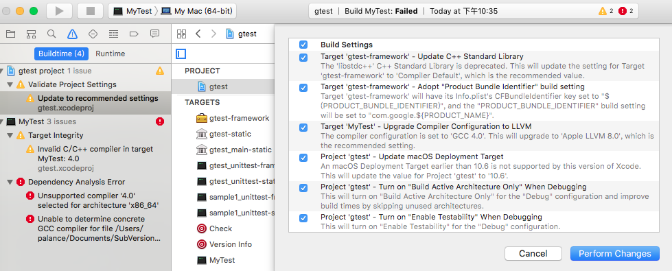
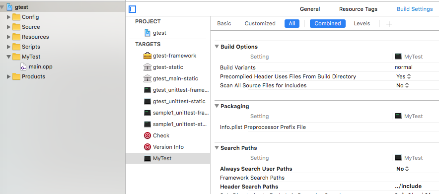

最近用到googletest给一个项目写单元测试，googletest的设计、使用和以前用到的测试框架都差不多，这里不再深究。主要是在macOS xcode下，搭建环境费了不少功夫，备忘一下吧。<!-- more -->

# 下载googletest
下载[googletest](https://github.com/google/googletest)，解压到本地，假设路径为$(GTest)。可以直接打开$(GTest)/googletest/xcode/gtest.xcodeproject，⌘-B编译一切OK。

# 添加MyTest
添加一个`Command Line`类型的Target：


# 修改编译选项
将gtest-framework和MyTest的`Build Settings` - `Apple LLVM 8.0 - Language - C++` - `C++ Standard Library`都改为`libstdc++(GNU C++ standard library`：

这个时候在MyTest中还找不到对应的编译选项，执行编译，会得到几个Warning和Error，点击gtest下的Warning会得到如下提示：

点击`Perform Changes`。然后在MyTest中就可以找到`Build Settings` - `Apple LLVM 8.0 - Language - C++` - `C++ Standard Library`了，改为`libstdc++(GNU C++ standard library`。

再编译MyTest就OK了。

# 添加测试用例
修改MyTest/main.cpp为
``` c++
#include "gtest/gtest.h"
using namespace std;
namespace {
    class FooTest : public ::testing::Test {
    protected:
        
        FooTest() {}
        virtual ~FooTest() {}
        
        virtual void SetUp() {}
        virtual void TearDown() {}
    };
    
    TEST_F(FooTest, MethodBarDoesAbc) {
        EXPECT_EQ(0, 0);
    }
    
    TEST_F(FooTest, DoesXyz) {
    }
    
}

int main(int argc, char **argv) {
    ::testing::InitGoogleTest(&argc, argv);
    return RUN_ALL_TESTS();
}
```
为MyTest添加gtest.framework：

为MyTest添加include路径：

# 编译执行
齐活儿，执行⌘-R：
``` bash
[==========] Running 2 tests from 1 test case.
[----------] Global test environment set-up.
[----------] 2 tests from FooTest
[ RUN      ] FooTest.MethodBarDoesAbc
[       OK ] FooTest.MethodBarDoesAbc (0 ms)
[ RUN      ] FooTest.DoesXyz
[       OK ] FooTest.DoesXyz (0 ms)
[----------] 2 tests from FooTest (0 ms total)

[----------] Global test environment tear-down
[==========] 2 tests from 1 test case ran. (1 ms total)
[  PASSED  ] 2 tests.
Program ended with exit code: 0
```
