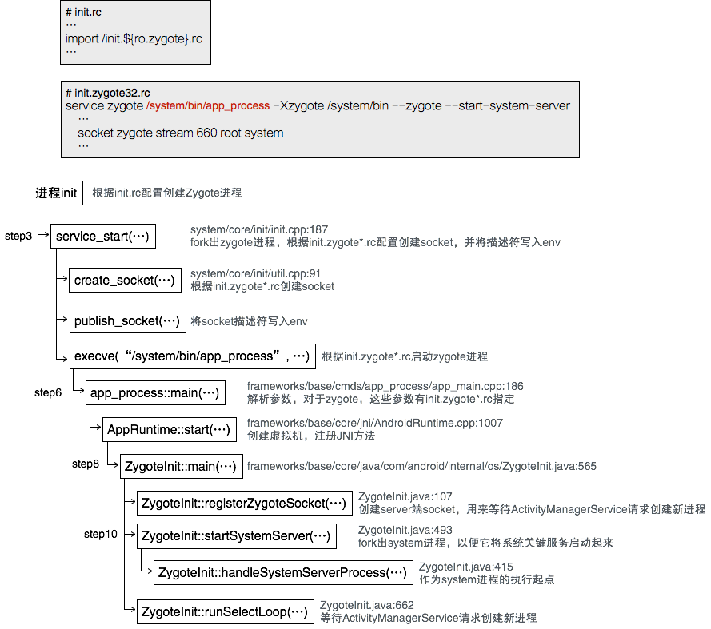

Android系统的第一个进程是init，它将Zygote进程启动起来，所有应用程序进程以及运行系统关键服务的System进程由Zygote负责创建。<!-- more -->

# Step1 init.rc脚本
init启动后会根据init.rc创建Zygote进程，init.rc内容如下：
```
// system/core/rootdir/init.rc
...
import /init.environ.rc
import /init.usb.rc
import /init.${ro.hardware}.rc
import /init.usb.configfs.rc
import /init.${ro.zygote}.rc
import /init.trace.rc
...

```
Android 5.0开始支持64位程序，所以在init.rc中根据系统情况引入不同脚本。在system/core/rootdir下，zygote有四个配置：

脚本名称|说明
---|----
init.zygote32.rc|纯32位模式，zygote进程对应app_process
init.zygote32_64.rc|纯64位模式，zygote进程对应app_process64
init.zygote64.rc|启动两个zygote进程(zygote和zygote_secondary)分别对应app_process32（主模式）和app_process64
init.zygote64_32.rc|启动两个zygote进程(zygote和zygote_secondary)分别对应app_process64(主模式)和app_process32

# Step2 init.zygote32.rc
来看init.zygote32.rc：
```
service zygote /system/bin/app_process -Xzygote /system/bin --zygote --start-system-server
    class main
    socket zygote stream 660 root system
    onrestart write /sys/android_power/request_state wake
    onrestart write /sys/power/state on
    onrestart restart media
    onrestart restart netd
    writepid /dev/cpuset/foreground/tasks
```
脚本格式说明可参见system/core/init/readme.txt。
service是由init启动的程序，形式如下：
```
service <name> <pathname> [ <argument> ]*
   <option>
   <option>
   ...
```
option用于修饰service，他们会影响到init启动service的时机和方式。相关的option类格式说明：
```
socket <name> <type> <perm> [ <user> [ <group> [ <seclabel> ] ] ]
  创建一个名字为/dev/socket/<name>的套接字，并把描述符传给进程。<type>必取"dgram"、"stream"或"seqpacket"之一。<user>、<group>默认为0.<seclable>是套接字的SELinux安全上下文，默认为service的安全上下文，或者由seclable指定，或者基于service可执行文件的安全上下文计算得出。其中perm的每个数字是由w=4,r=2,x=1组合而成，三个数字分别用于定义owner、group、other的权限。

class <name>
  指定服务所在类名，以便相同类名的服务可以一起启动和停止。如果没有指定，默认为"default"。

onrestart
  重启时执行一条命令。

writepid <file...>
  执行fork时，把子进程id写入指定文件。
```
因此再来解读init.zygote32.rc文件，它定义了名称为zygote的服务，该服务执行文件`/syste/bin/app_process`参数为：`-Xzygote /system/bin --zygote --start-system-server`。它创建的socket对于owner和group均为可读写。

# Step3 service_start(...)
``` c++
// system/core/init/init.cpp:187
void service_start(struct service *svc, const char *dynamic_args)
{
    ...
    pid_t pid = fork();  // 当前进程为init
    if (pid == 0) {      // 在子进程（即Zygote进程）中返回
        struct socketinfo *si;
        ...
        // svn->sockets即在init.zygote*.rc中的socket部分
        // 遍历该部分的所有socket配置，并创建
        for (si = svc->sockets; si; si = si->next) {
            int socket_type = (
                    !strcmp(si->type, "stream") ? SOCK_STREAM :
                        (!strcmp(si->type, "dgram") ? SOCK_DGRAM : SOCK_SEQPACKET));
            // 🏁 Step4
            int s = create_socket(si->name, socket_type,
                                  si->perm, si->uid, si->gid, si->socketcon ?: scon);
            if (s >= 0) {
                publish_socket(si->name, s); // 🏁 Step5
            }
        }

        ...
        // dynamic_args是该服务的动态启动参数列表
        if (!dynamic_args) {
            // svn->args[0] = "/system/bin/app_process"
            // 如果没有动态启动参数列表，则直接执行init.zygote*.rc中的命令
            if (execve(svc->args[0], (char**) svc->args, (char**) ENV) < 0) {
                ...
            }
        } else { // 否则把动态参数和静态参数合并到arg_ptrs中再执行service命令
            char *arg_ptrs[INIT_PARSER_MAXARGS+1];
            int arg_idx = svc->nargs;
            char *tmp = strdup(dynamic_args);
            char *next = tmp;
            char *bword;

            /* Copy the static arguments */
            memcpy(arg_ptrs, svc->args, (svc->nargs * sizeof(char *)));

            while((bword = strsep(&next, " "))) {
                arg_ptrs[arg_idx++] = bword;
                if (arg_idx == INIT_PARSER_MAXARGS)
                    break;
            }
            arg_ptrs[arg_idx] = NULL;
            execve(svc->args[0], (char**) arg_ptrs, (char**) ENV);
        }
        _exit(127);
    }
    ...
}
```
# Step4 create_socket(...)
``` c++
// system/core/init/util.cpp:91
int create_socket(const char *name, int type, mode_t perm, uid_t uid,
                  gid_t gid, const char *socketcon)
{
    // name = "zygote"
    // 按照init.zygote*.rc中的配置创建socket，并返回描述符
    struct sockaddr_un addr;
    int fd, ret;
    ...
    fd = socket(PF_UNIX, type, 0);
    ...
    memset(&addr, 0 , sizeof(addr));
    addr.sun_family = AF_UNIX;
    // ANDROID_SOCKET_DIR为"/dev/socket" 
    // addr.sun_path 为"/dev/socket/zygote"
    snprintf(addr.sun_path, sizeof(addr.sun_path), ANDROID_SOCKET_DIR"/%s",
             name);
    ...
    ret = bind(fd, (struct sockaddr *) &addr, sizeof (addr));
    ...
    // perm为660，对于owner和group均为可读写
    chown(addr.sun_path, uid, gid);
    chmod(addr.sun_path, perm);
    ...
    return fd;
    ...
}
```
# Step5 publish_socket(...)
``` c++
// system/core/init/init.cpp:172
static void publish_socket(const char *name, int fd)
{
    char key[64] = ANDROID_SOCKET_ENV_PREFIX; // "ANDROID_SOCKET_"
    char val[64];

    // key = "ANDROID_SOCKET_zygote"
    strlcpy(key + sizeof(ANDROID_SOCKET_ENV_PREFIX) - 1,
            name,
            sizeof(key) - sizeof(ANDROID_SOCKET_ENV_PREFIX));
    snprintf(val, sizeof(val), "%d", fd);
    add_environment(key, val); // 把描述符写入环境变量"ANDROID_SOCKET_zygote"

    /* make sure we don't close-on-exec */
    fcntl(fd, F_SETFD, 0);
}
```
综上所述，进程init根据配置文件`init.zygote*.rc`：
* 首先创建socket，并将其描述符写入环境变量；
* 然后找到zygote对应的可执行文件，并启动进程。

接下来找到system/bin/app_process的入口函数。

# Step6 app_process::main(...)
``` c
// frameworks/base/cmds/app_process/app_main.cpp:186
int main(int argc, char* const argv[])
{
    if (prctl(PR_SET_NO_NEW_PRIVS, 1, 0, 0, 0) < 0) {...}

    AppRuntime runtime(argv[0], computeArgBlockSize(argc, argv));
    // Process command line arguments
    // ignore argv[0]
    argc--;
    argv++;

    // Everything up to '--' or first non '-' arg goes to the vm.
    //
    // The first argument after the VM args is the "parent dir", which
    // is currently unused.
    //
    // After the parent dir, we expect one or more the following internal
    // arguments :
    //
    // --zygote : Start in zygote mode
    // --start-system-server : Start the system server.
    // --application : Start in application (stand alone, non zygote) mode.
    // --nice-name : The nice name for this process.
    //
    // For non zygote starts, these arguments will be followed by
    // the main class name. All remaining arguments are passed to
    // the main method of this class.
    //
    // For zygote starts, all remaining arguments are passed to the zygote.
    // main function.
    //
    // Note that we must copy argument string values since we will rewrite the
    // entire argument block when we apply the nice name to argv0.

    int i;
    for (i = 0; i < argc; i++) {
        if (argv[i][0] != '-') {
            break;
        }
        if (argv[i][1] == '-' && argv[i][2] == 0) {
            ++i; // Skip --.
            break;
        }
        runtime.addOption(strdup(argv[i]));
    }

    // Parse runtime arguments.  Stop at first unrecognized option.
    bool zygote = false;
    bool startSystemServer = false;
    bool application = false;
    String8 niceName;
    String8 className;

    ++i;  // Skip unused "parent dir" argument.
    while (i < argc) {
        const char* arg = argv[i++];
        if (strcmp(arg, "--zygote") == 0) {
            zygote = true; // 由init.zygote*.rc可知该值为true
            niceName = ZYGOTE_NICE_NAME; // "zygote"
        } else if (strcmp(arg, "--start-system-server") == 0) {
            startSystemServer = true;
        } else if (strcmp(arg, "--application") == 0) {
            application = true;
        } else if (strncmp(arg, "--nice-name=", 12) == 0) {
            niceName.setTo(arg + 12);
        } else if (strncmp(arg, "--", 2) != 0) {
            className.setTo(arg);
            break;
        } else {
            --i;
            break;
        }
    }

    Vector<String8> args;
    if (!className.isEmpty()) { // className 为空
        // We're not in zygote mode, the only argument we need to pass
        // to RuntimeInit is the application argument.
        //
        // The Remainder of args get passed to startup class main(). Make
        // copies of them before we overwrite them with the process name.
        args.add(application ? String8("application") : String8("tool"));
        runtime.setClassNameAndArgs(className, argc - i, argv + i);
    } else {
        // We're in zygote mode.
        maybeCreateDalvikCache();

        if (startSystemServer) {
            args.add(String8("start-system-server"));
        }

        char prop[PROP_VALUE_MAX];
        if (property_get(ABI_LIST_PROPERTY, prop, NULL) == 0) {...}

        String8 abiFlag("--abi-list=");
        abiFlag.append(prop);
        args.add(abiFlag);

        // In zygote mode, pass all remaining arguments to the zygote
        // main() method.
        for (; i < argc; ++i) {
            args.add(String8(argv[i]));
        }
    }

    if (!niceName.isEmpty()) { // niceName = "zygote"
        runtime.setArgv0(niceName.string());
        set_process_name(niceName.string()); // 进程名设置为"zygote"
    }

    if (zygote) { // zygote = true
        // 🏁
        runtime.start("com.android.internal.os.ZygoteInit", args, zygote);
    } else ...
}
```
# Step7 AppRuntime::start(...)
``` c++
// frameworks/base/core/jni/AndroidRuntime.cpp:1007
void AndroidRuntime::start(const char* className, const Vector<String8>& options, bool zygote)
{
    // className = "com.android.internal.os.ZygoteInit"
    // zygote = true
    ...
    const char* rootDir = getenv("ANDROID_ROOT");
    if (rootDir == NULL) {
        rootDir = "/system";
        ...
        setenv("ANDROID_ROOT", rootDir, 1);
    }
    ...
    /* 创建虚拟机 */
    JniInvocation jni_invocation;
    jni_invocation.Init(NULL);
    JNIEnv* env;
    if (startVm(&mJavaVM, &env, zygote) != 0) {
        return;
    }
    onVmCreated(env);

    /*
     * 在虚拟机中注册一系列JNI方法
     */
    if (startReg(env) < 0) {
        ...
        return;
    }

    /*
     * We want to call main() with a String array with arguments in it.
     * At present we have two arguments, the class name and an option string.
     * Create an array to hold them.
     */
    jclass stringClass;
    jobjectArray strArray;
    jstring classNameStr;

    stringClass = env->FindClass("java/lang/String");
    ...
    // 创建string array用于记录启动参数列表
    strArray = env->NewObjectArray(options.size() + 1, stringClass, NULL);
    ...
    // 创建string用于保存类名
    classNameStr = env->NewStringUTF(className);
    ...
    env->SetObjectArrayElement(strArray, 0, classNameStr);
    
    for (size_t i = 0; i < options.size(); ++i) { // 初始化启动参数列表
        jstring optionsStr = env->NewStringUTF(options.itemAt(i).string());
        ...
        env->SetObjectArrayElement(strArray, i + 1, optionsStr);
    }

    /*
     * Start VM.  This thread becomes the main thread of the VM, and will
     * not return until the VM exits.
     */
    char* slashClassName = toSlashClassName(className);
    jclass startClass = env->FindClass(slashClassName);
    if (startClass == NULL) {...
    } else {
        jmethodID startMeth = env->GetStaticMethodID(startClass, "main",
            "([Ljava/lang/String;)V"); // 获得入口函数
        if (startMeth == NULL) {...
        } else {
            // 🏁调用com/android/internal/os/ZygoteInit::main(...)函数
            env->CallStaticVoidMethod(startClass, startMeth, strArray);
...
        }
    }
    free(slashClassName);
    ...
}
```
由此可见，zygote的main函数里启动了虚拟机，并在虚拟机里执行函数`com.android.internal.os.ZygoteInit::main`。
# Step8 ZygoteInit::main(...)
``` java
// frameworks/base/core/java/com/android/internal/os/ZygoteInit.java
package com.android.internal.os;
...
public class ZygoteInit {
...
//:565
    public static void main(String argv[]) {
        try {
            RuntimeInit.enableDdms();
            // Start profiling the zygote initialization.
            SamplingProfilerIntegration.start();

            boolean startSystemServer = false;
            String socketName = "zygote";
            String abiList = null;
            for (int i = 1; i < argv.length; i++) {
                if ("start-system-server".equals(argv[i])) {
                    startSystemServer = true; // 回顾init.zygote*.rc，该值为true
                } else if (argv[i].startsWith(ABI_LIST_ARG)) {
                    abiList = argv[i].substring(ABI_LIST_ARG.length());
                } else if (argv[i].startsWith(SOCKET_NAME_ARG)) {
                    socketName = argv[i].substring(SOCKET_NAME_ARG.length());
                } else {...}
            }
            ...
            // 🏁Step9 创建一个server端socket，用来等待ActivityManagerService
            // 请求Zygote创建新进程
            registerZygoteSocket(socketName);  // socketName="zygote"
            ...
            if (startSystemServer) { // true
                // 🏁Step10 启动system进程，以便它将系统的关键服务启动起来
                startSystemServer(abiList, socketName);
            }

            // 🏁Step11等待ActivityManagerService请求Zygote创建新进程
            runSelectLoop(abiList);
            ...
        } catch (MethodAndArgsCaller caller) {
            caller.run();
        } catch (RuntimeException ex) {...}
    }
```
# Step9 ZygoteInit::registerZygoteSocket(...)
``` java
// frameworks/base/core/java/com/android/internal/os/ZygoteInit.java:107
private static void registerZygoteSocket(String socketName) {
    // socketName = "zygote"
    if (sServerSocket == null) {
        int fileDesc;
        // fullSocketName = "ANDROID_SOCKET_zygote"
        // 在Step5中将socket描述符写入该环境变量
        final String fullSocketName = ANDROID_SOCKET_PREFIX + socketName;
        try {
            String env = System.getenv(fullSocketName);
            fileDesc = Integer.parseInt(env); // 取出socket描述符
        } catch (RuntimeException ex) {...}

        try {
            FileDescriptor fd = new FileDescriptor();
            fd.setInt$(fileDesc);
            // 根据描述符创建一个server端socket，zygote将system进程启动后就会在此
            // socket上等待ActivityManagerService来请求创建新进程
            sServerSocket = new LocalServerSocket(fd);
        } catch (IOException ex) {...}
    }
}
```
# Step10 ZygoteInit::startSystemServer(...)
``` java
// frameworks/base/core/java/com/android/internal/os/ZygoteInit.java:493
private static boolean startSystemServer(String abiList, String socketName)
        throws MethodAndArgsCaller, RuntimeException {
    long capabilities = posixCapabilitiesAsBits(
        OsConstants.CAP_BLOCK_SUSPEND,
        OsConstants.CAP_KILL,
        OsConstants.CAP_NET_ADMIN,
        OsConstants.CAP_NET_BIND_SERVICE,
        OsConstants.CAP_NET_BROADCAST,
        OsConstants.CAP_NET_RAW,
        OsConstants.CAP_SYS_MODULE,
        OsConstants.CAP_SYS_NICE,
        OsConstants.CAP_SYS_RESOURCE,
        OsConstants.CAP_SYS_TIME,
        OsConstants.CAP_SYS_TTY_CONFIG
    );
    /* 构造system进程的启动参数*/
    String args[] = {
        "--setuid=1000",
        "--setgid=1000",
        "--setgroups=1001,1002,1003,1004,1005,1006,1007,1008,1009,1010,1018,1021,1032,3001,3002,3003,3006,3007",
        "--capabilities=" + capabilities + "," + capabilities,
        "--nice-name=system_server",
        "--runtime-args",
        "com.android.server.SystemServer",
    };
    ZygoteConnection.Arguments parsedArgs = null;

    int pid;

    try {
        parsedArgs = new ZygoteConnection.Arguments(args);
        ...
        /* 创建system进程 */
        pid = Zygote.forkSystemServer(
                parsedArgs.uid, parsedArgs.gid,
                parsedArgs.gids,
                parsedArgs.debugFlags,
                null,
                parsedArgs.permittedCapabilities,
                parsedArgs.effectiveCapabilities);
    } catch (IllegalArgumentException ex) {...}

    /* For child process */
    if (pid == 0) {
        ...
        handleSystemServerProcess(parsedArgs); // 🏁在新的子进程中执行，下一节介绍
    }

    return true;
}
```
# Step11 ZygoteInit::runSelectLoop(...)
``` java
// frameworks/base/core/java/com/android/internal/os/ZygoteInit.java:662
    private static void runSelectLoop(String abiList) throws MethodAndArgsCaller {
        ArrayList<FileDescriptor> fds = new ArrayList<FileDescriptor>();
        ArrayList<ZygoteConnection> peers = new ArrayList<ZygoteConnection>();
        // sServerSocket是Step9中创建的server端socket
        fds.add(sServerSocket.getFileDescriptor());
        peers.add(null);

        // 等待ActivityManagerService请求创建新进程 
        while (true) {
            // 将fds转移到pollFds中
            StructPollfd[] pollFds = new StructPollfd[fds.size()];
            for (int i = 0; i < pollFds.length; ++i) {
                pollFds[i] = new StructPollfd();
                pollFds[i].fd = fds.get(i);
                pollFds[i].events = (short) POLLIN;
            }
            try { // 监控socket是否有数据可读
                Os.poll(pollFds, -1);
            } catch (ErrnoException ex) {...}
            for (int i = pollFds.length - 1; i >= 0; --i) {
                if ((pollFds[i].revents & POLLIN) == 0) {
                    continue;
                }
                if (i == 0) {
                    // ActivityManagerService通过sServerSocket与Zygote建立连接，
                    // 但还没有请求位置创建新进程，因此只是将此连接添加到peers中，并将
                    // socket描述符添加到fds，一边接下来可以接收到创建进程的请求
                    ZygoteConnection newPeer = acceptCommandPeer(abiList);
                    peers.add(newPeer);
                    fds.add(newPeer.getFileDesciptor());
                } else {
                    // 处理ActivityManagerService的创建进程的请求
                    boolean done = peers.get(i).runOnce();
                    if (done) {
                        peers.remove(i);
                        fds.remove(i);
                    }
                }
            }
        }
    }
```
与Android2.x相比，此处使用epoll替代了select，epoll的具体用法可以参见[《键盘消息处理学习笔记（四）——Looper机制》](http://palanceli.com/2016/10/02/2016/1002KeyboardLearning4/#关于epoll)。
# 总结
Zygote进程的启动过程如下：
