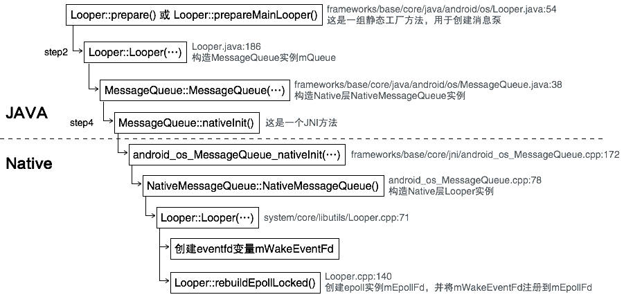

在[《细胞分裂——Android进程的启动》](http://palanceli.com/2017/01/29/2017/0129Process/#Step11-ActivityThread-main-…)的尾部，Zygote分裂出了新的进程后，就会执行ActivityThread::main(...)函数作为新进程的执行起点，其中的主要工作就是创建和进入消息循环。接下来就以Looper::prepareMainLooper()和Looper::prepare()为起点开始分析。<!-- more -->

# 创建消息队列
``` java
// frameworks/base/core/java/android/os/Looper.java:54
public final class Looper {
...
// :68
// 这是一个线程局部对象，每一个创建了消息队列的线程都关联一个Looper对象
// 通过其成员函数get()或静态成员函数myLooper()可以获得与当前线程关联的Looper对象
static final ThreadLocal<Looper> sThreadLocal = new ThreadLocal<Looper>();
// 主线程的Looper对象，之所以用一个独立的静态成员变量保存，是为了让其他线程可以通过
// Looper::getMainLooper()来访问它。
private static Looper sMainLooper;  // guarded by Looper.class

final MessageQueue mQueue;
...
// :82
    public static void prepare() {
        prepare(true);
    }

    private static void prepare(boolean quitAllowed) {
        if (sThreadLocal.get() != null) { 
            throw new RuntimeException("Only one Looper may be created per thread");
        }
        sThreadLocal.set(new Looper(quitAllowed)); // 🏁
    }

    /**
     * Initialize the current thread as a looper, marking it as an
     * application's main looper. The main looper for your application
     * is created by the Android environment, so you should never need
     * to call this function yourself.  See also: {@link #prepare()}
     */
    public static void prepareMainLooper() {
        prepare(false);
        synchronized (Looper.class) {
            if (sMainLooper != null) {
                throw new IllegalStateException("The main Looper has already been prepared.");
            }
            sMainLooper = myLooper();
        }
    }
```
Looper::prepare(...)用于创建消息队列，Looper::prepareMainLooper()只能用于在主线程中创建消息队列，这是一个特殊的线程，因为只有它才能执行与UI相关的操作。

# Step2 Looper::Looper(...)
``` java
// frameworks/base/core/java/android/os/Looper.java:186
    private Looper(boolean quitAllowed) {
        mQueue = new MessageQueue(quitAllowed); // 🏁
        mThread = Thread.currentThread();
    }
```
# Step3 MessageQueue::MessageQueue(...)
``` java
// frameworks/base/core/java/android/os/MessageQueue.java:38
public final class MessageQueue {
...
// :46
private long mPtr; // used by native code
...
// :68
    MessageQueue(boolean quitAllowed) {
        mQuitAllowed = quitAllowed;
        mPtr = nativeInit(); // 🏁
    }
```
# Step4 MessageQueue::nativeInit()
这是一个JNI函数：
``` c
// frameworks/base/core/jni/android_os_MessageQueue.cpp:172
static jlong android_os_MessageQueue_nativeInit(JNIEnv* env, jclass clazz) {
    NativeMessageQueue* nativeMessageQueue = new NativeMessageQueue(); // 🏁
    ...
    nativeMessageQueue->incStrong(env);
    return reinterpret_cast<jlong>(nativeMessageQueue);
}
```
# Step5 NativeMessageQueue::NativeMessageQueue()
``` c
// frameworks/base/core/jni/android_os_MessageQueue.cpp:78
NativeMessageQueue::NativeMessageQueue() :
        mPollEnv(NULL), mPollObj(NULL), mExceptionObj(NULL) {
    mLooper = Looper::getForThread(); // 获取Looper线程局部变量
    if (mLooper == NULL) {
        mLooper = new Looper(false); // 🏁
        Looper::setForThread(mLooper);
    }
}
```
在此构造函数中，检查如果没有Looper的线程局部变量，则创建。
Looper的创建可参见[《键盘消息处理学习笔记（四）——Looper机制》](http://palanceli.com/2016/10/02/2016/1002KeyboardLearning4/)。在Looper::Looper()构造函数中创建了事件对象，并将其注册到epoll机制中，完成了消息泵的创建。

# 总结
消息队列的创建过程如下：

生成的数据结构如下：


