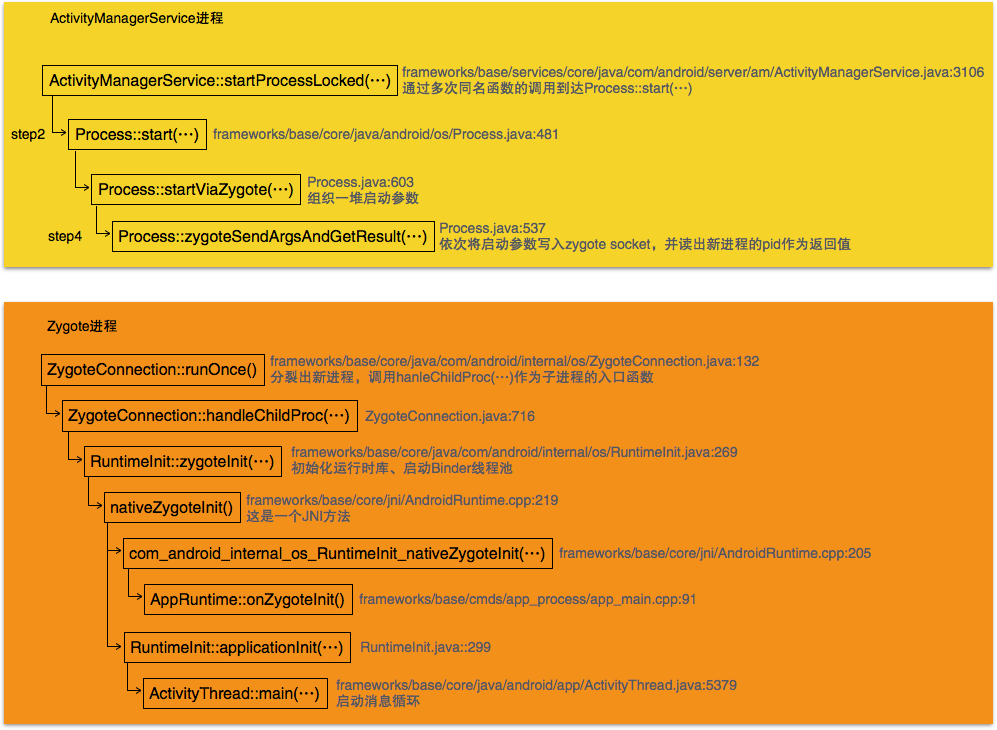

在[《创世记（一）——Zygote进程的启动》之step7](http://localhost:4000/2017/01/27/2017/0127init1/#Step7-AppRuntime-start-…)中，Zygote创建了虚拟机。在接下来的step8中创建了server端socket，启动了system进程。尔后就开始等待ActivityManagerService创建进程的请求，接收到该请求后，Zygote继续fork执行新进程的任务，完成分裂，因此从Zygote分裂出的应用程序进程都继承了Zygote创建的虚拟机。ActivityManagerService通过调用函数startProcessLocked()启动新进程，接下来就进入该函数的学习。<!-- more -->

# Step1 ActivityManagerService::startProcessLocked(...)
在[Activity启动过程学习笔记（二）之Step31](http://palanceli.com/2016/10/27/2016/1027ActivityStarting2/#Step30-ActivityManagerService-startProcessLocked-…)分析Activity启动过程时曾接触过Android应用的启动：
``` java
// frameworks/base/services/core/java/com/android/server/am/ActivityManagerService.java:3106
final ProcessRecord startProcessLocked(String processName,
        ApplicationInfo info, boolean knownToBeDead, int intentFlags,
        String hostingType, ComponentName hostingName, boolean allowWhileBooting,
        boolean isolated, boolean keepIfLarge) {
    // 🏁调用同名函数
    return startProcessLocked(processName, info, knownToBeDead, intentFlags, hostingType,
            hostingName, allowWhileBooting, isolated, 0 /* isolatedUid */, keepIfLarge,
            null /* ABI override */, null /* entryPoint */, null /* entryPointArgs */,
            null /* crashHandler */);
}
//：3116
final ProcessRecord startProcessLocked(String processName, ApplicationInfo info,
        boolean knownToBeDead, int intentFlags, String hostingType, ComponentName hostingName,
        boolean allowWhileBooting, boolean isolated, int isolatedUid, boolean keepIfLarge,
        String abiOverride, String entryPoint, String[] entryPointArgs, Runnable crashHandler) {
    long startTime = SystemClock.elapsedRealtime();
    ProcessRecord app;
    if (!isolated) {
        app = getProcessRecordLocked(processName, info.uid, keepIfLarge);
        ...
    } 
    ...
    String hostingNameStr = hostingName != null
            ? hostingName.flattenToShortString() : null;

    if (app == null) {
        ...
        app = newProcessRecordLocked(info, processName, isolated, isolatedUid);
        ...
    } 
    ...
    startProcessLocked( // 🏁调用同名函数
            app, hostingType, hostingNameStr, abiOverride, entryPoint, entryPointArgs);
    ...
    return (app.pid != 0) ? app : null;
}
//:3247
private final void startProcessLocked(ProcessRecord app, String hostingType,
        String hostingNameStr, String abiOverride, String entryPoint, String[] entryPointArgs) {
    ...
    try {
        ...
        int uid = app.uid;
        int[] gids = null;
        ... // 获得新进程的用户ID及组ID

        app.gids = gids;
        app.requiredAbi = requiredAbi;
        app.instructionSet = instructionSet;

        // Start the process.  It will either succeed and return a result containing
        // the PID of the new process, or else throw a RuntimeException.
        boolean isActivityProcess = (entryPoint == null);
        if (entryPoint == null) entryPoint = "android.app.ActivityThread";
        ...
        // 🏁 创建进程
        Process.ProcessStartResult startResult = Process.start(entryPoint,
                app.processName, uid, uid, gids, debugFlags, mountExternal,
                app.info.targetSdkVersion, app.info.seinfo, requiredAbi, instructionSet,
                app.info.dataDir, entryPointArgs);
        ...
    } catch (RuntimeException e) ...
}
```
# Step2 Process::start(...)
``` java
// frameworks/base/core/java/android/os/Process.java:481
public static final ProcessStartResult start(final String processClass,
                              final String niceName,
                              int uid, int gid, int[] gids,
                              int debugFlags, int mountExternal,
                              int targetSdkVersion,
                              String seInfo,
                              String abi,
                              String instructionSet,
                              String appDataDir,
                              String[] zygoteArgs) {
    try { // 🏁
        return startViaZygote(processClass, niceName, uid, gid, gids,
                debugFlags, mountExternal, targetSdkVersion, seInfo,
                abi, instructionSet, appDataDir, zygoteArgs);
    } catch (ZygoteStartFailedEx ex) ...
}
```
# Step3 Process::startViaZygote(...)
``` java
// frameworks/base/core/java/android/os/Process.java:603
private static ProcessStartResult startViaZygote(final String processClass,
                              final String niceName,
                              final int uid, final int gid,
                              final int[] gids,
                              int debugFlags, int mountExternal,
                              int targetSdkVersion,
                              String seInfo,
                              String abi,
                              String instructionSet,
                              String appDataDir,
                              String[] extraArgs)
                              throws ZygoteStartFailedEx {
    synchronized(Process.class) {
        ArrayList<String> argsForZygote = new ArrayList<String>();
        // 组织启动参数，保存在argsForZygote中
        // --runtime-args, --setuid=, --setgid=,
        // and --setgroups= must go first
        argsForZygote.add("--runtime-args");
        argsForZygote.add("--setuid=" + uid);
        argsForZygote.add("--setgid=" + gid);
        ...

        if (niceName != null) {
            argsForZygote.add("--nice-name=" + niceName);
        }

        if (seInfo != null) {
            argsForZygote.add("--seinfo=" + seInfo);
        }

        if (instructionSet != null) {
            argsForZygote.add("--instruction-set=" + instructionSet);
        }

        if (appDataDir != null) {
            argsForZygote.add("--app-data-dir=" + appDataDir);
        }
        ...
        // 🏁 继续创建进程
        return zygoteSendArgsAndGetResult(openZygoteSocketIfNeeded(abi), argsForZygote);
    }
}
```
# Step4 Process::zygoteSendArgsAndGetResult(...)
``` java
// frameworks/base/core/java/android/os/Process.java:537
private static ProcessStartResult zygoteSendArgsAndGetResult(
        ZygoteState zygoteState, ArrayList<String> args)
        throws ZygoteStartFailedEx {
    try {
        /**
         * See com.android.internal.os.ZygoteInit.readArgumentList()
         * Presently the wire format to the zygote process is:
         * a) a count of arguments (argc, in essence)
         * b) a number of newline-separated argument strings equal to count
         * 依次将参数写入Zygote socket，并读出新进程的pid作为新进程的返回值
         * 
         * After the zygote process reads these it will write the pid of
         * the child or -1 on failure, followed by boolean to
         * indicate whether a wrapper process was used.
         */
        final BufferedWriter writer = zygoteState.writer;
        final DataInputStream inputStream = zygoteState.inputStream;

        writer.write(Integer.toString(args.size()));
        writer.newLine();

        int sz = args.size();
        for (int i = 0; i < sz; i++) {
            String arg = args.get(i);
            ...
            writer.write(arg);
            writer.newLine();
        }

        writer.flush();

        // Should there be a timeout on this?
        ProcessStartResult result = new ProcessStartResult();
        result.pid = inputStream.readInt();
        ...
        result.usingWrapper = inputStream.readBoolean();
        return result;
    } catch (IOException ex) ...
}
```
可见，ActivityManagerService通过调用startProcessLocked(...)函数创建新进程并非在该函数内部完成进程的创建，而是通过socket把进程创建需求发送给Zygote，等待Zyogte分裂出一个新进程。
接下来可以接到[《创世记（一）——Zygote进程的启动》之Step11](http://localhost:4000/2017/01/27/2017/0127init1/#Step11-ZygoteInit-runSelectLoop-…)，在函数ZygoteInit::runSelectLoop(…)中等待从socket读取进程创建请求。一旦收到请求，则调用`boolean done = peers.get(i).runOnce();`处理请求。peers的声明为`ArrayList<ZygoteConnection> peers = new ArrayList<ZygoteConnection>();`，因此接下来进入`ZygoteConnection::runOnce()`。
# Step5 ZygoteConnection::runOnce()
``` java
// frameworks/base/core/java/com/android/internal/os/ZygoteConnection.java:132
boolean runOnce() throws ZygoteInit.MethodAndArgsCaller {

    String args[];
    Arguments parsedArgs = null;
    ...

    try { // 读取参数
        args = readArgumentList();
        ...
    } catch (IOException ex) ...
    ...
    int pid = -1;
    ...
    try {
        parsedArgs = new Arguments(args);
        ...
        // 分裂出新进程
        pid = Zygote.forkAndSpecialize(parsedArgs.uid, parsedArgs.gid, parsedArgs.gids,
                parsedArgs.debugFlags, rlimits, parsedArgs.mountExternal, parsedArgs.seInfo,
                parsedArgs.niceName, fdsToClose, parsedArgs.instructionSet,
                parsedArgs.appDataDir);
    } catch (ErrnoException ex) ...

    try {
        if (pid == 0) {
            // in child
            IoUtils.closeQuietly(serverPipeFd);
            serverPipeFd = null;
            // 🏁 子进程的入口函数
            handleChildProc(parsedArgs, descriptors, childPipeFd, newStderr);

            // should never get here, the child is expected to either
            // throw ZygoteInit.MethodAndArgsCaller or exec().
            return true;
        } else ...
    } finally ...
}
```
# Step6 ZygoteConnection::handleChildProc(...)
``` java
// frameworks/base/core/java/com/android/internal/os/ZygoteConnection.java:716
private void handleChildProc(Arguments parsedArgs,
        FileDescriptor[] descriptors, FileDescriptor pipeFd, PrintStream newStderr)
        throws ZygoteInit.MethodAndArgsCaller {
    /**
     * By the time we get here, the native code has closed the two actual Zygote
     * socket connections, and substituted /dev/null in their place.  The LocalSocket
     * objects still need to be closed properly.
     */

    closeSocket();
    ZygoteInit.closeServerSocket();

    if (descriptors != null) {
        try {
            Os.dup2(descriptors[0], STDIN_FILENO);
            Os.dup2(descriptors[1], STDOUT_FILENO);
            Os.dup2(descriptors[2], STDERR_FILENO);

            for (FileDescriptor fd: descriptors) {
                IoUtils.closeQuietly(fd);
            }
            newStderr = System.err;
        } catch (ErrnoException ex) ...
    }

    if (parsedArgs.niceName != null) {
        Process.setArgV0(parsedArgs.niceName);
    }

    // End of the postFork event.
    ...
    if (parsedArgs.invokeWith != null) {
        ...
    } else { // 🏁在新创建的进程中初始化运行时库、启动Binder线程池
        RuntimeInit.zygoteInit(parsedArgs.targetSdkVersion,
                parsedArgs.remainingArgs, null /* classLoader */);
    }
}
```
# Step7 RuntimeInit::zygoteInit(...)
``` java
// frameworks/base/core/java/com/android/internal/os/RuntimeInit.java:269
public static final void zygoteInit(int targetSdkVersion, String[] argv, ClassLoader classLoader)
        throws ZygoteInit.MethodAndArgsCaller {
    ...
    commonInit();       // 初始化运行时库
    nativeZygoteInit(); // 🏁启动Binder线程池
    applicationInit(targetSdkVersion, argv, classLoader); // 🏁step10创建消息循环
}
```
至此，又与[system进程的启动逻辑](http://palanceli.com/2017/01/28/2017/0128init2/#Step2-RuntimeInit-zygoteInit-…)重合了，支持逻辑重合，数据（参数）却不同。
其中`nativeZygoteInit()`是一个JNI方法，在`frameworks/base/core/jni/AndroidRuntime.cpp:219`中有对应关系：
``` c
static JNINativeMethod gMethods[] = {
    ...
    { "nativeZygoteInit", "()V",
        (void*) com_android_internal_os_RuntimeInit_nativeZygoteInit },
    ...
};
```
接下来看这个JNI方法。
# Step8 com_android_internal_os_RuntimeInit_nativeZygoteInit(...)
``` c
// frameworks/base/core/jni/AndroidRuntime.cpp:205
static void com_android_internal_os_RuntimeInit_nativeZygoteInit(JNIEnv* env, jobject clazz)
{
    gCurRuntime->onZygoteInit(); // 🏁
}
// :238
AndroidRuntime::AndroidRuntime(char* argBlockStart, const size_t argBlockLength) : ...
{
    ...
    gCurRuntime = this;
}
```
在[zygote进程的main函数的头部](http://palanceli.com/2017/01/27/2017/0127init1/#Step6-app-process-main-…)，定义了AppRuntime变量，AppRuntime继承自AndroidRuntime，因此在zygote进程中gCurRuntime的类型即为AppRuntime。
# Step9 AppRuntime::onZygoteInit()
``` c
// frameworks/base/cmds/app_process/app_main.cpp:91
virtual void onZygoteInit()
{
    sp<ProcessState> proc = ProcessState::self();
    ...
    proc->startThreadPool(); // 
}
```
# Step10 RuntimeInit::applicationInit(...)
``` java
// frameworks/base/core/java/com/android/internal/os/RuntimeInit.java::299
private static void applicationInit(int targetSdkVersion, String[] argv, ClassLoader classLoader)
        throws ZygoteInit.MethodAndArgsCaller {
    // If the application calls System.exit(), terminate the process
    // immediately without running any shutdown hooks.  It is not possible to
    // shutdown an Android application gracefully.  Among other things, the
    // Android runtime shutdown hooks close the Binder driver, which can cause
    // leftover running threads to crash before the process actually exits.
    nativeSetExitWithoutCleanup(true);
    // We want to be fairly aggressive about heap utilization, to avoid
    // holding on to a lot of memory that isn't needed.
    VMRuntime.getRuntime().setTargetHeapUtilization(0.75f);
    VMRuntime.getRuntime().setTargetSdkVersion(targetSdkVersion);
    final Arguments args;
    try {
        args = new Arguments(argv);
    } catch (IllegalArgumentException ex) {...}
    ...
    // Remaining arguments are passed to the start class's static main
    // 🏁调用函数android.app.ActivityThread::main(...)
    invokeStaticMain(args.startClass, args.startArgs, classLoader);
}
```
其中args.startClass来自[step1](#Step1-ActivityManagerService-startProcessLocked-…)中Process.start(...)的第一个参数，即："android.app.ActivityThread"。因此，它调用到andoird.app.ActivityThread::main(...)函数。

# Step11 ActivityThread::main(...)
``` java 
// frameworks/base/core/java/android/app/ActivityThread.java:5379
public static void main(String[] args) {
    ...
    Looper.prepareMainLooper();  // 创建消息循环

    ActivityThread thread = new ActivityThread();
    thread.attach(false);
    ...
    Looper.loop(); // 进入消息循环
    ...
}
```
# 总结
综上所述，当需要启动新进程时，ActivityManagerService会向Zygote的socket写入创建请求，由Zygote分裂出新的进程，并将新进程的pid写入socket返回给Zygote，过程如下：
