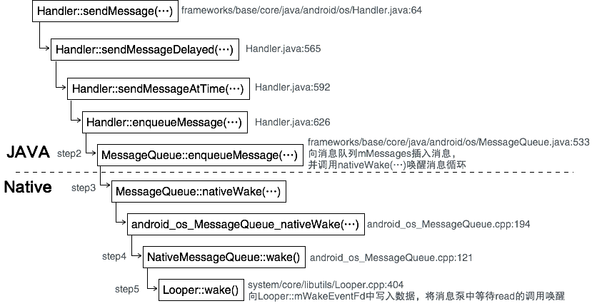

Handler::sendMessage(...)用来向消息队列发送一个消息，接下来依次函数为起点继续学习。<!-- more -->
# Step1 Handler::sendMessage(...)
``` java
// frameworks/base/core/java/android/os/Handler.java
//:64
public class Handler {
...
//:113
    public Handler() {
        this(null, false);
    }
...
//:188
    public Handler(Callback callback, boolean async) {
        // 默认callback = null; async = false
        ...
        mLooper = Looper.myLooper();
        ...
        mQueue = mLooper.mQueue;
        mCallback = callback;
        mAsynchronous = async;
    }
...
//:505
    public final boolean sendMessage(Message msg)
    {   // 发送消息的处理时间为系统当前时间
        return sendMessageDelayed(msg, 0);
    }
...
//:565
    public final boolean sendMessageDelayed(Message msg, long delayMillis)
    {   // 发送消息的处理时间为将来的一个相对时间
        if (delayMillis < 0) {
            delayMillis = 0;
        }
        return sendMessageAtTime(msg, SystemClock.uptimeMillis() + delayMillis);
    }
...
//:592
    public boolean sendMessageAtTime(Message msg, long uptimeMillis) {
        // 发送消息的处理时间为将来的一个绝对时间
        // uptimeMillis描述消息的处理时间
        MessageQueue queue = mQueue;
        ...
        return enqueueMessage(queue, msg, uptimeMillis);
    }
...
//:626
    private boolean enqueueMessage(MessageQueue queue, Message msg, long uptimeMillis) {
        msg.target = this; // 将msg.target设置为当前正在处理的Handler对象
        ...
        // 将msg发送到消息队列mQueue中
        return queue.enqueueMessage(msg, uptimeMillis); 
    }
...
//:742
    final MessageQueue mQueue;
    final Looper mLooper;
...
```
# Step2 MessageQueue::enqueueMessage(...)
``` java
// frameworks/base/core/java/android/os/MessageQueue.java:533
    boolean enqueueMessage(Message msg, long when) {
        ...

        synchronized (this) {
            ...
            msg.when = when;
            Message p = mMessages;
            boolean needWake;
            if (p == null || when == 0 || when < p.when) {
                // New head, wake up the event queue if blocked.
                // 消息队列中的消息是按照其处理时间从小到大顺序排列，因此当目标队列为空
                // 或 msg的处理时间为0 或 msg的处理时间小于队列头消息的处理时间，
                // 只需将msg插入到队列头部
                msg.next = p;
                mMessages = msg;
                // mBlocked表示当前线程是否正处于睡眠状态，如果为true表示正在睡眠
                // 此时向消息队列头部插入一条消息则必须将线程消息循环唤醒
                needWake = mBlocked;
            } else {
                // 剩余情况需要把msg插入到队列的合适位置
                // Inserted within the middle of the queue.  Usually we don't have to wake
                // up the event queue unless there is a barrier at the head of the queue
                // and the message is the earliest asynchronous message in the queue.
                // 由于不是往消息队列头部插入消息，不改变既有的处理节奏，因此不唤醒消息循环
                needWake = mBlocked && p.target == null && msg.isAsynchronous();
                Message prev;
                for (;;) {
                    prev = p;
                    p = p.next;
                    if (p == null || when < p.when) {
                        break;
                    }
                    if (needWake && p.isAsynchronous()) {
                        needWake = false;
                    }
                }
                msg.next = p; // invariant: p == prev.next
                prev.next = msg;
            }

            // We can assume mPtr != 0 because mQuitting is false.
            if (needWake) { 
                nativeWake(mPtr); // 🏁 唤醒消息循环
            }
        }
        return true;
    }
```
# Step3 MessageQueue::nativeWake(...)
这是一个JNI函数：
``` c
// frameworks/base/core/jni/android_os_MessageQueue.cpp:194
static void android_os_MessageQueue_nativeWake(JNIEnv* env, jclass clazz, jlong ptr) {
    NativeMessageQueue* nativeMessageQueue = reinterpret_cast<NativeMessageQueue*>(ptr);
    nativeMessageQueue->wake(); // 🏁 
}
```
# Step4 NativeMessageQueue::wake()
``` c
// frameworks/base/core/jni/android_os_MessageQueue.cpp:121
void NativeMessageQueue::wake() {
    mLooper->wake(); // 🏁
}
```
# Step5 Looper::wake()
``` c
// system/core/libutils/Looper.cpp:404
void Looper::wake() {
...
    uint64_t inc = 1;
    ssize_t nWrite = TEMP_FAILURE_RETRY(write(mWakeEventFd, &inc, sizeof(uint64_t)));
    if (nWrite != sizeof(uint64_t)) {
        if (errno != EAGAIN) {
            ALOGW("Could not write wake signal, errno=%d", errno);
        }
    }
}
```
# 总结
综上所述，所谓发送消息主要做了两件事：
1. 向线程消息队列中插入描述消息的数据结构；
2. 向消息泵的Looper::mWakeEventFd中写入数字1，使得该消息泵中等待read的调用被唤醒。
调用过程如下：
