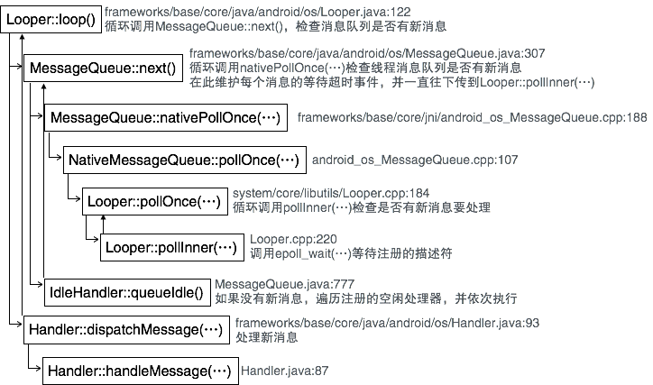

在[《Android应用消息队列（二）——创建消息队列》](http://palanceli.com/2017/01/30/2017/0130MessageQueue2/#Step1-Looper-loop)中分析了Looper::loop()的前半部分，获取消息。当获取到消息以后将处理消息。接下来继续分析Looper::loop()处理消息的部分。<!-- more -->
# Step1 Looper::loop(...)
``` java
// frameworks/base/core/java/android/os/Looper.java:122
public static void loop() {
    final Looper me = myLooper(); // 获取当前线程的消息队列
    ...
    final MessageQueue queue = me.mQueue;
    // Make sure the identity of this thread is that of the local process,
    // and keep track of what that identity token actually is.
    Binder.clearCallingIdentity();
    final long ident = Binder.clearCallingIdentity();
    for (;;) {
        Message msg = queue.next(); // 获取消息might block
        ...
        msg.target.dispatchMessage(msg); // 🏁处理消息
        ...
        // Make sure that during the course of dispatching the
        // identity of the thread wasn't corrupted.
        final long newIdent = Binder.clearCallingIdentity();
        ...
        msg.recycleUnchecked();
    }
}
```
msg.target的类型为Handler。
# Step2 Handler::dispatchMessage(...)
``` java
// frameworks/base/core/java/android/os/Handler.java:93
public void dispatchMessage(Message msg) {
    if (msg.callback != null) { // 如果消息在发送的时候指定了回调，则执行此回调
        handleCallback(msg);    // 🏁 Step3
    } else {
        if (mCallback != null) {// 如果负责分发消息的Handler对象有回调，则执行此回调
            if (mCallback.handleMessage(msg)) {
                return;
            }
        }
        handleMessage(msg);     // 🏁 Step4
    }
}
```
# Step3 Handler::handleCallback(...)
``` java
// frameworks/base/core/java/android/os/Handler.java:738
private static void handleCallback(Message message) {
    message.callback.run();
}
```
message.callback的类型为Runnable，因此`message.callback.run()`调用的是`Runnable::run()`。
# Step4 Handler::handleMessage(...)
``` java
// frameworks/base/core/java/android/os/Handler.java:87
    public void handleMessage(Message msg) {
    }
```
该函数的定义是空的，显然然在处理业务逻辑的时候应该由Handler派生子类并实现handleMessage(...)函数。
# 空闲消息的执行
再来看[《Android应用消息队列（二）——创建消息队列》](http://localhost:4000/2017/01/30/2017/0130MessageQueue2/#Step2-MessageQueue-next)中的MessageQueue::next()中对于空闲消息的处理：
``` java
// frameworks/base/core/java/android/os/MessageQueue.java:307
Message next() {
    ...
    int pendingIdleHandlerCount = -1; // -1 only during first iteration
    int nextPollTimeoutMillis = 0;
    for (;;) {
        ...
        nativePollOnce(ptr, nextPollTimeoutMillis); // 检查新消息

        synchronized (this) {
            // 获取新消息
            ...
            // If first time idle, then get the number of idlers to run.
            // Idle handles only run if the queue is empty or if the first message
            // in the queue (possibly a barrier) is due to be handled in the future.
            if (pendingIdleHandlerCount < 0
                    && (mMessages == null || now < mMessages.when)) {
                // 首次进入循环，没有新消息或者还不该处理新消息，得到注册的空闲处理器个数
                pendingIdleHandlerCount = mIdleHandlers.size();
            }
            if (pendingIdleHandlerCount <= 0) { 
                // No idle handlers to run.  Loop and wait some more.
                // 如果没有注册的空闲处理器则拉倒
                mBlocked = true;
                continue;
            }

            if (mPendingIdleHandlers == null) { // 将注册的空闲处理器拷贝到缓存中
                mPendingIdleHandlers = new IdleHandler[Math.max(pendingIdleHandlerCount, 4)];
            }
            mPendingIdleHandlers = mIdleHandlers.toArray(mPendingIdleHandlers);
        }

        // Run the idle handlers.
        // We only ever reach this code block during the first iteration.
        for (int i = 0; i < pendingIdleHandlerCount; i++) {
            // 依次执行缓存中的空闲处理器
            final IdleHandler idler = mPendingIdleHandlers[i];
            mPendingIdleHandlers[i] = null; // release the reference to the handler

            boolean keep = false;
            try {
                keep = idler.queueIdle();
            } catch (Throwable t) ...

            if (!keep) {
                synchronized (this) {
                    mIdleHandlers.remove(idler);
                }
            }
        }

        // Reset the idle handler count to 0 so we do not run them again.
        pendingIdleHandlerCount = 0;

        // While calling an idle handler, a new message could have been delivered
        // so go back and look again for a pending message without waiting.
        nextPollTimeoutMillis = 0;
    }
}
```
综上所述，空闲处理不是在消息处理的环节执行，因为到了消息处理环节，说明有新消息要处理，那就轮不上空闲处理了。空闲处理是在获取消息未遂的时候（可能因为没有新消息，也可能是下一个消息还没有到执行的时间），才有机会被执行。
# 空闲消息处理器 
``` java
// frameworks/base/core/java/android/os/MessageQueue.java:777
public static interface IdleHandler {
    /**
     * Called when the message queue has run out of messages and will now
     * wait for more.  Return true to keep your idle handler active, false
     * to have it removed.  This may be called if there are still messages
     * pending in the queue, but they are all scheduled to be dispatched
     * after the current time.
     */
    boolean queueIdle();
}
```
和Handler类似，它只定义了接口，业务逻辑层需要实现该接口。通过调用`MessageQueue::addIdleHandler(...)`向消息队列注册空闲消息处理器：
``` java
// frameworks/base/core/java/android/os/MessageQueue.java:115
public void addIdleHandler(@NonNull IdleHandler handler) {
    ...
    synchronized (this) {
        mIdleHandlers.add(handler);
    }
}
```
# 总结
综上所述，Looper::loop()函数是Android消息循环的处理核心。它的主干逻辑是：从消息队列获取新消息，如果没有新消息或者新消息还没有到要处理的时间，则执行在册的空闲处理器；如果有新消息，则执行新消息。过程如下：
