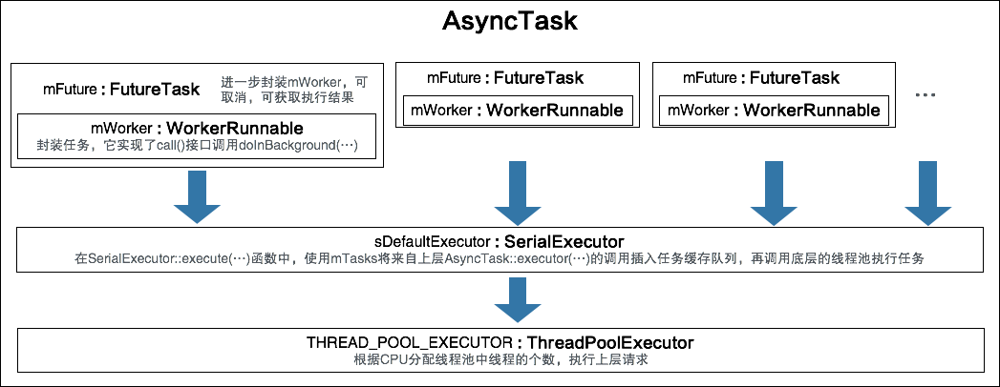

# 带有消息循环的子线程 HandlerThread
一个典型的工作线程是这样的：
``` java
// 定义工作线程
public class WorkThread extends Thread{
    public WorkThread(String name){
        super(name);
    }

    public void run(){
        // work...
    }
}

// 使用工作线程
WorkThread workThread = new WorkThread("Work Thread");
workThread.start();
```
这种工作线程适合默默无闻在后台干活，当需要和其他线程有关联或交互的时候，就适合用一个配备了消息循环的子线程来处理了，这就是HandlerThread的用武之地。
<!-- more -->
假设有一个后台工作线程不断产生数据；前台UI也可以产生数据；这些数据都需要保存起来，我们使用HandlerThread来完成数据保存的工作。过程如下：

* WorkThread中每隔一段时间产生一条数据，之后打印数据信息，并通知DataThread保存。
* MainThread中每次点击按钮就会产生一条数据，并通知DataThread保存。
* DataThread中收到保存请求时，先Sleep片刻表示正在保存，之后打印保存信息。

## 创建DataThread
创建数据线程与创建工作线程没有差别，只是需要拿到其Handler以备后面向线程发送消息：
``` java
// 创建数据线程
mDataThread = new HandlerThread("Data Thread");
mDataThread.start();
// 保存数据线程的Handler
mDataThreadHandler = new Handler(mDataThread.getLooper());
...
```
## 向DataThread发送消息
在工作线程中，每完成一项工作后向数据线程发送消息：
``` java
public class WorkThread extends Thread{
    private int mWorkNum;
    public WorkThread(String name){
        super(name);
    }

    public void run(){
        int tid = android.os.Process.myTid();
        for (; mWorkNum<10; mWorkNum++){
            try {
                Thread.sleep(1000);  // 工作线程完成每次工作
            } catch (InterruptedException e) {
                e.printStackTrace();
            }
            System.out.printf("[Work Thread %d] Complete Work %d.\n", tid, mWorkNum);

            // 向数据线程发送消息
            mDataThreadHandler.post(new DataTask(mWorkNum, true));
        }
    }
}
```
在主线程中，每按一次按钮也产生一次数据请求，发送给数据线程：
``` java
mManualWorkNum = 0;
final Button clickMeButton = (Button)findViewById(R.id.ManualWorkButton);
clickMeButton.setOnClickListener(new View.OnClickListener() {
                                     @Override
                                     public void onClick(View view) {
                                         mManualWorkNum++;
                                         mDataThreadHandler.post(new DataTask(mManualWorkNum, false));
                                     }
                                 });
```
## 封装成消息的数据请求
无论是手动还是自动数据请求，都是把DataTask对象封装成一条消息，post给DataThread。
DataTask实现了Runnable接口，并在其中完成数据线程的业务逻辑：
``` java
// 定义在数据线程中的工作任务
public class DataTask implements Runnable{
    private int mWorkNum;
    private boolean mAutoWork = true; // 手动还是自动
    public DataTask(int workNum, boolean autoWork){
        mWorkNum = workNum;
        mAutoWork = autoWork;
    }
    public void run(){
        int tid = android.os.Process.myTid();
        try {
            Thread.sleep(2000);       // 假设需要一段时间保存数据
        } catch (InterruptedException e) {
            e.printStackTrace();
        }
        if(mAutoWork)
            System.out.printf("[Data Thread %d] Save auto work %d\n", tid, mWorkNum);
        else
            System.out.printf("[Data Thread %d] Save manual work %d\n", tid, mWorkNum);
    }
}
```
在它的run()函数里，每次完成数据保存，都把当前的线程id打印出来。从log中可以发现：不管是从工作线程还是从主线程发起的post，在保存完成后打印的线程id都是DataThread的tid。

# 可更新主线程UI的子线程 AsyncTask

## Step0 定义和启动AsyncTask
``` java
// 定义AsyncTask，
// public abstract class AsyncTask<Params, Progress, Result> 三个模板参数分别为：
//   Params：  doInBackground方法的参数类型
//   Progress：AsyncTask所执行的后台任务的进度类型
//   Result：  后台任务的返回结果类型
AsyncTask<Integer, Integer, Integer> task =
        new AsyncTask<Integer, Integer, Integer>() {
    @Override
    protected Integer doInBackground(Integer... integers) {
        Integer asyncTaskNum = integers[0];
        int tid = android.os.Process.myTid();

        for(; asyncTaskNum<10; asyncTaskNum++){
            try {
                Thread.sleep(1000);
                System.out.printf("[Async Task Thread %d] Complete async task%d.\n", tid, asyncTaskNum);
            } catch (InterruptedException e) {
                e.printStackTrace();
            }
            publishProgress(asyncTaskNum);
        }
        return asyncTaskNum;
    }
    protected void updateAsyncTextInfo(Integer val){
        TextView tv = (TextView)findViewById(R.id.aysncTextInfo);
        int tid = android.os.Process.myTid();
        tv.setText("Completed " + val + " async tasks.(tid=" + tid + ")");
    }
    @Override
    protected void onProgressUpdate(Integer... integers){
        super.onProgressUpdate(integers);
        updateAsyncTextInfo(integers[0]);
    }
    @Override
    protected void onPostExecute(Integer integer){
        updateAsyncTextInfo(integer);
    }
};
// 启动
task.execute(0);
...
```
从demo中的log可以看出，函数`doInBackground(...)`是由AsyncTask在内部线程池执行，其余方法均在主线程中执行。

AsyncTask主要提供了如下方法：
* `onPreExecute()`
后台任务执行前被调用，用于进行一些准备工作
* `doInBackground(Params... params)`
定义要执行的后台任务，在这个方法中可以调用publishProgress来更新任务进度（publishProgress内部会调用onProgressUpdate方法）
* `onProgressUpdate(Progress... values)`    
由publishProgress内部调用，表示任务进度更新
* `onPostExecute(Result result)`    
后台任务执行完毕后被调用，参数即为后台任务的返回结果
* `onCancelled()`    
后台任务被取消时被调用

异步任务执行完成后，就会从函数doInBackground(...)中返回，并将它的返回值分发给函数onPostExecute(...)处理。接下来深入到AsyncTask内部来看它的实现。

## Step1 AsyncTask的创建AsyncTask()
``` java
// frameworks/base/core/java/android/os/AsyncTask.java:180
public abstract class AsyncTask<Params, Progress, Result> {
...
//:288
    public AsyncTask() {
        // mWorker和mFuture共同描述一个即将要执行的工作任务
        mWorker = new WorkerRunnable<Params, Result>() {
            public Result call() throws Exception {
                mTaskInvoked.set(true); // 表示任务已经被调用过

                Process.setThreadPriority(Process.THREAD_PRIORITY_BACKGROUND);
                //noinspection unchecked
                Result result = doInBackground(mParams); // 执行后台任务
                Binder.flushPendingCommands();
                // 从函数名上可以判断postResult(...)的执行并不在后台线程，
                // 而应该是封装成消息扔给了主线程，因为要刷新UI
                return postResult(result);
            }
        };

        mFuture = new FutureTask<Result>(mWorker) {
            @Override
            protected void done() {
                try {
                    postResultIfNotInvoked(get());
                } catch (InterruptedException e) 
                    ...
            }
        };
    }
//:677
    private static abstract class WorkerRunnable<Params, Result> implements Callable<Result> {
        Params[] mParams;
    }
```
构造函数初始化了两个成员变量。mWorker派生自WorkerRunnable，后者实现了接口Callable，该接口定义如下：
``` java
// libcore/luni/src/main/java/java/util/concurrent/Callable.java:28
public interface Callable<V> {
    ...
    V call() throws Exception;
}
```
因此mWorker就是一个指定了参数、返回值，并实现了call接口的Callable对象，在mWorker.call()中执行了后台任务的核心处理逻辑。

mFuture派生自FutureTask，
``` java
// libcore/luni/src/main/java/java/util/concurrent/FutureTask.java:35
public class FutureTask<V> implements RunnableFuture<V> {
...
//:123
    public FutureTask(Callable<V> callable) {
        if (callable == null)
            throw new NullPointerException();
        this.callable = callable;
        this.state = NEW;       // ensure visibility of callable
    }
```
是对mWorker的进一步封装，通过它可以方便地取消任务以及获取任务的执行结果，主干逻辑是通过调用mFuture.call()到达mWorker.call()。那么mFuture.call()是什么时候被调用的呢？接下来看执行的导火索`AsyncTask::execute(...)`。
## Step2 AsyncTask的执行execute(...)
``` java
// frameworks/base/core/java/android/os/AsyncTask.java:550
public final AsyncTask<Params, Progress, Result> execute(Params... params) {
    return executeOnExecutor(sDefaultExecutor, params); // 🏁
}
```
参数params正是在Step0中AsyncTask的第一个模板参数，用来描述初始数据。
## Step3 AsyncTask::executeOnExecutor(...)
``` java
// frameworks/base/core/java/android/os/AsyncTask.java:588
public final AsyncTask<Params, Progress, Result> executeOnExecutor(Executor exec,
        Params... params) {
    // exec = sDefaultExecutor
    // 可见，不能重复执行“正在运行”和“已经完成”的AsyncTask任务，即只能被执行一次
    if (mStatus != Status.PENDING) { 
        switch (mStatus) {
            case RUNNING:
                throw new IllegalStateException("Cannot execute task:"
                        + " the task is already running.");
            case FINISHED:
                throw new IllegalStateException("Cannot execute task:"
                        + " the task has already been executed "
                        + "(a task can be executed only once)");
        }
    }

    mStatus = Status.RUNNING;

    onPreExecute(); // 由此可见onPreExecute()是在主线程中执行

    mWorker.mParams = params;
    exec.execute(mFuture); // 🏁

    return this;
}
```
exec是sDefaultExecutor，追溯其来源：
``` java
// frameworks/base/core/java/android/os/AsyncTask.java:180
public abstract class AsyncTask<Params, Progress, Result> {
...
    public static final Executor SERIAL_EXECUTOR = new SerialExecutor();
    ...
    private static volatile Executor sDefaultExecutor = SERIAL_EXECUTOR;
```
类型为SerialExecutor，来看它的定义：
## Step4 SerialExecutor
``` java
// frameworks/base/core/java/android/os/AsyncTask.java:226
    private static class SerialExecutor implements Executor {
        // 线程池的任务缓存队列
        final ArrayDeque<Runnable> mTasks = new ArrayDeque<Runnable>();
        Runnable mActive;
        public synchronized void execute(final Runnable r) {
            mTasks.offer(new Runnable() { // 向mTasks中添加一个任务
                public void run() {
                    try {
                        r.run();
                    } finally {
                        scheduleNext();
                    }
                }
            });
            if (mActive == null) { // 首次执行为真
                scheduleNext();
            }
        }
        protected synchronized void scheduleNext() {
            if ((mActive = mTasks.poll()) != null) {
                THREAD_POOL_EXECUTOR.execute(mActive);
            }
        }
    }
```
在Step3中通过调用它的execute(...)函数，把后台任务mFuture添加到线程池任务缓存队列SerialExecutor::mTasks中，并设置好了“启动按钮”`run()`，该函数会调用mFuture.run()，后者再调用mWorker.call()。那么谁来负责按下这个“启动按钮”呢？继续往下看。

SerialExecutor有一个成员变量mActive表示当前正在执行的后台任务，初始值为空，于是执行`scheduleNext()`，其内部取出mTasks中的元素即mFuture，尔后继续执行execute(...)函数。THREAD_POOL_EXECUTOR是什么？

## Step5 THREAD_POOL_EXECUTOR
``` java
// frameworks/base/core/java/android/os/AsyncTask.java:180
public abstract class AsyncTask<Params, Progress, Result> {
...
    private static final int CPU_COUNT = Runtime.getRuntime().availableProcessors();
    private static final int CORE_POOL_SIZE = CPU_COUNT + 1;
    private static final int MAXIMUM_POOL_SIZE = CPU_COUNT * 2 + 1;
    private static final int KEEP_ALIVE = 1;

    // 这是一个工厂类，它创建出来的线程用于执行sPoolWorkQueue中的任务
    private static final ThreadFactory sThreadFactory = new ThreadFactory() {
        private final AtomicInteger mCount = new AtomicInteger(1);

        public Thread newThread(Runnable r) {
            return new Thread(r, "AsyncTask #" + mCount.getAndIncrement());
        }
    };

    // 维护一个工作任务队列，每个元素均为实现了Runnable接口的任务
    // 该队列有两个性质：1、从空队列中取出一个元素，将导致阻塞知道有新任务添加进来；
    // 2、向满的队列中添加新任务同样导致阻塞，直到队列腾出新的空闲位置为止。
    private static final BlockingQueue<Runnable> sPoolWorkQueue =
            new LinkedBlockingQueue<Runnable>(128);
    ...

// :202
    // 这是一个线程池对象
    public static final Executor THREAD_POOL_EXECUTOR
            = new ThreadPoolExecutor(CORE_POOL_SIZE, MAXIMUM_POOL_SIZE, KEEP_ALIVE,
                    TimeUnit.SECONDS, sPoolWorkQueue, sThreadFactory);

```
THREAD_POOL_EXECUTOR是根据CPU个数创建的线程池对象，作为AsyncTask的底层执行引擎。乍一看AsyncTask只有一个后台任务mFuture，而且每个AsyncTask仅能调用一次execute(...)函数，为什么需要一个线程池来为之服务呢？原因很简单，AsyncTask的底层执行引擎sDefaultExecutor是静态成员，上层有可能创建多个AsyncTask对象，不管创建了多少个，到了底层执行的时候都是同一个引擎，具体执行策略跟多少个任务无关，而是根据CPU个数而定，这个设计很棒！

## Step6 AsyncTask::postResult(...)
``` java
// frameworks/base/core/java/android/os/AsyncTask.java:325
    private static Handler getHandler() {
        synchronized (AsyncTask.class) {
            if (sHandler == null) {
                sHandler = new InternalHandler();
            }
            return sHandler;
        }
    }

// :325
    private Result postResult(Result result) {
        @SuppressWarnings("unchecked")
        Message message = getHandler().obtainMessage(MESSAGE_POST_RESULT,
                new AsyncTaskResult<Result>(this, result));
        message.sendToTarget();
        return result;
    }
```
`getHandler()`返回sHandler，并通过它发送一个MESSAGE_POST_RESULT消息，sHandler又是什么？

## Step 7 AsyncTask::sHandler
``` java
// frameworks/base/core/java/android/os/AsyncTask.java:216
private static InternalHandler sHandler;
// :656
    private static class InternalHandler extends Handler {
        public InternalHandler() {
            super(Looper.getMainLooper()); // 注意这里传入的是主线程的Looper
        }

        @SuppressWarnings({"unchecked", "RawUseOfParameterizedType"})
        @Override
        public void handleMessage(Message msg) {
            AsyncTaskResult<?> result = (AsyncTaskResult<?>) msg.obj;
            switch (msg.what) {
                case MESSAGE_POST_RESULT:
                    // There is only one result
                    result.mTask.finish(result.mData[0]);
                    break;
                case MESSAGE_POST_PROGRESS:
                    result.mTask.onProgressUpdate(result.mData);
                    break;
            }
        }
    }
```
InternalHandler在构造函数中传入的是主线程的Looper，由此确保了其消息处理函数`handleMessage(...)`也是在主线程中执行的。这样就印证了在Step1中的猜测：的确是把执行结果封装成了消息发送给主线程执行。
## 总结
当回过头来再看AsyncTask的设计的时候，不由得感叹：这玩意儿设计得够精妙！它有三层结构：一、最上层是给客户端调用，用于定义业务层逻辑；二、中间层将上层定义的后台任务排队进入任务缓存队列；三、根据CPU个数创建一个线程池，完成执行引擎的职责。



[本文的Demo源码](https://github.com/palanceli/blog/tree/master/source/_attachment/20170131MessageQueue5/MsgLoopDemo)
