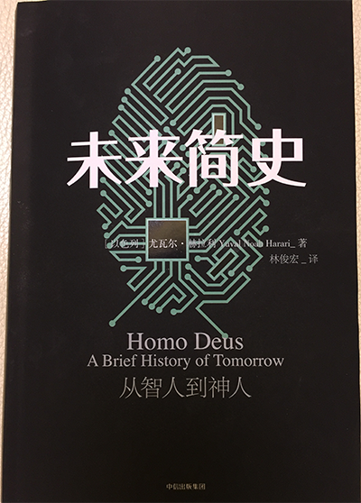

春节期间如预期完成了两个计划：1、读完了《Android系统源代码情景分析》并给大部分章节写了读书笔记，当然这个目标大部分是利用了2016年的业余时间完成的，春节只是给他画了个句号。2、读完了《未来简史》，这是用五天的时间读完的。<!-- more -->

《未来简史》这本书很好读，思路清晰。他首先分析了现代人类赋予自身的意义，然后又逐个分析这些意义存在的基础，进而推导出对未来的一种猜想——所有的意义终将烟消云散，数据将成世界的主宰。有些推导的必然性值得反复品味，反正仅凭一次阅读，我也没有想明白。其中很多思考问题的方向，我觉得是很有意思的。这里随便举几个印象深刻的例子。

《未来简史》说研究历史的目的，是为了挣脱过去的桎梏，让我们能看向不同的方向，并开始注意到前人无法想象或过去不希望我们想象到的可能性。这与司马光的“以史为鉴”有些不同。“以史为鉴”是把历史当作一种指导，让我们免于踩坑或者看到机会。比如知道“双十一”的历史，你知道初期商家为了讲故事、造节日，确实下了本，当全民培养起“双十一血拼”的习惯以后，降价、打折就成了传说，这种好事是很难抢到的，知道这个可以指导你以后双十一前天晚上不必再痴痴守夜。而《简史》的观念则是通过长焦镜头看待这段历史，让你知道“双十一”、“情人节”、“钻石”、“名牌”……这些都只是人造故事而已，当你对一件事情痴迷而无法自拔的时候，仔细想想是不是又深陷到了某个人造故事里。这类故事如“文革”、如“纳粹”一样，经历也许不用太久的时间洗礼，就会变得非常可笑。那么我该如何选择，还对对它那么痴迷吗？

《未来简史》说智人统治世界，是因为只有智人能编织出互为主体的意义之网。我们每个人，每分每秒都活在这张网里。有的时候这张网就是你的牢笼，有的时候你又要依靠这张网给你赋能。比如你的工作、你的职位、你的家庭、你的银行账户等等。节前跟一位朋友聊天，聊到了假离婚卖房这事儿，我还嘲笑他太死脑筋。我和我老婆的关系，只有我俩最清楚，我们不需要也没有人有资格裁决它。我们只是利用“有关部门”开具一张纸，用来向另外一些“有关部门”办事的时候方便，才办了结婚证。而不是婚姻脆弱到需要用那张纸来保护和证明。有没有那张纸，我们都是夫妻，这就跟有没有出生证明，我家闺女都来到世上一样。需要毛的证明！既然这张纸的作用是让办事方便，那现在我要买房，这么正经的事儿，那张纸当然要为这事儿大开绿灯，难得有几次用它的时候！即使如此，我依然在“婚姻”这张网之内，“婚姻”也是智人编制出的意义之网，不是嘛。

《未来简史》说人只是肉做的计算机而已，其内部运行的是生化算法。你感觉到疼是因为大脑回路的开合，你感觉到开心是因为大脑回路的开合，你想吃饭是因为大脑回路的开合，你选择特朗普当总统依然是因为大脑回路的开合。所谓的“主观意识”不存在，“你以为”不过是当下科技还未触达的某个大脑回路的开合。这与马克思说“人的本质是其一切社会关系的总和”相去甚远，“一切社会关系”只不过是数据。把人的本质说成“在其肉体之上一切算法的总和”倒更贴切《未来简史》的观点。如果这个观点成立，那真地细思极恐了。幸福是什么？人活着的意义是什么？人类社会发展的脉络如果是朝着算法越来越有效率演进，那么当机器比肉体运算更快更有效率，那块肉还有存在的必要么？

这个春节没有回家，我已经连着两个年都是待在家里一周看书学习，消除内心对匮乏的焦虑。读了《未来简史》之后，感觉内心更加荒凉了。小的时候正月十五之前集市、商店都不开张，所有人都会“慌年”，赶在过年之前储备足够多吃的，妈妈会在头一天晚上给我赶做好新衣服，全家围在一起看春晚。直到现在，我家宝宝过年那天给在老家的妈妈微信的时候，我妈还问“有没有新衣服”。到了公元2017年的今天，过年超市、饭店不打烊，需要什么随时去；一年四季需要添衣服了都懒得出门，点点手机就给你送到家；美剧、大片、赛事每天不断，“晚会”已经成了上一个世纪的词汇。我们的生活越来越有效率，也越来越平淡——人类正放弃意义而换取力量——这也是《未来简史》中提到的“现代性”契约。

好不希望这个预言是真的，但它貌似就在一点一点地发生。我和父母一起经历过那些意义，好歹一些语言、行为还能心领神会。等到我的女儿长大，也许过年进一步蜕变成位于地球两端的两个app之间几秒钟的电信号而已……哎，一声叹息。

不过也有好消息——研究历史的目的，是为了挣脱过去的桎梏，让我们能看向不同的方向，并开始注意到前人无法想象或过去不希望我们想象到的可能性:) 未来我要努力给自己的生活营造出意义，给自己也给我的家人。因为过往的幸福感来自意义，来自故事。虽然这个想法远没有达到挣脱桎梏的境界，但我认为能够看到历史，能够理解未来的发展脉络，至少就已经不是梦中人，能让自己思考如何打破桎梏，这是读《未来简史》的收获。

2017我还会反复读《未来简史》这本书，并把细品出的味道写成读书笔记。桌上还有两本刚到的《王阳明——一切心法》我隐约感受它和《未来简史》之间是有一些关联的。2017惟愿自己自由！
