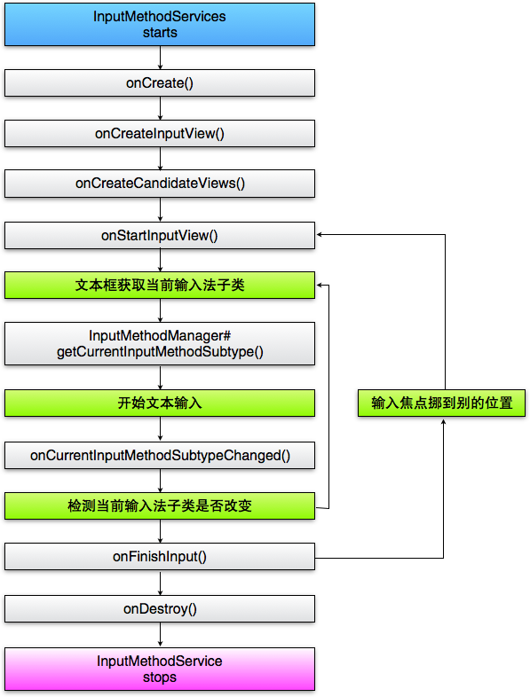
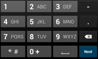
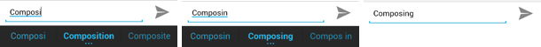
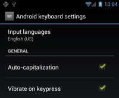
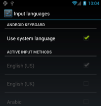

原文来自Android Delelopers开发官网：[Creating an Input Method](https://developer.android.com/guide/topics/text/creating-input-method.html)。<!-- more -->

# 概述  

输入法是用来输入文字的组件。基于安卓的输入法框架开发出新的输入法，可以使应用程序向用户提供可选的、统一的输入法，这些输入法可基于触屏键盘也可基于语音等。用户可以自主安装，在系统设置里选择为默认，然后就能使用了。同一时刻只能使用一个输入法。

在安卓系统里创建输入法，首先应该从`InputMethodService`派生子类并实现它，通常还需要创建一个设置activity，用来设置输入法开关。此外，还可以定义一个展现在系统设置界面中的输入法设置界面。

本文下面的部分将覆盖如下主题：
* 输入法生命周期
* 在manifest文件中声明输入法组件
* 输入法API
* 设计输入法UI
* 从输入法向应用程序上屏文字
* 输入法子类

如果之前没有接触过输入法，建议先阅读[《触屏输入法》](http://android-developers.blogspot.com/2009/04/updating-applications-for-on-screen.html)这篇介绍性文章。SDK中包含了一个例子[SoftKeyboard](https://android.googlesource.com/platform/development/+/master/samples/SoftKeyboard/)也是学习编写输入法不错的参考。

# 输入法生命周期（The IME Lifecycle）

下图展示了输入法的生命周期：


本文剩下的部分将按照该生命周期介绍如何实现输入法的界面和编码。

# 在Manifest文件中声明输入法组件（Declaring IME Components in the Manifest）

在安卓系统中，输入法是一类包含IME服务的特殊应用。需要在manifest文件中声明该服务和必要的权限，提供匹配`action.view.InputMethod`的intent filter，提供定义输入法特征的元数据。定义主设置界面以及能从系统设置界面中启动的输入法设置界面。

下面的代码段声明了一个输入法服务。它包含：申请BIND_INPUT_METHOD权限，该权限允许本服务将输入法连接到系统；创建匹配`android.view.InputMethod`的intent filter，并定义元数据：
``` xml
<!-- 定义IME 服务 -->
<service android:name="FastInputIME"
    android:label="@string/fast_input_label"
    android:permission="android.permission.BIND_INPUT_METHOD">
    <intent-filter>
        <action android:name="android.view.InputMethod" />
    </intent-filter>
    <meta-data android:name="android.view.im" 
        android:resource="@xml/method" />
</service>
```
下面的代码段声明了输入法的设置activity。它在`intent filter`中指定了`ACTION_MAIN`，表明该activity是输入法应用的主入口。
``` xml
<!-- 可选设置: 控制输入法设置的Activity -->
<activity android:name="FastInputIMESettings"
    android:label="@string/fast_input_settings">
    <intent-filter>
        <action android:name="android.intent.action.MAIN"/>
    </intent-filter>
</activity>
```
应该在输入法键盘界面里提供打开输入法设置的入口。

# 输入法相关的API（The Input Method API）

在包[android.inputmethodservice](https://developer.android.com/reference/android/inputmethodservice/package-summary.html)和[android.view.inputmethod](https://developer.android.com/reference/android/view/inputmethod/package-summary.html)中可以找到和输入法相关的类。class [KeyEvent](https://developer.android.com/reference/android/view/KeyEvent.html)用来处理键盘数据。

输入法的核心部分是从[InputMethodService](https://developer.android.com/reference/android/inputmethodservice/InputMethodService.html)派生的一个服务组件。除了要实现普通服务的生命周期以外，该类还为输入法UI绘制、用户输入处理、上屏文字等提供了相应的回调函数。[InputMethodService](https://developer.android.com/reference/android/inputmethodservice/InputMethodService.html)已经实现了大部分管理输入法状态、是否可见以及和输入区域交互的默认行为。


下面还有一些比较重要的类：
* [BaseInputConnection](https://developer.android.com/reference/android/view/inputmethod/BaseInputConnection.html)
定义从[InputMethod](https://developer.android.com/reference/android/view/inputmethod/InputMethod.html)回调宿主的通道。使用该类可以读取光标附近的文字，上屏输入法写作、候选窗中文本，把原始的按键事件发送给应用程序。应用程序应该扩展该类，而不只是实现[InputConnection](https://developer.android.com/reference/android/view/inputmethod/InputConnection.html)的接口。

* [KeyboardView](https://developer.android.com/reference/android/inputmethodservice/KeyboardView.html)
提供键盘布局并响应按键事件的[View](https://developer.android.com/reference/android/view/View.html)。可以通过xml文件定义[keyboard](https://developer.android.com/reference/android/inputmethodservice/Keyboard.html)，它用来描述一个键盘布局。

# 设计输入法界面（Designing the Input Method UI）

输入法有两个可以看到的界面元素：输入窗和候选窗。他们提供了大部分默认的行为，只需要实现和输入法相关的元素即可。

## 输入窗（Input view）

输入窗是用户输入文字的区域，可以是键盘、手写或手势。当输入法首次显示的时候，系统将回调[onCreateInputView()](https://developer.android.com/reference/android/inputmethodservice/InputMethodService.html#onCreateInputView)函数。在实现该函数的时候，应当创建你希望在输入法窗体上展现的布局，并将此布局返回给系统。下面是一个[onCreateInputView()](https://developer.android.com/reference/android/inputmethodservice/InputMethodService.html#onCreateInputView\(\))函数的例程：
``` java
@Override
public View onCreateInputView() {
    MyKeyboardView inputView =
        (MyKeyboardView) getLayoutInflater().inflate( R.layout.input, null);

    inputView.setOnKeyboardActionListener(this);
    inputView.setKeyboard(mLatinKeyboard);

    return mInputView;
}
```

在这个例子中，MyKeyboardView是一个自定义的[keyboard](https://developer.android.com/reference/android/inputmethodservice/Keyboard.html)实例，它实现了[KeyboardView](https://developer.android.com/reference/android/inputmethodservice/KeyboardView.html)接口，如果要创建一个传统的QWERT键盘，请参见[KeyboardView](https://android.googlesource.com/platform/development/+/master/samples/SoftKeyboard/%3E%20%20%20%20SoftKeyboard%3C/a%3E%20sample%20app%20for%20an%20example%20of%20how%20to%20extend%20the%20%3Ccode%3E%3Ca%20href=)类。

## 候选窗（Candidates view）

候选窗用来显示输入法的候选或联想文字。在输入法的生命周期里，当要显示候选窗时，系统将回调[onCreateCandidatesView()](https://developer.android.com/reference/android/inputmethodservice/InputMethodService.html#onCreateCandidatesView())函数。在该函数中应当返回显示候选文字的布局，如果没有要显示的内容则返回null，这也是该函数的默认返回值。

在[SoftKeyboard](https://android.googlesource.com/platform/development/+/master/samples/SoftKeyboard/)例程中，演示了如何候选窗。

## 界面设计（UI design considerations）

本节讲述关于输入法特殊的UI设计考虑。
### 处理不同的屏幕尺寸

输入法界面必须能适配不同的屏幕尺寸，还要处理横竖屏。在非全屏输入法模式下，要为应用程序留出足够的空间显示上屏文字以及上下文，因此输入法不要占用超过一半的屏幕高度。全屏输入法模式则不存在此问题，现在几乎所有的输入法产品都是半屏模式。

### 处理不同的输入类型

在安卓系统下，文本输入区域允许设置一个“输入类型”的属性，比如文本、数字、URL、email地址或者搜索串。当实现一个输入法时，需要探测当前的输入类型，并提供与之对应的界面。不过你不必通过输入法检查用户输入的合法性——这是应用程序应该干的事儿。

比如，下面是针对输入区域是普通文本和数字的输入法截图：



当输入区域获得焦点，系统会调用函数[onStartInputView()](https://developer.android.com/reference/android/inputmethodservice/InputMethodService.html#onStartInputView(android.view.inputmethod.EditorInfo, boolean))启动输入法，并传入一个[EditorInfo](https://developer.android.com/reference/android/view/inputmethod/EditorInfo.html)对象，该对象包含了输入区域的输入类型等相关属性，其[inputType](https://developer.android.com/reference/android/view/inputmethod/EditorInfo.html#inputType)成员就表示输入区域的输入类型。

[inputType](https://developer.android.com/reference/android/view/inputmethod/EditorInfo.html#inputType)字段是一个整型值，它是由代表不同输入类型的位“逻辑或”起来的数值。可以将该值与[TYPE_MASK_CLASS](https://developer.android.com/reference/android/text/InputType.html#TYPE_MASK_CLASS)求逻辑与，如下：
``` java
inputType & InputType.TYPE_MASK_CLASS
```
可有如下几种取值：
* [TYPE_CLASS_NUMBER](https://developer.android.com/reference/android/text/InputType.html#TYPE_CLASS_NUMBER)
    需要输入数字。如前文所示，Latin IME此时在键盘区域显示数字键盘。
* [TYPE_CLASS_DATETIME](https://developer.android.com/reference/android/text/InputType.html#TYPE_CLASS_DATETIME)
    需要输入日期和时间。
* [TYPE_CLASS_PHONE](https://developer.android.com/reference/android/text/InputType.html#TYPE_CLASS_PHONE)
    需要输入电话号码。
* [TYPE_CLASS_TEXT](https://developer.android.com/reference/android/text/InputType.html#TYPE_CLASS_TEXT)
    可以输入所有字符。

这些常量在[InputType](https://developer.android.com/reference/android/text/InputType.html)的参考手册中有详细描述。此外，[InputType](https://developer.android.com/reference/android/text/InputType.html)字段还包含输入区域的其他属性，如：
* [TYPE_TEXT_VARIATION_PASSWORD](https://developer.android.com/reference/android/text/InputType.html#TYPE_TEXT_VARIATION_PASSWORD)
    在[TYPE_CLASS_TEXT](https://developer.android.com/reference/android/text/InputType.html#TYPE_CLASS_TEXT)类型下表示输入区域为密码，此时输入法不要明文显示输入内容
* [TYPE_TEXT_VARIATION_URI](https://developer.android.com/reference/android/text/InputType.html#TYPE_TEXT_VARIATION_URI)
    在[TYPE_CLASS_TEXT](https://developer.android.com/reference/android/text/InputType.html#TYPE_CLASS_TEXT)类型下表示输入区域为URL或者URI(Uniform Resource Identifiers)。
* [TYPE_TEXT_FLAG_AUTO_COMPLETE](https://developer.android.com/reference/android/text/InputType.html#TYPE_TEXT_FLAG_AUTO_COMPLETE)
    在[TYPE_CLASS_TEXT](https://developer.android.com/reference/android/text/InputType.html#TYPE_CLASS_TEXT)类型下表示输入的文本会被应用程序实现自动补全，宿主程序会根据字典、搜索结果或其它机制完成自动补全。

注意：当输入法在密码区域输入时，在输入窗和候选窗中都不要显示明文，但在上屏时，发送给输入区域的应该是明文，此处应当注意。切记不要在磁盘上保存曾经输入过的密码。参考[安全设计](https://developer.android.com/guide/practices/security.html)，可以了解更多和安全相关的主题。

# 上屏文字到应用程序（Sending Text to the Application）

当用户点击输入法按键，输入法通过发送按键事件向应用程序发送文字，也可以编辑输入区域中光标附近的文本。两种情况下，都是通过一个[InputConnection](https://developer.android.com/reference/android/view/inputmethod/InputConnection.html)的实例来传递文本的。调用静态函数[InputMethodService.getCurrentInputConnection()](https://developer.android.com/reference/android/inputmethodservice/InputMethodService.html#getCurrentInputConnection())可获得该实例。

## 编辑光标附近的文本（Editing the text around the cursor）

当要操作编辑输入区域已存在的文字时，[BaseInputConnection](https://developer.android.com/reference/android/view/inputmethod/BaseInputConnection.html)的方法会很有用：
* [getTextBeforeCursor()](https://developer.android.com/reference/android/view/inputmethod/BaseInputConnection.html#getTextBeforeCursor(int, int))
    返回一个[CharSequence](https://developer.android.com/reference/java/lang/CharSequence.html)对象，包含光标前指定数量的字符串序列。
* [getTextAfterCursor()](https://developer.android.com/reference/android/view/inputmethod/BaseInputConnection.html#getTextAfterCursor(int, int))
    返回一个[CharSequence](https://developer.android.com/reference/java/lang/CharSequence.html)对象，包含光标后指定数量的字符串序列。
* [deleteSurroundingText()](https://developer.android.com/reference/android/view/inputmethod/BaseInputConnection.html#deleteSurroundingText(int, int))
    删除光标前/后指定数量的字符串。
* [commitText()](https://developer.android.com/reference/android/view/inputmethod/BaseInputConnection.html#commitText(java.lang.CharSequence, int))
    向输入区域上屏一个[CharSequence](https://developer.android.com/reference/java/lang/CharSequence.html)对象，并设置新的光标位置。

下面代码段演示了如何将光标左边的四个字符替换为"Hello!"：
``` java
    InputConnection ic = getCurrentInputConnection();
    ic.deleteSurroundingText(4, 0);
    ic.commitText("Hello", 1);
    ic.commitText("!", 1);
```
## 上屏前组织写作串（Composing text before committing）

如果输入法要做文本预测或者需要多步才能组织成象形文字或短语，可以在写作窗显示暂时的组织过程，用户选择提交文字会使用候选串替代部分写作串。调用函数[setComposingText()](https://developer.android.com/reference/android/view/inputmethod/InputConnection.html#setComposingText(java.lang.CharSequence, int))添加一个文本片段。

下面的代码演示如何在文本区显示输入过程：
``` java
    InputConnection ic = getCurrentInputConnection();
    ic.setComposingText("Composi", 1);
...
    ic.setComposingText("Composin", 1);
...
    ic.commitText("Composing ", 1);
```

下面的截图演示了用户看到的这个过程：


## 监听硬键盘事件（Intercepting hardware key events）

尽管输入法窗口不会获得输入焦点，它依然是首先收到硬键盘事件的窗口。收到事件后，它可以选择吃掉并处理该事件或者转发出去使得应用程序可以收到它。比如，可以通过方向键来选择候选，这样在输入期间，方向键就被输入法吃掉了。可以同样的方式处理back按键来取消来自输入法的弹出窗口。

如果要监听硬键盘事件，需要覆盖函数[onKeyDown()](https://developer.android.com/reference/android/inputmethodservice/InputMethodService.html#onKeyDown(int, android.view.KeyEvent))和[onKeyUp()](https://developer.android.com/reference/android/inputmethodservice/InputMethodService.html#onKeyUp(int, android.view.KeyEvent))。例程[SoftKeyboard](https://android.googlesource.com/platform/development/+/master/samples/SoftKeyboard/)中有示例。对于不打算处理的事件，记得调用`super()`方法，这样该事件就能被继续转发给应用程序。

# 创建输入法子类（Creating an IME Subtype）

通过创建子类，输入法可以暴露多种输入模式和语言，一个子类可以表示：
* 一个语种如en_US或fr_FR
* 一种输入模式如：语音、键盘或手写
* 更多的输入风格、形式或者特性，比如10键或QWERTY键盘布局

通常用一个字串来表示这些模式，比如"keyboard", "voice"等等。输入子类可以是这些模式的组合。

子类信息会在通知栏的输入法切换面板中被用到，也会在输入法设置界面上被用到。这些信息令系统框架可以直接提供指定的子类。在构建自己的输入法时，应尽量使用子类机制，因为它有助于让用户在不同的输入法语言和模式下定位和切换。

可以在输入法XML资源文件中使用`<subtype>`元素来定义子类。下面的片段定义了两个子类：一个是英文键盘，一个是法语键盘：
``` xml
<input-method xmlns:android="http://schemas.android.com/apk/res/android"
        android:settingsActivity="com.example.softkeyboard.Settings"
        android:icon="@drawable/ime_icon">
    <subtype android:name="@string/display_name_english_keyboard_ime"
            android:icon="@drawable/subtype_icon_english_keyboard_ime"
            android:imeSubtypeLanguage="en_US"
            android:imeSubtypeMode="keyboard"
            android:imeSubtypeExtraValue="somePrivateOption=true"
    />
    <subtype android:name="@string/display_name_french_keyboard_ime"
            android:icon="@drawable/subtype_icon_french_keyboard_ime"
            android:imeSubtypeLanguage="fr_FR"
            android:imeSubtypeMode="keyboard"
            android:imeSubtypeExtraValue="foobar=30,someInternalOption=false"
    />
    <subtype android:name="@string/display_name_german_keyboard_ime"
            ...
    />
</input-method>
```

为确保你的子类能在界面上正确显示出来，应使用%s来获得子类字串，这样获得的字串显示子类的语种标签是一致的。下面的代码段演示了输入法XML部分：
``` xml
<subtype
        android:label="@string/label_subtype_generic"
        android:imeSubtypeLocale="en_US"
        android:icon="@drawable/icon_en_us"
        android:imeSubtypeMode="keyboard" />
```

下面的代码是输入法的string.xml部分。字串资源中定义了`label_subtype_generic`，用于在输入法界面中显示子类标签，定义如下：
``` xml
<string name="label_subtype_generic">%s</string>
```

该设置会让输入法显示的子类名称和系统语种设置相匹配。例如对于英文语种，显示名称为"English (United States)"。

## 从通知栏选择输入法子类（Choosing IME subtypes from the notification bar）

安卓系统会管理所有输入法暴露出来的所有子类。每个子类隶属于一个具体输入法，是该输入法的一种模式。用户可以在通知栏选择当前输入法的子类，如下图：


## 从系统设置中选择输入法子类（Choosing IME subtypes from System Settings）

用户可以在系统的“语言和输入法”设置面板中选择子类。在例程[SoftKeyboard](https://android.googlesource.com/platform/development/+/master/samples/SoftKeyboard/)中，文件`InputMethodSettingsFragment.java`实现了输入法设置中的子类机制。在安卓SDK中可以找到[SoftKeyboard](https://android.googlesource.com/platform/development/+/master/samples/SoftKeyboard/)，更多细节可以参考该例程。

# 在输入法子类中切换（Switching among IME Subtypes）

应该在键盘里提供子类的切换入口，如提供小地球图标，用户可以方便地切换。这么做可以提高键盘的易用性，可以帮助用户避免困惑。按照如下步骤可以让输入法长出此开关：
1. 在输入法的xml资源文件中声明`supportsSwitchingToNextInputMethod = "true"`，如下：
``` java
<input-method xmlns:android="http://schemas.android.com/apk/res/android"
        android:settingsActivity="com.example.softkeyboard.Settings"
        android:icon="@drawable/ime_icon"
        android:supportsSwitchingToNextInputMethod="true">
```
2. 调用函数[shouldOfferSwitchingToNextInputMethod()](https://developer.android.com/reference/android/view/inputmethod/InputMethodManager.html#shouldOfferSwitchingToNextInputMethod(android.os.IBinder))
3. 如果该方法返回true，显示一个切换键
4. 当用户点击了切换键，调用[switchToNextInputMethod()](https://developer.android.com/reference/android/view/inputmethod/InputMethodManager.html#switchToNextInputMethod(android.os.IBinder, boolean))，给第二个参数传入false。false会在不同输入法之间切换各种子类；指定true，系统会在当前输入法内切换所有子类。

注意：在Android5.0(API 21)之前，函数[switchToNextInputMethod()](https://developer.android.com/reference/android/view/inputmethod/InputMethodManager.html#switchToNextInputMethod(android.os.IBinder, boolean))是不知道有`supportsSwitchingToNextInputMethod` 属性的。如果用户切入了某个不带切换键的输入法，他将进入死胡同，因为不能方便地切到别的输入法。

# 实现通用输入法还需要考虑什么（General IME Considerations）

这里还有一些实现输入法时需要考虑的其它问题：
* 要在输入法键盘上提供入口，可以进入输入法设置界面
* 由于设备里可能同时安装了多个输入法，应该在输入法界面里提供切到其他输入法的入口
* 尽可能快地切出输入法。让较大数据块的加载放到后台执行，这样用户在点击可输入区域后立刻就能看到键盘切出。如果后面还会频繁使用一些资源，应该把它们缓存起来。
* 当输入法窗口隐藏后，应当尽快释放大块内存，以便应用程序有足够的内存可运行。应当考虑使用`delayed message`来释放资源，以便输入法处于隐藏状态一段时间后，不再继续占用资源。
* 针对当前的语言和语种，保证用户可以输入尽可能多的字符。切记：用户可能在账号或密码中输入标点符号，因此输入法应当在密码框中给用户提供足够多的字符。