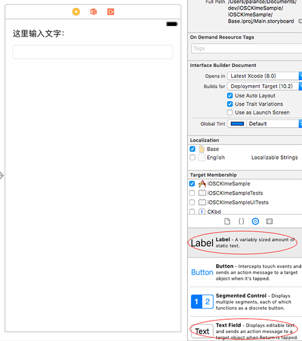
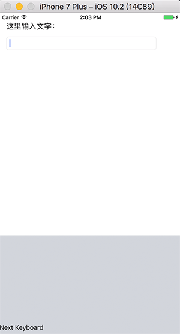
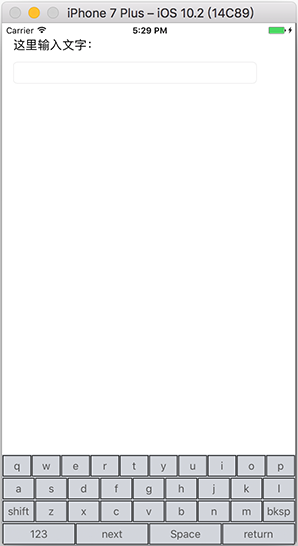

iOS下自定义键盘的创建方法在[《Custom Keyboard（译）》](http://palanceli.com/2017/03/07/2017/0307CustomKeyboard/#使用Xcode自定义键盘模板)中有详细描述，它生成的键盘只是一个白板。这里我们继续把它完善成为一个输入法的样子。<!-- more -->
项目的名称为`iOSCKImeSample`，这也是容器app的名字。键盘的Target name为`CKbd`。

# 在容器app中添加可输入对象
如图，在容器app中添加两个控件，以便验证键盘：


# Xcode模板生成的键盘
先来看看Xcode默认生成的输入法的样子：

在`iOSCKImeSampleCKbd/KeyboardViewController.m`中，
`KeyboardViewController::viewDidLoad`代码如下：
``` obj-c
- (void)viewDidLoad {
  [super viewDidLoad];
  
  // 生成方形圆角按钮
  self.nextKeyboardButton = [UIButton buttonWithType:UIButtonTypeSystem];
  // 设置标题，和状态
  [self.nextKeyboardButton setTitle:
   NSLocalizedString(@"Next Keyboard",
                     @"Title for 'Next Keyboard' button")
                           forState:UIControlStateNormal];
  // 按钮尺寸为能容纳内容的最小化尺寸
  [self.nextKeyboardButton sizeToFit];
  self.nextKeyboardButton.translatesAutoresizingMaskIntoConstraints = NO;
  
  // 设置响应：长按显示输入法列表，短按切换输入法
  [self.nextKeyboardButton addTarget:self action:@selector(handleInputModeListFromView:withEvent:) forControlEvents:UIControlEventAllTouchEvents];
  // 将按钮添加为view的子视图
  [self.view addSubview:self.nextKeyboardButton];
  // 将按钮左/下边缘对齐到view的左下边缘
  [self.nextKeyboardButton.leftAnchor constraintEqualToAnchor:self.view.leftAnchor].active = YES;
  [self.nextKeyboardButton.bottomAnchor constraintEqualToAnchor:self.view.bottomAnchor].active = YES;
}
```
它直接在主视图上生成了一个`Next Keyboard`按钮，并响应点击事件。完善该键盘，只需要在主视图上长出完整的键盘按钮，并响应点击事件即可。
# Step1 创建按键布局
为`KeyboardViewController`添加函数`createCKbdUI`，并在`KeyboardViewController::viewDidLoad`中调用它：
``` obj-c
- (void)viewDidLoad {
  [super viewDidLoad];
  [self createCKbdUI]; // 创建键盘布局
}
```
## Step1.1 createCKbdUI
``` obj-c
- (void)createCKbdUI{
  self.allButtons= [NSMutableArray array];
  self.isPressShiftKey= NO;
  // 定义每一行的键帽字符
  NSArray *titles = @[@[@"q",@"w",@"e",@"r",@"t",@"y",@"u",@"i",@"o",@"p"],
                      @[@"a",@"s",@"d",@"f",@"g",@"h",@"j",@"k",@"l"],
                      @[@"shift",@"z",@"x",@"c",@"v",@"b",@"n",@"m",@"bksp"],
                      @[@"123",@"next",@"space",@"return"]];
  // 为每一行创建视图，并加入主视图
  NSMutableArray *rowViews = [NSMutableArray array];
  for(NSArray *rowTitle in titles){
    UIView* view = [self createRowOfButtons:rowTitle]; // 🏁
    [self.view addSubview:view];
    [rowViews addObject:view];
  }
  // 为每行视图添加约束
  for(UIView *rowView in rowViews) {
    NSInteger index = [rowViews indexOfObject:rowView];
    rowView.translatesAutoresizingMaskIntoConstraints = NO;
    // 左右都与主视图的左右边缘对齐
    NSLayoutConstraint *rightConstraint = [NSLayoutConstraint
                                           constraintWithItem:rowView
                                           attribute:NSLayoutAttributeRight
                                           relatedBy:NSLayoutRelationEqual
                                           toItem:self.view
                                           attribute:NSLayoutAttributeRight
                                           multiplier:1.0 constant:0];
    NSLayoutConstraint *leftConstraint = [NSLayoutConstraint
                                          constraintWithItem:rowView
                                          attribute:NSLayoutAttributeLeft
                                          relatedBy:NSLayoutRelationEqual
                                          toItem:self.view
                                          attribute:NSLayoutAttributeLeft
                                          multiplier:1.0 constant:0];
    // 首行view与主视图上边缘对齐，之后的与上邻view下边缘对齐
    id toItem = self.view;
    NSLayoutAttribute toItemAttribute = NSLayoutAttributeTop;
    if(index > 0){
      toItem = rowViews[index - 1];
      toItemAttribute = NSLayoutAttributeBottom;
    }
    NSLayoutConstraint *topConstraint = [NSLayoutConstraint
                                         constraintWithItem:rowView
                                         attribute:NSLayoutAttributeTop
                                         relatedBy:NSLayoutRelationEqual
                                         toItem:toItem
                                         attribute:toItemAttribute
                                         multiplier:1.0 constant:0];
    // 末行view与主视图下边缘对齐，之前的与下邻view上边缘对齐
    toItem = self.view;
    toItemAttribute = NSLayoutAttributeBottom;
    if(index < rowViews.count - 1){
      toItem = rowViews[index +1];
      toItemAttribute = NSLayoutAttributeTop;
    }
    NSLayoutConstraint *buttomConstraint = [NSLayoutConstraint
                                            constraintWithItem:rowView
                                            attribute:NSLayoutAttributeBottom
                                            relatedBy:NSLayoutRelationEqual
                                            toItem:toItem
                                            attribute:toItemAttribute
                                            multiplier:1.0 constant:0];
    // 等高约束
    UIView *firstRow = rowViews[0];
    NSLayoutConstraint *heightConstraint = [NSLayoutConstraint
                                            constraintWithItem:firstRow
                                            attribute:NSLayoutAttributeHeight
                                            relatedBy:NSLayoutRelationEqual
                                            toItem:rowView
                                            attribute:NSLayoutAttributeHeight
                                            multiplier:1.0
                                            constant:0];
    [self.view addConstraint:heightConstraint];
    [self.view addConstraints:@[leftConstraint,rightConstraint,topConstraint,buttomConstraint]];
  }
}
```
## Step1.2 createRowOfButtons
根据buttonTitles创建包含一排按键的视图
``` obj-c
- (UIView* )createRowOfButtons:(NSArray*)buttonTitles{
  // 为每行按键创建一个view
  UIView *keyBoardRowView = [[UIView alloc]initWithFrame:CGRectMake(0, 0, 320, 50)];
  
  NSMutableArray *buttons = [NSMutableArray array];
  //遍历title，依次创建按键，并加入到keyBoardRowView
  for(NSString *title in buttonTitles) {
    UIButton *btn = [UIButton buttonWithType:(UIButtonTypeSystem)];
    btn.frame = CGRectMake(0, 0, 20, 30);
    [btn setTitle:title forState:(UIControlStateNormal)];
    [btn sizeToFit];
    [btn.layer setBorderWidth:1.0];
    btn.titleLabel.font = [UIFont systemFontOfSize:15];
    [btn setTranslatesAutoresizingMaskIntoConstraints:false];
    [btn setTitleColor:[UIColor darkGrayColor]
              forState:(UIControlStateNormal)];
    // 指定响应函数
    [btn addTarget:self action:@selector(didTapButton:)
              forControlEvents:(UIControlEventTouchUpInside)]; // 🏁
    [buttons addObject:btn];
    [self.allButtons addObject:btn];
    [keyBoardRowView addSubview:btn];
  }
  
  // 遍历每一个按键，设置约束
  for(UIButton *button in buttons) {
    NSInteger space = 1; // 边距
    NSInteger index = [buttons indexOfObject:button];
    //关闭button自动翻译约束的功能
    button.translatesAutoresizingMaskIntoConstraints = NO;
    
    // button 顶部与keyboardView顶部对齐
    NSLayoutConstraint *topConstraint = [NSLayoutConstraint
                                         constraintWithItem:button
                                         attribute:NSLayoutAttributeTop
                                         relatedBy:NSLayoutRelationEqual
                                         toItem:keyBoardRowView
                                         attribute:NSLayoutAttributeTop
                                         multiplier:1.0
                                         constant:space];
    // button 底部与keyboardView底部对齐
    NSLayoutConstraint *bottomConstraint = [NSLayoutConstraint
                                            constraintWithItem:button
                                            attribute:NSLayoutAttributeBottom
                                            relatedBy:NSLayoutRelationEqual
                                            toItem:keyBoardRowView
                                            attribute:NSLayoutAttributeBottom
                                            multiplier:1.0 constant:-space];
    // 行首button与keyboardView左侧对齐，之后的与左邻button右边缘对齐
    id toItem = keyBoardRowView;
    NSLayoutAttribute toItemAttribute = NSLayoutAttributeLeft;
    if (index > 0){
      toItem = buttons[index - 1];
      toItemAttribute = NSLayoutAttributeRight;
    }
    NSLayoutConstraint *leftConstraint = [NSLayoutConstraint
                                          constraintWithItem:button
                                          attribute:NSLayoutAttributeLeft
                                          relatedBy:NSLayoutRelationEqual
                                          toItem:toItem
                                          attribute:toItemAttribute
                                          multiplier:1.0 constant:space];
    // 行末button与keyboardView右侧对齐，之前的与右邻button左边缘对齐
    toItem = keyBoardRowView;
    toItemAttribute = NSLayoutAttributeRight;
    if(index < buttons.count - 1){
      toItem = buttons[index + 1];
      toItemAttribute = NSLayoutAttributeLeft;
    }
    NSLayoutConstraint *rightConstraint = [NSLayoutConstraint
                                           constraintWithItem:button
                                           attribute:NSLayoutAttributeRight
                                           relatedBy:NSLayoutRelationEqual
                                           toItem:toItem
                                           attribute:toItemAttribute
                                           multiplier:1.0 constant:-space];
    // 每个按键都等宽
    UIButton *firstButton = buttons[0];
    NSLayoutConstraint *widthConstraint = [NSLayoutConstraint
                                           constraintWithItem:firstButton
                                           attribute:NSLayoutAttributeWidth
                                           relatedBy:NSLayoutRelationEqual
                                           toItem:button
                                           attribute:NSLayoutAttributeWidth
                                           multiplier:1.0 constant:0];
    [keyBoardRowView addConstraint:widthConstraint];
    [keyBoardRowView addConstraints:@[topConstraint,bottomConstraint,rightConstraint,leftConstraint]];
  }
  return keyBoardRowView;
}
```
运行后能看到键盘布局如下：

# Step2 指定键盘响应函数
在Step1.2创建每个按键后，调用addTarget为之指定响应函数`didTapButton:`
``` obj-c
- (void)didTapButton:(UIButton*)sender{
  //获取被点击按钮的title
  NSString *title = [sender titleForState:(UIControlStateNormal)];
  if([title caseInsensitiveCompare:@"shift"] == NSOrderedSame){
    self.isPressShiftKey = !self.isPressShiftKey;
    [self onShift]; // 切换大小写
  }else if([title caseInsensitiveCompare:@"bksp"] == NSOrderedSame){
    [self.textDocumentProxy deleteBackward];
  }else if([title caseInsensitiveCompare:@"space"] == NSOrderedSame){
    [self.textDocumentProxy insertText:@" "];
  }else if([title caseInsensitiveCompare:@"return"] == NSOrderedSame){
    [self.textDocumentProxy insertText:@"\n"];
  }else if([title caseInsensitiveCompare:@"next"] == NSOrderedSame){
    [self advanceToNextInputMode];
  }else{
    [self.textDocumentProxy insertText:title];
  }
}

- (void)onShift{
  // 遍历每一个按键，切换键帽大小写
  for(UIButton *button in self.allButtons) {
    NSString *title = [button titleForState:UIControlStateNormal];
    if (self.isPressShiftKey) {
      title = [title uppercaseString];
    }else{
      title = [title lowercaseString];
    }
    [button setTitle:title forState:(UIControlStateNormal)];
  }
}
```
参见[《自定义键盘之：自定义键盘API》](http://localhost:4000/2017/03/07/2017/0307CustomKeyboard/#自定义键盘API)，这里有键盘与输入对象之间交互的API，这也是输入法处理按键主要调用的API。

# 总结
到此一个简单的可处理按键事件的自定义键盘就完成了。和Windows的IMM框架相比，iOS的Custom Keyboard体系让输入法能最小化运行起来，要简单太多了。我分析原因如下：
* 手机上的按键输入事件来自键盘界面；而Windows的IMM则来自系统，因此Windows须定义一套协议让按键从IMM传递给输入法，这就是那十几个Imexxx的导出函数。
* 而且Windows处理每个按键不是一个导出函数就能完成，而需要`ImeProcessKey`和`ImeToAsciiEx`两次调用，这是我一直不理解的地方。
* iOS下处理按键是由键盘视图驱动，处理完成后直接调用视图方法更新界面；而Windows处理完按键之后，不能直接调用界面更新，而是把待更新的内容转换成消息，通知输入法UI窗口，UI窗口再把消息翻译成更新的内容展现到子窗口上。这相当于系统有定义了一层WM_IME_xxx的消息协议。为什么不能直接控制界面呢？应该是怕卡死主进程，试想一般的Windows UI程序，假设要定时刷新界面，不是在定时器里直接绘制，而是在定时器里设置无效区域，在WM_PAINT消息中处理绘制。
* Windows的IMC是每线程一份，这么做的好处是在不同的进程或线程之间切换焦点，可以保持上次的输入状态和内容，但也让数据和对这些数据的处理必须分离开；而iOS的上下文信息则与输入app无关，当输入焦点切换，上下文信息也就丢失了。这么做的好处是输入法不必负责根据上下文恢复当前状态，省去了逻辑的复杂性。当然，如果在Windows下状态机做得漂亮，这个复杂度倒也不大，这需要付出更大的设计成本。
* iOS底层一定有更便利的进程间通信机制，让输入法可以和输入进程通信；这是Windows所不具备的。iOS这个机制让输入法更方便、准确地获得输入上下文，从而可以提供更好的联想候选。

协议为两个模块之间的交互提供了一个抽象层，使得两个模块之间解除了耦合，但同时也增加了学习成本，如果原本就是一个模块，其内部调用也用协议来隔离，那就会把事情复杂化。Windows的Imexxx导出函数这层协议是必要的，但这十几个函数中必须的也就四五个，其它大部分用不到；WM_IME_xxx这层协议就把事情弄复杂了，但又不得不这么做。Windows每线程一份的IMC却对设计提出更高的要求，并没有带来多大的好处，，比如macOS下也没有基于进程或线程的输入上下文，也不觉得缺憾。以上就是Windows的IMM框架比iOS复杂的原因。