Fork了一份[libGooglePinyin](https://github.com/palanceli/libgooglepinyin)，并在此基础上稍作修改，以便能跑起来。开源的代码，方便讨论，并以此为切入点研究输入法引擎当中，解决具体问题的方法。libGooglePinyin的本尊在[这里](https://code.google.com/archive/p/libgooglepinyin/)，在Github上还有很多拷贝。<!-- more -->
本文讨论libGooglePinyin构建词库的过程，以及词库格式。由于对代码做了一些改动，我就以自己的代码树为标准来讨论。

词库的构建代码在tools/pinyinime_dictbuilder.cpp，生成可执行文件dictbuilder.exe，调用格式为：
`dictbuilder.exe <rawdict_utf16_65105_freq.txt的路径> <valid_utf16.txt的路径> <系统词库dict_pinyin.dat的生成路径>`

main函数的代码很简单：
``` c++
// tools/pinyinime_dictbuilder.cpp
int main(int argc, char* argv[]) {
  DictTrie* dict_trie = new DictTrie();
  ...
  // 🏁Step1
  success = dict_trie->build_dict("../data/rawdict_utf16_65105_freq.txt",
                                     "../data/valid_utf16.txt");
  ...
  // 🏁Step3
  success = dict_trie->save_dict("dict_pinyin.dat");
  ...
  return 0;
}
```
文件`rawdict_utf16_65105_freq.txt`是词库的文本形式；
文件`valid_utf16.txt`存放所有合法的汉字。

# Step1 DictTrie::build_dict(...)
``` c++
bool DictTrie::build_dict(const char* fn_raw, const char* fn_validhzs) {
  DictBuilder* dict_builder = new DictBuilder();

  free_resource(true);
 
  return dict_builder->build_dict(fn_raw, fn_validhzs, this); // 🏁Step2
}
```
# Step2 DictBuilder::build_dict(...)
``` c++
// src/dictbuilder.cpp
bool DictBuilder::build_dict(const char *fn_raw,
                             const char *fn_validhzs,
                             DictTrie *dict_trie) {
  ...
  // 读出原始数据，形成两个数据结构：
  // 1. lemma_arr_数组，它的每个元素存放词、词频、拼音串
  // 2. raw_spellings_哈希表，它的每个元素存放一个音节、音频（所有包含该音的词频总和）
  lemma_num_ = read_raw_dict(fn_raw, fn_validhzs, 240000);
  ...
```
数据结构`lemma_arr_`是从`rawdict_utf16_65105_freq.txt`读出系统词库并组织成的数组，每个元素是一个LemmaEntry结构体。
在记录拼音的时候，它默认将拼音字母转成大写，仅对双声母中的h使用小写。  
在解析拼音串的同时，它用哈希表`raw_spellings_`构建了一张拼音表，具体过程在Step4中分析。其有效元素即合法的音节字串个数413，这张哈希表的空间远比这个数字大，不过这个细节并不重要：


``` c++
  // Arrange the spelling table, and build a spelling tree
  // The size of an spelling. '\0' is included. If the spelling table is
  // initialized to calculate the spelling scores, the last char in the
  // spelling string will be score, and it is also included in spl_item_size.
  size_t spl_item_size;
  size_t spl_num;
  const char* spl_buf;
  // 将合法音节按顺序保存到spl_table_->spelling_buf_中，
  // 返回值spl_buf指向该成员
  spl_buf = spl_table_->arrange(&spl_item_size, &spl_num);
  ...
```
该函数将spl_table_->raw_spellings_中的音节串按照顺序，排列到spelling_buf_中。其中每个元素包含：音节拼音串 和 音节音频，前者占7个字节，以'\0'结尾；后者占1个字节。共413个元素。如下图：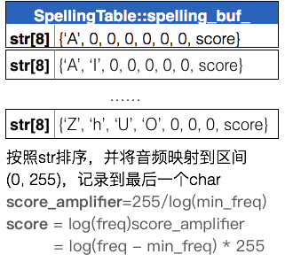

`spl_table_->arrange`返回的spl_buf即spl_table_->spelling_buf_，继续被传入`spl_trie.construct`中：
``` c++
  SpellingTrie &spl_trie = SpellingTrie::get_instance();
  // 把所有合法音节组织成一个Trie树
  if (!spl_trie.construct(spl_buf, spl_item_size, spl_num,
                          spl_table_->get_score_amplifier(),
                          spl_table_->get_average_score())) 
  {...}
```
在`spl_trie.construct(...)`中，生成的数据结构比较多，它从参数spl_buf中拷贝了一份spelling_buf： 
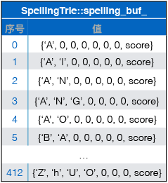  

为所有合法的音节串生成Trie树，该树的逻辑结构为：
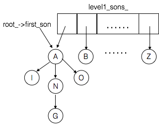

实际存储结构为：
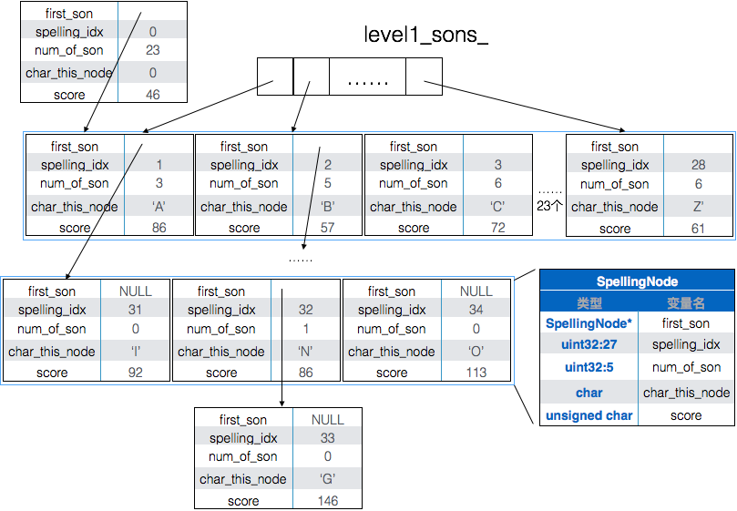

来看spelling_idx的含义，当它小于30，表示它可以作为一个half音节；如果大于30，表示这是一个full音节，该值即此音节在spelling_buf_中的偏移。
half音节是指可以作为音节首部的拼音串，包括声母（如`b`、`p`、`m`，双声母`zh`、`ch`、`sh`）和可独立出现的韵母（如`a`、`o`、`e`）。

该段代码还生成了`SpellingTrie::h2f_start_`和`SpellingTrie::h2f_num_`：
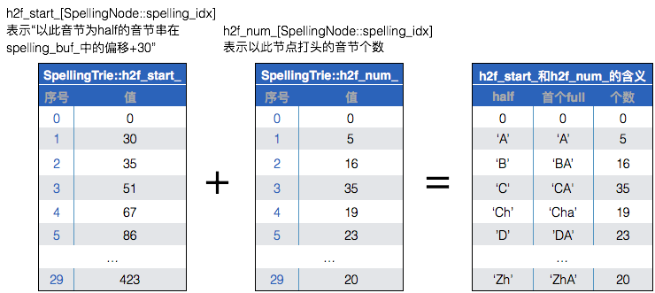
这两个数据结构要结合音节字典树和spelling_buf_一起来看。

该代码还生成了`SpellingTrie::f2h_`：
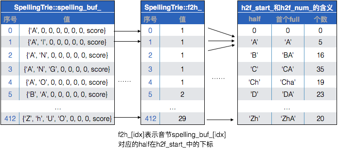
该数据结构用于从full到half的对应，因此可以把相关的数据结合来看。

该代码还生成了`SpellingTrie::ym_buf_`和`SpellingTrie::spl_ym_ids`前者是韵母表，后者则是音节到韵母的关系：
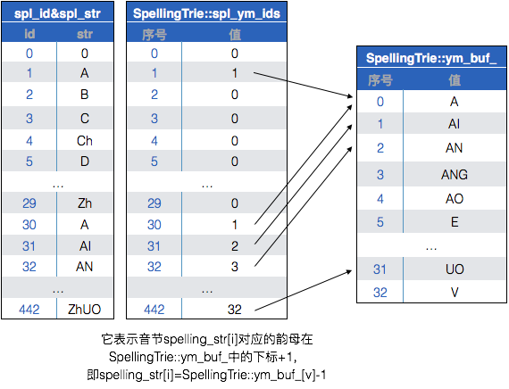
其中spl_id&spl_str这张表并不存在物理数据，这张表的转换关系是在函数`SpellingTrie::get_spelling_str(...)`中体现的。


``` c++
  // 填充lemma_arr_数组每个元素的spl_idx_arr项，它表示每个汉字的音对应的spl_id
  for (size_t i = 0; i < lemma_num_; i++) {
    for (size_t hz_pos = 0; hz_pos < (size_t)lemma_arr_[i].hz_str_len;
         hz_pos++) {
      uint16 spl_idxs[2];
      uint16 spl_start_pos[3];
      bool is_pre = true;
      int spl_idx_num =
        spl_parser_->splstr_to_idxs(lemma_arr_[i].pinyin_str[hz_pos],
                                    strlen(lemma_arr_[i].pinyin_str[hz_pos]),
                                    spl_idxs, spl_start_pos, 2, is_pre);
      assert(1 == spl_idx_num);

      if (spl_trie.is_half_id(spl_idxs[0])) {
        uint16 num = spl_trie.half_to_full(spl_idxs[0], spl_idxs);
        assert(0 != num);
      }
      lemma_arr_[i].spl_idx_arr[hz_pos] = spl_idxs[0];
    }
  }
  // 按照汉字串排序，更新idx_by_hz字段，为每个词分配一个唯一id
  sort_lemmas_by_hz();
  // 构建单字表到scis_，并根据该单字表更新lemma_arr_中的hanzi_scis_ids字段
  scis_num_ = build_scis();
```
for循环则遍历`lemma_arr_`数组，更新每个元素的`spl_idx_arr`字段，它表示该词的每个字音对应的spl_id。

`sort_lemmas_by_hz()`则按照汉字串对lemma_arr_排序，更新idx_by_hz字段，为每个词分配一个唯一id。

`scis`是`SingleCharItems`的简写，`build_scis()`创建了单字表，并再次更新`lemma_arr_::hanzi_scis_ids`字段，该字段是每个词的每个汉字在单字表中的序号。单字表内容如下：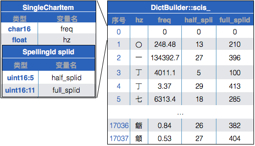
更新后的`lemma_arr_`内容如下：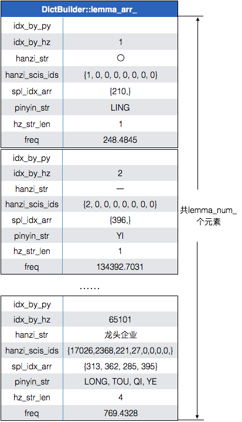

``` c++
  // Construct the dict list
  dict_trie->dict_list_ = new DictList();
  // 将单字序列化到scis_hz_，每个元素一个单字；
  // 将该单字对应的splid序列化到scis_splid_，每个元素一个SpellingId；
  // 将所有的词序列化到buf_，每个元素都是变长的词串
  bool dl_success = dict_trie->dict_list_->init_list(scis_, scis_num_,
                                                     lemma_arr_, lemma_num_);
  assert(dl_success);
```
`dict_trie->dict_list_->init_list(...)`函数将单字表拆成两个数组：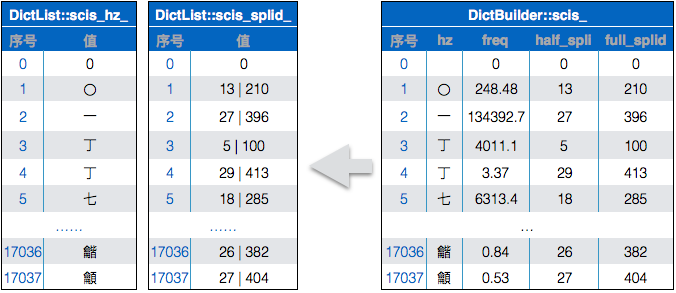
它把系统词库里所有汉字串成一个总串保存到`DictList::buf_`中，用`DictList::start_pos_`分别指向1字词、2字词……9字词的起点，用`DictList::start_id_`指向1字词、2字词……9字词在lemma_arr_中的起始位置：  
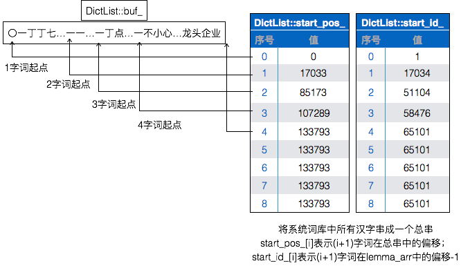
``` c++
  // 🏁Step9 将词频数据归拢到256个值
  NGram& ngram = NGram::get_instance();
  ngram.build_unigram(lemma_arr_, lemma_num_,
                      lemma_arr_[lemma_num_ - 1].idx_by_hz + 1);
```
它生成`NGram::lma_freq_idx_`、`NGram::freq_codes_df_`、`NGram::freq_codes_`三个数据结构。其中`NGram::freq_codes_df_`将系统词库里每个词条的词频归拢成256个值，并经过多伦迭代求均值，让这256个归拢值尽量接近被归拢的原始值；`NGram::lma_freq_idx_`则记录原始词频与归拢词频之间的对应关系：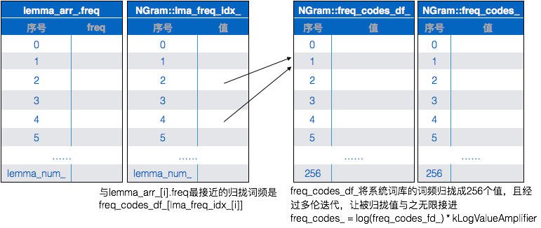
``` c++
  // sort the lemma items according to the spelling idx string
  myqsort(lemma_arr_, lemma_num_, sizeof(LemmaEntry), compare_py);

  get_top_lemmas(); // 取出词频最大的top_lmas_num_个LemmaEntry，由大到小排到top_lmas_中

#ifdef ___DO_STATISTICS___
  stat_init();
#endif

  lma_nds_used_num_le0_ = 1;  // The root node
  bool dt_success = construct_subset(static_cast<void*>(lma_nodes_le0_),
                                     lemma_arr_, 0, lemma_num_, 0);
  if (!dt_success) {
    free_resource();
    return false;
  }
```
函数`construct_subset(...)`主要生成了`lema_nodes_le0`、`lema_nodes_ge1`和`homo_idx_buf_`三个数据结构，这三坨数据也需要结合在一起解读，它们共同把系统词库按照读音组织成一个Trie树。  
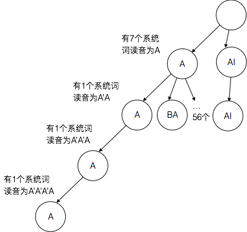它对应的存储结构为：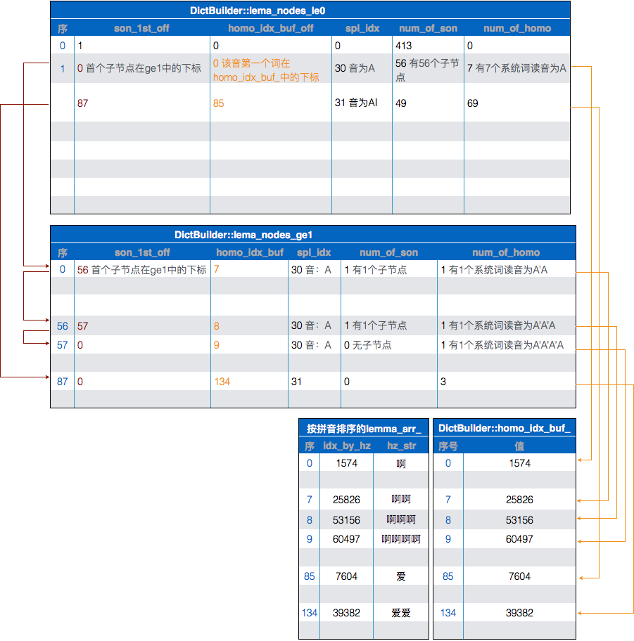
首先把lemma_arr_按照拼音排序，将其idx_by_hz抽取出来存储到homo_idx_buf_中。
lema_nodes_le0和lema_nodes_ge1的逻辑结构是完全一致的，只是出于空间开销的考虑，前者每个元素占用16个字节，后者仅占用8个字节。
lema_nodes_le0的首个元素记录Trie树第0层信息。字段son_1st_off表示第一个子元素在本表中的下标；num_of_son表示子元素个数。
lema_nodes_le0第2个及之后的元素记录第1层Trie节点信息。son_1st_off表示首个子元素在lema_node_ge1中的下标；homo_idx_buf_off表示该音节对应得以个系统词在homo_idx_buf_中的下标；spl_idx表示当前节点代表的音节；num_of_son表示当前节点的子节点个数；num_of_homo表示当前节点下有多少个系统词。
lema_nodes_ge1与lema_nodes_le0第2行以后的元素各字段表示的含义一致。

``` c++
#ifdef ___DO_STATISTICS___
  stat_print();
#endif

  // Move the node data and homo data to the DictTrie
  dict_trie->root_ = new LmaNodeLE0[lma_nds_used_num_le0_];
  dict_trie->nodes_ge1_ = new LmaNodeGE1[lma_nds_used_num_ge1_];
  size_t lma_idx_num = homo_idx_num_eq1_ + homo_idx_num_gt1_ + top_lmas_num_;
  dict_trie->lma_idx_buf_ = new unsigned char[lma_idx_num * kLemmaIdSize];
  assert(NULL != dict_trie->root_);
  assert(NULL != dict_trie->lma_idx_buf_);
  dict_trie->lma_node_num_le0_ = lma_nds_used_num_le0_;
  dict_trie->lma_node_num_ge1_ = lma_nds_used_num_ge1_;
  dict_trie->lma_idx_buf_len_ = lma_idx_num * kLemmaIdSize;
  dict_trie->top_lmas_num_ = top_lmas_num_;

  // 将lma_nodes_le0拷贝到dict_trie->root_，将lma_node_ge1_拷贝到dict_trie->nodes_ge1_
  memcpy(dict_trie->root_, lma_nodes_le0_,
         sizeof(LmaNodeLE0) * lma_nds_used_num_le0_);
  memcpy(dict_trie->nodes_ge1_, lma_nodes_ge1_,
         sizeof(LmaNodeGE1) * lma_nds_used_num_ge1_);
  // 将homo_idx_buf_拷贝到dict_trie->lma_idx_buf_，该数组的每个元素是3个字节
  for (size_t pos = 0; pos < homo_idx_num_eq1_ + homo_idx_num_gt1_; pos++) {
    id_to_charbuf(dict_trie->lma_idx_buf_ + pos * kLemmaIdSize,
                  homo_idx_buf_[pos]);
  }
  // dict_trie->lma_idx_buf_末端10个元素是词频最高的top10系统词
  for (size_t pos = homo_idx_num_eq1_ + homo_idx_num_gt1_;
       pos < lma_idx_num; pos++) {
    LemmaIdType idx =
        top_lmas_[pos - homo_idx_num_eq1_ - homo_idx_num_gt1_].idx_by_hz;
    id_to_charbuf(dict_trie->lma_idx_buf_ + pos * kLemmaIdSize, idx);
  }
  ...
  return dt_success;
}
```
# Step3 DictTrie::save_dict(...)
``` c++
bool DictTrie::save_dict(const char *filename) {
  ...
  SpellingTrie &spl_trie = SpellingTrie::get_instance();
  NGram &ngram = NGram::get_instance();

  FILE *fp = fopen(filename, "wb");
  ...
  if (!spl_trie.save_spl_trie(fp) || !dict_list_->save_list(fp) ||
      !save_dict(fp) || !ngram.save_ngram(fp)) {
    ...
  }
  ...
  return true;
}
```
把前面生成数据结构的过程研究透彻，这一步只不过把数据写入文件，内容如下：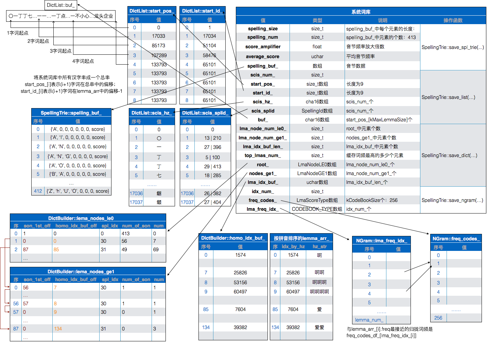