在我生命当中，三十岁以后能留下深刻印记的事件不多，每天貌似忙忙碌碌的，好几年时间瞬间滑过，好像就只过去几天。而这次登顶岗什卡，绝对是插在我人生旅途中的一支醒目的旗标。<!-- more -->

先来秀一下登顶证书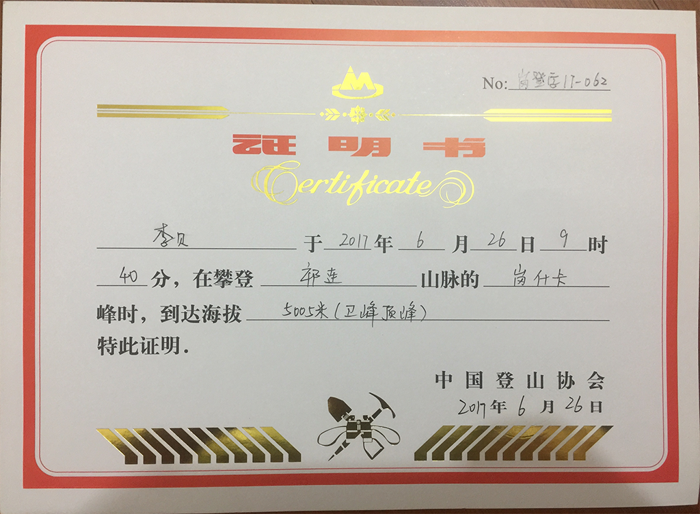

岗什卡的登山计划是由大哥发起，酝酿两个多月，终于在6月23日成行。我本来没打算参加，因为今年五六月份的差旅特别多，本想在六月底好好休息。后来经不住二哥挑逗，抱着打酱油的心态，就入伙了，直到落地西宁还是观光客一枚。一张充满仪式感的合影之后：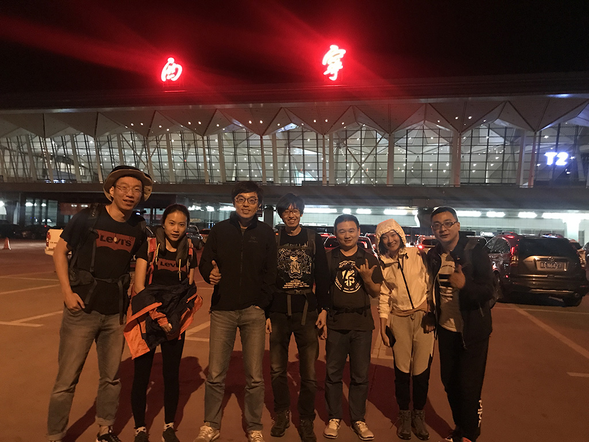就进入了胡吃海塞的节奏：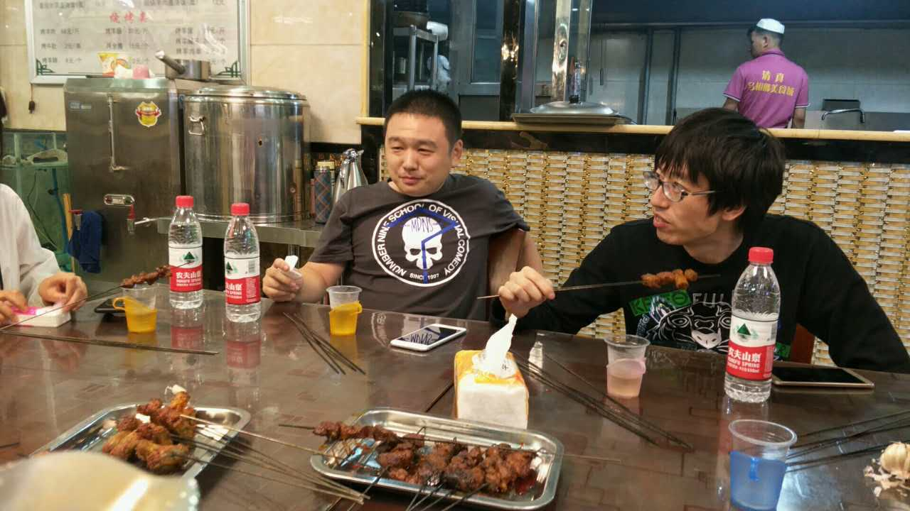羊肉串、大腰子，哈哈哈。如果不是教练叮嘱登山前不准喝酒，桌上码出一排酒瓶才是标配！

第二天（24日）一早就被迅速拉入角色，上午10点钟出发，三个小时徒步3.5公里，到达海拔4300多米的大本营。一路上的风景就像西北汉子一样粗狂不羁，偶尔还能看到不远处的雪山顶：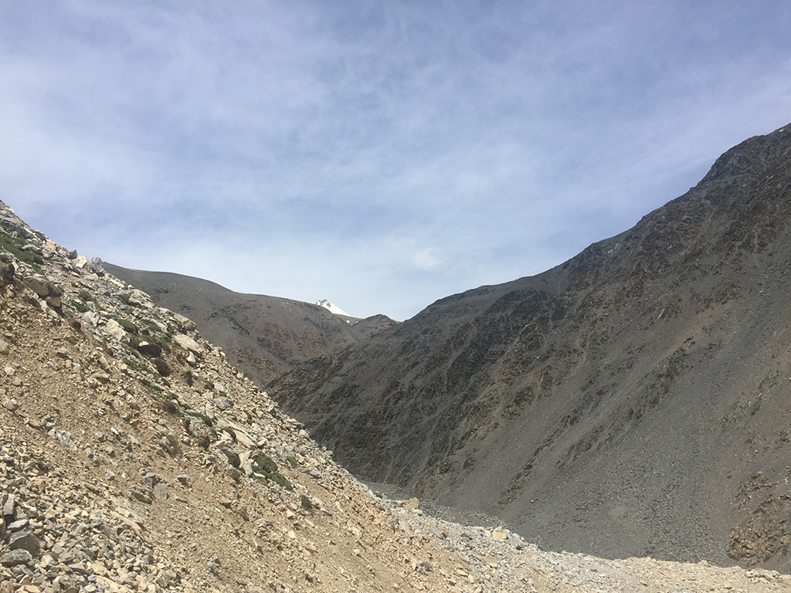随着露出越来越多的白色山尖，内心里的激动也开始越来越不安分了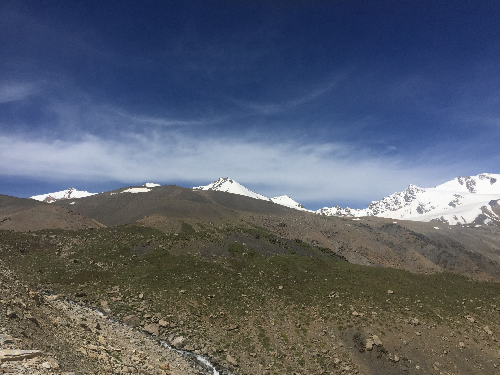无法掩饰一副踌躇满志的表情：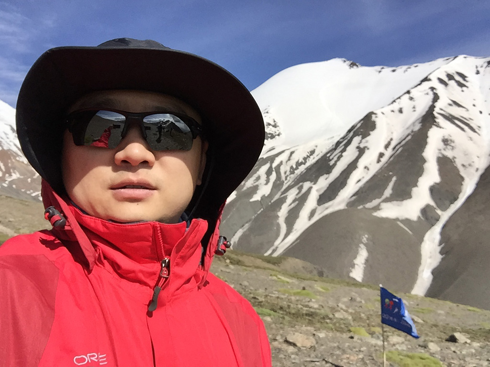中午1点多到达大本营：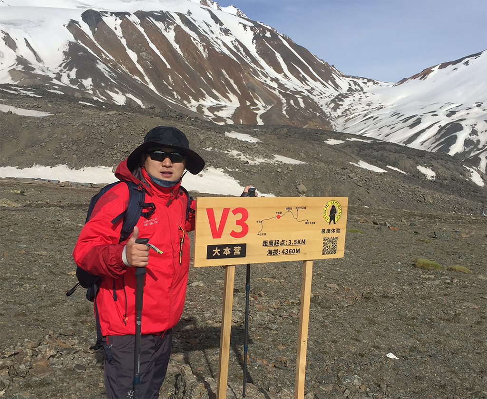

按照计划，当天下午休息，第二天出来拉练、适应，第三天登顶。此时一直令我内心不安的是：爬雪山会不会出现传说中的高原反应？如果爬到半山腰高反了谁把我扛下去？如果山上出现暴风雪，天昏地暗、飞沙走石，会不会小命就交代在山上？然而事实证明我想多了，因为拍完上面这张照片，进入大本营，我就差不多失忆了……

所谓大本营就是一栋木屋，晚上在这里休息，装备都运到这里，作为冲顶的基地。刚进屋落下脚，我就开始剧烈头痛，反胃。刚刚徒步那3.5公里更像是下肚了半斤劣质白酒，此时已融入浑身的血液，开始在体内撒欢，让你想吐又吐不出来。教练不让睡觉，因为睡太早夜里会难受地醒来，然后就更难入睡了，第二天会更难受。

据说一下午我都闭着眼睛，夹着尾巴，蜷在马扎上。说失忆也不准确，因为我能听到身边的人在走动、说话，就好像从天上传下来的声音，嗡嗡作响；同时还要忍受来自自己驱壳里的种种难受，真想从这驱壳里抽离出来，又做不到。那真的比死还难受！不知道那一下午的怂样有没有被人拍到，如果有回头会补一张:)

我不知道怎么挨到了晚上十点钟。终于，终于教练放我们睡觉了。睡前想最多的就是——老子不爬了！坐那喘口气儿都是负担，爬山？去他姥姥的…… 睡前我还艰难地睁开眼睛环顾下四周，发现Ruby高反也挺严重的，不禁心中暗喜，明儿打退堂鼓有伴了，好歹老子不是唯一一个怂包。不过人家Ruby是女生……哈哈哈哈，就算是唯一一个，老子也不爬了，太tm难受了，实在扛不住！岗什卡，拜一个拜啦~

我从晚上十点睡到第二天早上九点，中间要不是被尿憋醒，那一觉就完美了。说起晚上撒尿，实在不爽，因为要从热乎乎的睡袋里钻出来，穿好绒衣、羽绒服，到门口脱下保暖鞋换上外出的登山鞋，出去找个空地儿解决完之后，再回来换鞋、脱衣服、钻入睡袋。看看我们的睡袋：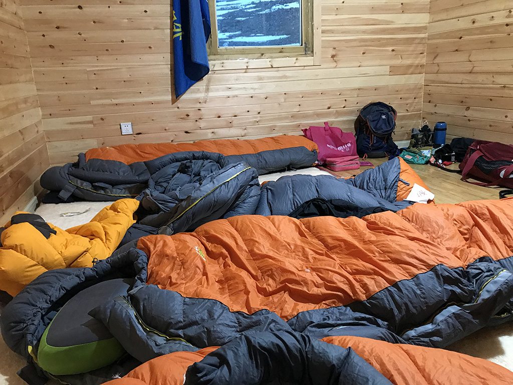睡袋是用拉链拉起来的，为了不让热气散掉，起夜要尽量拉开一个小口，从里面钻出来，而不是噗嗤拉开半截从里面跳出来。

为了要不要起来解决问题，我先斗争了二十分钟——他姥姥的晚上没吃没喝怎么会有尿呢？不会是做梦吧？好像是真的，还是谨慎一点，别一个不小心尿睡袋里可就糗大了……再憋一会？可这才凌晨一点多，憋到天亮非炸了……最后只好像豆虫蜕皮一样从睡袋里翻滚着钻了出来，钻出一身白毛汗，睡意全无。回来钻进去好像比钻出来更难，只好把拉链的口拉大一些。早知如此，出来的时候就直接拉开了嘛。

第三天（25日）醒来，我惊喜地发现不反胃了，头疼好像也缓解了很多。艹，昨天到底是走了3.5公里还是喝了半斤白酒？怎么跟喝了酒的感觉一模一样呢？如果真地是喝高了，那症状应该越来越轻，弄不好明天可以冲顶哦~ 这一天的任务是出来做适应性拉练，早饭已经有胃口了，吃点东西好像可以跟教练出来活动了。Ruby还是跟昨天一样痛苦，可是她还是坚持出来拉练，如果我说不行，好像是在有点太丢人。哎，真是上了贼船，出发吧！

这天上午的主要任务是穿上高山靴、雪套，走上几公里适应一下鞋子、道路、空气，再找个小雪坡，学习怎么上下。大家高反后的状态都不太一样，我是比较早出现反应的，第二天就明显缓解了；有人夜里睡觉开始高反，早上醒来也缓解了，二哥属于这种；也有第二天开始头疼，只是没那么严重，晓峰属于这种；还有武爷越来越难受的；最痛苦的还是Ruby，跟我差不多同时高反，直到从大本营撤下山才好转。不管是哪种情况，这一天大家全都集体出来拉练，没少走一步路。这一点让我觉得我们的团队很牛逼！

这是我们在学习走雪坡：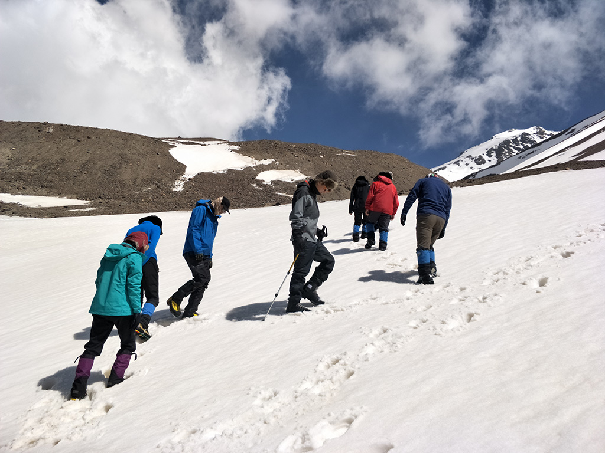累了休息，气色真地好了很多：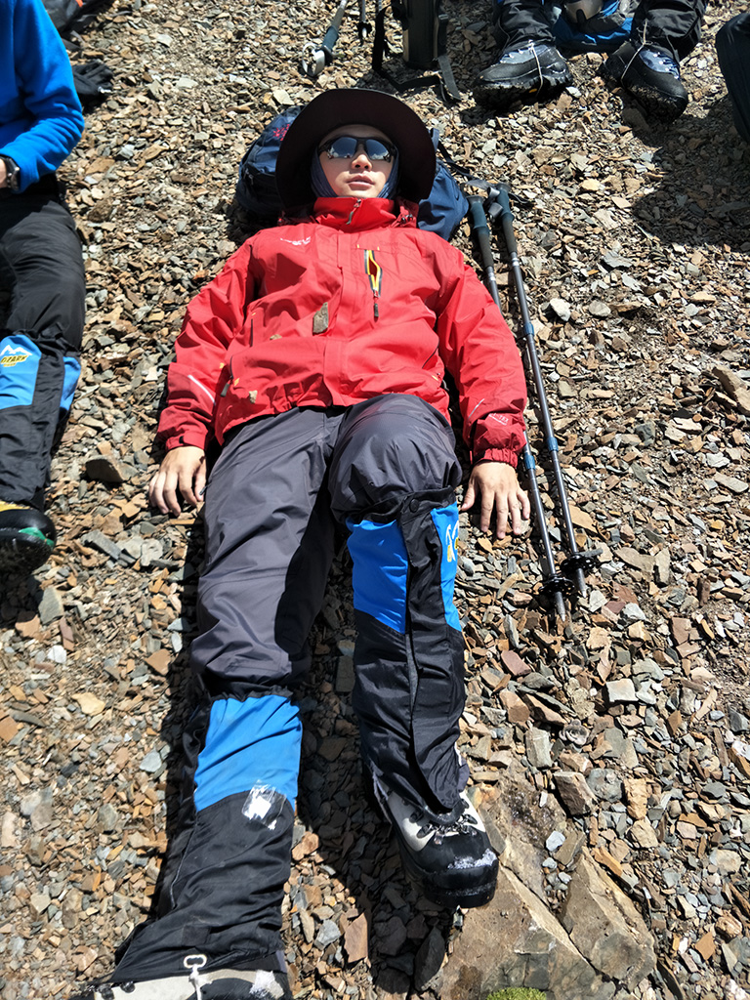后面雪坡上是我们走出的脚印，稍微运动几下，高反症状随时反扑，在这个雪坡上印出这些痕迹差不多等效于二两白酒吧：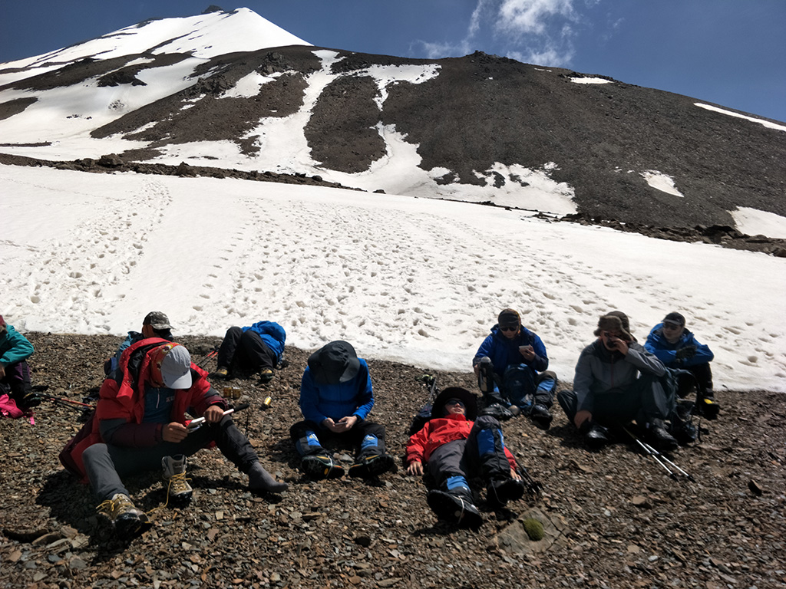这姑娘就是倔强的Ruby，我要是高反成她那样，这天早上绝对不出来了：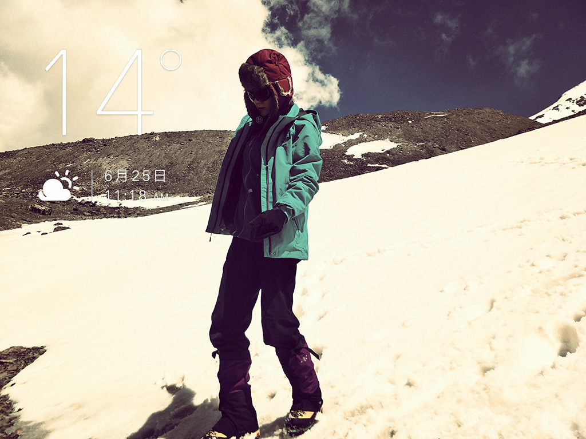还有两个逗比，二哥和晓峰：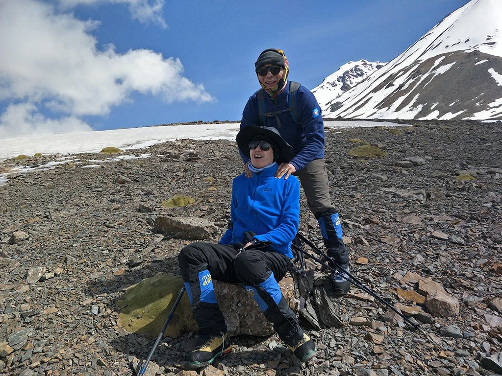这一天已经能清晰地看到我们即将挑战的山峰，最高那个尖尖就是：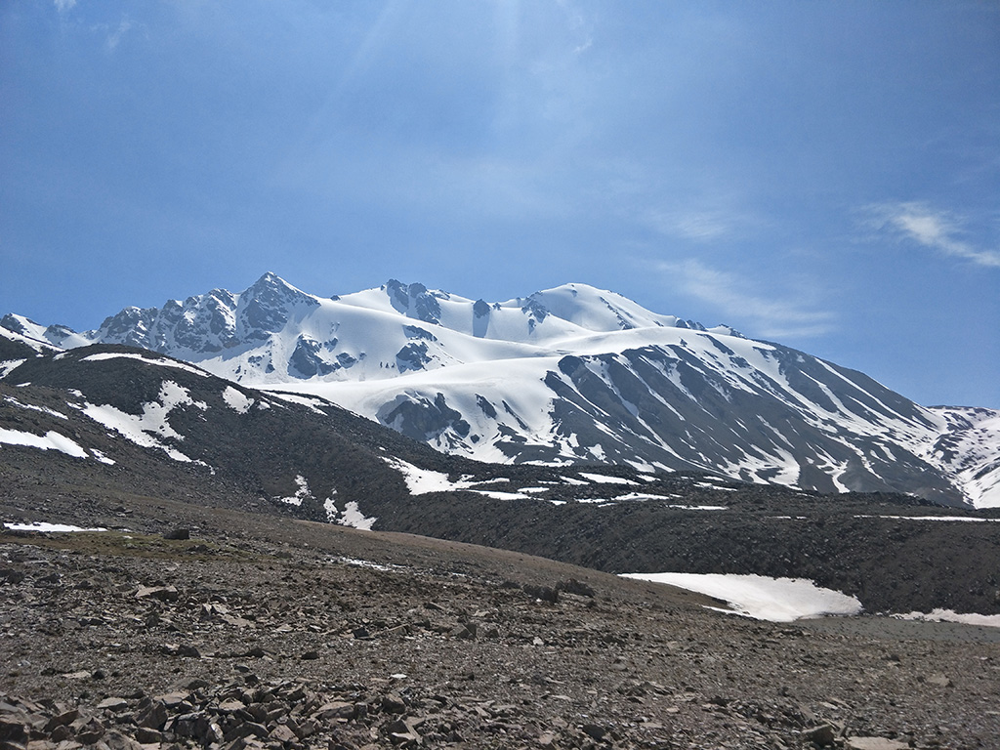

上午完成拉练，中午回大本营饱餐一顿，我们从下午三点睡到五点，晚上一顿美餐之后，教练给我们看纪录片——记录的是他带过的“7+2登山团”。所谓“7+2”是指七个大洲的最高峰+两个极点：非洲的乞力马扎罗（5895m）、亚洲珠穆朗玛峰（8844m）、南美洲阿空加瓜（6962m）、大洋洲查亚（5030m)、欧洲厄尔布鲁士（5642m）、北美洲麦金利（6194m）、南极洲文森（4897m）和南北极点。

看完之后大家血脉贲张，因为白天的拉练让大家初步体会到了带着高反在高山行走、攀登时的艰难。教练带的团队每次出征的平均年龄都要比我们大，他们面对挑战，勇敢面对，那股豪气感染了我们。那些场面、那些话语、那些在雪山下的行走，平时在自家客厅里看和这一晚在雪山脚下的大本营里看，那感受完全不同！

第四天（26日）凌晨三点，教练集合令响，大家收拾行装，向岗什卡山顶行进！

出发之前，大概三点半出来撒尿，我被满天星斗惊呆了！那漫天寒光，映衬着远处黑漆漆的山幕，让人内心顿生敬畏，那种感觉和深夜依偎在海边像极了。非常幸运的是我还看到一颗流星，慢速地划过了半边天空。突然有种感觉：在这星空的背后是有灵魂的，他正在用闪烁严肃地表达着自己。我没有拍照，因为我知道这种美只有此刻身临其境才能感受得到，照片还不能还原其万分之一。

这张是大哥照的，已经非常漂亮了！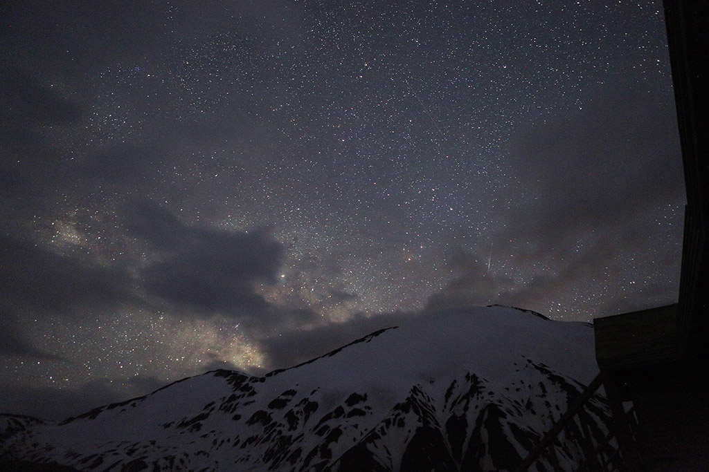这次岗什卡之行最大的遗憾是没有看到银河，据说一两点出来就能看到。

大家背上行装，点亮头灯，向山顶进发！远处的灯光是我们的木屋。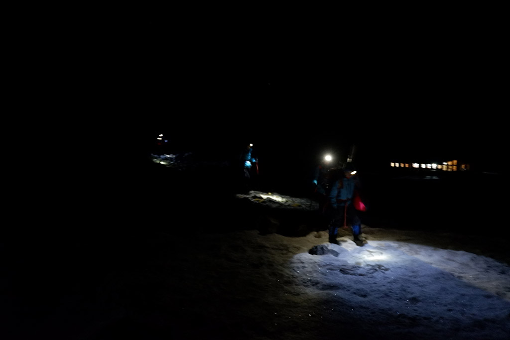虽然没有睡爽，个个睡眼惺忪，但一票人马能在凌晨四点举着火把出门，本身就挺有仪式感的。我想大家此时想法应该都差不多——登顶！

通往山顶的路程分三段：前三分之一是碎石路，接下来是两段“>”字形的雪坡。黎明时分，大家已经走完三分之一，越过了雪线，穿上冰爪踏在雪地上，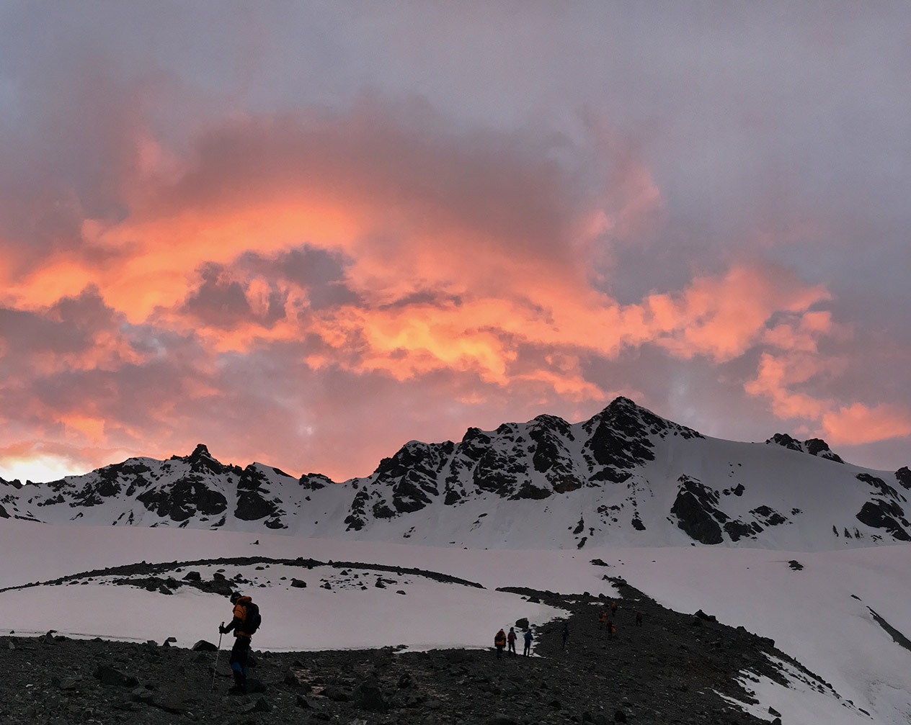
头还是隐隐地疼，大口喘着粗气，但终于踏在茫茫雪地里，那股新鲜劲儿支撑着我继续前行。但是没走多远就感觉体力不支了，因为每翻过一个雪坡，发现后面还有一座更大的雪坡。开始不敢往前看了，感觉脚下的冰爪越来越沉，而且深一脚浅一脚时不时陷入雪坑里。

教练贵哥为我们开路，大家一字行进，其他的教练穿插在队伍中间。教练们都太厉害了，他们不用登山杖，步履轻盈。常常从队首走到对尾，又从队尾走到队首。每当教练从我身边走过，看到他如履平地，而我的双腿像灌了铅一样，我都要仔细盯着他们看半天，因为我忍不住地猜测他们一定是有凌波微步之类的诀窍或步法能让他们走得如此之快。
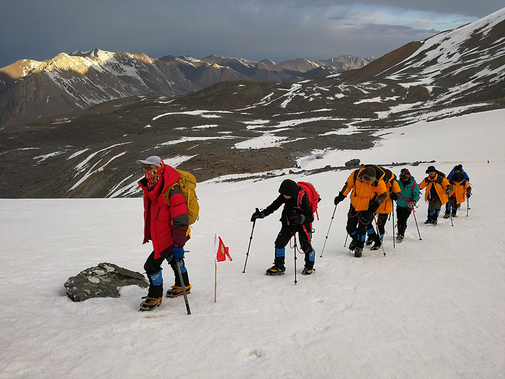
我们教练里还有一位美女，叫晓晓。她一路上为我们拍照、直播视频。她的登山动作更是飘逸——一路上一手拿着自拍杆不停采访、直播每位队员，一手拿着一根小竹竿，点啊点地就登顶了。一路上看到她总让我想起金庸武侠里的绝世高手，随意捻起一根柳条、树枝都能耍出剑气如虹。而我等手中的装备，不管是“倚天杖”还是“屠龙杖”，此刻只有一个感觉——沉！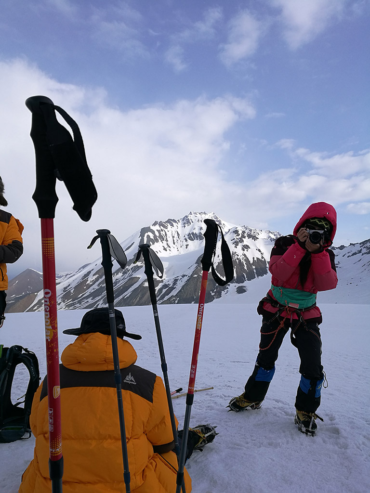

终于可以坐下来休息一会，补充水分，吃点东西。昨天拉练的时候，没走多远教练就会让我们休息，今天明显每段行军长度要长很多。稍微休息一会，心跳很快就能恢复，只是刚站起来没走几步，就又进入了大口喘气的状态。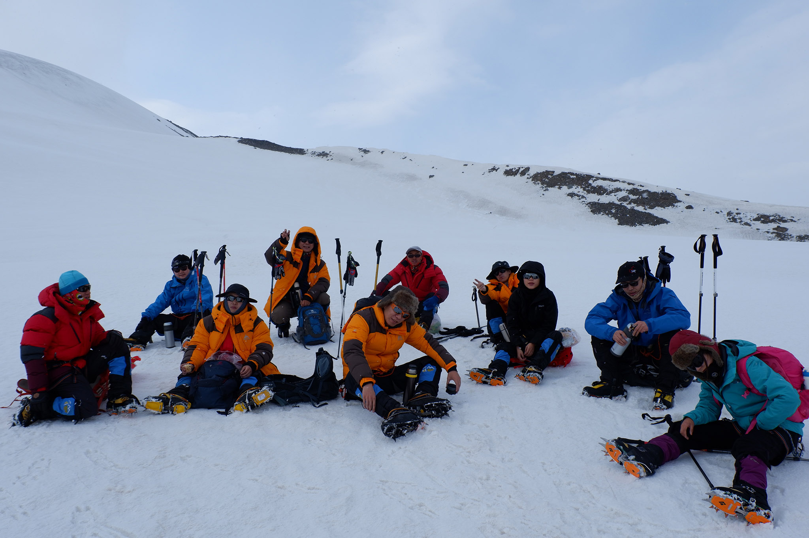

最后三分之一的路程天地都是白茫茫一片，话明显少了，整个世界只剩下我的呼吸声，体力已经接近极限，每挪动一步都非常艰难。不过思维反而活跃起来。白天我曾多次问教练确认，我的状态能不能冲顶，教练总是信心十足地告诉我——没问题！
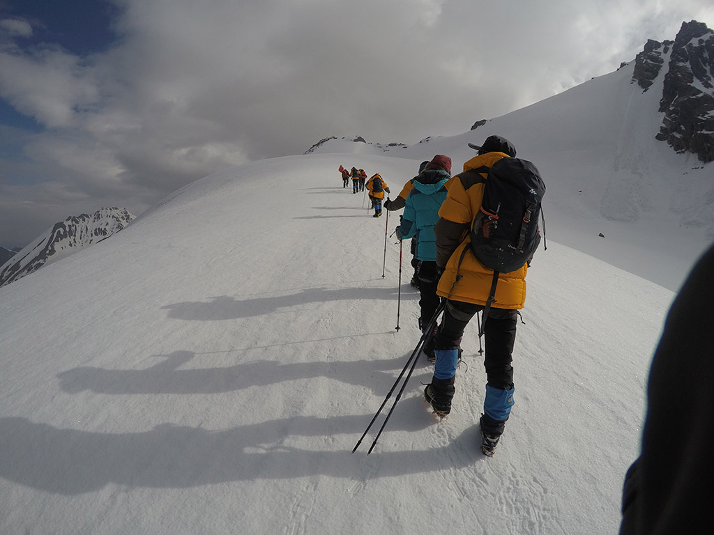

我觉得这次冲顶成功最关键的因素有两个——和教练结成了信任关系+自己的意志力。当筋疲力尽，而抬头望去却还是白茫茫一片的时候，我脑子里常常响起教练告诉我的“没问题！”。有好几次，我的身体像坠入了深海的海底，只能听到自己的呼吸声，大脑一片空白，我甚至都闭上了眼睛，但坚持让自己的双腿保持机械性的挪动，因为我相信“没问题”，一定能走到头！
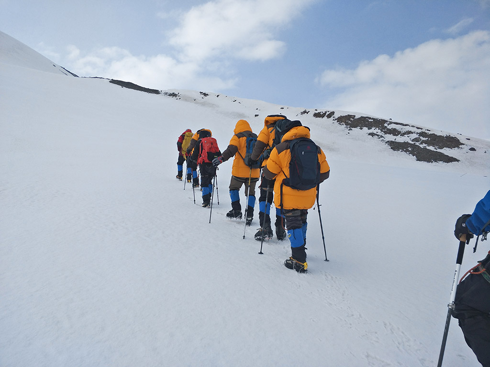

终于，终于，山顶就在眼前了！我印象最深刻的就是最后那十几步——同伴就在前面十几步的地方，大家在那里扔下书包，准备登顶，他们在朝我招手。我看着他们，真想直接扑过去，这要在平时，几个箭步几秒钟就能到达的距离，我却要用尽所有力气去一步步地挪动。在那几分钟里，我脑子里浮现出好多“十几步”的距离——从我的工位到饮水机，从每天给女儿背上书包到看她上校车，从我家出门到单元门口……每天有这么多次的“十几步”，从来没有想过会有这么艰难的走法。那一刻竟由衷地感到生活好幸福啊~
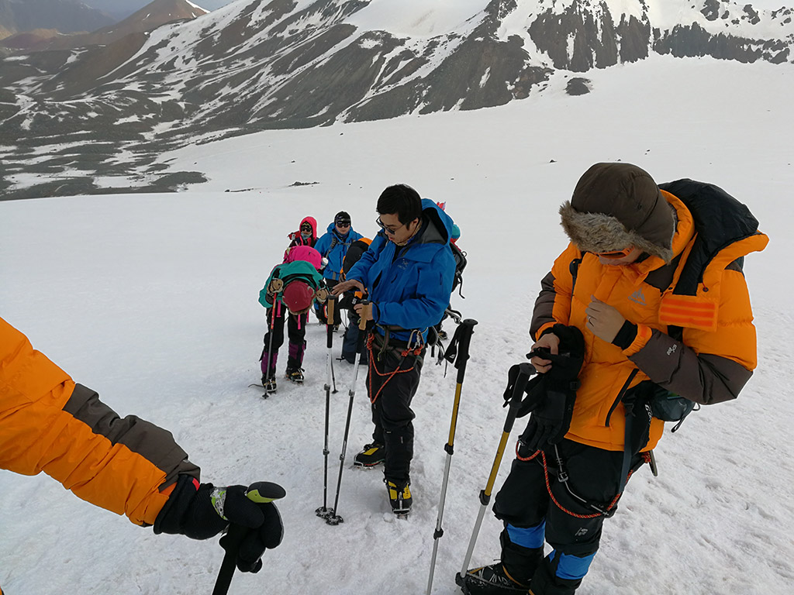
在山顶下休息一会，恢复些体力，开始冲顶！其实这个时候倒不是那么兴奋了，甚至觉得这山已经爬完了。我想一方面是因为大家体力已经严重透支，每个人只能低着头沿着前方的脚印继续艰难前行，这时候抬头是极耗体力的；另一方面作为观光客，大家都有过好多次“登顶”的经历，似乎不会有什么意外吧。
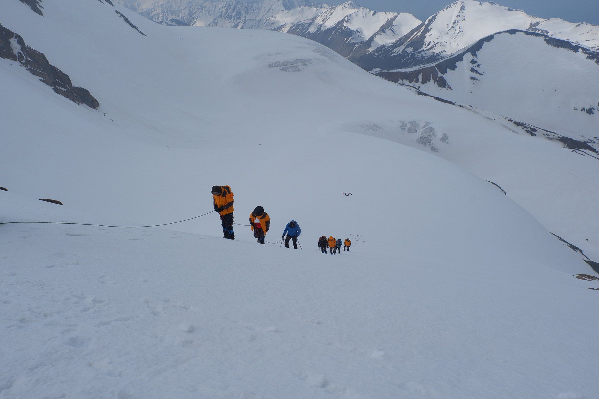
真地登到了山顶，还是有挺大意外的。不像旅游景点那样有一个大平台，山顶就是一个山尖尖。我们背靠的雪坡另一侧就是万丈悬崖。因此我们只能在这一侧斜坡上停留片刻。
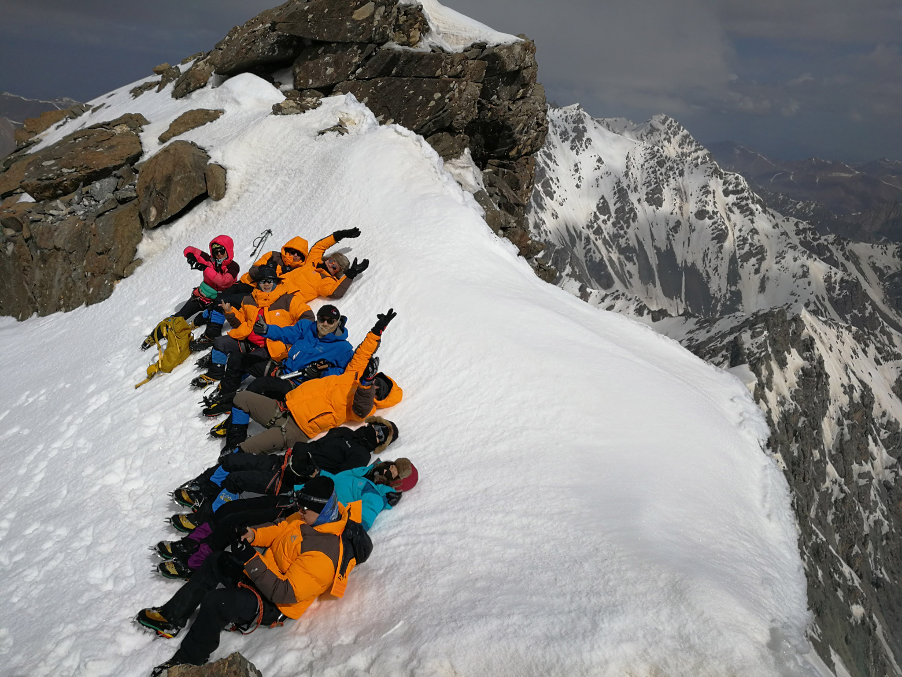
我们还是蛮幸运的，教练说他们之前几次登顶都是阴雨天气。我们上去的时候刚好阳光明媚，下来后很快就变天了。仿佛那抹阳光专门为了我们这次登顶而明媚的~
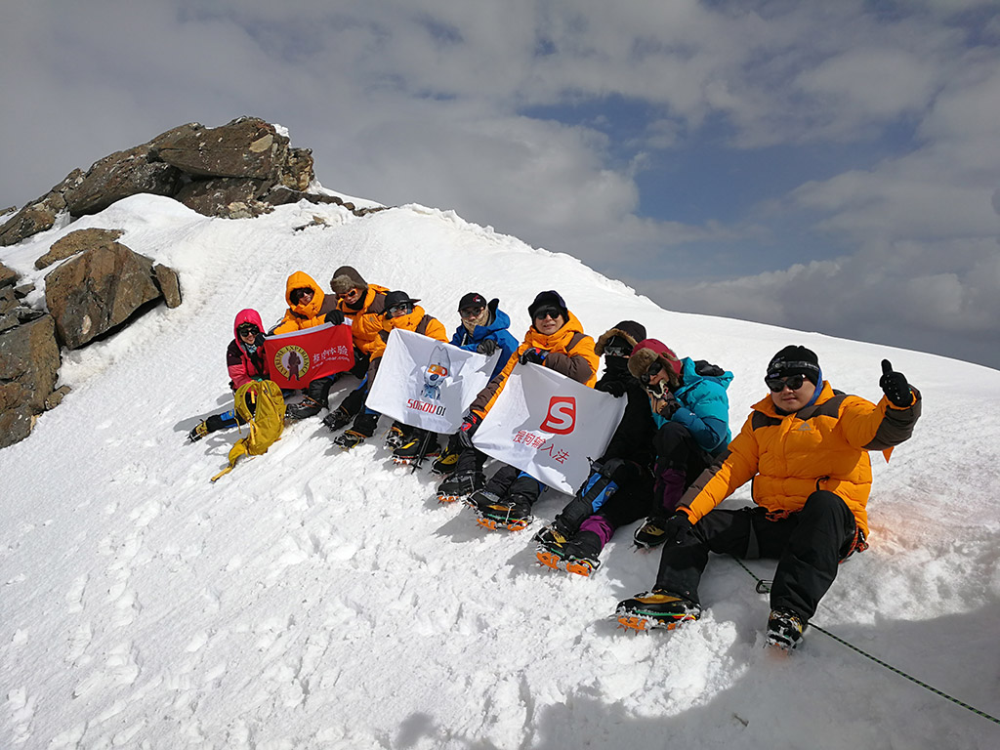

