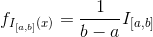

学习视频[《斯坦福大学公开课 ：机器学习课程》](http://open.163.com/special/opencourse/machinelearning.html)之前需要补充一些预备知识，主要是概率论相关的。<!-- more -->

# 希腊字符表
<style>
table th:nth-of-type(1){
    width: 5px;
}
table th:nth-of-type(2){
    width: 5px;
}
table th:nth-of-type(3){
    width: 10px;
}
table th:nth-of-type(4){
    width: 1px;
}
table th:nth-of-type(5){
    width: 5px;
}
table th:nth-of-type(6){
    width: 5px;
}
table th:nth-of-type(7){
    width: 10px;
}
table th:nth-of-type(8){
    width: 1px;
}
table th:nth-of-type(9){
    width: 5px;
}
table th:nth-of-type(10){
    width: 5px;
}
table th:nth-of-type(11){
    width: 10px;
}
</style>

|大写| 小写 | 名称 ||大写| 小写 | 名称 ||大写| 小写 | 名称 |
| --- | --- | --- || --- | --- | --- || --- | --- | --- |
|Α|α|alpha||Ι|ι ℩|iota||Ρ|ρ|rho|
|Β|β|beta||Κ|κ|kappa||Σ|σ ς|sigma|
|Γ|γ|gamma||Λ|λ|lambda||Τ|τ|tau|
|Δ|δ|delta||Μ|μ|mu||Υ|υ|upsilon|
|Ε|ε|epsilon||Ν|ν|nu||Φ|φ|phi|
|Ζ|ζ|zeta||Ξ|ξ|xi||Χ|χ|chi|
|Η|η|eta||Ο|ο|omicron||Ψ|ψ|psi|
|Θ|θ|theta||Π|π|pi||Ω|ω|omega|
# 概率质量函数
是离散随机变量在各特定取值上的概率。Probability Mass Function，简称PMF。

# 概率密度函数
连续型随机变量的**概率密度函数**简称**密度函数**，它是描述该随机变量的输出值在某个确定的取值点附近的可能性函数。Probability Density Function，简称PDF。

PDF是对连续随机变量定义的，本身不是概率，只有对连续随机变量的取值进行积分后才是概率。其数学表示如下：【注1】

X是一个连续型随机变量，fX(x)是它的概率密度函数，FX(x)是它的累计分布函数，F(x)=P(X<x)能清晰地表达出FX(x)的含义。对于在[a, b]上均匀连续分布的x而言，问它在某个点上的概率是没有意义的，我们能讨论的只能是它在某个区间上的概率，此概率等于区间的长度乘以密度。

# 梯度
梯度是一个曲面沿着给定方向的倾斜程度。一个标量函数φ的梯度记作：▽φ或gradφ，其中▽表示矢量微分算子。在三维情况下，梯度在直角坐标系中表示为：


# 贝叶斯公式
贝叶斯公式描述两个条件概率之间的关系：`P(A∩B) = P(A)*P(B|A) = P(B)*P(A|B)`，故


# 均匀分布
x在[a, b]上均匀分布，其概率密度函数为：

即，当x∉[a, b]函数值等于0；当x∈[a, b]函数值等于1/(b-a)。


# 正态分布
正态分布（Normal distribution）又名高斯分布（Gaussion distribution）。若随机变量X服从一个位置参数为μ，尺度参数为δ的概率分布，且其概率密度函数为：

则该随机变量就成为正太随机分布，记作：`X ~ N(μ, δ²)`，μ决定了其位置，δ决定了分布幅度。
μ=0 δ=1的正态分布成为标准正态分布。


# 伯努利分布
伯努利分布是一种离散分布，有两种可能的结果：1表示成功，出现概率为p；0表示失败，出现概率为1-p。
Pr[x=1] = p;
Pr[x=0] = 1-p


# 二项分布
二项分布是n重伯努利试验成功次数的离散概率分布。
- 如果实验E是个n重伯努利实验，每次成功的概率为p，X代表成功次数，则X的概率分布就是二项分布，记作`X ~ B(n, p)`，其概率质量函数为：

显然：

- 伯努利分布是二项分布在n=1时的特例。
- 二项分布名称的由来，是由于其概率质量函数中使用了二项式系数Cnk，该系数是二项式定理中的系数，二项式定力是由牛顿提出：

- 二项分布的典型例子是扔硬币，重复扔n次硬币，其中有k次正面朝上的概率即为一个二项分布概率。

# 多项分布
多项分布是二项分布的推广，还是做n次试验，每次试验结果可以有m个，且m个结果发生的概率互斥且和为1，则发生其中一个结果X次的概率就是多项式分布。
- 扔骰子就是典型的多项式分布，重复扔n次，有k次都是点6的概率就是：

- 多项分布的概率质量函数为：


# Beta分布
需要先明确几个概念
## 先验概率
先验概率（prior distribution）是事情尚未发生前对该事件发生概率的估计。利用历史资料计算的先验概率成为**客观先验概率**，凭人们的主观经验来判断而得到的先验概率成为**主观先验概率**。
## 后验概率
后验概率（posterior distribution）是指通过调查或其他方法获取新的附加信息，利用贝叶斯公式对先验概率进行修正而得到的概率。
## 似然函数
似然函数是一种关于统计模型参数的函数，给定输出x时，关于参数θ的似然函数L(θ|x)=P(X=x|θ)。“似然”和“概率”是同义词，但在统计学中，二者用法截然不同：概率用于在已知一些参数的情况下，预测接下来观测所得到的结果，而似然性则用于在已知某些观测所得到的结果时，对有关事物的性质参数进行估计。在已知某个参数B时，事件A发生的概率写作P(A|B)=P(A,B)/ P(B)，利用贝叶斯公式P(B|A)=P(A|B)*P(B)/P(A)。反过来可以构造似然性的方法：已知有事件A发生，运用似然函数L(B|A)估计估计参数B的可能性，L(b|A)=αP(A|B=b)，一个似然函数乘以一个正常数之后仍然是似然函数。

还以投硬币为例，在已知一系列投掷结果时，关于硬币投掷时正面朝上的可能性，可建立如下模型：假设硬币投出是正面朝上的概率为pH，则背面朝上的概率为1-pH，似然函数
L(pH|HH)=p(HH|pH=0.5) = 0.25，它表示观测到两次投掷都是正面朝上时，pH的似然性是0.25。
如果考虑pH=0.6，则
L(pH|HH)=p(HH|pH=0.6) = 0.36，这说明pH=0.6时，结果观测到连续两次正面朝上的概率比假设pH=0.5时更大，说明pH去0.6要比0.5更有说服力，更为“合理”。**似然函数的重要性不是他的具体值，而是当参数变化时函数变大还是变小。**这正是似然函数乘以一个正常数之后仍然是似然函数的原因。

对于投硬币来说，观测两次正面都朝上的似然函数为
L(θ|HH)=P(HH|pH=θ)=θ²，0≤pH≤1，它的曲线为：

投掷三次，前两次正面朝上，第三次背面朝上的似然函数为
L(θ|HHT)=P(HHT|pH=θ)=θ²(1-θ)，，0≤pH≤1，它的曲线图为：


## 逆概率问题
还以投硬币的实验来说明，假设不知道硬币是不是两面“公平”的，也就是说不了解这枚硬币的物理偏向性，这时候得到正面的概率pH就不一定是50%。那么逆概率问题便是企图从某个实验样本来猜测pH的数值。应用贝叶斯公式：
`后验概率 = 观测数据决定的调整因子 * 先验概率`　　　**公式（1）**
于是利用先验知识与观察数据一起，可以决定假设的最终概率，以允许对某种不确定性逐步调整后验概率并作出最终的概率预测。

因为是要对未知的不确定性作出预测，那么，在如何理解这种“不确定性”上产生了一些哲学意义上的分歧。分歧之一就是：这种不确定性是固有的客观存在吗？
逆概率问题，就是从样本数据来猜测概率模型的参数，比如说抛硬币实验，每次实验可以用随机变量X表示，X服从二项分布或伯努利分布。如何“猜测”抛硬币时正面出现的概率p？**频率学派认为模型参数p是固定的客观存在的，贝叶斯学派则把模型的参数p也当作一个不确定的随机变量Y**，因而，贝叶斯学派的Y不像频率学派的p那样是一个固定值，而是符合某种分布的随机变量（序列）。所以，对贝叶斯学派而言，硬币实验中有两类随机变量：硬币“正反”的一类随机变量X，和表征硬币偏向性的另一类随机变量Y。随机变量序列与分布相对应，因为Y是建立在随机序列X的模型参数之上的随机序列，因此，其分布被称为“分布之分布”。
频率学派认为p有一个固定数值，也就自然而然地认为决定这个数值的比较好的方法就是多次试验，不停地抛硬币，记录其中正面出现的频率，实验次数足够大的时候，就能越来越逼近p的真实数值，比如说，抛了1000次，正面601次，得到频率p（1000）=0.601，大概可以预测p=0.6。
贝叶斯学派并不假定p有一个“客观”数值，而是认为p也对应一个随机变量Y，可以取0到1之间的任何值，但可能服从某种分布（均匀、正态、或其它），实验次数的增多可以对此分布的情况了解更多。这样一来，使用贝叶斯公式，便可以逐次修正Y对应的分布：
后验概率分布 = 观测数据决定的调整因子×先验概率分布      
数学化的表达如下：
`P(Y|数据) = {P(数据| Y) / P(数据)} * P(Y) = 似然函数* P(Y)`　　　**公式（2）**
P(数据)可以暂不考虑，以后会放到概率的归一化因子中。
其中P(Y)是先验分布，P(Y|数据) 是考虑得到了更多数据条件下的后验分布，P(数据| Y)是（正比于）似然函数。

以简单的“抛硬币”实验为例，首先研究一下似然函数。对硬币“正反”随机性X对应的二项离散变量，事件要么发生（p），要么不发生（1-p）。如果发生m次，不发生n次，似然函数的形式为：
p^m * (1-p)^n
如果我们能找到一种分布形式来表示先验分布，乘以似然函数后，得到的后验分布仍然能够保持同样的形式的话，便不仅具有代数公式的协调之美，也会给实际上的计算带来许多方便之处。
Beta分布就具有这种性质。具有该性质的分布叫做“共轭先验”，beta分布是二项分布的共轭先验：

Beta分布用f(x;a,b)表示，其中的B(a,b)是通常的由gamma函数定义的beta函数，在这儿意义不大，只是作为一个归一化的常数而引进，以保证概率求和（或积分）得到1。

还以扔硬币为例，扔10次有3次正面朝上，7次背面朝上，可以由此记录得到一个beta的先验分布：f(H; 3, 7)。接下来再扔8次，前7次正面朝上，1次背面朝上，后验概率仍然是一个beta分布，只是参数发生了变化：f(H; 10, 8)。【注2】


Gamma函数 在实数域可以表示为：

Gamma函数 在整数域可以表示为：`Γ(n)=(n−1)!`
Gamma函数有以下性质：`Γ(x+1)=xΓ(x)`

# 拉格朗日乘法
拉格朗日乘法是用来解决**条件极值**问题的。极值问题分两类：一是无条件极值：求函数在给定区间上的极值，对自变量没有其他要求。比如求y=x²在x∈[-1, 1]的极小值。二是条件极值：对自变量有一些附加的约束条件限制下的极值。举个例子说明拉格朗日乘法的应用，例如给定椭球
求这个椭球的内接长方体的最大体积，该问题其实就是在满足椭球方程的条件下，求
`f(x, y, z) = 8xyz`的最大值。

它的一般化描述为：求函数`z=f(x, y)`在满足`φ(x, y)=0`下的条件极值，可以转化为求函数`F(x, y, λ) = f(x, y) + λφ(x, y)`的无条件极值。如果(x0, y0, λ0)势函数F(x, y, λ)的驻点，则(x0, y0)就是条件极值的嫌疑点。

回到上面椭球内接长方体的极值问题，通过拉格朗日乘法将问题转化为：

对F(x, y, z, λ)求偏导：


解方程组得到：
带入求得最大体积为：


<br>
<br>
<br>
> 注1：[这个数学公式生成网站](http://latex.codecogs.com/eqneditor/editor.php)使用起来很方便。
> 注2：在macOS下可以执行`brew install scipy`安装scipy模块，绘制beta分布的代码如下：
``` python
from scipy.stats import beta
import matplotlib.pyplot as plt
import numpy as np

def beta():
    x = np.linspace(0, 1, 100)

    plt.plot(x, beta.pdf(x, 3, 7), lw=1, alpha=0.6, label='prior distribution f(x, 3, 7)')
    plt.plot(x, beta.pdf(x, 10, 8), lw=1, alpha=0.6, label='posterior distribution f(x, 10, 8)')

    plt.legend(frameon=False)
    plt.show()
```
> 