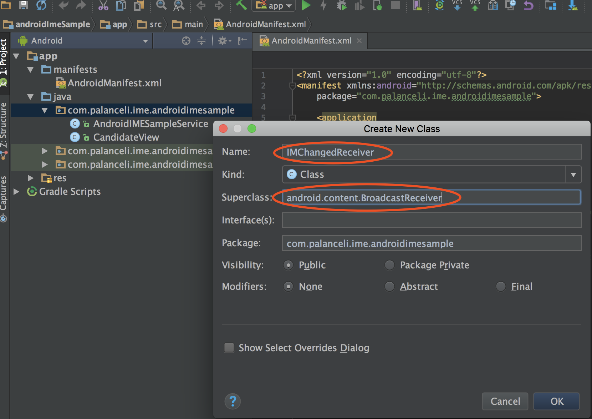
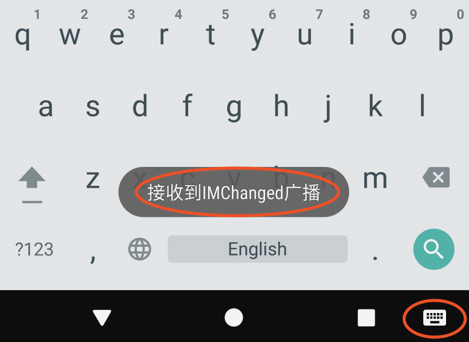

输入法被切走时是否收到通知？被切走输入法是否还在运行？
<!-- more -->
# 广播ACTION_INPUT_METHOD_CHANGED
在Android Developers [ACTION_INPUT_METHOD_CHANGED](https://developer.android.com/reference/android/content/Intent.html#ACTION_INPUT_METHOD_CHANGED)中说：
`Broadcast Action: An input method has been changed.`。
如果输入法由A切到B，A应该能收到该广播，如果再由B切到C，还能收到吗？
我在[AndroidIMESample](https://github.com/palanceli/AndroidIMESample)中拉出分支验证此问题。

创建IMChangedReceiver来处理该广播：添加`onReceiver()`函数：
``` java
public class IMChangedReceiver extends BroadcastReceiver {
    public IMChangedReceiver(){
        
    }

    @Override
    public void onReceive(Context context, Intent intent){
        Toast.makeText(context, "接收到IMChanged广播", Toast.LENGTH_SHORT).show();
    }
}
```

# 静态注册广播
在`AndroidManifest.xml`中添加如下行：
``` xml
    ...
    <application>
        ...
        <service> ... </service>

        <receiver android:name=".IMChangedReceiver">
            <intent-filter>
                <action android:name="android.intent.action.INPUT_METHOD_CHANGED"/>
            </intent-filter>
        </receiver>
    </application>
</manifest>
```
执行`Build` > `Build APK` > `Reveal in Finder`，把apk拖到模拟器里完成安装。实验结果是：
1. 从`SGDXAndroidIMESample`切到别的输入法时，`SGDXAndroidIMESample`能收到广播。
2. 从`Android键盘(AOSP)`切到`Sample Soft Keyboard`时，`SGDXAndroidIMESample`也能收到广播。也就是说不管切换和被切换的输入法和`SGDXAndroidIMESample`有没有关系，它都能收到切换的广播。
3. 重启机器，无需先切出`SGDXAndroidIMESample`，依然是：不管切换和被切换的输入法和`SGDXAndroidIMESample`有没有关系，它都能收到切换的广播。

# 动态注册广播
删除`AndroidManifest.xml`中静态注册`receiver`的代码，在`AndroidIMESampleService`中添加如下代码：
``` java

public class AndroidIMESampleService extends InputMethodService
        implements KeyboardView.OnKeyboardActionListener {
    ...
    private IMChangedReceiver mIMChangedReceiver = new IMChangedReceiver(); // 声明广播接收器

    @Override
    public View onCreateInputView() {
        ...

        // 动态注册IMChanged广播
        IntentFilter intentFilter = new IntentFilter();
        intentFilter.addAction(Intent.ACTION_INPUT_METHOD_CHANGED);
        registerReceiver(mIMChangedReceiver, intentFilter);

        return mKeyboardView;
    }
```
安装完成，尝试切换，实验结果是：
1. 仅从`SGDXAndroidIMESample`切到别的输入法时，`SGDXAndroidIMESample`才能收到广播，其它的切换均收不到。
2. 重启机器，依然是：仅从`SGDXAndroidIMESample`切到别的输入法时，`SGDXAndroidIMESample`才能收到广播，其它的切换均收不到。

也就是说如果是静态注册，只要不是被切入，输入法总能收到切换的广播；如果是动态注册，输入法仅能收到被切出的广播。
问题：输入法被切出以后进程还在吗？重启后如果不切出输入法，进程还在吗？如果在，为什么收不到动态注册的广播？如果不在，又是怎么收到静态注册广播的呢？