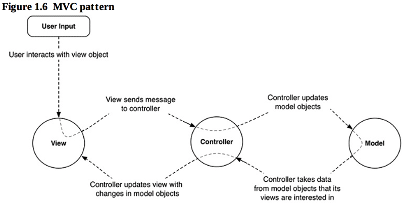
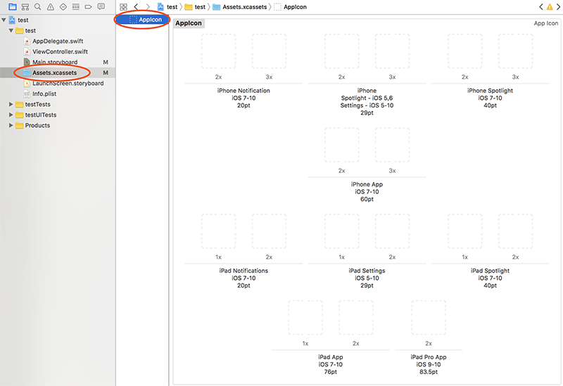

第一章实现该界面的问答功能，点击`Next Question`，显示一个新问题，点击`Show Answer`，显示该问题对应的答案。
要点是：
- 使用Interface Builder构建界面布局
- 使用约束确保兼容不同的尺寸的设备
- 为空间创建对应的变量，并为之关联消息响应函数。<!-- more -->

# 1 在story board上拖拽出界面
注意在Main.storyboard上构造界面，别搞成LaunchScreen.storyboard了，后者是开机界面。

## 1.1 设定约束确保在不同的机型上布局一致
与自动布局相关的按钮在Canvas的右下角：

本节会涉及到第3、4个按钮，分别表示对齐和添加新的约束。
对齐很容易理解：点击一个控件，再点击此按钮，勾选Horizontally in Container或Vertically in Container，可以让该控件在容器中水平或竖直方向居中

添加新约束：选择多个控件，把上下左右其中一条虚线点实，如果不填写具体值，则表示按照画布上的实际值摆放各空间之间的间隔；如果填写具体值，则表示让这些控件以该值作为行距。如果设置了Align，并选择Horizontal Center，表示被选中的每一个控件都与上方的一个保持居中对齐。

**其实约束条件最简单和直观的还是看左侧生成的Contraints等式：**

# 2 为Button关联响应函数
## 2.1 响应函数定义在哪？
书中的图1.6给出了答案：
Model包含数据（问题-答案 list），View包括界面上一切可见的元素（按钮、Label），Controller负责让Model和View保持一致。因此Controller应该包含View和Model的对象。
当用户与View产生交互，View将向Controller发送消息，这说明消息响应函数应该定义在Controller。

## 2.2 怎么定义响应函数？
``` objc
@IBAction func showNextQuestion(_ sender: UIButton) { 

}
```
关键字@IBAction告诉Xcode，该函数将作为消息响应函数关联到Interface Builder上的View。<font color=red>参数类型是怎么定义的？</font>
## 2.3 怎么让响应函数和界面上按钮的点击动作建立关联？
当按钮被按下时，它会调用另一个对象的方法，这另一个对象就称作按钮的target，该方法被称作action。
在Interface Builder界面中，按住Ctrl，将鼠标从按钮拖到target，此处即View Controller（左侧树状结构或者画布上的ViewController标志都可以），将弹出如下菜单，选中要关联的Action即可完成关联。
消息流向是从按钮流向target的，所以从按钮拖向target。

## 2.4 为界面上的Label控件定义变量，应该定义到哪？
答案见2.1
## 2.5 怎么定义控件变量？
Interface Builder可以生成connection，使得两个对象之间可以通信，connection分两类：
- outlets - 对一个对象的引用
- actions - view可以触发的方法

下面是在Controller中定义outlets的方法
``` objc
@IBOutlet var questionLabel: UILabel!
```
关键字@IBoutlet告诉Xcode，该变量将连接到Interface Builder生成的控件。<font color=red>关键字var、:UILabel和!分别是什么含义？</font>
## 2.6 怎么让控件变量和界面上的Label建立关联？
在ViewController中声明了outlets变量后，回到Interface Builder界面，按住Ctrl，将鼠标从ViewController（左侧树状结构或者画布上的ViewController标志都可以）拖到要关联的控件，将弹出如下菜单，选中要关联的变量即可。

常常忘记应该从哪拖到哪，此处是画布的主场，因此目标指向画布中的元素。

选中ViewController，在右侧utilities视图中选择Show the Connections Inspector可以看到与该ViewController关联的outlets变量和actions函数


# 3 定义问题-答案数组
## 3.1 怎么定义数组？
``` objc
let questions: [String] = [
"What is 7+7?",
"What is the capital of Vermont?", 
"What is cognac made from?"
]
let answers: [String] = [
 "14",
"Montpelier", 
"Grapes"
]
var currentQuestionIndex: Int = 0
```
let用于定义常量，var用于定义变量。
## 3.2 怎么定义字符串变量？
变量的定义格式是：var 变量名 : 类型 = 默认值
常量的定义格式是：let 常量名 : 类型 = 默认值
数组类型可以直接写作：[类型]，也可以写作：Array<类型>，或者什么都不写，编辑器会根据默认值推断变量的类型。
例如下面三种写法是等价的：
``` objc
let questions = ["aaa", "bbb", "ccc"];
let questions:[String] =  ["aaa", "bbb", "ccc"];
let questiongs:Array<String> =  ["aaa", "bbb", "ccc"];
```
数组常量写作：[值, 值]，字符串常量写作："xxx"。

# 4 在按钮响应函数中选择问题-答案并更新界面
## 4.1 怎么让界面上的某一个元素更新？
定义outlets变量，并完成关联后，直接修改其text属性即可：
``` objc
@IBOutlet var questionLabel:UILabel!
...
questionLabel.text = "???";	// 即可完成刷新
```
<font color=red>但是具体是什么机制以及在什么时机触发并完成的刷新呢？</font>

# 5 修改app图标
## 5.1 不同设备的app图标都是多大像素的？
设备				app图标像素
5.5寸iPhone		180x180 像素(@3x)
4.7和4.0寸iPhone	120x120像素(@2x)
7.9和9.7寸iPad	152x152像素(@2x)
12.9寸iPad		167x167像素(@2x)

## 5.2 修改app图标的操作步骤是什么？

按照标红的步骤，一路点到这个界面，什么设备下的什么图标，坑纹都就绪了，直接把图标拖过去即可。