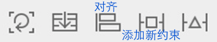
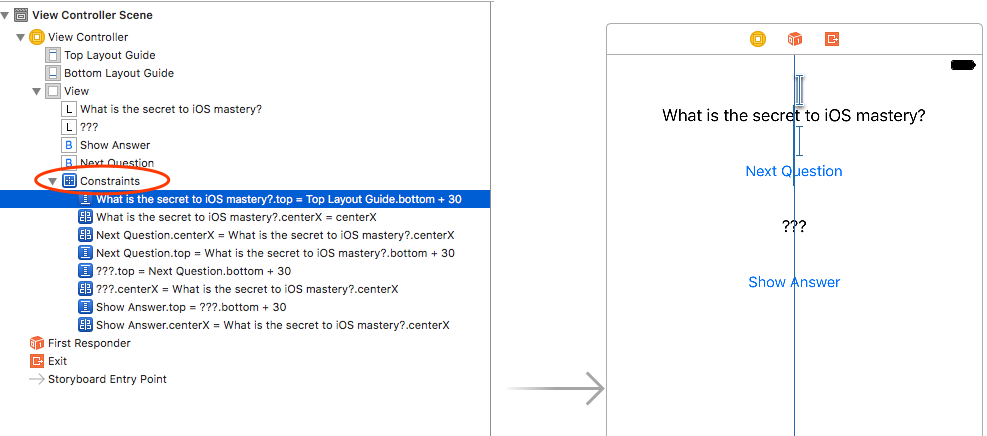
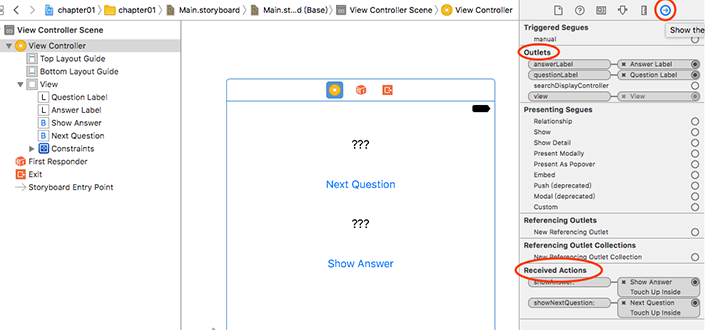

第一章实现该界面的问答功能，点击`Next Question`，显示一个新问题，点击`Show Answer`，显示该问题对应的答案。
要点是：
- 使用Interface Builder构建界面布局
- 为控件关联代码变量和响应函数
- 使用约束确保兼容不同的尺寸的设备
- 修改app图标
- iOS应用的UI刷新机制
<!-- more -->
---
# 1 在story board上拖拽出界面
注意在Main.storyboard上构造app主界面，别搞成LaunchScreen.storyboard了，后者是开机启动界面。

## 1.1 设定约束确保在不同的机型上布局一致
与自动布局相关的按钮在Canvas的右下角，本节涉及到第3、4个按钮，分别表示对齐和添加新的约束。

点击对齐按钮展开如下面板:

前7个用于设置一个控件与另一个控件之间的相对关系，左/右对齐，上/下对齐，水平/竖直居中对齐，对于文本控件的Baselines对齐；
后两个用于设置控件在所在容器中的相对位置，水平/竖直居中。
<br>

点击添加新约束按钮展开如下面板：

Add New Constraints表示控件与邻近控件的间距；
Width/Height用于设定控件长/宽；
Equal Widths/Equal Heights/Aspect Ratio用于设定多个控件等宽/等高/等宽高比；
如果设置了Align，并选择Horizontal Center，表示被选中的每一个控件都与上方的一个保持居中对齐。

约束条件最简单和直观也是最终极的依据是看左侧生成的Contraints等式：


> *添加新约束的Align和对齐面板中的配置是什么关系呢？*
答案是一样的：选中控件A和控件B，在对齐面板中勾选“Leading Edges”和在添加新约束面板中勾选“Align Leading Edges”都会产生约束`B.leading=A.leading`。


# 2 为Button关联响应函数
## 2.1 iOS的MVC结构
Model是数据（本节中就是`问题-答案` 列表）；View包括界面上一切可见的元素（按钮、Label）；Controller负责让Model和View保持一致。
在View中发生的消息通过Controller流到Model记录数据变化；在Model中发生的数据变化通过Controller流到View通知界面更新。因此Controller应该包含View和Model的对象。
当用户与View产生交互，View将向Controller发送消息，这是UI逻辑。在Controller中负责响应这个消息，这是业务逻辑。因此消息响应函数应该定义在Controller。

## 2.2 消息响应函数的定义形式
``` objc
@IBAction func showNextQuestion(_ sender: UIButton) { 
    ……  // 消息处理
}
```
关键字@IBAction告诉Xcode，该函数将作为消息响应函数关联到Interface Builder上的View。

> 怎么知道消息响应函数的函数原型呢？
> 在Xcode的《Document and API Reference》中查找UIButton，可以找三个：
``` objc
@IBAction func doSomething()
@IBAction func doSomething(sender: UIButton)
@IBAction func doSomething(sender: UIButton, forEvent event: UIEvent)
```
> 根据addTarget(\_:action:for:)传入的函数签名可以确定应该调用哪个。关于addTarget(\_:action:for:)的用法在[《iOS Programming BNRG》笔记六](http://palanceli.com/2017/07/26/2017/0726iOSProgrammingBNRG06/)学习。

## 2.3 怎么让响应函数和按钮的点击动作建立关联？
当按钮被按下时，它会调用另一个对象的方法，这另一个对象就称作按钮的target，该方法被称作action。
在Interface Builder界面中，按住Ctrl，将鼠标从按钮拖到target，此处即View Controller（左侧树状结构或者画布上的ViewController标志都可以），将弹出如下菜单，菜单中会列出View Controller中的@IBAction方法，选中要关联的Action即可完成关联。
消息流向是从按钮流向target的，所以从按钮拖向target。


## 2.4 为界面上的Label控件定义变量，应该定义到哪？
根据2.1的原则：Label是View，应当定义到View Controller。

## 2.5 怎么定义控件变量？
在Interface Builder可以生成connection，连接IB中的视图和代码中的对象，或者连接IB中的视图和代码中的消息响应函数。connection分两类：
- outlets - 连接视图和对象
- actions - 连接视图和消息响应函数

在Controller中定义outlets变量：
``` objc
@IBOutlet var questionLabel: UILabel!
```
关键字@IBoutlet告诉Xcode，该变量将连接到Interface Builder中的控件。

## 2.6 让变量和Label建立关联
回到Interface Builder界面，按住Ctrl，将鼠标从ViewController（左侧树状结构或者画布上的ViewController标志都可以）拖到Label控件，将弹出如下菜单，其中显示ViewController中声明的@IBOutlet变量，选中要关联的变量即可。


> 常常记不清Ctrl拖动的方向。如果是关联控件和变量，`从VC拖到控件`；如果是关联消息，`从控件拖到VC`。

选中ViewController，右侧`utilities`视图选择`Show the Connections Inspector`可以看到与该ViewController关联的所有outlets变量和actions函数：


# 3 定义问题-答案数组
## 3.1 怎么定义数组？
``` objc
let questions: [String] = [
"What is 7+7?",
"What is the capital of Vermont?", 
"What is cognac made from?"
]
let answers: [String] = [
 "14",
"Montpelier", 
"Grapes"
]
var currentQuestionIndex: Int = 0
```
let用于定义常量，var用于定义变量。
## 3.2 怎么定义字符串变量？
定义变量：`var 变量名 : 类型 = 默认值`
定义常量：`let 常量名 : 类型 = 默认值`
定义数组类：`[类型]`，也可以写作：`Array<类型>`，或者什么都不写，直接赋值，编辑器会根据默认值推断变量的类型。
例如下面三种写法是等价的：
``` objc
let questions = ["aaa", "bbb", "ccc"];
let questions:[String] =  ["aaa", "bbb", "ccc"];
let questiongs:Array<String> =  ["aaa", "bbb", "ccc"];
```
数组常量写作：`[值, 值, ...]`
字符串常量写作：`"xxx"`。

# 4 在按钮响应函数中选择问题-答案并更新界面
## 4.1 怎么让界面上的某一个元素更新？
定义outlets变量，并完成关联后，直接修改其text属性即可：
``` objc
@IBOutlet var questionLabel:UILabel!
...
questionLabel.text = "???";	// 即可完成刷新
```
## 4.2 iOS的界面刷新机制
iOS应用具体是什么机制以及在什么时机触发并完成的刷新呢？在[iOS Drawing Concepts](https://developer.apple.com/library/content/documentation/2DDrawing/Conceptual/DrawingPrintingiOS/GraphicsDrawingOverview/GraphicsDrawingOverview.html#//apple_ref/doc/uid/TP40010156-CH14-SW1)中对这个问题有描述。几种情况会令视图触发刷新：
- 将另一个视图移入/移出本视图，会触发本视图刷新
- 通过设置`hidden`属性为`NO`，让之前隐藏的视图显示出来，会触发它刷新
- 将之前在屏幕以外的视图滚入屏幕，会触发它刷新
- 显式调用`setNeedsDisplay`或`setNeedsDisplayInRect:`函数

当视图首次展现时，iOS系统会给视图的`drawRect:`方法传入视图的整个可见矩形区域。之后可能只有部分矩形区域发生了变化，处于性能考虑，应该仅让这部分区域重绘。

# 5 修改app图标
## 5.1 不同设备的app图标像素
设备|app图标像素
----|----
5.5寸iPhone|180x180 像素(@3x)
4.7和4.0寸iPhone|120x120像素(@2x)
7.9和9.7寸iPad|152x152像素(@2x)
12.9寸iPad|167x167像素(@2x)

## 5.2 修改app图标的操作步骤

按照标红的步骤，一路点到这个界面，什么设备下的什么图标，坑位都已就绪，直接把图标拖过去即可。