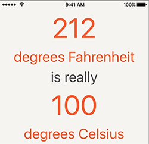
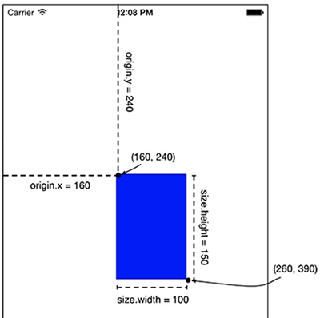

第三章构造了一个这样的界面，并添加约束。本章运用的知识差不多在第一章就介绍过了。

本章要点：
- 点和像素
<!-- more -->

# 1 构造UI
## 1.1 点和像素之间的关系是什么？
在第111页提到：
``` objc
override func viewDidLoad() {
super.viewDidLoad()
    let firstFrame = CGRect(x: 160, y:240, width: 100, height: 150)
    let firstView = UIView(frame: firstFrame)
    firstView.backgroundColor = UIColor.blue
    view.addSubview(firstView)
}
```
这段代码对应的UI界面如下：

但此处的单位不是像素而是点，点是一个相对单位，在不同的设备上对应的像素数不同。

点和像素之间的对应关系是什么呢？
这个问题正是苹果希望隐藏的设备相关细节，在[iOS Drawing Concepts](https://developer.apple.com/library/content/documentation/2DDrawing/Conceptual/DrawingPrintingiOS/GraphicsDrawingOverview/GraphicsDrawingOverview.html#//apple_ref/doc/uid/TP40010156-CH14-SW1)中有讲：系统自动完成从视图中的点到设备像素的转换，开发者应该牢记：一个点不一定对应到一个像素。
苹果希望同一个绘制函数在不同的设备上看到的效果尽量一致，一条宽度为1Point的线在低分屏是一个像素宽，在高分屏上就可能是两个像素宽，这样可以确保它们在视觉效果上都是一样宽的。在iOS下，Point和像素的比值是与视图相关的，每个`UIScreen`，`UIView`，`UIImage`或`CAlayer`都有一个`contentScaleFactor`属性来记录这个比值。