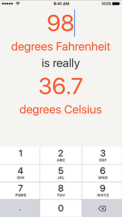

第四章在此界面上修改degrees Fahrenheit的值，它会换算出degree Celsius的值。
本章要点：
- 响应TextField的变化事件
- 在TextField失去焦点后收起键盘
- Property observer
- 协议和代理
<!-- more -->

# 1 布局TextField UI，并关联outlets对象
## 1.1 为什么给TextField填了足够大的字号，但运行时还是很小？
如下图所示，Label（"degrees Fahrenheit"）的字号只有27，TextField（"100"）的字号有50，但在运行时，Label的字体尺寸却比TextField的明显大，也就是说TextField的字号设置没有生效：

如果给TextField添加一个Width约束，字号才会生效。
> 这和第3章提到的字号是隐式约束不符呢：TextField的字号隐式约束没有生效。
这是因为TextField和Label是不一样的，Label是一个静态控件，内容是在编译期确定的，所以它的尺寸是由内容+字体字号在编译期可以确定的。而TextField是用于在运行期输入，其内容不固定，当然不应该根据初始内容来决定其宽度。TextField有一个`Min Font Size`属性，如果这个值足够小，字号根据TextField的长宽而变小。调大这个值可以改变最小字号。

# 2 响应Editbox的变化事件
## 2.1 如果View有多种事件，如何指定具体关联哪一种？
第1章Ctrl+鼠标拖动按钮到ViewController，可以把点击按钮和ViewController中的IBAction函数关联起来，如果按钮有多种事件，如何指定具体关联哪一种呢？比如拖动EditBox到ViewController的Action函数，那么关联的是EditBox的什么消息呢？

这是关联Action的第二种方式：对于消息单一的控件，直接从控件拖到ViewController即可；如果控件可以触发多种消息，先点击产生消息的控件，在Connection Inspector中选择要关联的消息，再Ctrl拖拽到ViewController，选择IBAction函数：


# 3 在TextField失去输入焦点后，收回键盘
## 3.1 TextField失去焦点会触发什么消息？
这个问题问的不对，因为点击Background并不会导致TextField失去焦点。其实是在Background View的点击事件里执行的收回键盘。

## 3.2 怎么实现收回键盘？
这里的实现是给Background View关联一个Gesture Recognizer，当在此View上点击一下，通过调用TextField的`resignFirstResponder()`函数使之失去焦点。
> 这么做有个缺点：如果当前界面上的TextField实例很多怎么办呢？每个实例调一次有点太傻了吧？[第14章](/2017/08/02/2017/0802iOSProgrammingBNRG14/#1-7-点击背景View收回键盘)有更简洁的方法。

## 3.3 怎么给View定义和关联一个手势处理函数
第一步，从Object Library中把要定义的Gesture Recognizer拖到View上，该ViewController的标题栏会为此Gesture Recognizer添加一个图标；
第二步，把这个Gesture Recognizer控件当做手势的触发源，从它的图标 Ctrl拖拽 到ViewController；
第三步，选择被关联的函数。
这里是把手势识别器（Gesture Recognizer）等同于按钮来处理了。尽管手势是用户发出的，但由手势识别器把这个手势转化成一个消息，这跟用户点击按钮，再由按钮把这个点击转化成一个消息是一模一样的。

# 4 属性观察者property observer
property observer有主动和被动两种形式。
## 4.1 主动是指当“我”发生变化时，会触发一段代码的执行。
``` objc
var x:Int = 0
var y:Int = 0
var z:Int?{
    willSet{ 	// 在z被赋值前调用
        x += 1
        print("x=\(x), y=\(y), z=\(z)")
    }
    didSet{	// 在z被赋值后调用
        y -= 1
        print("x=\(x), y=\(y), z=\(z)")
    }
}

z=0
```
这段代码的输出结果是：
x=1, y=0, z=nil			// willSet的输出
x=1, y=-1, z=Optional(0)	// didSet的输出

<font color=red>有没有关键字能在willSet或didSet里表示“我”的值呢？</font>

对于上面的例子如果要在z的willSet里取自己的值，如下：
``` objc
var z:Int?{
    willSet{
    x = z		// 如果前面z的名字变了，此处就得跟着变，如果有关键字比如self，就不存在这样的问题了
    }
}
```
## 4.2 被动是指当“我”被取值时，“我”的值是根据“别人”的值计算出来的。
这种形式的变量很像是一个内联函数，字面上看是一个变量，每次取值都是一次调用：
``` objc
var a:Int=0
var b:Int{
    return a+1
}

a=10
print("b=\(b)")
```
这段代码的输出结果是：
b=11					// b的取值是根据a算出来的

> 本章P150，点后面跟变量名是什么意思？例如：
``` objc
let nf = NumberFormatter()
nf.numberStyle = .decimal   // .decimal是什么意思呢？
```
> 在[《Swfit Programming BNRG》笔记十四](/2017/08/11/2017/0812SwiftProgrammingBNRG14/)中有介绍，这是枚举类型内部定义的case。

# 5. 协议和代理
## 5.1 协议的定义
``` objc
protocol 协议名:父协议名{
    接口函数
}
```
## 5.2 协议的使用
协议不能直接实例化，而需要让某个类实现某个协议：
``` objc
class 类名 : 父类, 协议名{
}
```
## 5.3 代理协议
不是所有的协议都是代理协议，代理协议的作用是把原本应该在A实现的代码委托给B来实现。比如TextField有一堆自己的逻辑，文字改变、退格、回车。对于这些事件的处理原本是TextField自己的事儿，如果要改变这些行为就必须派生TextField并重写这些逻辑，这就会产生很多零碎的类。而且并非所有与TextField相关的逻辑都应该放该类里处理，属于TextFiled逻辑的应该放入其subclass，属于业务逻辑的，就应该放到Controller里完成。
通过指定某Controller为TextField的代理，当这些事件发生时，TextField会直接调用该Controller的方法，这样就能把这些逻辑放在Controller里实现了。这些方法的集合就叫做协议，Controller实现该协议就叫做TextField代理。它解决的问题是把这些业务逻辑汇集到代理一并实现。

## 5.4 如果代理实现了多个TextField实例的某一个方法，如何在这个方法里区分当前是为谁服务的呢？
以P152的`UITextTextFieldDelegate`为例：
``` objc
protocol UITextFieldDelegate: NSObjectProtocol {
    optional func textFieldShouldBeginEditing(_ textField: UITextField) -> Bool optional func textFieldDidBeginEditing(_ textField: UITextField)
    optional func textFieldShouldEndEditing(_ textField: UITextField) -> Bool optional func textFieldDidEndEditing(_ textField: UITextField)
    optional func textField(_ textField: UITextField, shouldChangeCharactersIn range: NSRange,replacementString string: String) -> Bool optional func textFieldShouldClear(_ textField: UITextField) -> Bool
    optional func textFieldShouldReturn(_ textField: UITextField) -> Bool 
}
```
这些代理方法的第一个参数就是产生事件的控件，根据该参数就能判断了。

## 5.5 建立代理关联关系
从TextField ctrl拖动到ViewController，就会让ViewController成为TextField的代理。
这个拖动操作会让TextField的delegate属性指向ViewController，具体产生的代码在[第六章](/2017/07/26/2017/0726iOSProgrammingBNRG06/)介绍。