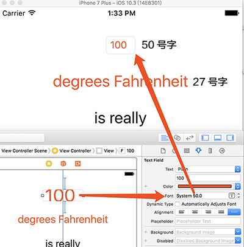

第四章在此界面上修改degrees Fahrenheit的值，它会换算出degree Celsius的值。本章要点：
- 响应TextField的变化事件
- 在TextField失去焦点后收起键盘
- Property observer
- 协议和代理
<!-- more -->

# 1 布局TextField UI，并关联outlets对象
## 1.1 为什么在TextField的Font属性里填写了足够大的字号，但运行时还是很小？
如下图所示，Label（"degrees Fahrenheit"）的字号只有27，TextField（"100"）的字号有50，但在运行时，Label的字体尺寸却比TextField的明显大，这是什么原因？

TextField的字号设置没有生效，如果先给第一行TextField设置水平居中，在全选所有控件，选择行距+水平对齐，运行后结果发现Label的字号设置会生效，但TextField不生效，需要再给TextField添加一个Width约束，字号才会生效。<font color=red>这和第3章提到的字号是隐式约束不符呢：TextField的字号隐式约束没有生效。</font>

# 2 响应Editbox的变化事件
## 2.1 如果View有多种动作，如何指定具体关联哪一种动作？
第1节中Ctrl+鼠标拖动按钮到ViewController，可以把点击按钮的动作和ViewController中的函数关联起来，如果按钮有多种动作，如何指定具体关联哪一种动作呢？比如如果此处拖动EditBox到ViewController的Action函数，那么关联的是EditBox的什么消息呢？

这是Action和方法建立关联的第二种方式，对于按钮这种消息唯一的控件，直接从按钮拖到ViewController即可，对于此处可能有多种消息时，先点击产生消息的控件，在Connection Inspector中选择要关联的消息，再Ctrl拖拽到ViewController，选择函数即可。


## 2.2 此处的if-let判断
``` objc
@IBAction func fahrenheitFieldEditingChanged(_ textField: UITextField) {
    if let text = textField.text, !text.isEmpty { 
        celsiusLabel.text = text
    } else {
        celsiusLabel.text = "???"
    }
}
```
起初我写成了
``` objc
@IBAction func fahrenheitFieldEditingChanged(_ textField: UITextField) {
    if !text.isEmpty { // 这会导致一个展开错误，因为text有可能是nil
        celsiusLabel.text = text
    } else {
        celsiusLabel.text = "???"
    }
}
```
所以要写成上面的形式，我验证过，如果TextField中内容为空，参数textField=""，而不会是nil。

# 3 在TextField失去输入焦点后，收回键盘
## 3.1 TextField失去焦点会触发什么消息？
这个问题问的不对，因为点击Background并不会导致TextField失去焦点。但是如果点击了其他可以得到焦点的控件，比如另一个TextField，倒是可以让当前TextField失去焦点，那么失去焦点的TextField会收到什么消息吗？

## 3.2 怎么实现收回键盘？
这里的实现是给Background View关联一个Gesture Recognizer，当在此View上点击一下，通过调用TextField的resignFirstResponder()函数使之失去焦点。但是这么做有个缺点：此处只有一个TextField实例，所以比较容易仅调用它的resignFirstResponder()函数即可，如果当前界面上的TextField实例很多怎么办呢？每个实例调一次有点太傻了吧？

## 3.3 怎么给View定义和关联一个手势处理函数
这是消息关联的第三类方式。手势识别在Xcode当中被当做一种控件来操作。
第一步，从Object Library中把要定义的Gesture Recognizer拖到View上，该ViewController的标题栏会为此Gesture Recognizer添加一个图标；
第二步，把这个Gesture Recognizer控件当做手势的触发源，从它的图标 Ctrl拖拽 到ViewController，这和之前关联按钮就一模一样了
第三步，选择被关联的函数。

其实也比较容易理解，尽管手势是用户发出的，但需要一个手势的识别器把这个手势转化成一个消息，这跟用户点击按钮，再由按钮把这个点击转化成一个消息是一模一样的。

# 4 属性观察者property observer
我总结property observer有两种形式，一种是主动，一种是被动。
## 4.1 主动是指当“我”发生变化时，会触发一段代码的执行。
``` objc
var x:Int = 0
var y:Int = 0
var z:Int?{
    willSet{ 	// 在z被赋值前调用
        x += 1
        print("x=\(x), y=\(y), z=\(z)")
    }
    didSet{	// 在z被赋值后调用
        y -= 1
        print("x=\(x), y=\(y), z=\(z)")
    }
}

z=0
```
这段代码的输出结果是：
x=1, y=0, z=nil			// willSet的输出
x=1, y=-1, z=Optional(0)	// didSet的输出

有没有关键字能在willSet或didSet里表示“我”的值呢？对于上面的例子如果要在z的willSet里取自己的值，如下：
``` objc
var z:Int?{
    willSet{
    x = z		// 如果前面z的名字变了，此处就得跟着变，如果有关键字比如self，就不存在这样的问题了
    }
}
```
## 4.2 被动是指当“我”被取值时，“我”的值是根据“别人”的值计算出来的。
这种形式的变量很像是一个内联函数：
``` objc
var a:Int=0
var b:Int{
    return a+1
}

a=10
print("b=\(b)")
```
这段代码的输出结果是：
b=11					// b的取值是根据a算出来的

# 5. 点后面跟变量名是什么意思？
例如：
``` objc
let nf = NumberFormatter()
nf.numberStyle = .decimal
```
.decimal是什么意思呢？

# 6. 协议和代理
## 6.1 协议的定义格式
protocol 协议名:父协议名{
接口函数
}
## 6.2 使用协议的书写格式
协议不能直接实例化，而需要让某个类实现某个协议：
class 类名 : 父类, 协议名{
}
## 6.3 代理协议
首先不是所有的协议都是代理协议，代理协议的作用是把原本应该在A实现的代码委托给B来实现。比如TextField有一堆自己的逻辑，文字改变、退格、回车。对于这些事件的处理原本是TextField自己的事儿，如果要改变这些行为就必须派生TextField并重写这些逻辑，这就会产生很多零碎的类。一种解决方案就是制定TextField的父窗体为TextField的代理，当这些事件发生时，TextField会直接调用父类的方法，通知父类，这样就能把这些逻辑放在父类的这些方法里实现了。这些方法的集合就叫做协议，父类实现该协议就叫做TextField代理。它解决的问题就是避免搞出一堆零碎的小类，把这些方法汇集到代理一并实现。

## 6.4 如果代理实现了多个TextField实例的某一个方法，如何在这个方法里区分当前是为谁服务的呢？

## 6.5 建立代理关联关系
从TextField ctrl拖动到ViewController，就会让ViewController成为TextField的代理。<font color=red>这个拖动操作具体会产生什么代码呢？我在swift文件里并没有看到，如果纯手工来做的话，应该怎么做呢？</font>