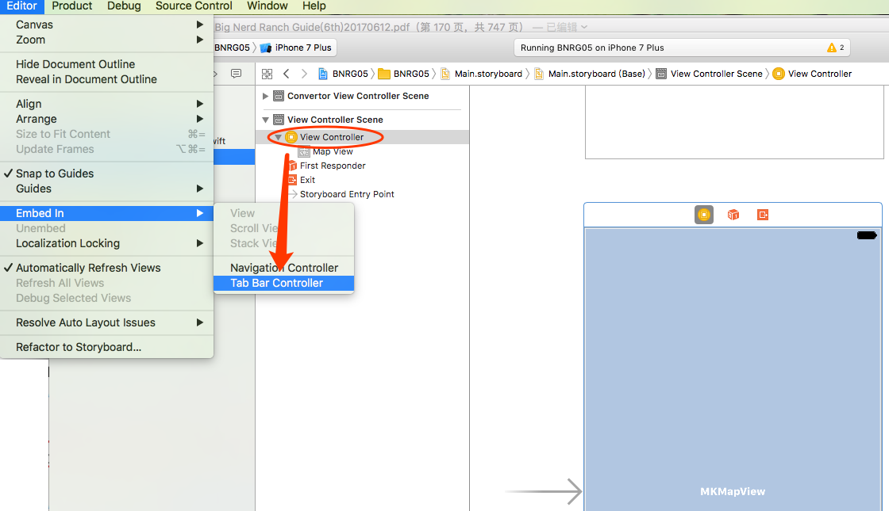
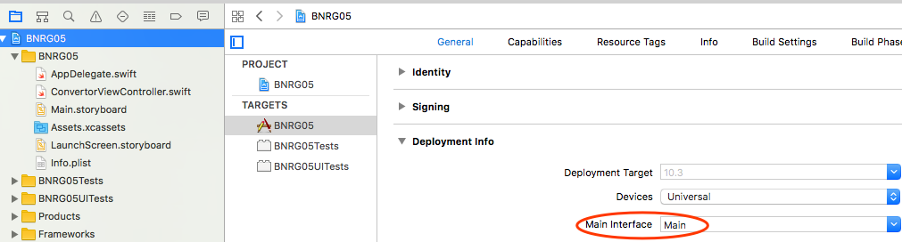
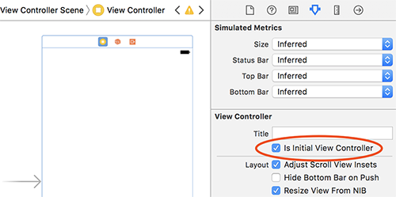
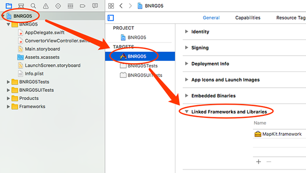

第五章增加了TabBarViewController，并关联了MapView。本章要点：
- TabBarViewController的使用
- 具有多个ViewController的应用
- framework
- 在项目中添加图片资源
<!-- more -->

# 1 TabBarController
## 1.1 怎么创建TabBarController？
在Interface Builder中选中VC，菜单Editor > Embed in > Tab Bar Container

Interface Builder会为之创建TabBarController：

## 1.2 怎么把已有的VC装入TabBarController？
如下图，从TabBarController的VC，Ctrl拖动到需要装进来的子VC，然后在面板上选择view controllers

Interface Builder就会把VC装到TabBarController里来，新增加的连线就表示这个含义：

## 1.3 点击TabBarController底部的tab页后，由谁来处理切换的消息？
切换消息的处理应该是被TabBarController封装在其内部了，所以只要把子VC包含进来，自然就有切换的逻辑。

## 1.4 怎么修改TabBarController底部Tab页的标题和图片？
点击被包含的VC底部的TabBar，直接修改Title，如果资源里有导入的图片，下拉Image就能找到该资源。

# 2 多个View Controllers？
## 2.1 为什么有多个View Controllers？而不是一个View Controller控制多个View？
我分析应该是方便做模块化的封装，比如TabBarController的逻辑是写在VC里而不是TabBarView里，这样可以更好地落实MVC的思想，让View只做显示，不负责切换和子view的维护。按照这个思路，TabBarController的子模块由于可能也有内部的控制、数据，所以这个子模块就应该是VC，而不是View。

## 2.2 如果每个View Controller控制一个View，那在两个View Controller之上应该还有一个View Controller咯？用来控制底部的tab和上面的view同步？
实际情况确实如此，TabBarController就是这个上层的View Controller。它用来维护底部tab和上面的VC而不是View的同步

## 2.3 什么是懒加载？怎么控制使用/不使用懒加载？
直到要在屏幕上显示的时候，ViewController才创建其中的子视图，这种优化手段称作懒加载。

## 2.4 View Controller创建其下View层次结构都有哪些途径？
第一种：在Interface Builder通过storyboard拖拽出界面。Interface Builder默认有一个ViewController及其根View，如果要创建更多的VC，则可以从Object Library中拖到Interface Builder中。如果要替换掉VC的默认View，只需先把原先的View删除，再从Object Library中找到想要的View，拖到VC里即可。
第二种：通过覆写ViewController的loadView()方法，在此方法中创建子视图

> 注1：ViewController有一个重要的属性var view:UIView!，它是该ViewController的根视图。把ViewController的根视图添加到一个window，会让该ViewController的整个视图层次结构全部添加进来。
> 注2：UIWindow有一个rootViewController属性，当一个ViewController被设置为window的rootViewController，该window之前的所有子视图均被删除，新VC的所有视图都被添加到window中。
> 注3：每个app有一个主界面，它指向一个storyboard。该storyboard中被设为initial viewcontroller的VC就是UIWindow的rootViewController，也就是这个app启动时的默认界面。如果项目存在多个storyboard，在项目设置中可以设定主界面指向哪一个storyboard：

## 2.5 当有多个VC时，怎么设置默认，即程序一启动时展现的VC？

# 3 framework
## 3.1 什么是framework？
在第166页提到：framework是一个静态库，包括代码、资源如界面文件和图片。

## 3.2 都有哪些方式可以导入framework？
首先就是书中介绍的手动导入步骤

从2.3中的书中解释还可以推测使用import关键字应该也可以咯？

## 3.3 在本章例程中，在Interface Builder中创建了一个VC，并在其中添加了MKMapView，并没有为此创建什么代码。为什么这个操作会导致运行时错误？
书中的解释是：*MKMapView所在的framework并没有被加载到应用程序中。原因是如果仅通过import关键字把MapKit导入进来，而没有任何代码使用该framework，编译器就会把该framework优化掉。*

我们的操作实际上只是在Interface Builder中添加了MKMapView，并没有写一行代码，也没有使用import关键字把它导入，我猜测是在Interface Builder的这个行为实际会触发import操作，但是我不理解的是，既然VC会被加载，其View就是MKMapView，自然一定有使用MapKit framework的相关代码吧？而且理论上说，静态库如果不是内部代码的逻辑错误，应该触发的是编译时错误，而不应该是运行时错误呀？

# 4 图片资源的添加
## 4.1 怎样为不同设备添加一套2x、3x的图片资源？
如图，进入Asserts.xcassets，准备好为不同设备准备的同名文件，将它们一起拖入Interface Builder，Xcode将根据文件名为他们创建一套资源：

# 5 VC加载的初期函数调用
## 5.1 viewDidLoad()和viewWillAppear(_:)
viewDidLoad()是在VC的interface文件被加载后调用，此时，所有vc的outlets都已指向了正确的实例
viewWillAppear(_:)是当view被添加到winow时被调用。
这两个函数的调用谁先谁后呢？我判断应该是先viewDidLoad()，之后才viewWillAppear(_:)，因为要先为每个loutlets指向正确实例，再把这些实例添加到window
两个函数还有一个区别：viewDidLoad()仅会调用一次，而viewWillAppear(_:)会在每次view展现的时候都被调用。问题又来了：本章不是说过当window的rootViewController变化时，原来的VC包含的窗体都会被删除么？如果是这样，下次再被切回来的时候应该重新创建咯？那就不应该仅创建一次了吧？

## 5.2 几个重要的VC的函数
- init(coder:)			当从storyboard中创建VC实例时会被调用。
- init(nibName: bundle:) 当VC不是通过storyboard创建时，该函数会被调用一次。
- loadView()			重载该函数可以用来通过代码（而不是storyboard）来创建VC的子视图。
- viewDidLoad()			在VC的子视图创建完成后调用，重载该函数可以用来配置从Interface文件中加载进来的子视图。
- viewWillAppear(_:)	重载该函数同样可以配置从Interface文件中加载进来的子视图。viewDidAppear(_:)在每次VC被显示到屏幕时会被调用。viewWillDisappear(_:)和viewDidDisappear(_:)会在每次VC从屏幕上消失时被调用。
