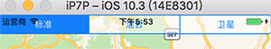
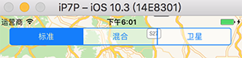

第五章还是这个界面，只不过是用代码的方式来实现的。本章要点：
- 设置VC的View
- 创建约束条件
- 为控件关联事件
<!-- more -->

本章先用Interface Builder创建好了TabBarViewController、ConvertorViewController和MapViewController，以及ConvertorVC和MapVC作为TabBarVC两个Tab的关联关系。并把MapVC里的默认View删掉了。之后的工作是用代码完成的。
# 1 用代码将主MapVC的View设为MapView
如第5章末尾提到的，为VC创建子视图是覆盖VC的loadView()函数：
``` objc
……
import MapKit	// 通过代码直接import，后面还有对MKMapView的使用，因此不必再手动导入framework

class MapViewController: UIViewController {

    var mapView: MKMapView!		// 定义View变量
    override func loadView() { 
        // Create a map view 
        mapView = MKMapView()	// 创建实例，并设置为VC的主view
        view = mapView 
    }
……
}
```
所以简单总结就是把VC的view变量指向新View的实例即可。

# 2. 用代码创建约束条件
## 2.1 autoresizing
在Auto Layout之前，苹果使用autoresizing标志位控制视图在不同设备上的布局。每一个view都有一个autoresizing标志位，但是该标志位往往会和Auto Layout的约束相冲突，解决冲突的办法就是把每个视图的autoresizing开关关掉，即把translatesAutoresizingMaskIntoConstraints属性置为false

## 2.2 锚点的概念
锚是视图的属性，用于约束和另一个视图锚点的关系。一个视图的锚点属性有
topAnchor
leadingAnchor
tailingAnchor
bottomAnchor
可以直观地类比为在Word中添加的控件前后左右的四个把手：

## 2.3 锚点的使用
用代码添加约束的主要手段是通过锚点，使用分两步：指定自己的哪个锚点和参照的哪个锚点之间是什么关系，这返回的是一个约束；让该约束生效。如下：
``` objc
// 让subView的顶部锚点与rootView的顶部锚点对齐
let topConstraint = subView.topAnchor.constraint(equalTo: rootView.topAnchor)  
// 让subView的左侧锚点与rootView的顶部锚点对齐 
let leadingConstraint = subView.leadingAnchor.constraint(equalTo: rootView.leadingAnchor)
// 让subView的右侧锚点与rootView的顶部锚点对齐
let tailingConstraint = subView.trailingAnchor.constraint(equalTo: rootView.trailingAnchor)

topConstraint.isActive = true			// 让各锚点生效
leadingConstraint.isActive = true
tailingConstraint.isActive = true
```

## 2.4 为什么修改常量的属性是合法的？
<font color=red>在2.3中topConstrait是常量（因为是用let声明的），常量按说是不能被修改的，为什么能设置它的isActive属性呢？</font>

## 2.5 为什么设置isActive可以触发方法调用？
在第193页提到，通过把isActive属性置为true，约束将会沿着subView和rootView找到他们的共同容器，并调用容器的addConstraint(_:)方法，我看到isActive的定义如下：
``` objc
    /* The receiver may be activated or deactivated by manipulating this property.  Only active constraints affect the calculated layout.  Attempting to activate a constraint whose items have no common ancestor will cause an exception to be thrown.  Defaults to NO for newly created constraints. */
    @available(iOS 8.0, *)
    open var isActive: Bool
```
<font color=red>并没有为该变量设置观察者，他怎么实现的“触发”呢？</font>

## 2.6 怎么让View的上边缘让出系统状态栏？
如果让SegmentedControl和根view的topAnchor对齐，会盖住系统状态栏：

系统提供了topLayoutGuide和bottomLayoutGuide两个变量记录系统状态栏的锚点，以及tab bar的锚点，通过与他们对齐可以有效避开防止叠加。这就是把SegmentedControl的上边缘对其到topLayoutGuide的下边缘：


更好的体验是不要让子视图可着边，而是在左右都留出边缘。一种做法是设定固定尺寸；推荐做法是使用layoutMarginsGuide，每个视图会有这么一个属性，用来记录边缘大小。让子视图和根视图的左右边缘对齐：
``` objc
let leadingConstrait = subView.leadingAnchor.constraint(equalTo: rootView.layoutMarginsGuide.leadlingAnchor)
let tailingConstrait = subView.trailingAnchor.constraint(equalTo: rootView.layoutMarginsGuide.trailingAnchor)
```

## 2.7 什么是显式约束？
以上是以视图为中心添加约束：把约束条件当做视图的属性。显式约束是以约束为中心，直接创建约束，把关联的视图边缘当做约束的属性。创建一个约束实例，其参数的基本含义就是某个视图的某个边缘等于另一个视图的某个边缘：


## 2.8 怎么生效一个显式约束？
<font color=red>隐式约束创建完成后需要设置isActive属性为true，显式约束需要吗？</font>

# 3 用代码创建子View并为之关联事件

## 3.1 如何创建子View
其实在1中已经演示了如何为VC创建根View，为View创建子View的方法也是一样的，直接创建实例就行了。

## 3.2 如何为子View关联事件
回想通过Interface Builder关联事件的步骤是：1、在VC中写好事件响应函数；2、在Interface Builder中从产生事件的视图 Ctrl拖动到VC就建立关联了。
代码和Interface Builder的步骤很类似：
第一步现在VC中写好事件响应函数：
``` objc
    func mapTypeChanged(_ segControl: UISegmentedControl){
        switch segControl.selectedSegmentIndex {
        case 0:
            mapView.mapType = .standard
        ……
        }
    }
```
第二步用代码建立关联：
``` objc
segmentedControl.addTarget(self, action: #selector(MapViewController.mapTypeChanged(_:)), for: .valueChanged)
```
它表示：segmentedControl的valueChanged事件，由当前VC的mapTypeChanged(_:)函数负责响应。

> 注：UIControl有几个通用事件：
UIControlEvents.touchDown：		在控件上按下
UIControlEvents.touchUpInside：		touchDown后在空间内部抬起
UIControlEvents.valueChanged：		控件的值被改变了
UIControlEvents.editingChanged：	正在编辑的内容发生变化
