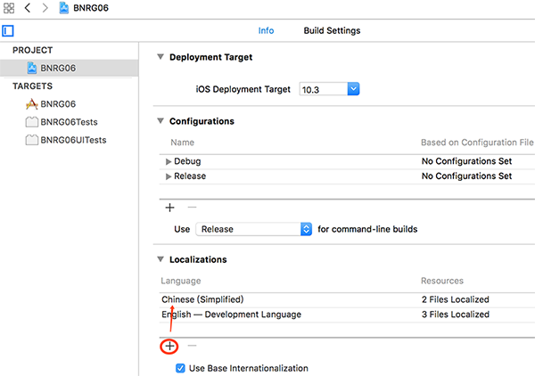
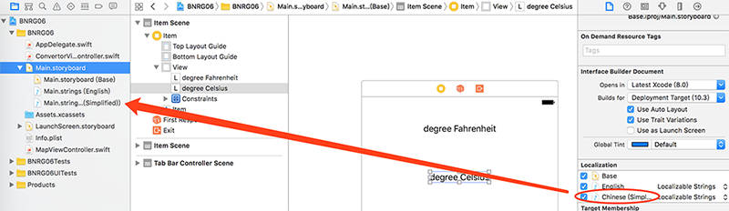
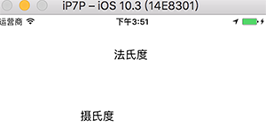
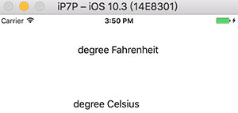
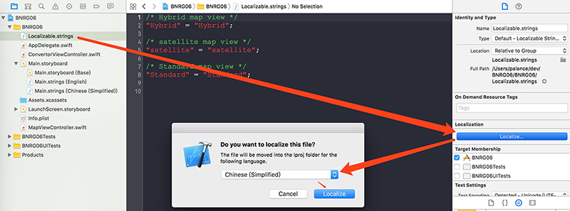
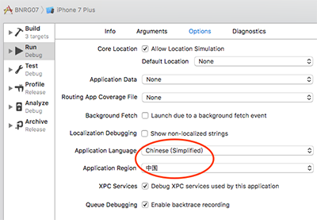
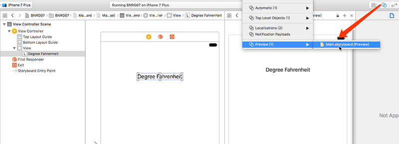
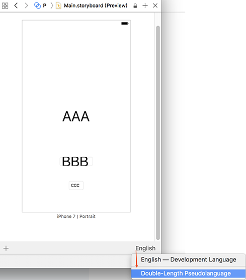

第七章实现app的本地化，当修改了系统语言后，app无需重新编译能自动适配。本章要点：
- Localization的基本概念
- 控件尺寸校验
<!-- more -->

# 1 本地化的基本概念
## 1.1 本地化都包含什么？
- 货币、数字、文字方向等走向的差异。比如有的国家小数点用`.`，千分符用`,`，有的国家刚好相反；各国有各自的货币符号，等等。这些信息都被Locale封装起来了，使用Locale的实例可以落实这些概念的具体值。
- Interface Builder中使用的字符串。在1.3中会具体讲。
- 代码中使用的硬编码字符串。在1.4中会具体讲。

## 1.2 iOS解决本地化问题的基本原理
Xcode构建一个target时，会把它所有可执行文件和相关的资源文件打成一个包。在运行时，代码可以通过一个Bundle实例main bundle来访问这个包里的所有数据。将一份资源本地化就是将这份资源的本地化副本拷贝到包里，这些资源按照语言名称（以lproj命名）组织目录名。
当访问包里的某个资源文件时，会先去包里的根目录查找该文件，如果没找到会再根据设备的语言/区域设置查找lproj目录，通过这种方式让语言相关的资源和代码相分离，实现本地化。

## 1.2 Interface Builder中的字符串怎么实现本地化？
第一步：在PROJECT > INFO > Localization添加待支持的语言：

第二步：在File Inspector中勾选该语言，它会为该storyboard生成对应的语种文件：

第三步：该文件会为storyboard中使用的所有文本创建一个变量，把每个变量的值修改为指定语言下的文本：

运行程序，如果系统语言设置为中文，app主界面就是：

把系统语言修改为英文，app不需要修改，主界面就变成了：

**需要注意：本地化的工作应该做在工程的最终阶段。因为如果完成本地化工作以后，再在storyboard中添加新的文本控件，Xcode是不会自动在语言包里为它添加变量的。只能重新在File Inspector中重新勾掉/勾选该语言，重新生成语言包。**

## 1.3 代码中的字符串怎么实现本地化？
第一步：使用NSLocalizedString(_:comment:)构造需要本地化的字符串：
``` objc
let standardString = NSLocalizedString("Standard", comment: "Standard map view")
let hybridString = NSLocalizedString("Hybrid", comment: "Hybrid map view")
let satelliteString = NSLocalizedString("satellite", comment: "satellite map view")
        
let segmentedControl = UISegmentedControl(items: [standardString, hybridString, satelliteString])
```
第二步：对包含本地化字符的文件生成语言包：
``` bash
$ genstrings MapViewController.swift
```
它会生成一个Localizable.strings文件，把它添加到工程里，然后按照如下步骤为它生成语言包：


它会在对应的lproj目录中生成Localizable.strings文件，把每个字符串修改成指定语言。
搞定！无需修改app代码，在系统指定语言下，app就会使用指定语言目录下的语言包来显示字符串。

## 1.4 怎样设置app调试运行的语言-区域


设置Application Language和Application Region，再run起app时，它就把该设置当做app的默认语言区域设置。
# 2 控件尺寸校验
## 2.1 为什么要为文本控件校验约束？
在实施本地化的时候，文本相关的控件（比如Label），其内容会根据语言/区域设置的变化而变化，这就需要为控件设置合适的约束。如果给Label的宽度设置一个定长约束，则会在文本变长时导致显示不全。因此，Xcode提供了一种机制，让story board里的文字瞬间翻倍，用来检查是不是所有的控件都设置了正确的约束。以方便开发者更好地本地化。

## 2.2 怎么校验文本控件的约束？
一、打开Assistant Editor
二、在打开的新视图上部选择Automatic > Preview > 选择预览要检查的界面

三、选择Double-Lenght Pseudolanguage，它会把界面中所有文字Double一遍

此时，对于约束设置不正确的控件，你就能发现诸如“文字展现不全”或“文字出界”等问题了