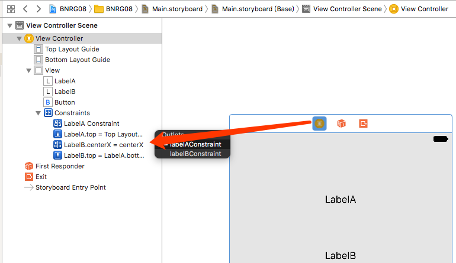

第八章实现了一些简单的动画。本章要点：
- animate函数的使用
<!-- more -->

# 1. 闭包
## 1.1 什么是闭包
闭包就是一个代码块，可以参数或者返回值的形式被传递。

## 1.2 声明、定义、使用闭包的形式
声明格式：
``` objc
(arguments) -> returnType
```
定义格式：
``` objc
{ (arguments) -> returnType in
// code
}
```
其中arguments是参数列表，returnType是返回值类型，in是关键字，在code处写要执行的代码

使用：
``` objc
let animation = {()->Void in
    self.labelA.alpha = 1
}	// 定义闭包，并赋值给变量animation

UIView.animate(withDuration: 0.5, animations: animation)
```
对于参数和返回均为空的闭包，也可以写作：
``` objc
UIView.animate(withDuration: 0.5, animations: {self.lableA.alpha = 1})
```
# 2. 动效函数
本章介绍的动画都是由这个函数实现的
``` objc
class func animate(withDuration duration: TimeInterval, animations: @escaping () -> Void)
```
使用这个函数和在keynote里制作动画很像，它不需要写多复杂的运动算法，只需要告诉它起始、终止位置，动画时长，加速度等参数，它就能生成动画效果。听起来好像很局限，其实对于一般应用来说已经足够用了。

## 2.1 怎么实现渐现/渐隐动画
只需要给animate函数传入动画时长和终局时控件的透明度即可：
``` objc
@IBAction func onButton(_ sender: UIButton){
    labelA.alpha = 0 	// 每次点击按钮先把labelA设为不可见
    labelB.alpha = 1	// 把labelB设为可见
    // 执行动画，时间长度5秒，最终效果是labelA可见，labelB不可见
    UIView.animate(withDuration: 5,
                  animations: {
       self.labelA.alpha = 1
       self.labelB.alpha = 0
    })
}
```
## 2.2 怎么实现飞入/飞出动画
原理和2.1一样，通过设置动画时长，终局时控件位置就可以生成动画。
有两种方式都能设置终局位置：
1. 直接设置要挪动的控件坐标；
2. 给控件添加约束，为约束关联outlet变量，设置该约束变量的值。

书在本章使用了第2种方式，它的好处在于：在Interface Builder中对控件做了完备的约束。如果采用第1种方式，只能在Interface Builder中不加某个方向的约束，这会因约束不足而被warning。
> 注意：对于一个view，如果加了约束同时又设置了它的坐标，生效的是约束，对坐标的设置无效。

## 2.3 通过设置终局位置实现飞入/飞出动画
``` objc
@IBOutlet var labelC:UILabel!
    
override func viewWillAppear(_ animated: Bool){
    super.viewWillAppear(animated)
    labelC.frame.origin.x = 0
}
    
@IBAction func onButton(_ sender: UIButton){
    let screenWidth = view.frame.width
    labelC.frame.origin.x = 0	// 从屏幕的左侧用5秒钟时间飞到屏幕右侧
    UIView.animate(withDuration: 5,
                    animations: {
        self.labelC.frame.origin.x = screenWidth
    })
}
```

## 2.4 为约束关联outlet变量
约束是在Interface Builder中创建的，要通过代码修改它的值，必须在代码中为之关联变量。在Interface Builder中的任何对象，都可以在代码中为之创建outlets变量。
第一步：在Interface Builder中为labelA创建水平居中的约束。
第二步：在VC中声明约束变量
``` objc
class ViewController: UIViewController {
    @IBOutlet var labelA:UILabel!
    @IBOutlet var labelB:UILabel!
    
    @IBOutlet var labelAConstraint: NSLayoutConstraint!
    @IBOutlet var labelBConstraint: NSLayoutConstraint!
……
}
```
第三步：在Interface Builder中完成对象到outlets变量的关联：


## 2.5 通过设置终局约束实现飞入/飞出动画
``` objc
class ViewController: UIViewController {
    @IBOutlet var labelA:UILabel!
    @IBOutlet var labelAConstraint: NSLayoutConstraint!  // 已完成关联，并在Interface Builder中设置居中
    
    override func viewWillAppear(_ animated: Bool){
        super.viewWillAppear(animated)
        
        labelA.alpha = 0
    }
    
    @IBAction func onButton(_ sender: UIButton){
        let screenWidth = view.frame.width
        labelA.alpha = 0
        labelAConstraint.constant = 0
        self.view.layoutIfNeeded()
        // 设置终局时labelA的水平约束值为screenWidth，即向屏幕右侧出去半个屏幕的宽度
        UIView.animate(withDuration: 5,	
                       animations: {
            self.labelA.alpha = 1
            self.labelAConstraint.constant = screenWidth
            self.view.layoutIfNeeded()
        })
    }
……
}
```
这个约束值的含义和在Interface Builder中体现的一模一样：0表示居中，屏幕左边缘是-view.frame.width / 2；右边缘是view.frame.width / 2

## 2.6 为什么要使用layoutIfNeed()函数
需要特别注意，如果要修改使徒的约束值，必须调用layoutIfNeed()函数，否则会看不到动画。而直接修改视图的坐标值则不存在这样的问题。
书中的解释是：约束修改后，系统需要重新计算所有相关视图的frame值，如果任何一个约束条件发生变化就立刻触发该计算，这在性能上非常不划算。因此应该在修改了所有约束之后，一次调用layoutIfNeeded()函数，这样重新计算就只会发生一次。


## 2.7 Xcode支持本地化时的bug
常常发现在修改了本地化文件的内容，再运行app后，修改并不生效，这是Xcode的一个bug。解决办法：在iOS中删除app，在Xcode中clean并重新编译项目。再次运行即可。

## 2.8 怎样调整动画的变化速度曲线？
还是使用animate函数，只是用更多参数的版本，本质上还是对终局和过程做设置：
``` objc
class func animate(withDuration duration: TimeInterval, 
    delay: TimeInterval, 
    usingSpringWithDamping dampingRatio: CGFloat, // 弹簧运动的阻尼比
    initialSpringVelocity velocity: CGFloat, 
    options: UIViewAnimationOptions = [], 	// 设置动画的加速度、是否循环播放
    animations: @escaping () -> Void, 
    completion: ((Bool) -> Void)? = nil)	// 动画结束时要执行的块
```
这个函数的用法应该反复使用，体会每个参数的含义。
