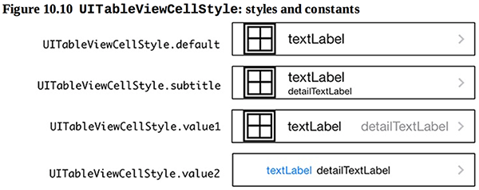
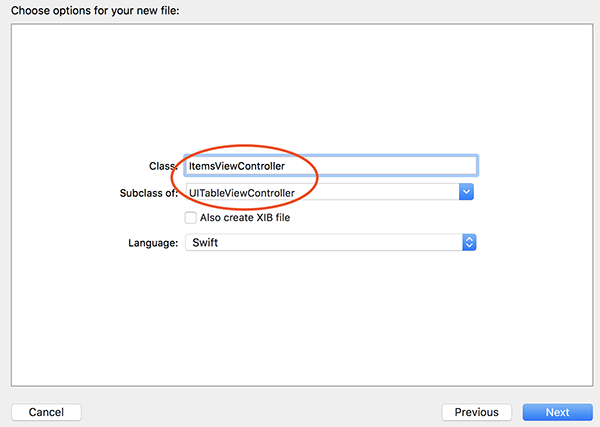
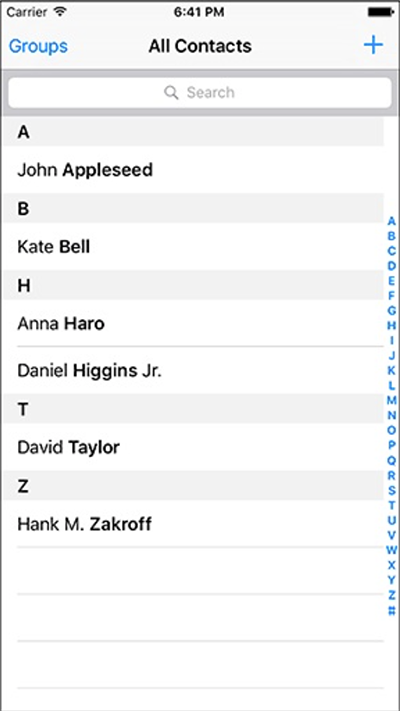

本章要点：
- UITableView的运作原理
- 初始化函数
- 依赖倒置原则
<!-- more -->

# UITableView
## 1 UITableView的默认形态是什么，都有哪些变种？

## 2 都有哪些典型的消息？

## 3 带开关的UITableView有谁来负责开关的开合？
我猜测它会把开关消息委托给VC，但是开关应该属于内部逻辑，是不是由UITableView包办的？

# UITableViewController
## 1 UITableViewController的运作原理
在Windows下制作ListCtrl的基本步骤是创建ListCtrl的实例后，向该实例的指定行循环插入数据。UITableViewConroller的运作模式则完全不同：它把MVC的职责划分更明确，
1、引入了data source的角色，只负责提供数据，即Model。通过协议来实现这个角色。
2、View在需要显示数据的时候，从data source取数据，他们之间通过data source 协议来通讯。因此在Windows下操作ListCtrl的生成数据并添加到ListCtrl的这种循环操作就被VC封装起来，不必程序员自己写了
3、通常由VC自己扮演data source，因此VC需要实现其协议。

我们可以做一个类比：当按钮被按下，按钮会把这个消息委托给VC来处理，因为按钮只知道怎么展现按下、抬起的状态，而VC能拿到数据，只有它才知道该怎么处理。UITableView是把“该展现多少行数据”、“每一行数据是什么”这些逻辑也封装成了类似“按钮被按下”的消息，委托给VC来处理了。所以你不必在关心如何把数据初始化给View，而只需要完成数据本身的初始化，并提供相应的协议接口，等着view来调用就好了。

书中的图10.4描述了TableView下的各MVC之间的关系，UITableViewController除了要遵守UITableViewDataSource协议，履行Model的职责以外，还要遵守UITableViewDelegate协议，这是要履行Controller的职责。这是因为TableView不像Button那么简单，Button只有一个被按下的操作，而TableView有一系列复杂操作，这些操作都要委托给Controller来做，因此需要用UITableViewDelegate协议来定义这些操作。

## 2 UITableViewController这种运作方式的好处

## 3 UITableDataSource都提供什么
具体需要查看Xcode 的Document and API reference，它有两个必须实现的接口：
``` objc
func tableView(UITableView, cellForRowAt: IndexPath)		// 返回指定位置的cell
func tableView(UITableView, numberOfRowsInSection: Int)	// 某一段有多少行
```
其余的接口都是可选的。

## 4 UITableView的默认形态
每行cell对象的展现形态构成了UITableView的展现形态。Cell可以分为两部分：contentView和AccessoryView

其中AccessoryView可以是icon、button或什么都没有，这通过UITableViewCellAccessoryType枚举类型来设置，默认为UITableViewCellAccessoryType.none。contentView又包含三部分：两个UILabel和一个UIImageView。
他们的关系为：

表现在界面上就是：

通过风格设定可以调整这三个字段的布局关系。

## 5 创建UITableViewController的基本步骤
第一步，引入TableView相关类和控件。
本书是把TableVC作为启动app时的初始VC，因此它把Xcode创建的默认VC的代码以及storyboard中的模板都删掉了。重新创建新的UITableViewController子类文件，从控件库中创先新的TableViewController，并关联到新创建的子类上，设置为Initial VC。

第二步，构造数据集合
本书中是Item、ItemStore类，前者记录一条数据，后者记录Item的集合。

第三步，改写VC的三个接口
``` objc
func numberOfSections(in tableView: UITableView) -> Int	// 返回TableView有几个段
func tableView(_ tableView: UITableView, numberOfRowsInSection section: Int) -> Int	// 返回指定的段有几行数据
func tableView(_ tableView: UITableView, cellForRowAt indexPath: IndexPath) -> UITableViewCell	// 返回指定位置的cell
```
TableView可以把数据分段显示，如系统通讯录就是按照字母分段：

第一个接口是Xcode自动生成的，默认返回0，在本章只显示1个段，因此改为1。
因为只有1段，所以第二个接口不必判断传入的段号，直接返回数据条数即可。
第三个接口Xcode自动生成的代码里使用了可重用队列来保存cell，暂时先注掉，每次都创建cell并返回。

## 6 可重用UITableViewCells的作用是什么
Xcode自动生成了如下代码：
``` objc
override func tableView(_ tableView: UITableView, cellForRowAt indexPath: IndexPath) -> UITableViewCell {
    let cell = tableView.dequeueReusableCell(withIdentifier: "reuseIdentifier", for: indexPath) // 这段代码的作用
    // Configure the cell...
    return cell
}
```
可重用队列的作用：TableView一次最多只能显示一屏数据，当前面的数据被滚动出屏幕，也就没必要继续保留它的对象了。假设有1000行数据要显示，一屏只能显示10行，只用11个对象就足以满足这1000条数据的展现。通过可重用UITableViewCells可以节省内存开销。

## 7 怎么使用可重用UITableViewCells
第一步：选中TableViewController中的Prototype Cells，为这里的Cell取一个ID填入Identifier

第二步：向tableView.dequeueReusableCell申请该ID的Cell对象
``` objc
override func tableView(_ tableView: UITableView,
cellForRowAt indexPath: IndexPath) -> UITableViewCell {
let cell = UITableViewCell(style: .value1, reuseIdentifier: "UITableViewCell")
// Get a new or recycled cell
let cell = tableView.dequeueReusableCell(withIdentifier: "UITableViewCell",
for: indexPath) ...
}
```
<font color=red>我的问题：实现一个可重用队列只要代码就可以了，为什么还要在InterfaceBuilder中设置Identifier呢？它背后做了什么？
可重用对象池里坑的个数依赖一屏可以容纳几行Cell，这个队列是怎么维护对象池个数的？
怎么修改Cell的高度？</font>

## 8 怎样让UITableView顶部留白以让出状态栏？
iOS的状态栏会透明显示在app的上面，所以始终要考虑不要出现文字叠加的情况：

任何视图顶部如果有文字，都要让出状态栏的位置。代码如下：
``` objc
override func viewDidLoad() { 
super.viewDidLoad()
// Get the height of the status bar
let statusBarHeight = UIApplication.shared.statusBarFrame.height
let insets = UIEdgeInsets(top: statusBarHeight, left: 0, bottom: 0, right: 0) 
tableView.contentInset = insets
tableView.scrollIndicatorInsets = insets
}
```
<font color=red>在第6章我们通过rootView.layoutMarginsGuide.leadingAnchor锚点对齐，使得位于地图顶部的SegmentedControl控件让出了状态栏，这里能否使用类似的做法呢？此处不是要实现什么对齐，所以没法直接类推，能否拿到状态栏锚点的坐标呢？</font>

# 初始化函数
## 1 什么是designated initializer和convenience initializer？
Disgnated initializer是一个类的主初始化器，是该类初始化的必经之路；必须在该初始化器中完成所有成员属性的初始化；该初始化器需要调用合适的父类初始化器来完成完整的初始化过程。
Convenience initializer通过调用其他的初始化器完成实例的初始化，每个类只要有一个designated initializer，convenience initializer则可有可无。Convenience initializer需要缀上关键字：
``` objc
convenience init(random: Bool = false) { 
    if random {
    let let
    var let
    idx let
    let let let
    adjectives = ["Fluffy", "Rusty", "Shiny"] nouns = ["Bear", "Spork", "Mac"]
    idx = arc4random_uniform(UInt32(adjectives.count)) randomAdjective = adjectives[Int(idx)]
    = arc4random_uniform(UInt32(nouns.count)) randomNoun = nouns[Int(idx)]
    randomName = "\(randomAdjective) \(randomNoun)" randomValue = Int(arc4random_uniform(100)) randomSerialNumber =
    UUID().uuidString.components(separatedBy: "-").first!
    self.init(name: randomName, serialNumber: randomSerialNumber, valueInDollars: randomValue)
    } else {
    self.init(name: "", serialNumber: nil, valueInDollars: 0)
    }
}
```
## 2 @discardableResult关键字
表示调用者可以忽略该函数的返回值，如果没有此关键字且调用者忽略了返回值，会得到一个编译警告
``` objc
@discardableResult func createItem() -> Item { 
let newItem = Item(random: true)
allItems.append(newItem)
return newItem 
}

// This is OK
let newItem = itemStore.createItem()

// This is also OK; the result is not assigned to a variable 
itemStore.createItem()
```
# 依赖倒置原则
## 1 什么是依赖倒置原则
依赖倒置原则包含两条：
1、高级别的对象不要依赖低级别的对象，他们都依赖于抽象
2、抽象不要依赖具体细节，细节应该依赖于抽象
高级别是指业务逻辑，低级别是指机制。比如文件系统就是一层抽象，上层的文件操作逻辑不依赖具体的文件类型，而只负责数据读写，文件系统负责处理具体不同文件类型的操作；上层的业务细节依赖得是文件系统的抽象层，<font color=red>抽象层调用具体文件类型的细节怎么解释呢？</font>

## 2 在本章中哪里体现了依赖倒置原则
没有在VC直接操作Item的集合，体现了这一原则。VC操作Item集合的增删改查，ItemStore把这些操作封装起来，成为一个抽象层。

## 3 试举个适用依赖倒置原则的例子
1中的文件系统的例子

## 4 什么是依赖注入，本章中如何使用依赖注入？
依赖注入是指通过构造函数或setter函数或直接在执行函数直接传参，把细节相关的对象传入业务层，之后业务层只访问传入对象的接口，而不关心细节。由此达成业务逻辑只依赖抽象的目的。
比如Button的响应函数的传入参数是UIButton，而不关心具体是哪个按钮，这就是通过执行函数直接传参的方式实现了依赖注入。

# 应用程序启动
## 1 AppDelegate的职责？
负责处理app的状态变化。<font color=red>app都有哪些状态？会怎么变化？AppDelegate需要怎么处理这些变化？</font>

## 2 AppDelegate::application(_:didFinishLaunchingWithOptions:)在什么时候被调用？
当应用程序首次启动时，该函数会被调用。
``` objc
func application(_ application: UIApplication, didFinishLaunchingWithOptions launchOptions: [UIApplicationLaunchOptionsKey : Any]?) -> Bool {
    // Override point for customization after application launch.
    // Create an ItemStore
    let itemStore = ItemStore()
    // Access the ItemsViewController and set its item store
    let itemsController = window!.rootViewController as! ItemsViewController itemsController.itemStore = itemStore  // 这句该怎么理解？
    return true 
}
```
<font color=red> 上面代码中注视的那句该怎么理解呢？</font>

# 为什么？
## 1 为什么变量itemStore尾部如果没有感叹号，编译会出现ItemsViewController没有初始化器的错误？
``` objc
class ItemsViewController: UITableViewController {
    var itemStore: ItemStore!  // 此处的感叹号如果缺少了，会提示ItemsViewController没有初始化器
    ...
}
```