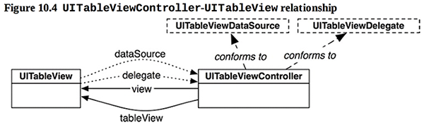
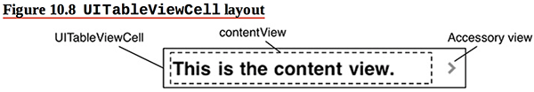
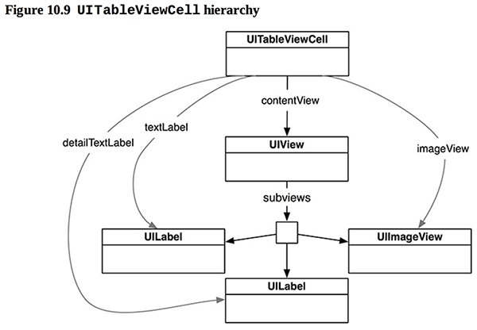
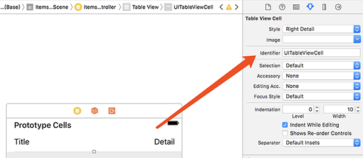

本章引入iOS一种常用的UI元素——UITableView，本章介绍它的数据呈现方法，下一章介绍编辑。

本章要点：
- UITableView的运作原理
- 初始化函数
- 依赖倒置原则
<!-- more -->

# 1 UITableViewController
## 1.1 UITableViewController的运作原理
在Windows下制作ListCtrl的基本步骤是创建ListCtrl的实例后，向该实例循环插入数据。UITableViewConroller的运作模式则完全不同：它把MVC的职责划分更明确，
1. 引入了data source的角色，只负责提供数据，即Model。通过协议来实现这个角色。
2. View在需要显示数据的时候，从data source取数据，他们之间通过data source 协议来通讯。因此在Windows下操作ListCtrl的生成数据并添加到ListCtrl的这种循环操作就作为这一层的业务逻辑被VC封装起来，不必程序员自己写了
3. 通常由VC自己扮演data source，因此VC需要实现其协议。

可以做一个类比：当按钮被按下，按钮会把这个消息委托给VC来处理，因为按钮只知道怎么展现按下、抬起的状态，而VC能拿到数据，只有它才知道该怎么处理。UITableView是把“该展现多少行数据”、“每一行数据是什么”这些逻辑也封装成了类似“按钮被按下”的消息，委托给data source来处理了。所以你不必在关心如何把数据初始化给View，而只需要完成数据本身的初始化，并提供相应的协议接口，等着view来调用就好了。

书中的图10.4描述了TableView下的各MVC之间的关系，UITableViewController除了要遵守UITableViewDataSource协议，履行Model的职责以外，还要遵守UITableViewDelegate协议，这是要履行Controller的职责。这是因为TableView不像Button那么简单，Button只有一个被按下的操作，而TableView有一系列复杂操作，这些操作都要委托给Controller来做，因此需要用UITableViewDelegate协议来定义这些操作。

## 1.2 UITableViewController这种运作方式的好处
之前多次提到过的，通过这种方式把UI逻辑和业务逻辑分离开了。UI逻辑包括行为逻辑和数据逻辑，行为逻辑如点击某个Item、显示某行等，数据逻辑包括包含多少Item项，每一项是什么等；业务逻辑则是点击了某个Item之后应该展现什么View以及什么数据。

分离开的好处在与如果没有特殊的定制，各个模块可以独立编写，工程上便于分工，如果现实模块发生变化，可以很快地把数据嫁接到别的视图，便于复用。

## 1.3 UITableDataSource都提供什么
具体需要查看Xcode 的Document and API reference，它有两个必须实现的接口：
``` objc
func tableView(UITableView, cellForRowAt: IndexPath)	// 返回指定位置的cell
func tableView(UITableView, numberOfRowsInSection: Int)	// 某一段有多少行
```
其余的接口都是可选的。

## 1.4 UITableView的默认形态
每行cell对象的展现形态构成了UITableView的展现形态。Cell可以分为两部分：contentView和AccessoryView

其中AccessoryView可以是icon、button或什么都没有，这通过UITableViewCellAccessoryType枚举类型来设置，默认为UITableViewCellAccessoryType.none。contentView又包含三部分：两个UILabel和一个UIImageView。
他们的关系为：

表现在界面上就是：

通过风格设定可以调整这三个字段的布局关系。

## 1.5 创建UITableViewController的基本步骤
第一步，引入TableView相关类和控件。
本书是把TableVC作为启动app时的初始VC，因此它把Xcode默认创建的VC相关文件模板都删掉了。重新创建新的UITableViewController子类文件，从控件库中创先新的TableViewController，并关联到新创建的子类上，设置为Initial VC。

第二步，定义数据。
本书中是Item、ItemStore类，前者记录一条数据，后者记录Item的集合。

第三步，改写VC的三个接口。
``` objc
func numberOfSections(in : UITableView) -> Int	// 返回TableView有几个段
func tableView(_ : UITableView, numberOfRowsInSection : Int) -> Int	// 返回指定的段有几行数据
func tableView(_ : UITableView, cellForRowAt : IndexPath) -> UITableViewCell	// 返回指定位置的cell
```
TableView可以把数据分段显示，如系统通讯录就是按照字母分段：

第一个接口是Xcode自动生成的，默认返回0，在本章只显示1个段，因此改为1。
因为只有1段，所以第二个接口不必判断段号，直接返回数据条数即可。
第三个接口Xcode自动生成的代码里使用了可重用队列来保存cell，暂时先注掉，每次都创建cell并返回。

## 1.6 可重用UITableViewCells的作用是什么
Xcode自动生成了如下代码：
``` objc
override func tableView(_ tableView: UITableView, cellForRowAt indexPath: IndexPath) -> UITableViewCell {
    let cell = tableView.dequeueReusableCell(withIdentifier: "reuseIdentifier", for: indexPath)
    // Configure the cell...
    return cell
}
```
`func tableView(_ : UITableView, cellForRowAt : IndexPath) -> UITableViewCell`返回的内容通过`UITableViewCell`封装起来，这就好像通过码头的货物要使用集装箱封装起来。
货物从一个港口装箱运到另一个港口，如果一船只能装100个箱子，运送1000箱货物其实不需要1000个箱子，有100个就够了。
数据从屏幕的顶部滚动到屏幕底部，再滚出屏幕，也不是有多少数据就构造多少个`UITableViewCell`，移出屏幕的Cell实例就可以继续复用盛放即将移入的数据了。显然通过可重用UITableViewCells可以节省内存开销。

## 1.7 怎么使用可重用UITableViewCells
第一步：选中TableViewController中的Prototype Cells，为这里的Cell取一个ID填入Identifier

第二步：向tableView.dequeueReusableCell申请该ID的Cell对象
``` objc
override func tableView(_ tableView: UITableView, cellForRowAt indexPath: IndexPath) -> UITableViewCell {
    let cell = UITableViewCell(style: .value1, reuseIdentifier: "UITableViewCell")
    // Get a new or recycled cell
    let cell = tableView.dequeueReusableCell(withIdentifier: "UITableViewCell", for: indexPath) 
    ...
    return cell
}
```
> 实现一个可重用队列只要代码就可以了，为什么还要在InterfaceBuilder中设置Identifier呢？它背后做了什么？
一个datasource可能服务于多个UITableView，不同的UITableView可能使用不同的UITableCell对象。当集装箱服务于不同的货船的时候后，可能他们的尺寸规格都不一样，显然应该使用独立的队列来保存这些集装箱，ID就是用来标识这些队列的。

<font color=red>可重用对象池里坑的个数依赖一屏可以容纳几行Cell，队列是怎么知道该留多少个坑呢？</font>

## 1.8 怎样让UITableView顶部留白以让出状态栏？
iOS的状态栏会透明显示在app的上面，所以始终要考虑不要出现文字叠加的情况：

任何视图顶部如果有文字，都要让出状态栏的位置。代码如下：
``` objc
override func viewDidLoad() { 
    super.viewDidLoad()
    // Get the height of the status bar
    let statusBarHeight = UIApplication.shared.statusBarFrame.height
    let insets = UIEdgeInsets(top: statusBarHeight, left: 0, bottom: 0, right: 0) 
    tableView.contentInset = insets
    tableView.scrollIndicatorInsets = insets
}
```
<font color=red>在[第6章](/2017/07/26/2017/0726iOSProgrammingBNRG06/#2-4-怎么让View的上边缘让出系统状态栏？)我们通过rootView.layoutMarginsGuide.leadingAnchor锚点对齐，使得位于地图顶部的SegmentedControl控件让出了状态栏，这里能否使用类似的做法呢？</font>

# 2 初始化函数
## 2.1 什么是designated initializer和convenience initializer？
Designated initializer是一个类的主初始化器，是该类初始化的必经之路；必须在该初始化器中完成所有成员属性的初始化；该初始化器需要调用合适的父类初始化器来完成完整的初始化过程。
Convenience initializer是Designated initializer的helper方法，每个类只要有一个designated initializer，convenience initializer则可有可无。Convenience initializer需要缀上关键字：
``` objc
convenience init(random: Bool = false) { 
    if random {
        let adjectives = ["Fluffy", "Rusty", "Shiny"]
        let nouns = ["Bear", "Spork", "Mac"]
        
        var let idx = arc4random_uniform(UInt32(adjectives.count))
        idx let randomAdjective = adjectives[Int(idx)]
        idx = arc4random_uniform(UInt32(nouns.count))
        let randomNoun = nouns[Int(idx)] 

        let randomName = "\(randomAdjective) \(randomNoun)"
        let randomValue = Int(arc4random_uniform(100))
        let randomSerialNumber = UUID().uuidString.components(separatedBy: "-").first!

        self.init(name: randomName, serialNumber: randomSerialNumber, valueInDollars: randomValue)
    } else {
        self.init(name: "", serialNumber: nil, valueInDollars: 0)
    }
}
```
## 2.2 @discardableResult关键字
表示调用者可以忽略该函数的返回值，如果没有此关键字且调用者忽略了返回值，会得到一个编译警告
``` objc
@discardableResult func createItem() -> Item { 
    let newItem = Item(random: true)
    allItems.append(newItem)
    return newItem 
}

// This is OK
let newItem = itemStore.createItem()

// This is also OK; the result is not assigned to a variable 
itemStore.createItem()
```

# 3 依赖倒置原则
## 3.1 什么是依赖倒置原则
依赖倒置原则包含两条：
1. 高级别的对象不要依赖低级别的对象，他们都依赖于抽象
2. 抽象不要依赖具体细节，细节应该依赖于抽象

高级别是指业务逻辑，低级别是指机制。比如文件系统就是一层抽象，上层的文件操作逻辑不依赖具体的文件类型，而只负责数据读写，文件系统负责处理具体不同文件类型的操作；上层的业务细节依赖文件系统的抽象层。

> 抽象层调用具体文件类型的细节怎么解释呢？不就和第2条矛盾了吗？
答案是：这两条规则描述的是模块之间的依赖原则，文件系统的抽象层调用文件系统的实现层这是模块内部，这叫封装，不叫依赖。
在本节中UITableView需要数据的时候问datasource请求，也是遵循了这样一个原则，data source是数据的抽象层，UITableView是UI逻辑的细节，是高级别的对象，datasource是数据抽象，是低级别的抽象，再往底层从文件获取数据或者从数据库获取数据则是数据的低级别具体。

## 3.2 在本章中哪里体现了依赖倒置原则
没有在VC直接操作Item的集合，体现了这一原则。VC操作Item集合的增删改查，ItemStore把这些操作封装起来，成为一个抽象层。

## 3.3 什么是依赖注入，本章中如何使用依赖注入？
依赖注入是指通过构造函数或setter函数或直接在执行函数直接传参，把细节相关的对象传入业务层，之后业务层只访问传入对象的接口，而不关心细节。由此达成业务逻辑只依赖抽象的目的。
比如Button的响应函数的传入参数是UIButton，而不关心具体是哪个按钮，这就是通过执行函数直接传参的方式实现了依赖注入。

# 4 应用程序启动
## 4.1 AppDelegate的职责？
负责处理app的状态变化。
<font color=red>app都有哪些状态？会怎么变化？AppDelegate需要怎么处理这些变化？</font>

## 4.2 AppDelegate::application(_:didFinishLaunchingWithOptions:)
当应用程序首次启动时，该函数会被调用。
``` objc
func application(_ application: UIApplication, didFinishLaunchingWithOptions launchOptions: [UIApplicationLaunchOptionsKey : Any]?) -> Bool {
    // Override point for customization after application launch.
    // Create an ItemStore
    let itemStore = ItemStore()
    // Access the ItemsViewController and set its item store
    let itemsController = window!.rootViewController as! ItemsViewController // 这句该怎么理解？
    itemsController.itemStore = itemStore  
    return true 
}
```
> 上面代码中注视的那句该怎么理解呢？
首次遇到带了两个感叹号，我们来分析一下。`window`是`AppDelegate`的optional变量，但在运行到`AppDelegate::application(_:didFinishLaunchingWithOptions:)`时，这个`window`变量及其`rootViewController`属性肯定不会是空，所以使用了强制展开。但是按照[第二章](/2017/07/22/2017/0722iOSProgrammingBNRG02/#2-3-展开optional变量)介绍的optional原则，是不是应该使用if-let更好呢。

<br>
> <font color=red>下面这段代码为什么变量itemStore尾部加了感叹号，编译不出现ItemsViewController没有初始化器的错误了？
没有感叹号的时候，出现这个错误可以理解：它要求所有成员都应该被designated initializer初始化，现在缺少这个initializer。可是为什么加了感叹号就没问题了呢？
``` objc
class ItemsViewController: UITableViewController {
    // 如果没有感叹号会提示ItemsViewController没有初始化器
    var itemStore: ItemStore!
    ...
}
```
</font>