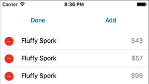

本章继续介绍UITableView，如何进入编辑模式，响应用户的增删操作。

本章要点：
- UITableView的编辑模式
- Alerts的使用
<!-- more -->

# 1 TableView的整体构造
## 1.1 Header和Footer
TableView的Header有Table Header和Section Header；同样，Footer有Table Footer和Section Footer：

## 1.2 如何为TableView创建Table Header？
只有一步：在Interface Builder中向TableView的顶部拖入一个View，然后就可以在这个View里放置按钮了

因此所谓的Table Header只是在TableView的上面放了一个普通的View，他并不是TableView体系的一部分。Table Footer也一样。
<font color=red>Section Header应该会不同，因为它要显示到TableView的内部。如果要插入Section Header具体怎么操作呢？</font>


## 1.3 如何进入Editing模式
UITableViewController有一个属性isEditing表示当前是否处于Editing模式，
有一个函数`func setEditing(_ editing: Bool, animated: Bool)`设置当前模式
因此Edit按钮的响应函数如下：
``` objc
@IBAction func toggleEditingMode(_ sender: UIButton) { 
    if isEditing { 	// 当前处于editing模式
        sender.setTitle("Edit", for: .normal)   // 修改Edit按钮文字
        setEditing(false, animated: true)       // 撤销Edit模式
    } else {		// 当前不是Editing模式
        sender.setTitle("Done", for: .normal)   // 修改Edit按钮文字
        setEditing(true, animated: true)        // 进入Edit模式
    }
}
```


> 这里只是设置了一个数据标志，之后系统会划入/划出右侧的图标。根据[第一章](/2017/07/21/2017/0721iOSProgrammingBNRG01/#4-2-iOS的界面刷新机制)可以推断，这个`setEditing(_ animated:)的操作应该通过`setNeedsDispaly`之类的操作触发了界面刷新，或者通过animate触发了动画。

## 1.4 如何删除一条记录
进入Editing后的界面交互，是TableView默认提供的。

可以点击左边红色按钮触发删除，这些不需要程序员控制。但是根据[第10章](/2017/07/29/2017/0729iOSProgrammingBNRG10/#1-1-UITableViewController的运作原理)介绍的TableView运行原理，一旦点击了删除按钮，需要数据源将该数据删除，M和V配合才能共同完成数据删除。具体需要两步：
1. 在data source中实现`tableView(_:commit:forRow:)`方法，该方法属于`TableViewDataSource`协议的一部分，如果没有实现该方法，点击Delete按钮是没响应的
2. 在`tableView(_:commit:forRow:)`方法中删除数据源中的数据，这是对M操作；调用TableView的`tableView(_:commit:forRowAt:)`方法删除一行，这是对V操作

代码如下：
``` objc
override func tableView(_ tableView: UITableView, commit editingStyle: UITableViewCellEditingStyle, forRowAt indexPath: IndexPath) {
    if editingStyle == .delete {	// 如果执行的是删除操作
        let item = itemStore.allItems[indexPath.row]
        itemStore.removeItem(item)	// M操作，删除数据源中的数据
        tableView.deleteRows(at: [indexPath], with: .automatic)	// V操作，删除视图中的一行
    } else if editingStyle == .insert {
        ...
    }    
}
```
tableView(_:commit:forRow:)方法从命名上就能判断，它不止用于处理删除，还可以处理其他的编辑操作，具体是哪种操作视editingStyle而定。
<font color=red>此处的依赖关系好像有点问题，data source执行View操作，不是底层对象依赖上层对象了么？这个删除动作由控件发起，应该首先告诉VC，再由VC调整界面，通知data source才符合MVC原则吧？</font>

## 1.5 如何调整TableView中记录的顺序
默认生成的TableView，进入Editing模式后是不能调整顺序的，由1.4不难猜测肯定是因为没有实现data source协议的某个接口。是的，这个接口的名字叫
tableView(_:moveRowAt:to:)
和1.4类似，实现该接口只需要操作数据源，调整数据的顺序即可。这里不需要通知TableView进行V操作，因为操作是通过用户在TableView上交互自然完成的。代码如下：
``` objc
override func tableView(_ tableView: UITableView, moveRowAt fromIndexPath: IndexPath, to destinationIndexPath: IndexPath) {
    itemStore.moveItem(from: fromIndexPath.row, to: destinationIndexPath.row) // M操作，只需要操作数据源即可
}
```
当然在此之前需要自己添加itemStore的mvoeItem方法

## 1.6 如何向TableView添加一行数据
按照第10章给出的TableView原理，添加记录应该只需要操作数据源，添加一条记录就可以了，但这只完成了一半，在运行中途动态添加数据还需要通知TableView更新：
1. 向数据源添加一条数据
2. 通知TableView添加一行

``` objc
@IBAction func addNewItem(_ sender: UIButton){
    let newItem = itemStore.createItem()    // 往数据源添加一条数据
    
    if let index = itemStore.allItems.index(of: newItem){
        let indexPath = IndexPath(row: index, section: 0)
        tableView.insertRows(at:[indexPath], with:.automatic)   // 通知TableView增加一行
    }
}
```

# 2 显示Alerts
## 2.1 Alerts的两种风格
可以通过UIAlertControllerStyle来指定Alert的显示风格

## 2.2 使用actionSheet Alert的操作步骤
先来看这种风格界面的完整展现：

实现这种提示共分三步：
1. 构造`UIAlertController`实例，并指定Title和Message。上图中第一行粗体灰字就是Title，第二行灰字就是Message。
2. 构造用户可以选择的`UIAlertAction`实例，指定Title、风格和操作，并将这些实例添加到`UIAlertController`实例中。上图中的Delete和Cancel分别对应一个`UIAlertAction`实例。
3. 调用VC的present方法，并传入`UIAlertController`实例完成显示。

代码如下：
``` objc
let item = itemStore.allItems[indexPath.row]

// 第一步：构造UIAlertController实例
let title = "Delete \(item.name)?"
let message = "Are you sure you want to delete this item?"
let ac = UIAlertController(title: title, message:message, preferredStyle:.actionSheet)

// 第二步：分别构造两个UIAlertAction实例，并添加到ac
let cancelAction = UIAlertAction(title: "Cancel", style: .cancel, handler: nil)
ac.addAction(cancelAction)

let deleteAction = UIAlertAction(title: "Delete", style: .destructive, 
handler: {(action) -> Void in			// 原先的删除操作作为闭包传入AA的handler参数
    self.itemStore.removeItem(item)		
    self.tableView.deleteRows(at: [indexPath], with: .automatic)
})
ac.addAction(deleteAction)
// 第三步：弹出提示框
present(ac, animated: true, completion: nil)
```
