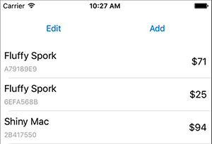
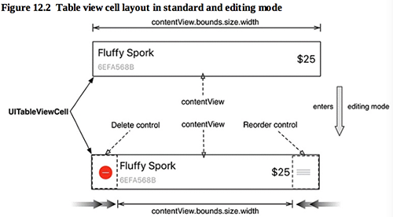
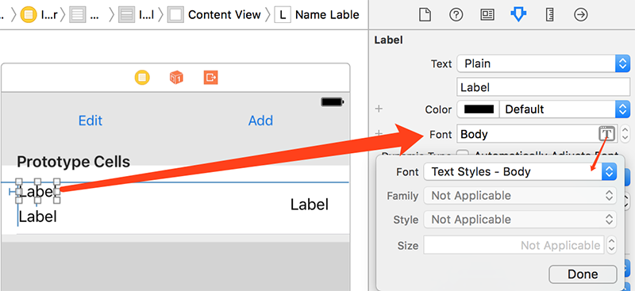
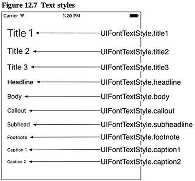
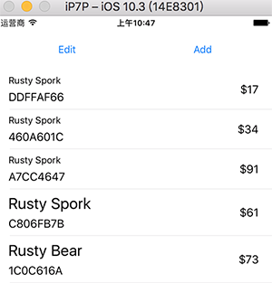

本章进一步通过子类化UITableViewCell实现自定义的样式展现。

本章要点：
- 子类化UITableViewCell
- 让字体随系统设置动态调整
<!-- more -->

在Interface Builder上点击Prototype Cells发现它对应的Class是UITableViewCell。因此，子类化UITableViewCell的方法应该是派生该类的子类，并将Interface Builder中的Prototype Cells的Class对应到该子类上去。具体做法是在Prototype Cells的面板上拖入需要的子控件，关联到子类的outlets变量。

# 1 子类化UITableViewCell
## 1.1 子类化UITableViewCell的基本思路
和布局一个普通的View没什么差别：
1. 派生UITableViewCell的子类
2. 在Interface Builder中将Prototype Cells的Style设置为Custome，将Class对应到该子类
3. 关联Interface Builder中的控件、消息与子类中的outlets变量、消息处理函数关联起来

需要注意的是：子控件应当添加到UITableViewCell的contentView中，而不是直接添加到cell上。因为当进入Editing模式后，cell的左右两侧会多出删除、移动的子控件，添加到contentView中能避免这两个子控件覆盖新加入的控件。书中的图12.2描述了他们之间的布局关系。

## 1.2 子类化UITableViewCell的步骤
1. 派生UITableViewCell的子类，取名ItemCell
2. 在Interface Builder中设置Prototype Cells的Style设置为Custom：

将Class为ItemCell：

3. 在Prototype Cells中修改布局，添加子控件。如果要修改高度，需要先勾选Row Height的Custom，再修改值：


## 1.3 怎么把Interface Builder 中Prototype Cells上的控件关联到ItemCell的成员变量
以前都是将IB控件关联到VC的成员变量，因此在Interface Builder中从VC Ctrl拖拽到控件，而此处要关联到ItemCell的成员变量，拖拽的起点应该是哪呢？步骤如下：
1. Ctrl-click Prototype Cells，会弹出如下UITableViewCell面板
2. 拖拽nameLable、serialNumberLabel和valueLabel右侧的加号到Prototype Cells中对应的子控件完成关联


## 1.4 将自定义TableViewCell显示到TableView的步骤
一、修改了cell的高度，需要告诉tableView：
``` objc
override func viewDidLoad() {
    super.viewDidLoad()

    let statusBarHeight = UIApplication.shared.statusBarFrame.height
    let insets = UIEdgeInsets(top:statusBarHeight, left:0, bottom:0, right:0)
    tableView.contentInset = insets
    tableView.scrollIndicatorInsets = insets
    
    tableView.rowHeight = 65	// 告知tableView每一行的高度
}
```
<font color=red>没有修改高度时，是在哪里以及什么时机告知的呢？</font>

二、在Interface Builder中修改Prototype Cells的Identifier属性：

这个属性在第11章介绍过，是用于可复用的cell。当然也可以不改，只要与第三步一致即可。
三、修改tableView(_:cellForRowAt:)函数，让它每次返回一个自定义的Cell实例：
``` objc
override func tableView(_ tableView: UITableView, cellForRowAt indexPath: IndexPath) -> UITableViewCell {
    // 此处修改了Identifier，并强制转换成ItemCell对象，因为接下来要设置其成员变量
    //  let cell = tableView.dequeueReusableCell(withIdentifier: "UITableViewCell", for: indexPath)
    let cell = tableView.dequeueReusableCell(withIdentifier: "ItemCell", for: indexPath) as! ItemCell

    // Configure the cell...
    let item = itemStore.allItems[indexPath.row]
    
    //  cell.textLabel?.text = item.name					// 原先的字段都改成新的
    //  cell.detailTextLabel?.text = "$\(item.valueInDollars)"
    cell.nameLable.text = item.name
    cell.serialNumberLabel.text = item.serialNumber
    cell.valueLabel.text = "$\(item.valueInDollars)"
    
    return cell
}
```
> 每次调用`dequeueResableCell`返回UITableViewCell对象，这个对象一定是此前创建好的，这里只是从队列里取出来，在什么时候创建的呢？我判断应该是加载storyboard时，知道此UITableView的Cell类型，并为之创建所需要的Cell对象，之后塞到队列里。

## 1.5 动态设定cell的行高
自动选择Cell的高度作为tableView的行高。具体步骤分两步：
一、添加从nameLabel到serialNumberLabel的Vertical Spacing约束
二、修改tableView的viewDidLoad()函数中的行高设置
<font color=red>书中说：UITableViewCell的约束应该足以让它知道自己的高度，而目前的约束还不够，这是为什么？为什么添加了一就够了呢？
P365，在本步中选中nameLabel，Ctrl拖拽到serialNumberLabel，并选择Vertical Spacing，为什么要这么操作？在Prototype Cells这个界面上一共设置了几个约束项？</font>
此前在P356中设置过5个：
1. 左上Label添加了上、左距离容器的边距
2. 左下Label添加了与左上Label的左对齐
3. 左下Label添加了下距离容器的边距
4. 右Label添加了与容器的右边距，并添加了竖直方向居中
5. 左下Label在size inspector中设置Vertical Content Hugging Priority=250，Vertical Content Compression Resistance Priority=749 <font color=rdd>说是第13章讲具体含义</font>
``` objc
override func viewDidLoad() {
    super.viewDidLoad()

    // Uncomment the following line to preserve selection between presentations
    // self.clearsSelectionOnViewWillAppear = false

    // Uncomment the following line to display an Edit button in the navigation bar for this view controller.
    // self.navigationItem.rightBarButtonItem = self.editButtonItem()
    let statusBarHeight = UIApplication.shared.statusBarFrame.height
    let insets = UIEdgeInsets(top:statusBarHeight, left:0, bottom:0, right:0)
    tableView.contentInset = insets
    tableView.scrollIndicatorInsets = insets
    
    tableView.rowHeight = UITableViewAutomaticDimension
    tableView.estimatedRowHeight = 65
}
```
<font color=red>书中说：设置tableView的行高为UITableViewAutomaticDimension可以提高性能，与其在tableView加载时请求每个单元格的高度，不如设置此属性允许将部分性能成本推迟到用户开始滚动为止。原因是什么呢？为什么可以提高性能？</font>

# 2 让字体随系统设置动态调整
## 2.1 系统设置如何影响app内字体
在系统设置 > 通用 > 辅助功能 > 更大字体 可以调整字号，在app内部通过简单的配置就能让字体随该设置变化。
一、在Interface Builder中对字体作如下设置：

系统对于不同类型的字体做了如下定义：

二、覆盖ItemCell的awakeFromNib()函数。
书中说：当对象实例从文件中加载时（此处是storyboard文件），会对该对象调用此函数。
此时，我们将ItemCell内所有文本控件的`adjustsFontForContentSizeCategory` 开关置为true，表明它的字体要参照系统设置。
``` objc
override func awakeFromNib() {
    super.awakeFromNib()
    // Initialization code
    nameLabel.adjustsFontForContentSizeCategory = true
    serialNumberLabel.adjustsFontForContentSizeCategory = true
    valueLabel.adjustsFontForContentSizeCategory = true
}
```
如果没有第二步，新创建的cell里的字体会随系统设置，例如：

最初系统设置了小字体，创建前三行数据，之后把系统字体调为大字体，再回到app新创建的后两行数据就是大字体，但前面的不会被刷新。只有在第二步中设置了`adjustsFontForContentSizeCategory`开关，控件才会在重新显示的时候刷新字体。