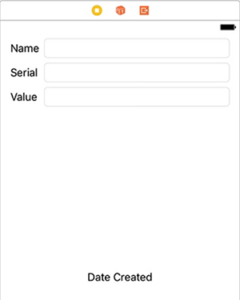
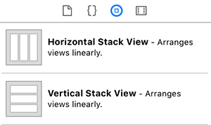
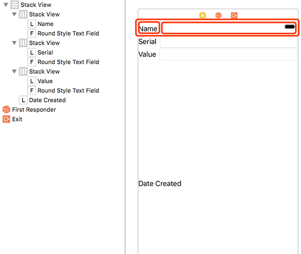
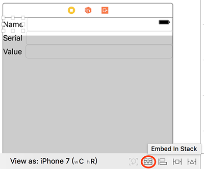
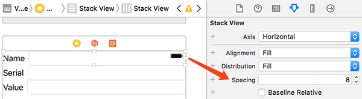
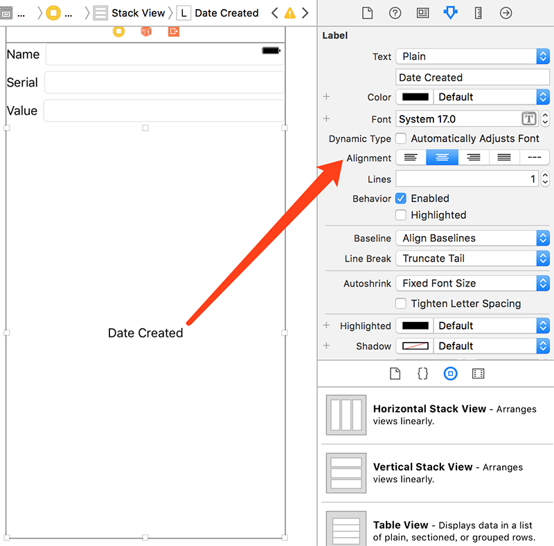
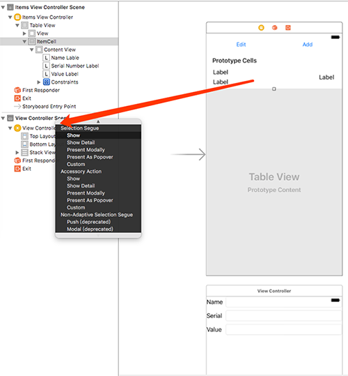
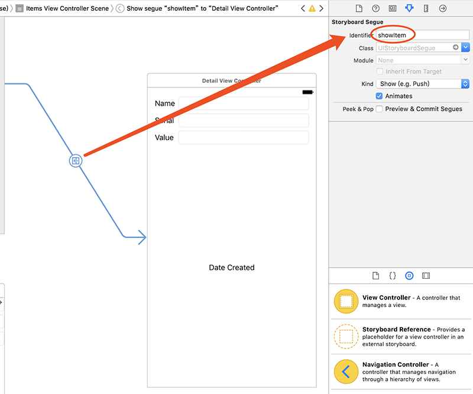
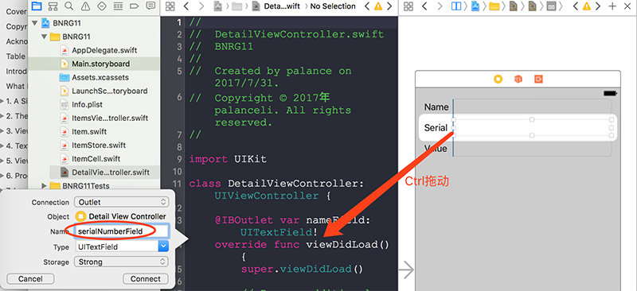

本章引入伸缩阻尼的概念，介绍控件排布的时候相互伸缩的优先级。本章中点击了UITableViewCell之后会专场到详细信息，这就是Segue。

本章要点：
- 伸缩阻尼
- Stack View
- Segue
<!-- more -->

# 1 两个控制内容伸缩的阻尼
## 1.1 content hugging priorities和content compression priorities
我把它们翻译成内容拉伸阻尼和内容压缩阻尼。
`内容拉伸阻尼（content hugging priorities）`：可以想象成一根安装在view内的弹簧，用来阻碍view的尺寸拉得比固有内容更长。阻尼值从0到1000，1000表示无法拉伸。
`内容压缩阻尼（content compression priorities)`：也可以想象成一根安装在view内的弹簧，用来阻碍View被压缩得比固有尺寸更短。阻尼从0到1000，1000表示无法被压缩。

书里的图不如这张说得明白：当容器被拉伸，内部的子控件的拉伸比例会参照其拉伸阻尼，越小的拉伸越多；当容器被压缩，内部的子控件的压缩比例也参照其压缩阻尼，越小的压缩越多。


# 2 Stack View
## 2.1 什么是Stack View
其实就是用网格方式排列子视图的View，从图标上就能看明白，包括水平和竖直两种：

## 2.2 嵌套的Stack View
在一个Horizontal Stack View内部可以再包含Vertical Stack View，这就是Stack View的嵌套。下面就是一个这样的例子。根Stack View是一个Vertical的，包含四行分别排列Name、Serial、Value和Date Created。前三行又分别是一个Horizontal Stack View，包含一个Label和一个Text Field：

选择一个控件，点击右下角第二个按钮，会生成一个Stack View 来包含此控件：

选中一个Stack View，可以在Attributes inspector中设置它的Stack方向，水平还是竖直： 

## 2.3 在Stack View中相邻的控件伸缩关系
结合前面讲的伸缩阻尼的概念，设置伸缩关系就很容易了。例如上图中Name Label和它后面的Text Field之间的关系，Label的`Horizontal Content Hugging Priority=251`，Text Field的`Horizontal Content Hugging Priority=250`，因此二者并排放，Text Field被拉伸了。

## 2.4 在Stack View中设置子视图边距
可以为Stack View设置相邻子视图之间的间隔距离：

这个距离的生效依然依赖控件的阻尼属性——这个值会让压缩阻尼小的控件被压缩，
Label的`Horizontal Content Compression Resistance Priority=750`，Text Field的`Horizontal Content Compression Resistance Priority=749`。因此是Text Field被压缩。

## 2.5 为什么Date Created的Aligment也能调整到布局？
在P282通过修改Date Created的Alignment也能调整此Label的布局，这个修改阻尼或者修改约束有什么差别呢？
其实这个操作并没有真正动到子视图间的布局关系，<font color=red>仔细看这个界面的布局，前三行都是Vertical Stack View，他们的竖直拉伸阻尼是250，Date Created的竖直拉伸阻尼是251，于是应该前三行被竖直拉伸吧？</font>设置Date Created的Alignment只是改变了其中的文字在Label框内的布局

## 2.6 已经框到Stack View格子里的子视图为什么还需要设置彼此对齐？
在书P282，要对三个Text Field再做左对齐。因为他们已经通过纵横的Stack View被格子限制过了，这个对齐约束必要吗？
其实还是必要的，仔细观察上图，这三个Text Field并没有纵向对齐。Horizontal Stack View的分割比例取决于Label的固有长度，如果文字长，留给Text Field的空间就小，否则就大。这里只是碰巧三个Label文字长度差不多，乍一看貌似是对齐的。
<font color=red>不过还是有问题：目测Value最短，所以他后面的Text Field是最长的，如果上面两个Text Field都与之对齐，不就与弹簧阻尼原则相冲突了么？一个极端的例子，把Name改为NameNameNameNameName，再让其后的Text Field与Serial后面的Text Field对齐，会出现什么现象？</font>

## 2.7 本章在放Vertical Stack View之前有把原先VC下的View删掉吗？
<font color=red>我试着删掉原先的VC再放Vertical Stack View，发现背景是黑色的。那就是说要保留原先的View咯？为什么呢？Stack View不也是View吗？这个Vertical Stack View的约束关系怎么设置呢？理论上说应该是让她紧贴着View，但我没看到书里这么做呢？</font>

# 3 Segue
## 3.1 什么是Segue
按照书中的解释：就是转场，从一个界面转到另一个界面，storyboard可以不必写代码来创建一个转场过程，就叫做segues。Segue包含：
- 一个Style 表明VC如何展现出来
- 一个Action item  触发转场的对象，如按钮、table view cell等
- 一个identifier  通过代码访问该Segue

## 3.2 怎么创建Segue
本章的例子是点击了ItemCell后转到详情页VC。在storyboard中从ItemCell Ctrl拖动到详情页VC上，在弹出面板中选择Selection Segue/Show。

## 3.3 怎么在转场之间传递数据？
转场的动作是不需要写代码了，这也带来一个疑问：详情页怎么知道是从哪条记录点入的呢？
当VC的Segue被触发的时候，此VC的`prepare(for:sender:)`方法会被调用，以初始化该Segue。该方法的第一个参数是被触发的segue，第二个参数是触发segue的对象（如TabelViewCell或Button）。通过此方法可以把被点击的记录传入详情页。

具体步骤为：
一、在storyboard中选中segue，并为之取一个Identifier：

二、覆盖触发segue的VC的prepare函数：
``` objc
class ItemsViewController: UITableViewController {
...
    override func prepare(for segue: UIStoryboardSegue, sender: Any?) {
        switch segue.identifier {
        case "showItem"?:	// 如果触发的segue是showItem，则找到选中的item，传入详情页VC
            if let row = tableView.indexPathForSelectedRow?.row{
                let item = itemStore.allItems[row]
                let detailViewController = segue.destination as! DetailViewController
                detailViewController.item = item
            }
        default:
            preconditionFailure("Unexpected segue identifier.")
        }
    }
...
}
```
> case "showItem"?后面的问号怎么理解？
书中说：因为`segue`的`identifier`是一个`optional String`所以要包含问号。如果不理解[optional的本质](/2017/07/22/2017/0722iOSProgrammingBNRG02/#2-2-为什么引入optional)就很难读懂这句话。

<br>
> `if let row = tableView.indexPathForSelectedRow?.row{`这句的问号又应怎么解释呢？还是要回到[optional的本质](/2017/07/22/2017/0722iOSProgrammingBNRG02/#2-2-为什么引入optional)，因为加问号和不加问号是两种数据类型，所以要先通过if-let安全展开，再获得属性。

## 3.4 创建outlets的快捷方法
一、让代码和Interface Builder同时出现在界面，可以Option Click文件，以打开另一个窗口：

Xcode就会在代码中为之生成变量。

<font color=red>这段代码怎么理解？大括号内不应该是闭包，为什么后面带括号？</font>
``` objc
let numberFormatter :NumberFormatter = {
    let fmt = NumberFormatter()
    fmt.numberStyle = .decimal
    fmt.minimumFractionDigits = 2
    fmt.maximumFractionDigits = 2
    return fmt
}()
```