本章引入UINavigationController，当进入了详细信息界面后可以通过导航栏退回，并在导航栏中展示当前路径。
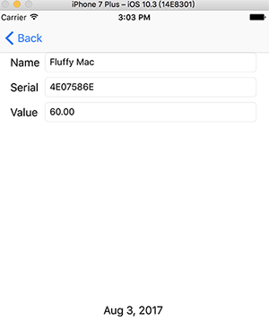
本章要点：
- UINavigationController的用法
<!-- more -->

# 1 UINavigationController
## 1.1 UINavigationController的结构关系
这张图比较清晰地描述了UINavigationController和其子控件之间的逻辑关系：
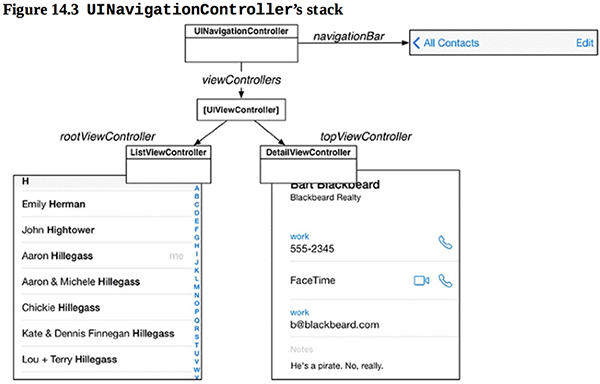
在初始化UINavigationController实例时，需要为之传入一个UIViewController对象，这个VC对象作为UINavigationController的根VC，以及VC栈的最底层VC。之后会有更多VC堆叠到VC栈顶或者从栈顶移出，UINavigationController的topViewController总是指向最顶层VC。
这张图从三层结构上画出了各层对象之间的关系：
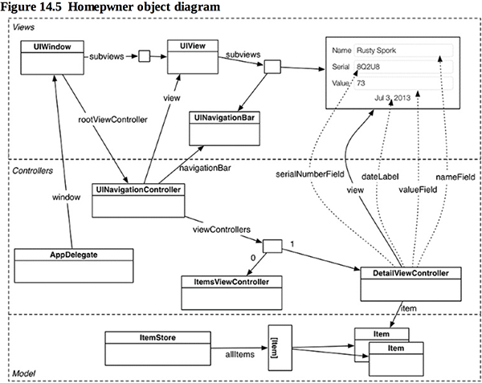
## 1.2 怎么引入UINavigationController
选中要作为UINavigationController的根VC，点击菜单Editor > Embed In > Navigation Controller
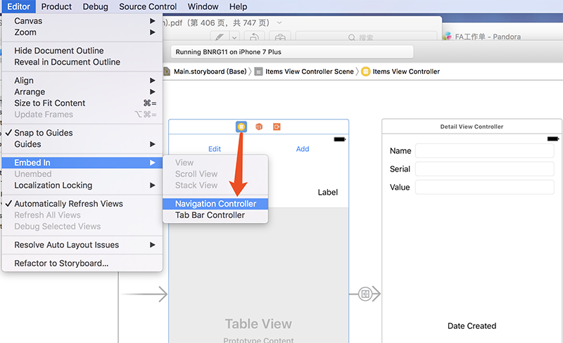
即可引入：
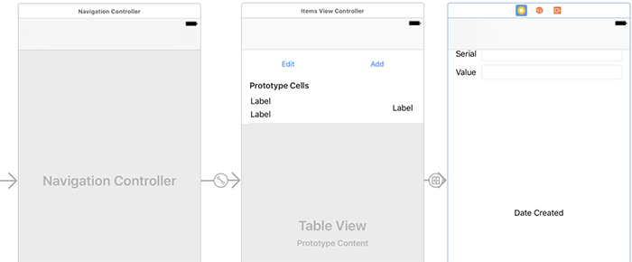
记住这个菜单项里的两个VC，他们的用法之前都学习过了。不过我认为Xcode的这种组织方式不好，统一性太差了。直接从控件库里拖出来，并设置根VC才是更一般性的做法。

完成以上步骤就加入了NavigationController：
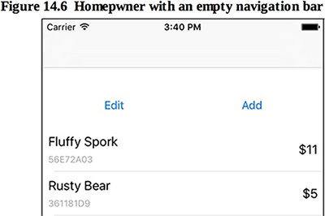
点击记录，由于在上一节添加了Segue，navigationController会自动完成详情页的导入，以及title的回退按钮：

<font color=red>它是怎么知道UINavigationController发生了一次Segue呢？Segue的本质是什么？为什么在Interface Builder搞这么一下就能完成这些工作呢？</font>

## 1.3 当修改了Item details，如何返回给TableViewController
假设`UINavigationController`的VC堆栈中有VC1和VC2，将VC2从堆栈中移除，返回到VC1。则VC2将收到`viewWillDisappear(_:)`消息，VC1将收到`viewWillAppear(_:)`消息。所以本例
1. 在`DetailViewController`的`viewWillDisappear(_:)`中把界面上的值更新到之前传入的Item变量中，
<font color=red>需要注意：在此函数最头部应调用基类的同名函数。这里都做了啥？</font>
``` objc
override func viewWillDisappear(_ animated: Bool) {
    super.viewWillDisappear(animated)
    // "Save" changes to item
    item.name = nameField.text ?? "" 	// 双问号是什么意思？编译通不过
    item.serialNumber = serialNumberField.text
    if let valueText = valueField.text,
        let value = numberFormatter.number(from: valueText) { 
        item.valueInDollars = value.intValue
    } else { 
        item.valueInDollars = 0
    }
}
```
    之前进入`DetailViewController`的时候已经传入了item，此处的修改会被传到外面。

2. 在`ItemsViewController`的`viewWillAppear(_:)`调用`tableView.reloadData()`令列表重新加载数据，即可完成数据的更新:
``` objc
    override func viewWillAppear(_ animated: Bool) {
        super.viewWillDisappear(animated)
        
        tableView.reloadData()  // 通知更新
    }
```
    <font color=red>移除VC2显示VC1，不应该会让VC1重新刷新么？这个重新刷新不应该会触发data source的各接口被调用么？为什么还要手动调用reloadData()呢？</font>

## 1.4 什么是first responder
有些消息如键盘事件或晃动并不会直接作用到视图的区域范围内，有需要一种机制来确定当前该由谁来响应这类事件，这种机制就叫做first responder。

## 1.5 first responder怎么适用于晃动事件呢？
<font color=red>在处理键盘消息时，需要先点击可以输入的视图，它收到焦点后弹出键盘，同时也被设为first responder，这有一个事先指定的过程。晃动不需要先指定，当晃动发生时怎么确定谁是first responder呢？</font>

## 1.6 怎样让text field处理回车事件？
1. 为text field指定UITextFieldDelegate委托代理，这个代理通常为text field所在的VC。具体做法是让此VC遵循UITextFieldDelegate协议。
2. 在委托代理对象中实现textFieldShouldReturn(_:)方法。此方法正是由回车触发。
3. 关联text field到textFieldShouldReture(_:)方法。

注意：这里又有一种关联控件和事件的方式：从控件Ctrl拖动到VC，在弹出的面板中选择delegate。这种方式建立的关联就会让所有UITextFieldDelegate包含的事件都交给VC来处理，不必对每一种事件一一建立关联了。

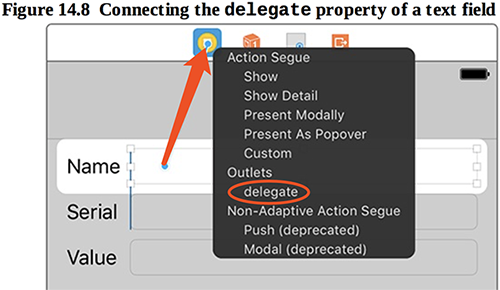
## 1.7 点击背景View收回键盘
这种处理方式在前面章节中介绍过了：为背景View添加Tap Gesture Recognizer，这会在VC的标题栏中创建图标，在VC中添加响应函数。从此图标Ctrl拖到VC的图标，关联响应函数。
此处再引入一种新的添加关联的方式：为背景View添加Tap Gesture Recognizer，从它的图标Ctrl拖拽到VC代码，在弹出面板中选择Connection为Action，输入名字并选择Type为UITapGestureRecognizer，点击Connect，这会在VC中创建并关联消息响应函数：

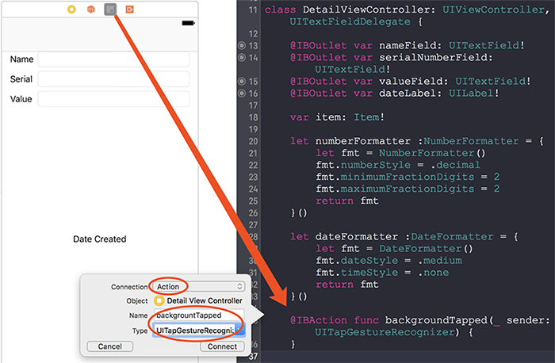
在收回键盘的处理上，之前都是调用first responder的resignFirstResponder()函数，此处有一种更便捷的方式：直接调用view.endEditing(true)，这也解答了[第四章](/2017/07/24/2017/0724iOSProgrammingBNRG04/#3-2-怎么实现收回键盘？)提出的问题——如果有很多textField，是否要逐个释放。

## 1.8 如何为UINavigationController设置标题文字、标题图片，修改回退文字
每一个`UIViewController`都有一个`navigationItem`属性，该属性的类型为`UINavigationItem`。当此VC被显示到`UINavigationController` VC栈顶时，它将该VC的`navigationItem`属性显示为导航栏标题。他们之间的关系如下：`UINavigationBar`使用`topViewController`的`navigationItem`来显示标题栏。
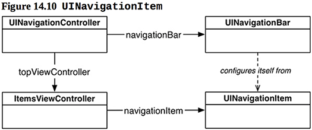
如果标题栏为hard code的字符串，直接在Interface Builder中双击它的导航栏编辑即可，例如`ItemsViewController`就是这样：
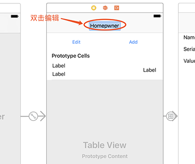
如果标题栏会随显示数据不同而变化，可以在数据被修改后更新`navigationItem.title`：
``` objc
var item: Item!{
    didSet{
        navigationItem.title = item.name
    }
}
```

## 1.9 NavigationBar都可以设置成什么形式？
可以放在`NavigationBar`的左、中、右，`UITextField`不是View，所以它不是`TextField`，`UIBarButtonItems`也不是View，所以它也不是按钮，他们只是包含左、中、右位置的信息，可能是文字或按钮。
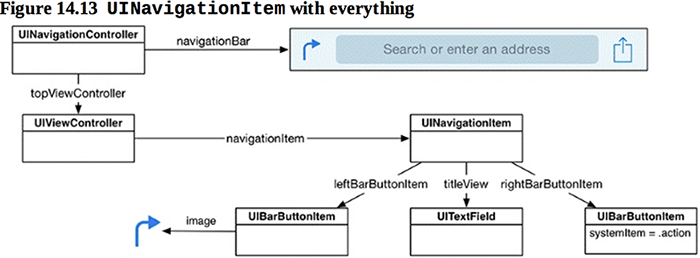
可以自定义`UINavigationItem`的实现，核心是实现它的`titleView`成员，这是一个`UIView`对象，可以用它显示一段文字，也可以是一张图片。

## 1.10 为NavigationBar添加按钮
1. 直接从控件库拖入`NavigationBar`的左、右位置，然后可以设置各种System Item：
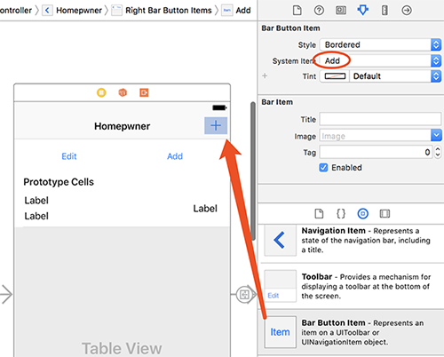
2. 为之关联消息响应函数：
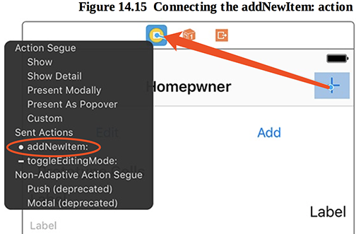
需要注意，消息响应函数的参数是`UIBarButtonItem`，而不是`UIButton`：
``` objc
@IBAction func addNewItem(_ sender: UIBarButtonItem) { 
...
}
```

## 1.11 为NavigationBar添加Edit按钮
准确的说应该是为`TableViewController`添加在导航栏中的Edit按钮。书中说：`TableViewController`暴露了一个`bar Button item`，可以用来自动切换`editing`模式，但是在`Interface Builder`中并没有提供操作它的方式，所以需要编码实现：
``` objc
class ItemsViewController: UITableViewController {
   ...
    required init?(coder aDecoder: NSCoder) {
        super.init(coder: aDecoder)
        // 右值是UIViewController的一个属性
        navigationItem.leftBarButtonItem = editButtonItem
    }
   ...
}
```
果然，你会发现点击此按钮会触发`tableView`的`Editing`模式切换，而且点击原来的`Edit`按钮切换`tableView`的`Editing`模式也会触发`leftBarButtonItem`自动变化：
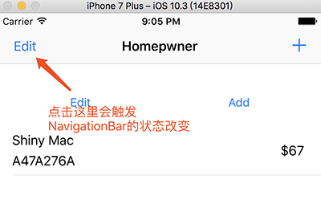
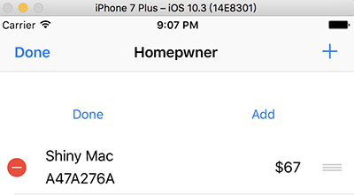
