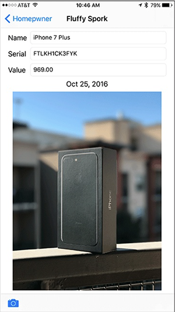
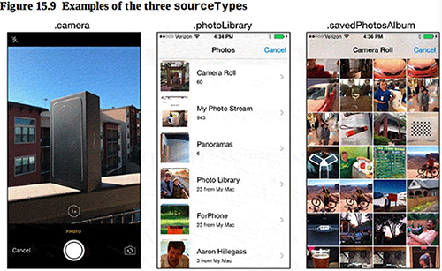
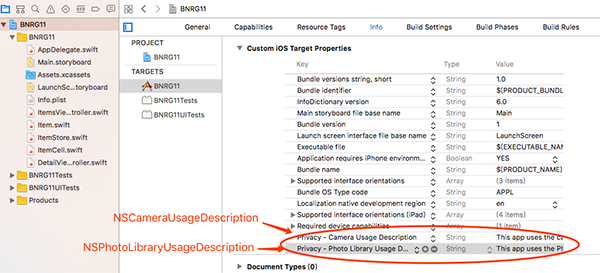

本章在详情界面中添加了选择照片的功能，引入了UIImageView：

本章要点：
- UIImageView
<!-- more -->

# 1 UIImageView
## 1.1 怎么控制UIImageView显示图片的缩放方式
根据`contentMode`属性：

<style>
table th:nth-of-type(1){
    width: 80px;
}
table th:nth-of-type(2){
    width: 300px;
}
</style>

contentMode|含义
---|---
scaleToFill|缩放图片使之充满容器，可能会导致图片变形
AspectFill|保持图片宽高比的前提下缩放图片，使之充满容器
Aspect Fit|保持图片宽高比的前提下缩放图片，使图片在容器内完整显示出来
Aspect|保持图片的宽高比

## 1.2 UIToolBar的特点
本章使用UIToolBar来展现左下角的相机图标，UIToolBar和UINavigationBar非常相似，不同之处在于在它上面可以添加多个按钮项，只要屏幕放得下。

## 1.3 选取照片都有哪几种形式
系统的相机和选取照片的界面是同一个控件`UIImagePickerController`，通过设置该控件的`sourceType`属性可以控制具体使用哪一个:

sourceType|含义
---|---
camera|调起拍照界面，拍摄新照片
photoLibrary|提示用户从相册里选取照片
savedPhotosAlbum|提示用户从最近的拍摄里选取照片



## 1.4 怎样呼出系统相机和照片界面
1. 判断设备是否有拍照功能，设置选取照片的形式
2. 为`UIImagePickerController`变量指定一个委托代理。
当用户选择了照片，会向代理发送`imagePickerController(_:didFinishPickingMediaWithInfo:)`消息。
如果用户选择取消，则会向代理发送`imagePickerControllerDidCancel(_:)`消息。
显然这个代理还是应当由UIImagePickerController所在的VC，在本章中即DetailViewController。
但是在书中此处让`DetailViewController`遵守了代理协议：`UINavigationControllerDelegate` 和`UIImagePickerControllerDelegate`。<font color=red>书中的解释是：`UIImagePickerController`的代理属性实际上是从它的基类`UINavigationController`继承的，`UIImagePickerController`有它自己的代理协议，它继承来的代理属性指向一个遵守`UINavigationControllerDelegate`的对象。这句话没看懂（P441）</font>
3. 调用`present`函数，显示选取图片的界面。
4. 在项目属性中声明Custom iOS Target Properties。如果没有这一步，运行程序会崩溃，因为访问相机或者相册时，iOS会弹出提示问用户是否同意应用程序获取访问权限。需要在项目配置中填写申请访问相机/相册的提示语。

代码如下：
``` objc
// ② 让VC遵循委托代理协议
class DetailViewController: UIViewController, UITextFieldDelegate, UIImagePickerControllerDelegate, UINavigationControllerDelegate {
    ……
    @IBAction func takePicture(_ sender: UIBarButtonItem) {
        let imagePicker = UIImagePickerController()
        // ① 判断设备是否有拍摄功能，并设置选取照片的形式
        if UIImagePickerController.isSourceTypeAvailable(.camera){	
            imagePicker.sourceType = .camera
        }else{
            imagePicker.sourceType = .photoLibrary
        }
        
        imagePicker.delegate = self // ②设置委托代理
        // ③ 显示选取照片界面
        present(imagePicker, animated: true, completion: nil)   
    }
    ……
}
```
④ 设置项目的权限申请提示语

<font color=red>问题：当调用了present之后，控制权在哪里？根据如何获得照片的方法，我判断present立即返回了，返回给谁了呢？</font>

## 1.5 如何获得/保存照片
常规的想法是在present调用之后获取imagePicker的图片属性，得到照片。实际不是这么完成的，而是在代理协议`UIImagePickerControllerDelegate`的`imagePickerController(_:didFinishPickingMediaWithInfo:)`函数中获取照片：
``` objc
    func imagePickerController(_ picker: UIImagePickerController, didFinishPickingMediaWithInfo info: [String : Any]) {
        // 获取被选中的照片
        let image = info[UIImagePickerControllerOriginalImage] as! UIImage	
        imageView.image = image
        
        dismiss(animated: true, completion: nil)
    }
```

> 书中P448
``` objc
func setImage(_ image: UIImage, forKey key: String) { 
    cache.setObject(image, forKey: key as NSString)	// 为什么转换呢？
}
```
> key在setImage函数传入的时候是String，再传入caceh.setObjet的时候，它接受的是NSString参数，因此需要做个转换。NSString是class，String是Struct。

# 2 引入imageStore
## 2.1 为什么要引入imageStore
用户选择的照片通常是较大的文件，如果都存入item结构体内会消耗巨大的内存。比较好的做法是把数据保存到文件，在内存中只缓存一小部分，需要的时候加载到缓存，不需要或者收到低内存警告的时候释放内存。这就是imageStore做的事情，它给每一个图片生成一个UUID，在item的数据结构中仅保存此UUID，它对应的图片将被永久保存到文件。

## 2.2 引入imageStore的步骤
一、创建ImageStore，用于根据key到图片的增、删、改、查，代码如下：
``` objc
import UIKit

class ImageStore {
    let cache = NSCache<NSString, UIImage>()
    
    func setImage(_ image: UIImage, forKey key: String){
        cache.setObject(image, forKey: key as NSString)
    }
    
    func image(forKey key: String) -> UIImage?{
        return cache.object(forKey: key as NSString)
    }
    
    func deleteImage(forKey key: String){
        cache.removeObject(forKey: key as NSString)
    }
}
```

二、在AppDelegate中创建ImageStore实例，并将该实例传入ItemViewController和DetailViewController
``` objc
class AppDelegate: UIResponder, UIApplicationDelegate {
   ……
    func application(_ application: UIApplication, didFinishLaunchingWithOptions launchOptions: [UIApplicationLaunchOptionsKey: Any]?) -> Bool {
        let itemStore = ItemStore()
        let imageStore = ImageStore()	// 创建ImageStore实例
        
        let navigationController = window!.rootViewController as! UINavigationController
        let itemsController = navigationController.topViewController as! ItemsViewController
        itemsController.itemStore = itemStore
        itemsController.imageStore = imageStore // 传入ItemViewController
        return true
    }
    ……
}


class ItemsViewController: UITableViewController {
    var itemStore: ItemStore!
    var imageStore: ImageStore!	// 用来接收传入的ImageStore
    ……
    // 点击某个Item引发转场
    override func prepare(for segue: UIStoryboardSegue, sender: Any?) {
       
        switch segue.identifier {
        case "showItem"?:
            if let row = tableView.indexPathForSelectedRow?.row{
                let item = itemStore.allItems[row]
                let detailViewController = segue.destination as! DetailViewController
                detailViewController.item = item
                // 当点击数据项时，传入imageStore
                detailViewController.imageStore = imageStore	 
            }
        default:
            preconditionFailure("Unexpected segue identifier.")
        }
    }
    ……
}
```
三、在创建一个新Item时，生成UUID：
``` objc
class Item: NSObject {
    ……
    let itemKey: String	// 保存UUID
    
    init(name: String, serialNumber: String?, valueInDollars: Int){
        ……
        self.itemKey = UUID().uuidString
    
        super.init()
    }
    ……
}
```
四、在DetailViewController中，加载时根据key显示照片，选择了一张照片后更新key对应的数据
``` objc
class DetailViewController: UIViewController, UITextFieldDelegate, UIImagePickerControllerDelegate, UINavigationControllerDelegate {
……
    
    override func viewDidLoad() {
        super.viewDidLoad()

        ……
        // 加载时显示key对应的图片
        let key = item.itemKey
        let imageToDisplay = imageStore.image(forKey: key)
        imageView.image = imageToDisplay
    }

    ……
    func imagePickerController(_ picker: UIImagePickerController, didFinishPickingMediaWithInfo info: [String : Any]) {
        let image = info[UIImagePickerControllerOriginalImage] as! UIImage
        // 修改了图片，更新imageStore
        imageStore.setImage(image, forKey: item.itemKey)    
        imageView.image = image
        
        dismiss(animated: true, completion: nil)
    }
……
}
```
五、删除一条记录时，记得删除它对应的数据
``` objc
class ItemsViewController: UITableViewController {
……

    // Override to support editing the table view.
    override func tableView(_ tableView: UITableView, commit editingStyle: UITableViewCellEditingStyle, forRowAt indexPath: IndexPath) {
        if editingStyle == .delete {
            // Delete the row from the data source
            let item = itemStore.allItems[indexPath.row]
            
            let title = "Delete \(item.name)?"
            let message = "Are you sure you want to delete this item?"
            let ac = UIAlertController(title: title, message:message, preferredStyle:.actionSheet)
            
            let cancelAction = UIAlertAction(title: "Cancel", style: .cancel, handler: nil)
            ac.addAction(cancelAction)
            
            let deleteAction = UIAlertAction(title: "Delete", style: .destructive, handler: {(action) -> Void in
                self.itemStore.removeItem(item)
                self.imageStore.deleteImage(forKey: item.itemKey)		// 删除图片数据
                self.tableView.deleteRows(at: [indexPath], with: .automatic)
            })
            ac.addAction(deleteAction)
            
            present(ac, animated: true, completion: nil)
        } else if editingStyle == .insert {
            // Create a new instance of the appropriate class, insert it into the array, and add a new row to the table view
        }    
    }
……
}
```