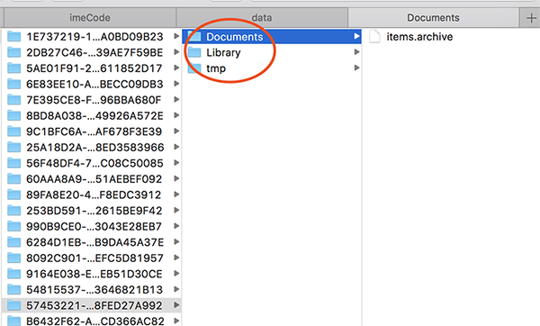
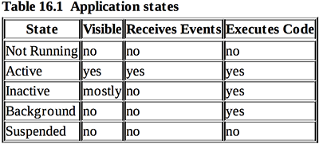
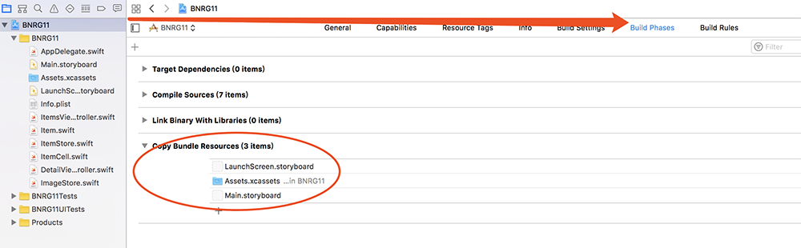

本章要点：
- Archiving
- 应用程序沙盒
- 应用程序的AppDelegate的几个函数
- 错误处理Error Handling
- Application Bundle
<!-- more -->
# 文件IO

## 1 iOS都有哪些常用的文件IO方式？
Archiving
Data
Property list serializable types

## 2 各种IO方式的优缺点

## 3 介绍Archiving
完成对象和序列化数据的编码/解码过程。要求遵循NSCoding协议，实现encode(with:)和init(coder:)接口，在encode(with:)中完成所有字段的encode，在init接口中完成所有字段的decode，这样的类就具备Archiving能力。
原生的数据类型的encode和init是怎么实现的？谁来决定数据被保存到哪里？

## 4 实现Item的Archiving
``` objc
class Item: NSObject, NSCoding {		// 遵守NSCoding协议
……
    func encode(with aCoder: NSCoder){
        aCoder.encode(name, forKey: "name")	// 完成每个字段的序列化编码
        ……
    }
    
    required init(coder aDecoder: NSCoder){
        name = aDecoder.decodeObject(forKey: "name") as! String	// 完成每个字段的序列化解码
        ……
        super.init()
    }
}
```
为什么函数内部不是简单的同名函数转发呢？我分析主要是因为它为每个对象安排了一个key，这是与MFC的序列化不同之处。它以更文本化的方式组织数据，比MFC的纯二进制方式更可靠，解除了平行关系数据之间的耦合性。
在aCoder.encode(_: forKey:)内会创建key，再对key对应的数据调用encode(with:)
在aDecoder.decodeObject(forKey:)内则是先找到key的数据块，再对其后的数据调用init(coder:)

## 5 触发Archiving的源头
应用程序应该在即将退出的时候逐个调用allItems每个元素的encode函数完成序列化，怎么构造NSCoder的实例呢？
书中是这么解决的：
``` objc
class ItemStore {
    ……
    func saveChanges() ->Bool{
        ……
        return NSKeyedArchiver.archiveRootObject(allItems, toFile: itemArchiveURL.path)
    }
    init(){
        if let archivedItems = NSKeyedUnarchiver.unarchiveObject(withFile: itemArchiveURL.path) as?[Item]{
            allItems = archivedItems
        }
    }
……
}
```
其中archiveRootObject(_:toFile:)完成如下几部：
· 创建NSKeyedArchiver实例，它是抽象类NSCoder的具体子类
· 对allItems每个元素调用它们的encode(with:)方法，并传入NSKeyedArchiver实例。这会进一步调用Item每个属性的encode(with:)方法
· 最终NSKeyedArchiver会把每个数据写入到指定路径的文件
书中给出这个过程的流程图：

不过这还不是触发Archiving的最源头，前面提到过，最源头应该在应用程序退出的时候。当用户按下Home键，会让应用程序退到后台，同时向应用程序的AppDelegate发送applicationDidEnterBackground(_:)消息。应用程序应该在这里保存数据，这里正是触发Archiving的最源头。
``` objc
func applicationDidEnterBackground(_ application: UIApplication) {
    let itemStore = ItemStore()
    ……
    itemStore.saveChanges()  // 触发Archiving
    ……
}
```
以上是数据的保存。当应用程序首次启动，会创建itemStore实例，他在其init()函数中完成数据的加载，与archiveRootObject(_:toFile:)的过程相反，它创建NSKeyedUnarchiver实例，并加载传入的指定文件。然后NSKeyedUnarchiver会检查数据文件中根对象的类型，创建它的实例。然后逐层调用该实例及其属性的init(coder:)函数，完成数据的加载。

## 6 沙盒的绝对目录在哪里？
我在模拟器里运行，在macOS看到的绝对目录是：
/Users/palance/Library/Developer/CoreSimulator/Devices/D4DF6101-9001-438B-A8EE-1D952E45618D/data/Containers/Data/Application/57453221-D3C8-48FA-ACC2-358FED27A992/Documents/items.archive
表粗的部分就是沙盒目录，在它下面可以看到Library、tmp等沙盒目录，由此可见iOS是对每一个应用创建了自己的目录体系

<font color=red>问题：在iOS真机上，绝对目录是什么样的呢？Documents/前的那串UUID是怎么生成的？应用程序重装了会变化吗？</font>

## 7 如何保存如图片这样的大块数据
准确地说是本章是怎么做的，它确实没有使用Archiving的方法。<font color=red>（为什么不使用Archiving，是为了介绍新方法还是不适用？）</font>
本章在ImageStore中，以图片的key为文件名，将图片保存到Documents/下。
从逻辑路径上来说，在创建图片缓存时保存图片文件；在删除图片缓存时删除图片文件；在获取图片缓存时，如果缓存获取不到要再去看看文件是否存在。代码如下：
``` objc
class ImageStore {
    let cache = NSCache<NSString, UIImage>()
    
    func setImage(_ image: UIImage, forKey key: String){	// 缓存图片时保存图片文件
        cache.setObject(image, forKey: key as NSString)
        
        let url = imageURL(forKey: key)
        
        if let data = UIImageJPEGRepresentation(image, 0.5){	// 第二个参数表示压缩比
            let _ = try?data.write(to: url, options: [.atomic])		// 第二个参数是保存方式，atomic是先把文件暂存到临时目录，成功后在通过rename覆盖
        }
    }

    func image(forKey key: String) -> UIImage?{		// 获取图片缓存时，如果缓存区不到，再去看看文件是否存在
        if let existingImage = cache.object(forKey: key as NSString){
            return existingImage
        }
        let url = imageURL(forKey: key)
        guard let imageFromDisk = UIImage(contentsOfFile: url.path) else{
            return nil
        }
        cache.setObject(imageFromDisk, forKey: key as NSString)
        return imageFromDisk
    }
    
    func deleteImage(forKey key: String){			// 删除缓存时，同时删除文件
        cache.removeObject(forKey: key as NSString)
        
        let url = imageURL(forKey: key)
        FileManager.default.removeItem(at: url)
    }
    
    func imageURL(forKey key: String) ->URL{	// 根据key获取文件url
        let documentsDirectories = FileManager.default.urls(for: .documentDirectory, in: .userDomainMask)
        let documentDirectory = documentsDirectories.first!
        
        return documentDirectory.appendingPathComponent(key)
    }
}
```
关键字guard的用法，P489说：guard是一个条件判断语句，等效于if。如果guard内的条件为真，编译器会只继续guard内的语句。上面的guard语句等效于：
``` objc
if let imageFromDisk = UIImage(contentsOfFile: url.path) { cache.setObject(imageFromDisk, forKey: key)
return imageFromDisk
}
return nil
```
<font color=red>书中还说：guard语句更清晰，更重要的是它以更安全的方式确保退出。但怎么清晰，为什么安全，我没有理解。</font>

# 应用程序沙盒
## 1 应用程序沙盒都有哪些，什么作用
Documents/
用于保存应用程序运行时产生或需要的数据。当设备与iTunes或iCloud同步时，这部分数据会被备份。

Library/Caches/
用于缓存应用程序运行时产生或需要的临时数据。当设备与iTunes或iCloud同步时，这部分数据不会被备份。例如，浏览器缓存的网页数据就可以缓存到这里。

Library/Preferences/
用于保存数据的偏好设置，系统的设置程序也会到这里查找应用程序的偏好设置。需要通过NSUserDefaults类来访问这个目录下的数据，该目录参与iTunes或iCloude的同步。

tmp/
用于暂存数据。当应用程序不再运行时，操作系统会清除与之相关的文件。建议应用程序在不需要时就清除掉数据。该目录不参与iTunes或iCloud的同步。

## 2 如何获取沙盒目录
通过FileManager来构造文件URL，如下代码返回Documents/下的items.archive
……
let documentsDirectories = FileManager.default.urls(for: .documentDirectory, in: .userDomainMask)
let documentDirectory = documentsDirectories.first!
return documentDirectory.appendingPathComponent("items.archive")
<font color=red>它返回的绝对路径是什么？</font>
函数urls(for:in:)的第一个参数是一个枚举值，表示沙盒路径，第二个参数在iOS下始终未.userDomainMask，这个函数是与macOS公用的，该参数是为了兼容macOS版本。

# 应用程序的AppDelegate的几个函数
## 1 Xcode生成的几个函数的注释说明
Xcode为AppDelegate默认生成了几个函数，并且给出了比较详细的注释，应该好好阅读以下
``` objc
@UIApplicationMain	// 这个是什么意思？
class AppDelegate: UIResponder, UIApplicationDelegate {
……

    func application(_ application: UIApplication, didFinishLaunchingWithOptions launchOptions: [UIApplicationLaunchOptionsKey: Any]?) -> Bool {
        // 这里是应用程序启动后，用户自定义逻辑的起点
      ……
        return true
    }

    func applicationWillResignActive(_ application: UIApplication) {
// 当应用程序即将从活动状态变为不活动状态时，会收到此消息。发生这种情况通常是因为某些类型的临时中断（比如来电或者SMS消息）或用户退出应用程序后，程序转向后台时。
// 在该函数中可以暂停正在进行的任务，关闭定时器，让图形渲染回调失效。游戏应用应该在这里暂停游戏。
    }

    func applicationDidEnterBackground(_ application: UIApplication) {
// 在该方法中释放共享资源，保存用户数据，关闭定时器，保存所有数据以确保如果应用程序被终止后，通过读取这些数据就能还原当前的现场。
// 如果你的应用程序支持后台运行，当用户退出应用时，会调用本方法，而不是applicationWillTerminate: 
        ……
    }
<font color=red>这个函数的注视没有看太明白，“如果应用程序支持后台运行，当用户退出应用时，会调用本方法”，这个用户退出是指按下Home键，还是双击Home键在列表中删除呢？</font>

    func applicationWillEnterForeground(_ application: UIApplication) {
// 当应用从后台转入前台时，会调用该方法，在这里可以撤销进入后台时做的许多更改
    }

    func applicationDidBecomeActive(_ application: UIApplication) {
// 可以在这里重新启动应用处于inactive时暂停（或尚未启动）的所有任务。如果之前应用程序处于后台，可以选择性地刷新用户界面
    }

    func applicationWillTerminate(_ application: UIApplication) {
// 当应用程序即将终止时会被调用。如果需要的话应保存数据。参见applicationDidEnterBackground:
    }
}
```
## 2 应用程序状态和迁移图
前面的注释可以结合这张图来看

这张图有一个逻辑漏洞：Background如果没超过10秒钟，再点击应用程序图表是进入哪个逻辑分支呢？
active态的应用程序可能会被临时打断，比如来电、SMS消息等，这个时候应用将进入inactive态，此时应用程序的界面会被覆盖，但有可能还是可见的，此时应用程序仍可执行代码，但不再接受事件了。按下顶端的Lock按钮也会让应用处于inactive态，如果再unlock，应用仍然保持inative态。

在Suspended态的应用，当系统内存吃紧的时候，就会不经通知，直接清除掉。应用被清除掉后，仍然会留在双击Home键看到的任务列表中，点击后，应用需要重新启动。


# 错误处理Error Handling
## 1 怎么抛出错误
在定义函数时，缀上关键字throws，表示该函数可能会抛出错误：
``` objc
func removeItem(at URL: URL) throws
```
## 2 怎么调用抛出错误的函数
``` objc
func deleteImage(forKey key: String) { 
    cache.removeObject(forKey: key as NSString)
    let url = imageURL(forKey: key) 
    do {
        try FileManager.default.removeItem(at: url) 
    } catch {
        print("Error removing the image from disk: \(error)") 
    }
}
```
如果try内的函数抛出了错误，do块立即退出，同时向catch块传入一个error变量。以上使用了隐式常量error打印错误信息。还可以显式定义错误变量：
``` objc
func deleteImage(forKey key: String){
    cache.removeObject(forKey: key as NSString)
    
    let url = imageURL(forKey: key)
    do{
        try FileManager.default.removeItem(at: url)
    }catch let deleteError{
        print("Error removing the image from disk: \(deleteError)")
    }
}
```
## 3 怎么处理错误

注意（P500）：在许多语言中，任何预期外的结果都会抛异常。在Swift中，异常几乎只是用来提醒程序员这里出错了。NSException用来表示异常信息，调用栈信息也包含在NSException中。

什么时候抛出异常，什么时候抛出错误呢？比如写一个只能接收偶数作为参数的函数，如果传入了奇数，你希望帮主程序员发现这个错误，这个时候就应该抛出异常。如果你写的函数需要读取指定的目录，但是用户没有该权限，这个时候就应该抛出错误，提示用户你无法完成这项任务。

# Application Bundle
## 1 什么是Application Bundle
Application Bundle就是应用程序运行时所需要的可执行文件和所有资源文件打包而成的集合

## 2 怎么指定被打入Application Bundle的文件
可以在这里查看和添加：

## 3 怎么在运行时获取Application Bundle路径？
``` objc
// 获取 application bundle
let applicationBundle = Bundle.main
// 获取Application Bundle下的myImage.png文件的URL
url = applicationBundle.url(forResource: "myImage", ofType: "png") 
```
切记：Application bundle是只读的，在运行时，既不能修改也不能动态添加。