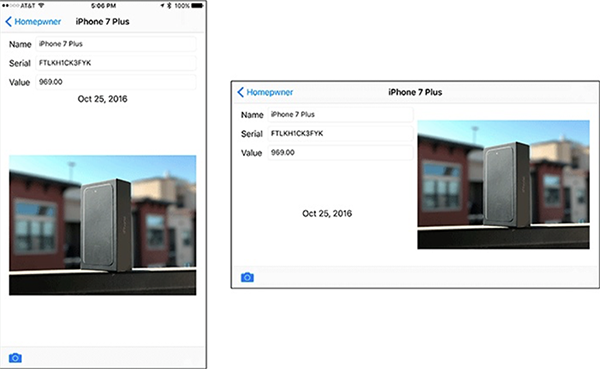
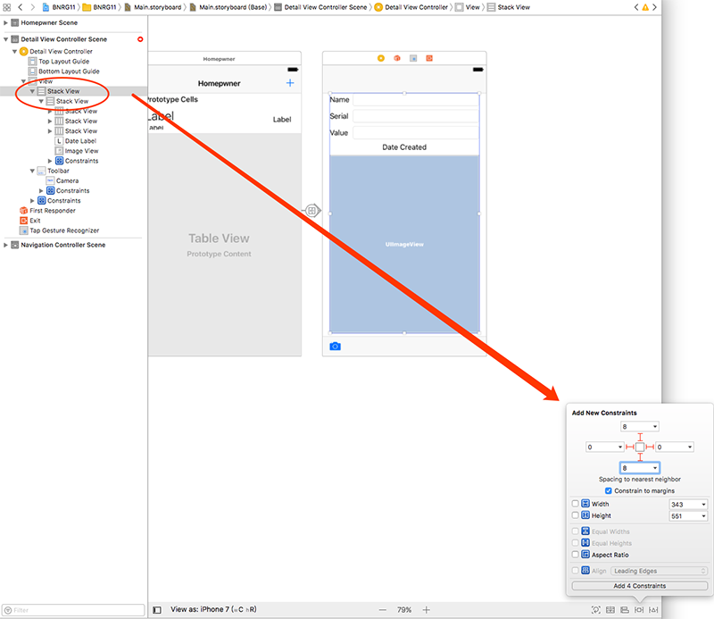
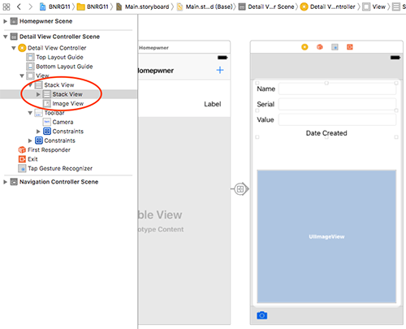
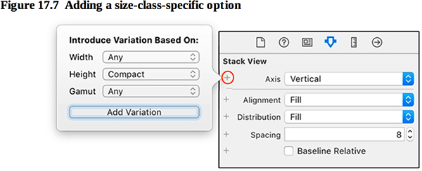
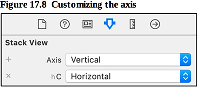
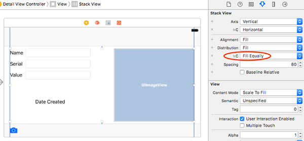

本章将详情界面在横屏时调整了布局：

本章要点：
- 横竖屏支持
<!-- more -->

# 1 横竖屏
## 1.1 如何在横竖屏下，调整界面布局
一、在布局上在原来的Vertical Stack之外再套一层Horizontal Stack，并为之设置约束：

二、如下调整ImageView在最上层StackView的位置，确保其布局和原来没有变化：

三、在InterfaceBuilder中切换成横屏设置

为最外层Stack View添加轴属性：

并设置为水平：

问题：此处添加轴属性的含义是当竖屏时为Vertical，当横屏时为Horizontal，可是这种对应关系是怎么对应起来的呢？创建轴变量的三个参数Width、Height和Gamut分别表什么含义呢？
再添加一条Distribution变量：Width= Any，Height=Compact，Gamut=Any。该变量的属性为Fill Equally：

运行后最终效果如下：
