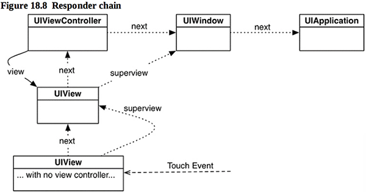

本章进入一个新的例程开发，主界面上通过触屏、拖动拉出一条直线。已经拉出的直线会留在屏幕上，还可以增加新的直线。
本章要点：
- 触摸消息
- struct
- 绘制
- @IBInspectable
- 消息响应链
<!-- more -->

# 1 触摸消息
## 1.1 触摸消息处理的基本流程
UIView从UIResponder派生了4个与触摸相关的消息：
- 手指触摸到屏幕时收到消息
`func touchesBegan(_ touches: Set<UITouch>, with event: UIEvent?)`
此时系统会创建一个UITouch实例，并传入该消息。

- 手指在屏幕上移动时，会持续不断收到消息
`func touchesMoved(_ touches: Set<UITouch>, with event: UIEvent?)`
touches中包含从手指触摸到屏幕到当前手指的位置信息，这是一个集合。
一旦一个视图收到触摸消息，之后只要手指不离开屏幕，即使移动到视图边界以外，该视图始终都是该触摸消息的接受者。

- 手指从屏幕离开时收到消息
`func touchesEnded(_ touches: Set<UITouch>, with event: UIEvent?)`
这个消息执行完毕后，UITouch对象们将被销毁。
因此，从手指触摸到屏幕开始，直到离开屏幕之前，中间产生的所有UITouch信息会一直保存，直到完成此消息后，才被销毁。注意：要从消息参数中获取UITouch对象，而不要自己保存它们。因为它们的生命周期是系统掌控的。

- 当收到电话时，触摸会被系统消息终止：
`func touchesCancelled(_ touches: Set<UITouch>, with event: UIEvent?)`

## 1.2 响应多指触摸和单指有什么不同之处
在默认情况下，视图只能接收单指触摸——单指触屏触发`touchesBegan(_:with:)`但是还没有抬起时，如果再有手指触屏，会被系统忽略，即视图不会收到UIResponder消息。

如果要让视图能处理多指触摸消息，必须将其`multipleTouchesEnabled`属性置为true：

这样，只要有手指按下就会收到`touchesBegan(_:with:)`消息，抬起就能收到`touchesEnded(_:with:)`消息。
<font color=red>问题：A按下 - A移动 - B按下 - B移动，这个时候有两个正在绘制中的线条，那接下来收到的移动怎么知道应该给A还是B处理呢？</font>

## 1.3 每次UIResponder消息被调用时，touches参数表示什么？
仅处理单指触摸消息的时候很好理解：
``` objc
touchesBegan(_ touches: Set<UITouch>, with event: UIEvent?)	// 表示按下点的信息
override func touchesMoved(_ touches: Set<UITouch>, with event: UIEvent?)	// 表示当前移动点的信息
override func touchesEnded(_ touches: Set<UITouch>, with event: UIEvent?)	// 表示抬起点的信息
```
可以做个试验，在每个消息内插入如下代码，打印touches的所有元素：
``` objc
var msg = #function
for touch in touches{
    let location = touch.location(in: self)
    msg += "(\(Int(location.x)), \(Int(location.y))), "
}
print(msg)
```
划出一条直线，得到输出如下：
```
touchesBegan(_:with:)(184, 192), 
touchesMoved(_:with:)(183, 197), 
touchesMoved(_:with:)(182, 202), 
touchesMoved(_:with:)(179, 206), 
……
touchesEnded(_:with:)(176, 216), 
```
结论是：在touchesMoved时收到的是当前移动到的点。

多点触摸时，把打印函数稍微改一下，每次不仅打印函数名坐标，还把和touches的每个元素一一对应的NSValue打印出来
``` objc
var msg = #function
for touch in touches{
    let location = touch.location(in: self)
    let key = NSValue(nonretainedObject: touch)
    msg += "(\(key):\(Int(location.x)), \(Int(location.y))), "
}
print(msg)
```
划出两条直线，结果如下：
```
touchesBegan(_:with:)(<a0dee0d6 b27f0000>:222, 246), (<105ee0d6 b27f0000>:191, 489), 
touchesMoved(_:with:)(<a0dee0d6 b27f0000>:221, 250), (<105ee0d6 b27f0000>:192, 485), 
touchesMoved(_:with:)(<a0dee0d6 b27f0000>:220, 255), (<105ee0d6 b27f0000>:194, 480), 
……
touchesEnded(_:with:)(<a0dee0d6 b27f0000>:219, 262), (<105ee0d6 b27f0000>:195, 473), 
```
我是使用模拟器演示的触屏，在实际设备上两个指头同时触屏的可能性很小，如果是先后触屏，就会收到两次`touchesBegan(_:with:)`消息；接下来手指移动时，在`touchesMoved(_:with:)`消息中会收到两个touch元素，分别代表两个指尖，即使一个指尖移动，另一个没动，也会收到两个；最后如果先后离开屏幕，则会收到两次`touchesEnded(_:with:)`消息。

## 1.4 不要在UIResponder消息内强引用UITouch实例
在书中P534，通过如下定义来记录当前还没画完的直线：
``` objc
var currentLines = [NSValue:Line]()
```
这是一个字典，key是`NSValue`，value是`Line`实例。这个key是通过如下代码生成的值：
``` objc
let key = NSValue(nonretainedObject: touch)
```
它的参数是一个`UITouch`对象，`NSValue`根据该对象生成与其地址一一对应的key。
为什么不在`currentLines`字典中直接把`UITouch`对象作为其key呢？因为`UITouch`的文档强调：不要强引用一个`UITouch`对象！使用`NSValue`的作用就是既能确保key与对象地址一一对应，又能不强引用该对象。
<font color=red>为什么不能强引用UITouch对象呢？</font>

## 1.5 完整的绘制步骤
支持多点触摸，当手指触屏时绘制直线起点，移动时绘制直线终点，离开屏幕时固话直线。这套逻辑的完整步骤如下：
``` objc
class DrawView: UIView {
    var currentLines = [NSValue:Line]() // 当前正在绘制的直线
    var finishedLines = [Line]()        // 已经固化的直线
    
    func stroke(_ line: Line){
        let path = UIBezierPath()
        path.lineWidth = 10
        path.lineCapStyle = .round
        
        path.move(to: line.begin)
        path.addLine(to: line.end)
        path.stroke()
    }
    
    override func draw(_ rect: CGRect){
        UIColor.black.setStroke()	// 已经固化的直线用黑色
        for line in finishedLines{
            stroke(line)
        }
        
        UIColor.red.setStroke()		// 正在绘制的直线用红色
        for(_, line) in currentLines{
            stroke(line)
        }
    }
    
    override func touchesBegan(_ touches: Set<UITouch>, with event: UIEvent?) {
        for touch in touches{		// 根据touches创建起点
            let location = touch.location(in: self)
            let newLine = Line(begin: location, end: location)
            let key = NSValue(nonretainedObject: touch)
            currentLines[key] = newLine
        }
        setNeedsDisplay()
    }
    
    override func touchesMoved(_ touches: Set<UITouch>, with event: UIEvent?) {
        for touch in touches{		// 修改正在绘制的直线们的终点
            let key = NSValue(nonretainedObject: touch)
            currentLines[key]?.end = touch.location(in: self)
        }
        
        setNeedsDisplay()
    }
    
    override func touchesEnded(_ touches: Set<UITouch>, with event: UIEvent?) {
        for touch in touches{		// 把完结的直线添加到固化直线集合
            let key = NSValue(nonretainedObject: touch)
            if var line = currentLines[key]{
                line.end = touch.location(in: self)
                
                finishedLines.append(line)
                currentLines.removeValue(forKey: key)
            }
        }

        setNeedsDisplay()
    }
    
    override func touchesCancelled(_ touches: Set<UITouch>, with event: UIEvent?) {
        currentLines.removeAll()	// 删除所有正在绘制的直线

        setNeedsDisplay()
    }
}
```
# 2 Struct
## 2.1 Struct区别于Class的特征
- Struct不支持继承
- 如果没有特别指定`initializer`，编译器会为之生成`member-wise initializer`。`member-wise initializer` 的参数列表会为每个成员属性指定一个参数。<font color=red>参数列表的顺序是什么？</font>
- 如果所有参数有默认值，并且没有指定特殊的`initializer`，struct会有一个空的`initializer`即`init()`，它在创建实例时，将每个成员属性设置为默认值
- struct（和enums）是值类型（value types），class是引用类型（reference types）。

## 2.2 值类型和引用类型的区别
**值类型的数据**：当赋值或传参的时候会拷贝其值，数组、字典、enum和struct都是值类型。
**引用类型的数据**：当赋值或传参的时候不会发生值的拷贝，而是传递实例的引用。class和closure都是引用类型

# 3 绘制
## 3.1 View的绘制是在什么时候被调用的？
绘制行为是覆盖`draw(_:)`来实现的，<font color=red>draw(_:)是被谁调用，在什么时机调用的呢？</font>
在P748中提到：通过调用`setNeedsDisplay()`，使得视图在消息循环的末端得到重新绘制。<font color=red>有没有不在消息循环中即时绘制局部的方法呢？</font>

## 3.2 绘制线条的基本步骤
``` objc
UIColor.red.setStroke()		// 选择颜色
let path = UIBezierPath()	// 创建路径实例
path.lineWidth = 10		// 设置线宽等属性
path.lineCapStyle = .round
        
path.move(to: line.begin)	// 起点、终点
path.addLine(to: line.end)
path.stroke()                   // 绘制
```

# 4 @IBInspectable
## 4.1 @IBInspectable是什么？
通过给视图定义@IBInspectable变量，可以在Interface Builder中为该变量生成对应的配置界面。如：
``` objc
class DrawView: UIView {
    ……
    @IBInspectable var finishedLineColor: UIColor = UIColor.black	// 固化直线的颜色
    @IBInspectable var currentLineColor: UIColor = UIColor.red	// 正在绘制的直线颜色
    @IBInspectable var lineThickness: CGFloat = 10				// 直线的粗细
……
}
```
在这些属性前加了@IBInspectable关键字后，在Interface Builder中设置某个视图为DrawView，就会看到该视图的这些属性：


# 5 消息响应链
## 5.1 响应链的基本概念
除了`UIView`作为`UIResponder`可以响应触摸事件以外，`UIResponder`的子类还有`UIViewController`、`UIApplication`和`UIWindow`。尽管`UIViewController`并不是屏幕上可见的视图，不能直接接收到触屏消息，但是它作为消息响应链上的必经环节，是可以接收到并处理触屏消息的。
每一个`UIResponder`都有一个next属性，指向下一个`UIResponder`对象，通过next指针它们构成了消息响应链。一个触屏事件从某个View发起，通常View的next指向其`UIViewController`，或者上一层View。如果它不处理该消息，就把消息转发给next。一个app里最顶层视图就是`UIWindow`了，而`UIWindow`的next则指向`UIApplication`。下图描述了app里通常的响应链：
