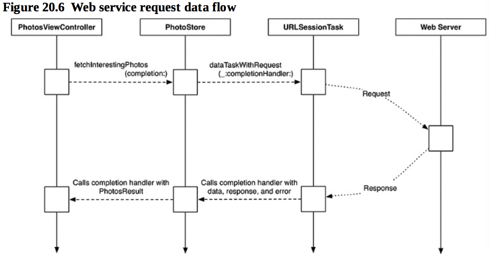

本章要点：
- 访问控制
- iOS上的HTTP编程
- json数据的解析
<!-- more -->
# 访问控制
## 1 访问控制的几种类型和含义
· open
· public
· internal
· fileprivate
· private
<font color=red>他们的含义是什么？</font>

# iOS端的HTTP编程
## 1 如何组装请求和接收应答
一、通过URLComponents和URLQueryItem共同完成URL的组装
``` objc
private static func filckURL(method: Method, parameters: [String:String]?) -> URL{
    // 构造url路径
    var components = URLComponents(string: "https://api.flickr.com/services/rest")!
    var queryItems = [URLQueryItem]() // 每个URLQueryItem是一个kv对
    // 组装参数
    let baseParam = [
    "method": method.rawValue,
    "format": "json",
    "nojsoncallback": "1",
    "api_key": apiKey
    ]
    for (key, value) in baseParam{
        let item = URLQueryItem(name: key, value: value)
        queryItems.append(item)
    }
    ……
    components.queryItems = queryItems	// 设置参数
    return components.url!
}
```
二、使用URLSessionTask发送请求并接收应答
``` objc
// 创建URLSession实例，后面要用它生成URLSessionTask
private let session : URLSession = {	
    let config = URLSessionConfiguration.default
    return URLSession(configuration: config)
}()

func fetchInterestingPhotoes(){
    let url = FlickrAPI.interestingPhotoesURL		// 这是一个URL变量，可以通过第一步创建
    let request = URLRequest(url: url)				// 使用URL构造URLRequest
    // 使用request和completionHandler构造URLSessionTask，在completionHandler中处理应答数据
    let task = session.dataTask(with: request, completionHandler:{	
        (data, response, error) -> Void in
        if let jsonData = data{
            if let jsonString = String(data: jsonData, encoding: .utf8){
                print(jsonString)
            }
        }else if let requestError = error{
            print("Error fetching interesting photoes: \(requestError)")
        }else{
            print("Unexpected error with the request")
        }
    })
    task.resume()		// 启动task，完成发送请求和接收应答
}
```
URLSessionTask分三类：
URLSessionDataTask 		从server端接收数据，并保存到内存的Data数据结构中；
URLSessionDownloadTask 	从server端接收数据，并保存到文件；
URLSessionUploadTask 	向server发送数据。

通过URLSession的工厂方法
func dataTask(with: URL)
func downloadTask(with: URL)
func uploadTask(with: URLRequest, from: Data)
可以生成这三类的实例，这三个方法还有不同的变种。

在创建URLSession实例的时候传入一个配置，用来指定公用的设置，这些公用设置在通过工厂方法生成的URLSessionTask实例中都会生效。一个URLSession实例可以通过工厂方法生成多个URLSessionTask。

在本例中工厂方法除了设置request以外，第二个参数是应答响应处理闭包，在这里处理收到的应答数据。

通过调用task.resume()发送请求。

## 2 主线程和后台线程
主线程又称为UI线程，因为所有改变UI的代码都发生在这个线程内。默认情况下，URLSessionDataTask是在后台线程里跑完成处理代码，如果这部分代码是刷新UI界面的，应该放到主线程来完成。使用OperationQueue可以实现这一点：
``` objc
func fetchInterestingPhotoes(completion: @escaping(PhotoesResult) -> Void){
    let url = FlickrAPI.interestingPhotoesURL
    let request = URLRequest(url: url)

    let task = session.dataTask(with: request, completionHandler:{
        (data, response, error) -> Void in
        let result = self.processPhotoesRequest(data: data, error: error)
        OperationQueue.main.addOperation {	// 将这段代码放到主线程执行
            completion(result)
        }
    })
    task.resume()
}
```
# JSON数据

## 1 如何解析JSON数据

使用JSONSerialization从json文本创建json对象：
``` objc
do{
    let jsonObject = try JSONSerialization.jsonObject(with: jsonData, options: [])
    print(jsonObject)
}catch let error{
    print("Error creating JSON object: \(error)")
}
```
## 2 打印jsonObject对象长什么样？

对于一段这样的json文本：

{"photos":{"page":1,"pages":5,"perpage":100,"total":500,"photo":[{"id":"36350085092","owner":"43432513@N02","secret":"1bde6ffc70","server":"4401","farm":5,"title":"Night Storm IV: Anvil Crawler","ispublic":1,"isfriend":0,"isfamily":0,"datetaken":"2017-05-16 21:12:42","datetakengranularity":"0","datetakenunknown":"0","url_h":"https:\/\/farm5.staticflickr.com\/4401\/36350085092_9a12da6e8e_h.jpg","height_h":1130,"width_h":"1600"},
... ... ... ...
{"id":"36517793505","owner":"142252072@N06","secret":"0d5323572e","server":"4387","farm":5,"title":"Roe Deer","ispublic":1,"isfriend":0,"isfamily":0,"datetaken":"2017-08-11 20:11:19","datetakengranularity":"0","datetakenunknown":"0","url_h":"https:\/\/farm5.staticflickr.com\/4387\/36517793505_bf91f54cf1_h.jpg","height_h":1067,"width_h":"1600"}]},
"stat":"ok"}
转成jsonObject，打印如下：
{
    photos =     {
        page = 1;
        pages = 5;
        perpage = 100;
        photo =         (
                        {
                datetaken = "2017-07-03 20:40:20";
                datetakengranularity = 0;
                datetakenunknown = 0;
                farm = 5;
                id = 36507389026;
                isfamily = 0;
                isfriend = 0;
                ispublic = 1;
                owner = "26156338@N07";
                secret = 1f53fe13dd;
                server = 4372;
                title = "Scarborough Bluffs";
            },
		……
                        {
                datetaken = "2017-08-13 19:20:32";
                datetakengranularity = 0;
                datetakenunknown = 0;
                farm = 5;
                "height_h" = 1600;
                id = 36568626865;
                isfamily = 0;
                isfriend = 0;
                ispublic = 1;
                owner = "130293714@N07";
                secret = d162b2493e;
                server = 4363;
                title = "Portrait d'une (petite) grenouille";
                "url_h" = "https://farm5.staticflickr.com/4363/36568626865_c01dd04131_h.jpg";
                "width_h" = 1600;
            }
        );
        total = 500;
    };
    stat = ok;
}

## 3 如何解析上面的数据结构
完整代码如下：
``` objc
struct FlickrAPI {
    ……
    private static func photo(fromJSON json: [String: Any]) -> Photo?{
        guard
        let photoID = json["id"] as? String,
        let title = json["title"] as? String,
        let dateString = json["datetaken"] as? String,
        let photoURLString = json["url_h"] as? String,
            let url = URL(string: photoURLString),
            let dateTaken = dateFormatter.date(from: dateString)else{
                return nil
        }
        return Photo(title: title, photoID: photoID, remoteURL: url, dateTaken: dateTaken)
    }
    
    static func photoes(fromJSON data: Data) -> PhotoesResult{
        do{
            let jsonObject = try JSONSerialization.jsonObject(with: data, options: [])  // 读取json文本
            guard
                let jsonDictionary = jsonObject as? [AnyHashable:Any],				// 得到根节点
                let photoes = jsonDictionary["photos"] as? [String:Any],				// 得到/photos节点
                let photoesArray = photoes["photo"] as? [[String: Any]] else{		// 得到/photos/photo节点
                    return .failure(FlickrError.invalidJSONData)
            }
            var finalPhotoes = [Photo]()
            for photoJSON in photoesArray{
                if let photo = photo(fromJSON: photoJSON){							// 解析/protos/photo/下的每个子节点
                    finalPhotoes.append(photo)												
                }
            }
            if finalPhotoes.isEmpty && !photoesArray.isEmpty{
                return .failure(FlickrError.invalidJSONData)
            }
            return .success(finalPhotoes)
        }catch let error{
            return .failure(error)
        }
    }
……
}
```
## 4 本章如何完成下载流程的
一、从VC的viewDidLoad()中调用下载，并传入完成后的结果打印代码
``` objc
class PhotoesViewController: UIViewController {
……
    override func viewDidLoad() {
        super.viewDidLoad()
        store.fetchInterestingPhotoes{
            (photoesResult) -> Void in			// 下载、解析完成后的打印结果代码
            switch photoesResult{
            case let .success(photoes):
                print("Successfully found \(photoes.count) photoes")
            ……
            }
        }
        // Do any additional setup after loading the view.
    }
……
}
```
二、创建SessionTask启动下载，并传入下载完成后的解析json代码
``` objc
class PhotoStore {
    ……
    
    private func processPhotoesRequest(data: Data?, error: Error?) ->PhotoesResult{
        guard let jsonData = data else{
            return .failure(error!)
        }
        return FlickrAPI.photoes(fromJSON: jsonData)
    }
    
    func fetchInterestingPhotoes(completion: @escaping(PhotoesResult) -> Void){
        let url = FlickrAPI.interestingPhotoesURL
        let request = URLRequest(url: url)
 let task = session.dataTask(with: request) { 		// 下载完成后解析数据代码
(data, response, error) -> Void in 
let result = self.processPhotosRequest(data: data, error: error) 
completion(result)
 } 
 task.resume()

    }
}
```
过程如下图所示：

从web server获取数据是一个异步过程，一旦发起请求，可能需要较长时间才能收到服务器响应。因此fetchInterestingPhotoes(completion:)并不直接返回PhotoesResult，而是由调用者提供完成闭包，当收到应答数据后调用。
<font color=red>我的问题是：task.resume()直接返回了，那控制权交给谁了？当收到应答数据后又是在哪个线程执行的完成代码呢？控制权的获得者和执行这段完成代码的线程是个什么关系？我猜应该是同一个线程，那么控制权又是怎么移交给完成代码的呢？</font>

## 5 @escaping关键字的作用
这个关键字用来修饰闭包，它让编译器知道这段闭包可能并不在函数内执行。在本例中fetchInterestingPhotoes(completion:)内部的task.resume()是个异步调用，直到收到服务端应答后才会执行参数闭包代码。
<font color=red>我的问题：如果不带这个关键字，会有什么后果？这个关键字起到什么作用？


本章P592
``` objc
func fetchInterestingPhotos() { 
	let url = FlickrAPI.interestingPhotosURL 
	let request = URLRequest(url: url)
    let task = session.dataTask(with: request) {  // 这是个什么语法呢？我以为是写错了，发现其实是能走到的，为什么？
		(data, response, error) -> Void in 
		if let jsonData = data {
            if let jsonString = String(data: jsonData, encoding: .utf8) { 
				print(jsonString) } 
			} else if let requestError = error {
                print("Error fetching interesting photos: \(requestError)") 
			} else {
                print("Unexpected error with the request") 
			} 
		} 
	task.resume() 
} 
```
</font>
