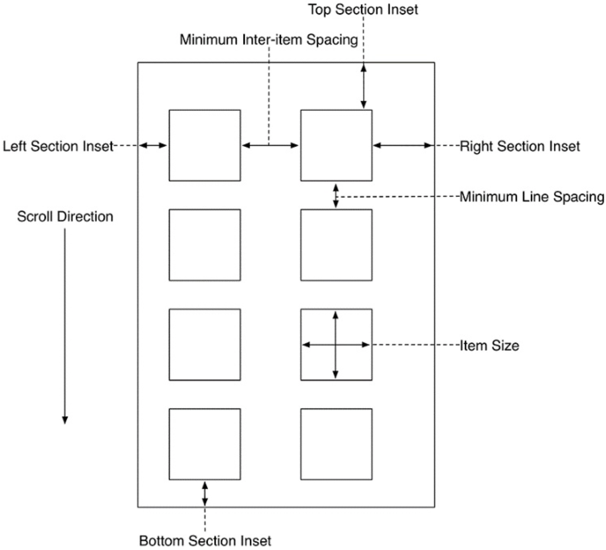

本章把读取到的图片通过CollectionView展现到界面上。
本章要点：
- Collection Views
- 扩展
<!-- more -->

# 1 CollectionView
## 1.1 CollectionView的使用框架
和UITableView类似，CollectionView的数据来自UICollectionViewDataSource。
在本章，这个DataSource不再是VC，而是独立的类。这样做的好处是增加了一层抽象层，未来如果数据长在其它的VC上，可以直接拿去复用。
``` objc
class PhotoesViewController: UIViewController {
    @IBOutlet var collectionView: UICollectionView!
    var store: PhotoStore!
    let photoDataSource = PhotoDataSource()
    
    override func viewDidLoad() {
        super.viewDidLoad()
        // 设置dataSource
        collectionView.dataSource = photoDataSource	
        ……
    }
    ……
}

// CollectionViewDataSource必须实现两个接口，返回数据的个数以及制定位置的数据
class PhotoDataSource: NSObject, UICollectionViewDataSource {
    var photoes = [Photo]()
    
    func collectionView(_ collectionView: UICollectionView, numberOfItemsInSection section: Int) -> Int{
        return photoes.count
    }
    
    func collectionView(_ collectionView: UICollectionView, cellForItemAt indexPath: IndexPath) -> UICollectionViewCell {
        let identifier = "UICollectionViewCell"
        let cell = collectionView.dequeueReusableCell(withReuseIdentifier: identifier, for: indexPath)
        return cell
    }
}
```
<font color=red>什么情况下使用override关键字？难道这些接口不是重载么？为什么没有加override关键字？</font>

## 1.2 CollectionView的几个和布局相关的属性

## 1.3 collectionView 和collectionView 是什么关系？
`collectiononView(_:willDiaplay:forItemAt:)`是`UICollectionViewDelegate`方法，当某个位置的cell即将划入屏幕的时候会被调用；
`collectionView(_:cellForItemAt:)`是`UICollectionViewDataSource`的方法，当需要显示某个位置的数据时被调用。
我怎么觉得这两个是一回事呢？下文回答这个问题。

## 1.4 为什么添加了collectionView(_:willDisplay:forItemAt:)就显示出图片了？
在collectionView(_:cellForItemAt:)中仅仅从队列中取出cell对象：
``` objc
func collectionView(_ collectionView: UICollectionView, cellForItemAt indexPath: IndexPath) -> UICollectionViewCell {
    let identifier = "UICollectionViewCell"
    let cell = collectionView.dequeueReusableCell(withReuseIdentifier: identifier, for: indexPath) as! PhotoCollectionViewCell
    return cell
}
```
把每个格子想象成一个集装箱，这个函数只是集装箱体，使用了可重用的集装箱体可以节省箱体的资源。到此为止，这与箱体里面装什么无关。有了箱体之后还要往里面放满货物，这是`collectionView(_:willDisplay:forItemAt:)`做的事情：
``` objc
func collectionView(_ collectionView: UICollectionView, willDisplay cell: UICollectionViewCell, forItemAt indexPath: IndexPath){
    let photo = photoDataSource.photoes[indexPath.row]
    
    store.fetchImage(for: photo){(result) -> Void in
        
        guard let photoIndex = self.photoDataSource.photoes.index(of: photo),
            case let .success(image) = result else{
                return
        }
        let photoIndexPath = IndexPath(item: photoIndex, section: 0)
        
        if let cell = self.collectionView.cellForItem(at: photoIndexPath) as? PhotoCollectionViewCell{
            cell.update(with: image)
        }
    }
}
```
他不关心箱体从哪来的，只负责往箱体里面装满货物。这就回答了1.3的疑问，这两个函数之间是有先后关系的，显然要先提供箱体，再装满货物。
<font color=red>我的问题：这里把提供箱体和装货分开做的目的是为了让格子在被看到的时候才触发下载，以节省流量；在第10章中是在提供箱体的时候就同时装货了。但是我觉得在本章中分离并没有起到这个目的呢？提供箱体本来就是在即将展现的时候才被请求的，所以在提供箱体的时候装货应该就能满足需求吧？</font>

## 1.5 switch...case的另一种用法
1.4中的代码
``` objc
if case let .success(image) = result {
    photo.image = image
}
```
等价于
``` objc
switch result {
case let .success(image):
    photo.image = image
case .failure:
    break
}
```

## 1.6 CollectionViewCell的重置时机
有两个重置相关的时机：
- 首次创建，此时会伴随调用
``` objc
override func awakeFromNib(){
    super.awakeFromNib()
    ...
}
```
- CollectionViewCell被重用，此时会伴随调用
``` objc
override func prepareForReuse(){
    super.prepareForReuse()
    ...
}
```
<font color=red>我的问题：被重用应该是个数据层的操作，怎么会通过framework层的调用通知到cell呢？重用是通过出队
`collectionView.dequeueReusableCell(withReuseIdentifier: for: )`
来完成的，我猜测应该是在这个函数内部调用了`prepareForReuse()`？ </font>

## 1.7 回顾页面跳转是怎么完成的
在前面的章节中已经使用过segue，本章中点击了网格图片后会显示大图。这里简单回顾，步骤如下：
1. 在InterfaceBuilder中，添加VC并在上面添加ImageView
2. 在InterfaceBuilder中，从CollectionViewCell Ctrl拖拽到一中创建的VC，在弹出的面板中选择show，这就创建了一个segue
3. 选中segue，设置它的identifier为showPhoto
4. 在segue发生的起点VC中覆盖prepare(for: sender:)函数，把被点击的图片信息传给segue的目的VC
5. 在segue的目的VC中完成初始化

# 2 扩展
## 2.1 扩展的目的和适用范围
通过扩展可以将若干个功能归拢到一个逻辑单元。它不仅可以用来扩展你自己的数据类型，也可以用来扩展系统或者别的framework提供的数据类型，即使你不拥有这个数据类型的源代码。

书中P644：扩展可以适用于类、结构和枚举，可以给它们添加<font color=red>计算属性（computed properites）</font>、方法、协议，但是不能添加<font color=red>存储属性（stored properties）。
什么是计算属性，什么是存储属性？</font>
