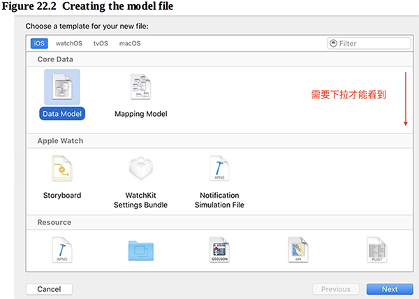
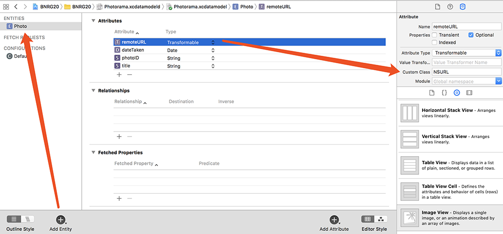
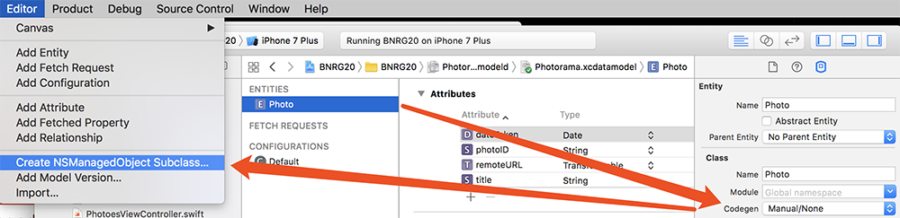
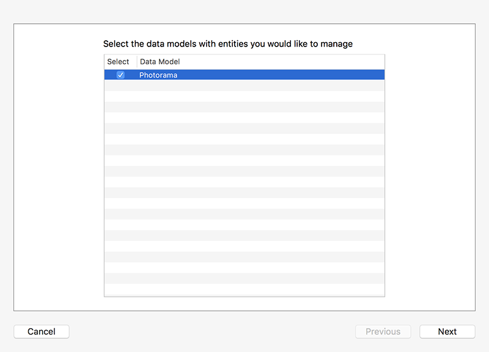
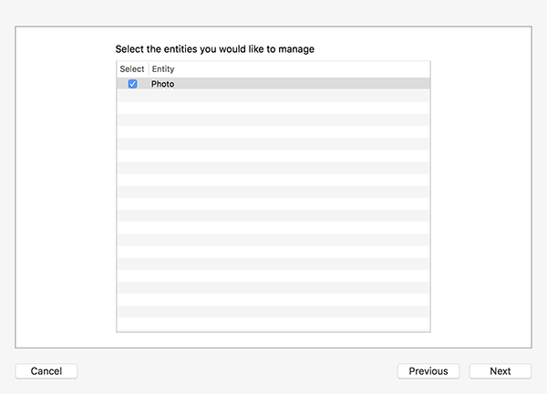

本章要点：
- Core Data

<!-- more -->
# CoreData
## 1 为什么使用CoreData
Archiving最大的缺点是all-or-nothing特性：如果要读取archive文件，必须把它全部unarchive；如果要写入也必须写入整个文件。
CoreData则可以只读取文件的子集，或者只修改一部分。

## 2 怎么创建CoreData
关系数据库是由表组成的，表是由字段组成的，CoreData是关系数据库的另一种表述方式：表在CoreData中被称作实体（entity），字段在CoreData中被称作属性（attribute）。CoreData文件正是用来描述实体的。
一、新建CoreData文件

二、在CoreData编辑器中添加实体，添加属性



## 3 Transformable数据类型是干嘛用的
CoreData是一个OC层的framework，只能处理某些数据类型。比如：它不能处理URL（这是一个struct），但可以处理NSURL（这是一个class）。
swift提供了URL和NSURL相互转换的机制。类型为transformable的属性需要使用ValueTransformer的子类来完成类型转换，如果没有明确指定子类，系统默认使用NSKeyedUnarchiveFromDataTransformer来完成转换，它通过archiving把数据转成Data对象。由于NSURL遵循NSCoding协议，默认的NSKeyedUnarchiverFromDataTransformer足以完成任务；如果被转换的数据类型不遵循NSCoding协议，你就得自己为他写ValueTransformer子类了。

## 4 怎么为CoreData生成代码
创建CoreData只是创建了一个数据模型，或者可理解为建表，还需要为这个数据模型生成代码，以操作这个数据实体。

把实体的Codegen设置为Manual/None，在Editor中选择未知生成NSManagedObject Subclass。
一路下一步生成代码：


所有CoreData的对象必须是NSManagedObject的子类，该类负责管理CoreData对象。
生成的代码包含：
Photo+CoreDataClass.swift
Photo+CoreDataProperties.swift
两个文件。Xcode根据CoreData实体的定义生成Photo+CoreDataProperties.swift文件，因此不要直接修改该文件，如果CoreData实体发生变化，应当直接删除并重新生成该文件。任何自定义的属性和代码都应当放到Photo+CoreDataClass.swift中。

Photo+CoreDataProperties.swift的内容如下：
``` objc
import Foundation
import CoreData

extension Photo {

    @nonobjc public class func fetchRequest() -> NSFetchRequest<Photo> {
        return NSFetchRequest<Photo>(entityName: "Photo")
    }

    @NSManaged public var photoID: String?
    @NSManaged public var title: String?
    @NSManaged public var dateTaken: NSDate?
    @NSManaged public var remoteURL: NSURL?
}
```
其中@NSManaged关键字表示该字段来自CoreData，它的存储和实现会在运行时提供。

## 5 NSPersistentContainer的作用
NSPersistentContainer像是文件读写的“文件”，通过它可以加载数据：
``` objc
class PhotoStore {
    ……
    let persistentContainer: NSPersistentContainer = {
        let container = NSPersistentContainer(name: "Photorama")	// name必须与CoreData文件名相同
        container.loadPersistentStores{(description, error) in			// 读取文件，这是一个异步操作
            if let error = error{
                print("Error setting up Core Data (\(error)).")
            }
        }
        return container
    }()
……
}
```
<font color=red>问题：文件的具体位置在哪里？</font>

## 6 NSManagedObjectContext的作用
viewContext是NSPersistentContainer的一个成员变量，类型为NSManagedObjectContext。这很像是数据库游标的概念，是用来操作CoreData的入口。

## 7 怎么写入CoreData数据
CoreData数据的写入分两步：
一、将数据写入“游标”viewContext
``` objc
struct FlickrAPI {
    ……
    private static func photo(fromJSON json: [String: Any], into context: NSManagedObjectContext) -> Photo?{
        guard							// 从json中读取一个photo对象
        let photoID = json["id"] as? String,
        let title = json["title"] as? String,
        let dateString = json["datetaken"] as? String,
        let photoURLString = json["url_h"] as? String,
            let url = URL(string: photoURLString),
            let dateTaken = dateFormatter.date(from: dateString)else{
                return nil
        }

        var photo: Photo!
        context.performAndWait{		// context即persistentContainer.viewContext，将这个photo对象写入CoreData
            photo = Photo(context: context)
            photo.title = title
            photo.photoID = photoID
            photo.remoteURL = url as NSURL
            photo.dateTaken = dateTaken as NSDate
        }
        return photo
    }
……
}
```
这只是写入了游标，按照数据库的操作步骤，还需要把游标中的数据commit到文件。

二、将“游标”保存到文件：
``` objc
class PhotoStore {
    ……    
    let persistentContainer: NSPersistentContainer = {
        let container = NSPersistentContainer(name: "Photorama")
        container.loadPersistentStores{(description, error) in
            if let error = error{
                print("Error setting up Core Data (\(error)).")
            }
        }
        return container
    }()
   ……
    func fetchInterestingPhotoes(completion: @escaping(PhotoesResult) -> Void){
        let url = FlickrAPI.interestingPhotoesURL
        let request = URLRequest(url: url)
        let task = session.dataTask(with: request, completionHandler:{
            (data, response, error) -> Void in
		// 从web server请求数据，并通过前面的FlickrAPI::photoes生成Photo对象，插入游标
            var result = self.processPhotoesRequest(data: data, error: error) 
            if case .success = result{
                do{
                    try self.persistentContainer.viewContext.save()	// 成功读取数据后，数据都进入了游标，这里保存到文件
                }catch let error{
                    result = .failure(error)
                }
            }
            OperationQueue.main.addOperation {
                completion(result)
            }
        })
        task.resume()
    }
```
以上两步就完成了数据写入游标，保存游标到文件的过程。

## 8 排序描述符和谓词
从CoreData读取数据也很像操作数据库，只不过数据库有SQL语句来描述要获取的数据，而CoreData是通过排序描述符和谓词。
排序描述符sortDescriptors是一个NSSortDescriptor数组，记录主排序规则、次排序规则以及更低一级的排序规则。相当于SQL中的order by 从句
谓词则用来描述查询出的数据应满足的条件，相当于SQL中的where从句。
最后这些从句都将配置到NSFetchRequest对象，NSFetchRequest相当于完整的SQL

## 9 怎么从CoreData读出数据
一、构造NSFetchRequest实例
``` objc
let fetchRequest: NSFetchRequest<Photo> = Photo.fetchRequest()
```
二、构造排序和谓词
``` objc
let sortByDateTaken = NSSortDescriptor(key: #keyPath(Photo.dateTaken), ascending: true)
fetchRequest.sortDescriptors = [sortByDateTaken]
let predicate = NSPredicate(format: "#keyPath(Photo.photoID) == \(someIdentifier)") 
request.predicate = predicate 
```
三、通过游标执行查询
``` objc
let viewContext = persistentContainer.viewContext		// 获取游标
viewContext.perform {
    do{
        let allPhotoes = try viewContext.fetch(fetchRequest)  // 执行查询
        completion(.success(allPhotoes))
    }catch{……}
}
```
## 10 本章中完整的读取数据的逻辑是什么
程序在初始化的时候，数据获取包含两部分：从本地CoreData中读取之前已保存的数据，从web server读取数据。
一、在viewDidLoad中发起数据加载
``` objc
class PhotoesViewController: UIViewController, UICollectionViewDelegate {
……
    override func viewDidLoad() {
        super.viewDidLoad()
        ……
        self.updateDataSource()		// 加载本地数据
        
        store.fetchInterestingPhotoes{	// 读取web server数据，存入本地
            (photoesResult) -> Void in
            self.updateDataSource()	// 再次加载本地数据
        }
    }

    private func updateDataSource(){
        store.fetchAllPhotoes{      // 从CoreData加载所有数据
            (PhotoesResult) in
            switch PhotoesResult{
            case let .success(photoes):
                self.photoDataSource.photoes = photoes
            case .failure:
                self.photoDataSource.photoes.removeAll()
            }
            self.collectionView.reloadSections(IndexSet(integer: 0))
        }
    }
……
}
```
在viewDidLoad中之所以重复调用self.updateDataSource()是因为从web server读取数据是个长程操作，因此要先从本地加载，之后从web server读完，排重后再读一次。

二、在photoStore.fetchAllPhotoes中读取CoreData
``` objc
class PhotoStore {
    ……
    func fetchAllPhotoes(completion: @escaping(PhotoesResult) -> Void){
        let fetchRequest: NSFetchRequest<Photo> = Photo.fetchRequest()
        let sortByDateTaken = NSSortDescriptor(key: #keyPath(Photo.dateTaken), ascending: true)
        fetchRequest.sortDescriptors = [sortByDateTaken]
        
        let viewContext = persistentContainer.viewContext
        viewContext.perform {
            do{
                let allPhotoes = try viewContext.fetch(fetchRequest)	// 从CoreData读取本地数据
                completion(.success(allPhotoes))
            }catch{
                completion(.failure(error))
            }
        }
    }
	……
}
```
三、在photoStore.fetchInterestingPhotoes从web server读取数据
``` objc
class PhotoStore {
    ……
    func fetchInterestingPhotoes(completion: @escaping(PhotoesResult) -> Void){
        let url = FlickrAPI.interestingPhotoesURL
        let request = URLRequest(url: url)
        let task = session.dataTask(with: request, completionHandler:{
            (data, response, error) -> Void in
            var result = self.processPhotoesRequest(data: data, error: error) // 组织request，请求json
            if case .success = result{
                do{
                    try self.persistentContainer.viewContext.save()	// 把读到的数据保存入CoreData
                }catch let error{……}
            }
            OperationQueue.main.addOperation {
                completion(result)
            }
        })
        task.resume()
    }

    private func processPhotoesRequest(data: Data?, error: Error?) ->PhotoesResult{
        guard let jsonData = data else{
            return .failure(error!)
        }
        return FlickrAPI.photoes(fromJSON: jsonData, into: persistentContainer.viewContext)
    }
……
}
```
四、在FlickrAPI.photoes中将web server中读取的数据写入CoreData
``` objc
struct FlickrAPI {
……
    static func photoes(fromJSON data: Data, into context: NSManagedObjectContext) -> PhotoesResult{
        do{
            let jsonObject = try JSONSerialization.jsonObject(with: data, options: [])
            guard
                let jsonDictionary = jsonObject as? [AnyHashable:Any],
                let photoes = jsonDictionary["photos"] as? [String:Any],
                let photoesArray = photoes["photo"] as? [[String: Any]] else{……}
            var finalPhotoes = [Photo]()
            for photoJSON in photoesArray{
                if let photo = photo(fromJSON: photoJSON, into:context){	// 读取photo数组
                    finalPhotoes.append(photo)
                }
            }
            ……
            return .success(finalPhotoes)
        }catch let error{……}
    }

    private static func photo(fromJSON json: [String: Any], into context: NSManagedObjectContext) -> Photo?{
        guard
        let photoID = json["id"] as? String,
        let title = json["title"] as? String,
        let dateString = json["datetaken"] as? String,
        let photoURLString = json["url_h"] as? String,
            let url = URL(string: photoURLString),
            let dateTaken = dateFormatter.date(from: dateString)else{……}
        // 如果从web server下到的photo，本地CoreData已经存在，就不再往CoreData中保存了，避免dup
        let fetchRequest: NSFetchRequest<Photo> = Photo.fetchRequest()
        let predicate = NSPredicate(format: "\(#keyPath(Photo.photoID)) == \(photoID)")
        fetchRequest.predicate = predicate
        
        var fetchedPhotoes: [Photo]?
        context.performAndWait {
            fetchedPhotoes = try? fetchRequest.execute()
        }
        if let existingPhoto = fetchedPhotoes?.first{
            return existingPhoto
        }
        
        var photo: Photo!
        context.performAndWait{		// 将web server中读到的photo写入游标
            photo = Photo(context: context)
            photo.title = title
            photo.photoID = photoID
            photo.remoteURL = url as NSURL
            photo.dateTaken = dateTaken as NSDate
        }
        return photo
    }
……
}
```