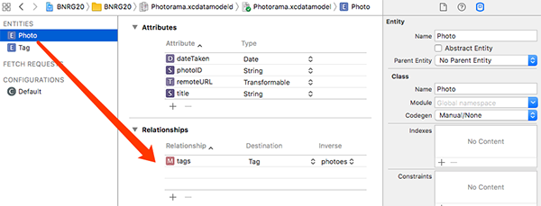

CoreData就是一个关系数据库，本章让两个表之间建立连接关系。
本章要点：
- 为Core Data生成代码
- Core Data Relationships
<!-- more -->

# 1 CoreData的代码生成
## 1.1 Entity的Codegen选项
Entity的Codegen对应三个选项：

`Manual/None`   告诉Xcode不要为Entity生成任何代码
`Class Definition`  自动生成全部的类定义
`Category/Extionsion`   由程序员自己写NSManagedObject子类，自定义行为，但Xcode会生成扩展代码来定义类的属性和关系

# 2 Core Data Relationships
## 2.1 Core Data Relationships是什么
Core Data Relationships就是关系数据库中的连接关系。

## 2.2 怎么在数据模型层创建Core Data Relationships
一、打开xcdatamodeld文件编辑器，原先已经添加了Photo实体，再添加一个Tag实体，仅包含一个name:String字段：

可以给照片对应多个标签，一个标签又可以标注多张照片，这是一个多对多的关系

二、在Photo中添加一条关系，名字为tags，Destination为Tag，
同样地在Tag中也添加一条关系`Relationship=photoes`，`Destination=Photo`，以上两步创建了两条单向关系。

在Photo的tags关系中选择`Inverse=photoes`，这会让Tag的photoes关系`Inverse=tags`，这就把两条单向关系变成了一条双向关系。

三、点击菜单Editor -> Create NSManagedObject Subclass为Photo生成代码。

## 2.3 在代码中操作关系数据
本章中大量的篇幅花在了业务逻辑上，前一步创建了关系数据模型，接下来使用代码来按照关系模型添加数据其实非常简单，首先看Xcode为`photo+CoreDataProperties`生成的代码，这里已经为操作关系数据生成了代码：
``` objc
extension Photo {	// 为Photo生成的字段属性
    ……
    @NSManaged public var dateTaken: NSDate?
    @NSManaged public var photoID: String?
    ……
}

extension Photo {	// 为Photo生成的relationship方法

    @objc(addTagsObject:)
    @NSManaged public func addToTags(_ value: Tag)

    @objc(removeTagsObject:)
    @NSManaged public func removeFromTags(_ value: Tag)
    ……
}
```
因此，当为某个图片勾选/勾掉tag时，只需要使用这些方法就能修改关系：
``` objc
class TagsViewController: UITableViewController {
    ……
    // 勾选/勾掉某一item时会调用此方法
    override func tableView(_ tableView: UITableView, didSelectRowAt indexPath: IndexPath){
        let tag = tagDataSource.tags[indexPath.row]
        
        if let index = selectedIndexPaths.index(of: indexPath){
            selectedIndexPaths.remove(at: index)
            photo.removeFromTags(tag)   // 调用relationship方法修改关系数据
        }else{
            selectedIndexPaths.append(indexPath)
            photo.addToTags(tag)
        }
        
        do{
            try store.persistentContainer.viewContext.save()
        }catch{
            print("Core Data save failed: \(error).")
        }
        
        tableView.reloadRows(at: [indexPath], with: .automatic)
    }
    ……
}
```
## 2.4 iOS的线程模型
我觉得iOS多线程编程模式好诡异，应该再体系地研究一下iOS的线程模型。