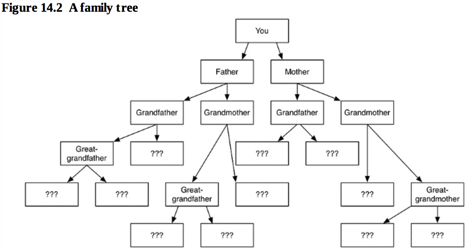

本章介绍枚举Enumerations的基本使用方法，以及枚举的高级使用方法包括：原生值枚举、带方法的枚举、关联值、嵌套枚举。
<!-- more -->
# 基本使用
定义类型
``` objc
enum TextAlignment {
	case left
	case right
	case center
}
```
定义变量：
``` objc
var alignment: TextAlignment = TextAlignment.left
```
根据等号右值可以推断变量类型，所以也可以写作：
``` objc
var alignment = TextAlignment.left
```

赋值：
``` objc
alignment = TextAlignment.right
```
由于alignment已经被初始化，因此也就知道其类型，所以再次赋值时可以省略类型，写作：
``` objc
alignment = .right
```

同理，比较的时候也可以这么写：
``` objc
if alignment == .right{
	...
}
```

使用switch可以做多路比较：
``` objc
switch alignment {
case .left:
	print("left aligned")
case .right:
	print("right aligned")
case .center:
	print("center aligned")
}
```

# Raw Value Enum原生值枚举
枚举类型其实只是对原生类型的可读化的包装，在C/C++下这个原生类型只能是int，在swift下可以指定更多数据类型：
``` objc
enum TextAlignment: Int {
	case left
	case right
	case center
	case justify
}
```
指定该枚举类型的原生类型为Int。

打印原生值：
``` objc
var alignment = TextAlignment.left
print("Left has raw value \(alignment.rawValue)")
```
可以为每个枚举值定义原生值：
``` objc
enum TextAlignment: Int {
	case left		= 20
	case right	= 30
	case center	= 40
	case justify	= 50
}
```
从原生值转为枚举值
``` objc
let myRawValue = 20	// 原生值
if let myAlignment = TextAlignment(rawValue: myRawValue) {
	print("successfully converted.")
} else{
	print("\(myRawValue) has no corresponding TextAlignment case")
}
```
注意，此处的转换不一定都能成功，假如myRawValue = 100就无法完成转换，此时myAlignment就为nil。

子串类型的枚举
``` objc
enum ProgrammingLanguage: String {
	case swift		= "swift"
	case objectiveC	= "objective-c"
	case c			= "c"
	case cpp		= "c++"
	case java		= "java"
}
```
也可以不为每一个枚举值都指定rawValue。对于Int，第一个没指定rawValue的值为0，第二个为1，以此类推。对于String，没指定rawValue默认就是它的case名字。

# 带方法的枚举定义
在swift中，不仅类、结构体可以有成员方法，枚举也可以有。如：
``` objc
enum Lightbulb{
    case on
    case off
    func surfaceTemperature(forAmbientTemperature ambient: Double) {
        switch self {
        case .on:
            return ambient + 150.0
        case .off:
            return ambient
        }
    }
}
```
使用时可以
``` objc
var bulb = Lightbulb.on
let ambientTemperature = 77
var bulbTemperature = bulb.surfaceTemperature(forAmbientTemperature: ambientTemperature)
```
每个枚举方法都有一个默认的self参数，用来访问本尊实例。

如果要在成员方法中修改本尊的值，需要注意给成员方法追上mutating关键字：
``` objc
enum Lightbulb{
    case on
    case off
    mutating func toggle() { // 由于要修改本尊的值，必须缀上mutating关键字
        switch self {
        case .on:
            self = .off
        case .off:
            self = .on
        }
    }
}
```
# 关联值
swift枚举类型的实例，可以为每个枚举case可以关联若干个值。例如下面的ShapeDimensions表示几何形状，包括正方形、长方形：
``` objc
enum ShapeDimensions {
    case square(side: Double)		// 关联边长
    case rectangle(width: Double, height: Double)	// 关联长、宽

    // 可以使用switch语句获取关联值
    func area() -> Double {
        switch self {
        case let .square(sice: side):
            return side * side
        case let .rectangle(width: w, height: h):
            return w * h
        }
    }
}
var squareShape = ShapeDimensions.square(side: 10.0)
var rectShape = ShapeDimensions.rectangle(width: 5.0, height: 10.0)
```
# 嵌套枚举
既然一个枚举case可以关联值，那么这个关联的值类型能否是自身的枚举类型。书中举的变态例子是这样的：

每个人有父母，父母又有各自的父母，有的祖辈已经不知道姓名了，于是定义枚举类型如下：
``` objc
enum FamilyTree {
case noKnownParents
case oneKnownParent(name: String, ancestors: FamilyTree)
case twoKnownParents(fatherName: String, fatherAncestors: FamilyTree, motherName: String, motherAncestores: FamilyTree)
}
```
如果直接这么写，编译器会报错。因为swift在编译期需要知道每个类所占大小，以便为他们的变量分配空间。对于枚举类型，编译器需要知道它的每个case所占内存大小，只需要为此枚举对象变量分配最大case所占空间即可。但是由于oneKnownParent又依赖FamilyTree，所以编译器就无法确定该枚举类型到底占用多大内存了。

上面的例子可以这么写：
``` objc
indirect enum FamilyTree {
case noKnownParents
case oneKnownParent(name: String, ancestors: FamilyTree)
case twoKnownParents(fatherName: String, fatherAncestors: FamilyTree, motherName: String, motherAncestores: FamilyTree)
}
```
关键字indirect告诉编译器为此枚举类型保留一个指针大小即可。这个FamilyTree对象在64位机器下就占用8字节。

还可以写作：
``` objc
enum FamilyTree {
case noKnownParents
indirect case oneKnownParent(name: String, ancestors: FamilyTree)
indirect case twoKnownParents(fatherName: String, fatherAncestors: FamilyTree, motherName: String, motherAncestores: FamilyTree)
}
```
<font color=red>但是书里没写这种情况下，占多大空间，我理解应该只是每个case占一个指针大小吧？</font>