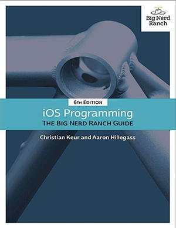

重读《iOS Programming BNRG》，同时解决知识内化的问题。

<!-- more -->

一年前曾经读过本书第四版，当时读的纸版，跟着书上的例子做了，书里也写了好多笔记。可在一个月前需要在iOS上写一段测试代码的时候发现很抓狂，很多东西忘得差不多了。工作中的主要精力都在业务逻辑上，平台相关如果没有常年的练习，真是三天不练手就生。不可能再像当年那样有大把时间浸淫在Windows/Visual Studio下，当然也不再追求在平台下有那样的熟稔程度，那是年轻同学做的事。可是遇到问题能在某个平台下快速验证的动手能力是必须要有的，总请小朋友们代劳一方面信息流转效率太低，几行代码的验证本来只需要十来分钟，如果找人做沟通都不止这个时间，另一方面，手生的时间长了也会影响意识。

我不希望这次翻开书再过一两个月又忘掉，所以必须想一个更有效率的办法把知识内化，结成知识晶体，永久保存。今年读过一些快速阅读的著作，第一遍略读，第二遍重点突破，第三遍总结复述。但我觉得核心目标不是快，而是内化。即使仨月不用也不会忘掉，或者花十分钟就能恢复现场。

这次读了这本书的第6版英文电子版，中文版好像还没出到这么新。内化的方法如下：
1. 对于原先有印象的章节，先不着急看，合上书想一下本章完成了什么，如果自己做应该怎么做。会做的写下步骤，不会做的写下问题，越具体越好。
2. 对于没印象的章节，先扫一遍本章目标，然后做第1步，想想应该怎么达成这个目标或者可能怎么达成目标。想得越详细越好，最好能细化到代码行或操作流程。想不通了自然就发现问题了，赶紧记下来。
3. 带着1、2记录的问题阅读本章，找到每个问题的答案。
4. 每读完一节（不是一章），就把这一节梳理成笔记。梳理的原则是让未来能用最短的时间回顾本章内容。要点：
    - 业务逻辑剔除掉，把知识要点提取出来，未来翻看的时候，这些内容是最有用的。
    - 一个长程步骤，成体系地梳理出来，扫一眼就能概览全貌
5. 对于比较长的章，可以节为单位完成以上4步
6. 全书完成后，用阅读全书5%~10%的时间把笔记回顾一遍。可能还有遗留的问题，未来通过延伸阅读或者具体操作的时候再体会，回答这些问题。