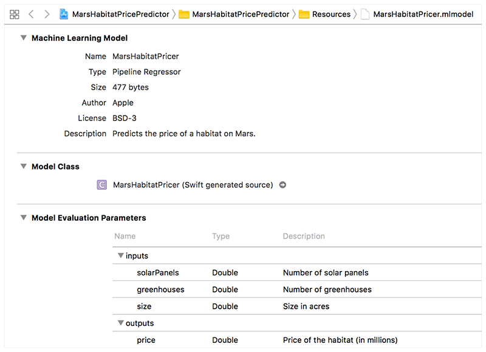
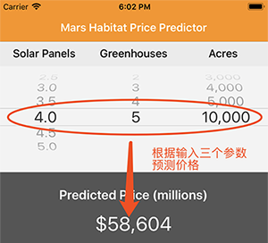

本章把玩苹果发布的CoreML例程以及CoreMLTools，对CoreML有个感性认识。
本章要点：
- 怎么操作CoreML
- model文件是什么

<!-- more -->

首先，运行CoreML，操作系统必须大于macOS 10.13或iOS11，Xcode版本要在9或以上。Xcode9-beta稳定性还可以，而且自带iOS11 simulator，macOS 10.13现在还很不稳定，升级要慎重:P

苹果官方对CoreML的资料还不多。

[Build more intelligent apps with machine learning](https://developer.apple.com/machine-learning/)对CoreML有个导入性的介绍：1、可以把当下广泛的机器学习的数据模型整合到app中，包括tree ensembles、SVMs、generalized linear和深度学习；2、可以无缝利用苹果设备的CPU和GPU为机器学习提供最高的性能和效率。
目前可以应用在图像识别、文本检测、目标跟踪以及自然语言处理如语言识别、词干提取等。

[Core ML](https://developer.apple.com/documentation/coreml)则是技术文档的入口。包含一个简单的例程：[Integrating a Core ML Model into Your App](https://github.com/palanceli/IntegratingaCoreMLModelintoYourApp)我在这个例程里加了一些自己的代码，所以url是我的github。

# Integrating a Core ML Model into Your App
从这个例程可以对CoreML的用法有个大致了解。它根据一块地产的太阳能板个数、温室的间数和面积三个输入参数来预测这块地产的价格。CoreML和CoreData在用法上很相似，步骤如下。

## 1 把CoreML文件导入工程。
Xcode支持对数据模型文件的解析和展现，输入、输出都有哪些字段，数据类型。如图这是Xcode看到的mlmodel文件：

Xcode会为mlmodel生成相应的接口文件，这个文件从工程里是找不到的，点击上图MarsHabitatPricer右侧的箭头可以打开此文件，它是对model数据的封装。
## 2 通过mlmodel接口文件访问数据：
``` objc
let model = MarsHabitatPricer()	// 创建mlmodel实例

// 从界面上得到三个输入参数
func selectedRow(for feature: Feature) -> Int {
    return pickerView.selectedRow(inComponent: feature.rawValue)
}

let solarPanels = pickerDataSource.value(for: selectedRow(for: .solarPanels), feature: .solarPanels)
let greenhouses = pickerDataSource.value(for: selectedRow(for: .greenhouses), feature: .greenhouses)
let size = pickerDataSource.value(for: selectedRow(for: .size), feature: .size)

// 向mlmodel输入参数，得到预测价格
guard let marsHabitatPricerOutput = try? model.prediction(solarPanels: solarPanels, greenhouses: greenhouses, size: size) else {
    fatalError("Unexpected runtime error.")
}
let price = marsHabitatPricerOutput.price
priceLabel.text = priceFormatter.string(for: price)
```
例程的界面如下：


CoreML的使用就这么简单，但越是简单的东西，越吸引人去了解它的内部构造，因为你知道它不是简单的查表，也不是一次方程算出的结果，而是根据喂进去数据训练出模型，再根据模型预测新的输入/输出关系。

---

# mlmodel文件
在官方文档上说：现在大多数第三方机器学习工具产生的数据文件，都可以通过[Core ML Tools](https://pypi.python.org/pypi/coremltools)来转换成mlmodel文件。在[coremltools 文档](https://apple.github.io/coremltools/)中可以看到它的用法。

coremltools的作用有三点：
- 把流行的机器学习工具（包括Keras, Caffe, scikit-learn, libsvm 和 XGBoost）转成Core ML格式（.mlmodel）
- 使用API把数据模型写成Core ML格式
- 在指定的平台上，使用Core ML框架进行预测来验证转换


## 测试mltools
在我的[palanceli/IntegratingaCoreMLModelintoYourApp/testcoreml.py](https://github.com/palanceli/IntegratingaCoreMLModelintoYourApp/blob/master/testcoreml.py)中有对这个工具的测试。
``` python
# -*- coding:utf-8 -*-

import coremltools
import logging
import os

if __name__ == '__main__':
    logFmt = '%(asctime)s %(lineno)04d %(levelname)-8s %(message)s'
    logging.basicConfig(level=logging.DEBUG, format=logFmt, datefmt='%H:%M',)
    
    
    modelFilePath = os.getcwd()
    modelFilePath += '/MarsHabitatPricePredictor/Resources/MarsHabitatPricer.mlmodel'
    logging.debug(modelFilePath)
    model = coremltools.models.MLModel(modelFilePath)  # 加载mlmodel文件

    # 打印各字段，这些是文件的概要信息
    logging.info('author:              %s' % (model.author))
    logging.info('license:             %s' % (model.license))
    logging.info('short description:   %s' % (model.short_description))
    logging.info('input description:   %s' % (model.input_description))
    logging.info('output description:  %s' % (model.output_description))
 
 	# 打印spec，这里有详细的各字段信息
    logging.info(model.get_spec())

    # 根据输入的三个字段，验证输出值
    dataList = [{'solarPanels':1.0, 'greenhouses':1.0, 'size':1024},
                {'solarPanels':4.0, 'greenhouses':5.0, 'size':10000}]
    logging.info('solarPanels greenhouses size   price')
    logging.info('------------------------------------')
    for dataItem in dataList:
    	predictions = model.predict(dataItem)
        logging.info('%11.1f %11d %4d  %5d' % (dataItem['solarPanels'], \
        	dataItem['greenhouses'], dataItem['size'], predictions['price']))
```
运行结果如下：
``` bash
$ python testcoreml.py
07:53 0014 DEBUG    /Users/test/Documents/IntegratingaCoreMLModelintoYourApp/MarsHabitatPricePredictor/Resources/MarsHabitatPricer.mlmodel
07:53 0018 INFO     author:              Apple
07:53 0019 INFO     license:             BSD-3
07:53 0020 INFO     short description:   Predicts the price of a habitat on Mars.
07:53 0021 INFO     input description:   Features(solarPanels,greenhouses,size)
07:53 0022 INFO     output description:  Features(price)
07:53 0025 INFO     specificationVersion: 1
description {
  input {
    name: "solarPanels"
    shortDescription: "Number of solar panels"
    type {
      doubleType {
      }
    }
  }
  input {
    name: "greenhouses"
    shortDescription: "Number of greenhouses"
    type {
      doubleType {
      }
    }
  }
  input {
    name: "size"
    shortDescription: "Size in acres"
    type {
      doubleType {
      }
    }
  }
  output {
    name: "price"
    shortDescription: "Price of the habitat (in millions)"
    type {
      doubleType {
      }
    }
  }
  predictedFeatureName: "price"
  metadata {
    shortDescription: "Predicts the price of a habitat on Mars."
    author: "Apple"
    license: "BSD-3"
  }
}
pipelineRegressor {
  pipeline {
    models {
      specificationVersion: 1
      description {
        input {
          name: "solarPanels"
          type {
            doubleType {
            }
          }
        }
        input {
          name: "greenhouses"
          type {
            doubleType {
            }
          }
        }
        input {
          name: "size"
          type {
            doubleType {
            }
          }
        }
        output {
          name: "__feature_vector__"
          type {
            multiArrayType {
              shape: 3
              dataType: DOUBLE
            }
          }
        }
      }
      featureVectorizer {
        inputList {
          inputColumn: "solarPanels"
          inputDimensions: 1
        }
        inputList {
          inputColumn: "greenhouses"
          inputDimensions: 1
        }
        inputList {
          inputColumn: "size"
          inputDimensions: 1
        }
      }
    }
    models {
      specificationVersion: 1
      description {
        input {
          name: "__feature_vector__"
          type {
            multiArrayType {
              shape: 3
              dataType: DOUBLE
            }
          }
        }
        output {
          name: "price"
          type {
            doubleType {
            }
          }
        }
        predictedFeatureName: "price"
      }
      glmRegressor {
        weights {
          value: 136.726723178
          value: 653.511013762
          value: 5.8540790493
        }
        offset: -3751.05587847
      }
    }
  }
}

07:53 0030 INFO     solarPanels greenhouses size   price
07:53 0031 INFO     ------------------------------------
07:53 0035 INFO             1.0           1 1024   3033
07:53 0035 INFO             4.0           5 10000  58604
```
可见，在mlmodel文件的description中包含了数据模型的所有信息。其中input和output包括输入/输出字段的名称、描述、数据类型，metadata是文件的概要信息。<font color=red>pipelineRegressor我猜测是数据训练的相关信息，这个要把数据是怎么生成的弄清楚才能解答了。</font>

最后可以看到，输入和iOS App里相同的数据，将得到相同的输出数据。

到此只知道了mlmodel文件的数据框架信息，和关系数据库做个类比，相当于只知道这个文件的表结构，其中包含什么数据，有没有算法和代码还不得而知。文档里说mltools可以转其它机器学习的输出结果，但mltools自己能否直接训练数据生成模型呢？我在[coremltools.models的文档](https://apple.github.io/coremltools/coremltools.models.html)中发现应该可以，其中`coremltools.models.neural_network`和`coremltools.models.tree_ensemble`都是用来“construct CoreML models”，但显然还很不完整。

# 遇到的问题
## 关闭SIP升级numpy
在macOS下通过命令`pip install numpy --upgrade`升级numpy默认会失败，这是因为没有System Integrity Protection权限。解决办法：
1. 重启电脑，启动前按住⌘+R
2. 启动后在菜单中找到“终端”并打开，输入`csrutil disable`
3. 重启电脑
4. 之后就可以成功执行`pip install numpy --upgrade`升级numpy了。
5. 完成后记得再用`csrutil enable`恢复SIP设置。

## unable to find utility "coremlcompiler"错误
coremltools已经安装就虚了，初次跑会提示如下错误：
`RuntimeError: Got non-zero exit code 72 from xcrun. Output was: xcrun: error: unable to find utility "coremlcompiler", not a developer tool or in PATH`

这是因为命令行路径没有指向Xcode beta，在命令行下执行下面命令即可：
``` bash
sudo xcode-select --switch /Applications/Xcode-beta.app/Contents/Developer
```