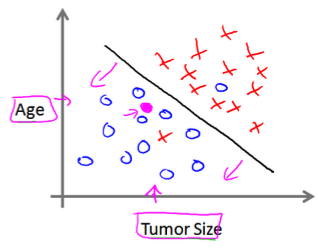

本节介绍了监督式学习/非监督式学习等基本概念，并深入学习了单变量线性回归问题。

<!-- more -->
# 基本概念
监督式学习：预先给了算法“正确结果”，即所有我们观察到的变量。
非监督式学习：现有的数据中并没有结果，只有特征，因此非监督学习要解决的是发现这些数据是否可以分为不同的组。

聚类问题和分类问题的差别是什么？为什么说分类问题是监督式学习问题，而聚类问题是非监督式学习问题？

课程举的分类问题是恶性肿瘤/良性肿瘤的分类：

聚类问题是

## 常用标记
m：训练集中实例的数量
x：特征/输入变量
y：目标变量/输出变量
(x, y)：训练集中的实例
(x(i), y(i))：第i个观察实例
h：学习算法的解决方案或函数也成为假设（hypothesis）

# 单变量线性回归问题
解决房价预测问题就是将训练集“喂”给学习算法，进而学到一个假设h。当把要预测的房屋尺寸作为输入变量输入给h，将输出预测出的房屋交易价格。

h也就是[CoreML初探](/2017/08/26/2017/0826CoreML/#测试mltools)那一节讲的mlmodel文件中的核心内容。
h的表达式为： hθ=θ0+θ1x　　…**公式①**
因为只含有一个特征/输入变量，因此这样的问题叫做单变量线性回归问题。

我的问题：只有一个输入变量不代表h就是这个变量的一次函数，到目前为止h还是通过画图观察，得出的一次线性方程吧？数学建模不可能是人肉建啊？

## 代价函数
建模的目标是得到**让误差的平方和最小的模型参数**。在上例中即θ0和θ1。
根据定义可得**代价函数**为：

<!-- J(\theta_{0}, \theta_{1})=\frac{1}{2m}\sum_{i=1}^{m}(h_{\theta}(x^{(i)})-y^{(i)})^2 -->
建模的目标就是求该最小值。
> 当训练集固定，m就是常量，因此前面加一个1/2m系数对于最终结果没有影响，我猜测应该是为了便于数学计算而加的该系数。

## 梯度下降
初始选一组随机参数(θ0, θ1, …, θn)，计算代价函数，寻找下一个能让代价函数值下降最多的参数组合。持续这么做直到找到局部最优值。
方法：
（1）确定下一步的步伐大小α
（2）给定一个初始值：θ0 θ1
（3）确定一个向下的方向，并向下走预先规定的步伐，并更新θ0 θ1
（4）当下降的高度小于某个定义的值，则停止下降

该算法的公式化描述为（**公式③**）：

其中convergence表示终止条件。

对J(θ0, θ1)求偏导得出公式④：

<!--   \frac{\partial }{\partial \theta_{j}}J(\theta_{0}, \theta_{1}) = \frac{\partial }{\partial \theta_{j}}\frac{1}{2m}\sum_{i=1}^{m}(h_{\theta}(x^{(i)})-y^{(i)})^2=\frac{1}{2m}\sum_{i=1}^{m}2(h_{\theta}(x^{(i)})-y^{(i)})\frac{\partial h_{\theta}}{\partial \theta_{j}} -->
根据公式①可得（**公式⑤**）：

<!-- \frac{\partial h_{\theta}}{\partial \theta_{0}} = 1\, \, \, \, \, \, \, \, \, \, \, \, \, \,  \frac{\partial h_{\theta}}{\partial \theta_{1}} = x^{(i)} -->

将公式④⑤代入公式③可得：

<!-- \theta_{0}:=\theta_{0} - \alpha \frac{1}{m}\sum_{i=1}^{m}(h_{\theta}(x^{(i)}) - y^{(i)}) -->

<!-- \theta_{1}:=\theta_{1} - \alpha \frac{1}{m}\sum_{i=1}^{m}((h_{\theta}(x^{(i)}) - y^{(i)})x^{(i)}) -->

于是可以将算法的公式化描述改写为：

 

> **参考**
[利用梯度下降法实现线性回归的算法及matlab实现](http://blog.csdn.net/zyqdragon/article/details/72353507)