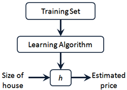

本节介绍了监督式学习/非监督式学习等基本概念，并深入学习了单变量线性回归问题。

<!-- more -->
# 基本概念

基本概念还是参考周志华的《机器学习》第1章，更全面、易懂。
> 假定收集一批西瓜的数据：
(色泽=青绿; 根蒂=蜷缩; 敲声=浊响),  
(色泽=乌黑; 根蒂=稍蜷; 敲声=沉闷),  
(色泽=浅白; 根蒂=硬挺; 敲声=清脆), 
……

<u>**数据集（data set）**</u>：这组记录集合成为一个~。
<u>**示例（instance）或样本（sample）**</u>：每条记录成为一个~。
<u>**属性（attribute）或特征（feature）**</u>：反应某方面表现或性质的数据，例如本例中的“色泽”、“根蒂”称为~。
<u>**属性值（attribute value）**</u>：属性的取值称为~。
<u>**属性空间（attribute space）或样本空间（Sample space）或输入空间（input space）**</u>：属性张成的空间称为~，例如本例中“色泽”、“根蒂”和“敲声”作为三个坐标轴，它们张成用于描述西瓜的三维空间，即样本空间。
<u>**特征向量（feature vector）**</u>：空间中每个点对应一个坐标向量，称为一个~。
<u>**学习（learning）或训练（training Sample）**</u>：从数据中学的模型的过程称为~。
<u>**训练数据（training data）**</u>：训练过程中使用的数据称为~。
<u>**训练样本（training Sample）**</u>：其中每个样本成为一个~。
<u>**训练集（training set）**</u>：训练样本组成的集合称为~。
<u>**假设（hypothesis）**</u>：学得模型对应了关于数据的某种潜在的规律称作~。
<u>**真相或事实（ground-truth）**</u>：这种潜在规律自身称作~。
<u>**学习器（learner）**</u>：学习过程就是为了找出或逼近真相，学得的模型称作~。

> 要学得是不是好瓜的模型，仅有上面的实力数据是不够的，还需要有结果信息，例如：((色泽=青绿; 根蒂=蜷缩; 敲声=浊响), 好瓜)

<u>**样例（example）**</u>：拥有了标记信息的示例称为~。
<u>**标记空间（Label space）或输出空间（output space）**</u>：用(xi, yi)表示第i个样例，其中yi∈Y是样例xi的标记，Y是所有标记的集合，称为~。
<u>**分类（classification）**</u>：待预测的是离散值，例如“好瓜”、“坏瓜”，这类学习任务称为~。只涉及两个类别的称为<u>**二分类（binary classification）**</u>，其中一个类为<u>**正类**</u>另一个为<u>**反类**</u>。涉及多个类别时则称为<u>**多分类（multi-class classification）**</u>
<u>**回归（regression）**</u>：待预测的是连续值，例如西瓜的成熟度是0.9、0.3，这类学习任务称为~。
<u>**测试（testing）**</u>：学得模型后，使用其进行预测的过程称为~。被预测的样本称为<u>**测试样本（testing Sample）**</u>

> 一般地，预测任务是希望从一个输入空间X到输出空间Y的映射`f:X⟼Y`，对二分类任务，通常令Y={-1, 1}或{0, 1}；对多分类任务，|Y|>2；对回归任务，Y=ℝ，ℝ为实数集。

<u>**聚类（clustering）**</u>：将训练集中的西瓜分成若干组，每组成为一个<u>**簇（cluster）**</u>，这些自动形成的簇可能对应一些潜在的概念划分，例如“浅色瓜”、“深色瓜”，“本地瓜”、“外地瓜”……这样的学习过程有助于我们了解数据的内在规律，能为更深入地分析数据建立基础。需说明的是：聚类学习中，“浅色瓜”、“本地瓜”这样的概念是事先不知道的，学习过程中使用的训练样本通常不拥有标记信息。
<u>**学习的分类**</u>：根据训练数据是否拥有标记信息，学习任务可划分为两大类，<u>**监督学习（supervised learning）**</u>和<u>**无监督学习（unsupervised learning）**</u>。分类和回归属于监督学习，聚类则属于无监督学习。
<u>**泛化（generalization）**能力</u>：学得模型适用于新样本的能力。

 
课程举的分类问题是恶性肿瘤/良性肿瘤的分类：

聚类问题是

## 常用标记
m：训练集中实例的数量
x：特征/输入变量
y：目标变量/输出变量
(x, y)：训练集中的实例
(x(i), y(i))：第i个观察实例
h：学习算法的解决方案或函数也成为假设（hypothesis）

# 单变量线性回归问题
解决房价预测问题就是将训练集“喂”给学习算法，进而学到一个假设h。当把要预测的房屋尺寸作为输入变量输入给h，将输出预测出的房屋交易价格。

h也就是[CoreML初探](/2017/08/26/2017/0826CoreML/#测试mltools)那一节讲的mlmodel文件中的核心内容。
h的表达式为： hθ=θ0+θ1x　　…**公式①**
因为只含有一个特征/输入变量，因此这样的问题叫做单变量线性回归问题。

我的问题：只有一个输入变量不代表h就是这个变量的一次函数，到目前为止h还是通过画图观察，得出的一次线性方程吧？数学建模不可能是人肉建啊？

## 代价函数
建模的目标是得到**让误差的平方和最小的模型参数**。在上例中即θ0和θ1。
根据定义可得**代价函数**为：

<!-- J(\theta_{0}, \theta_{1})=\frac{1}{2m}\sum_{i=1}^{m}(h_{\theta}(x^{(i)})-y^{(i)})^2 -->
建模的目标就是求该最小值。
> 当训练集固定，m就是常量，因此前面加一个1/2m系数对于最终结果没有影响，我猜测应该是为了便于数学计算而加的该系数。

## 梯度下降
初始选一组随机参数(θ0, θ1, …, θn)，计算代价函数，寻找下一个能让代价函数值下降最多的参数组合。持续这么做直到找到局部最优值。
方法：
（1）确定下一步的步伐大小α
（2）给定一个初始值：θ0 θ1
（3）确定一个向下的方向，并向下走预先规定的步伐，并更新θ0 θ1
（4）当下降的高度小于某个定义的值，则停止下降

该算法的公式化描述为（**公式③**）：

其中convergence表示终止条件。

对J(θ0, θ1)求偏导得出公式④：

<!--   \frac{\partial }{\partial \theta_{j}}J(\theta_{0}, \theta_{1}) = \frac{\partial }{\partial \theta_{j}}\frac{1}{2m}\sum_{i=1}^{m}(h_{\theta}(x^{(i)})-y^{(i)})^2=\frac{1}{2m}\sum_{i=1}^{m}2(h_{\theta}(x^{(i)})-y^{(i)})\frac{\partial h_{\theta}}{\partial \theta_{j}} -->
根据公式①可得（**公式⑤**）：

<!-- \frac{\partial h_{\theta}}{\partial \theta_{0}} = 1\, \, \, \, \, \, \, \, \, \, \, \, \, \,  \frac{\partial h_{\theta}}{\partial \theta_{1}} = x^{(i)} -->

将公式④⑤代入公式③可得：

<!-- \theta_{0}:=\theta_{0} - \alpha \frac{1}{m}\sum_{i=1}^{m}(h_{\theta}(x^{(i)}) - y^{(i)}) -->

<!-- \theta_{1}:=\theta_{1} - \alpha \frac{1}{m}\sum_{i=1}^{m}((h_{\theta}(x^{(i)}) - y^{(i)})x^{(i)}) -->

于是可以将算法的公式化描述改写为：

 

> **参考**
[利用梯度下降法实现线性回归的算法及matlab实现](http://blog.csdn.net/zyqdragon/article/details/72353507)