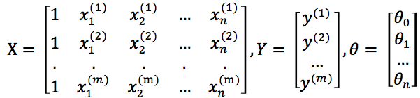

本节深入学习了多变量线性回归。
<!-- more -->
# 多变量线性回归
当引入多个变量，如房价的高低可能不只是取决于房屋大小，还取决于居室个数、年限等，这些都是变量，因此模型的特征为：(x1, x2, ..., xn)

常用标记
n 表示特征的数量
x(i) 第i个训练实例，也是特征矩阵中第i行
xj(i) 第i个训练实例的第j个特征，即特征矩阵中第i行第j列

## 预测函数
预测多变量的函数可以表示为：hθ(x) = θ0 + θ1x1 + θ2x2 + ... + θnxn
为了简化公式，引入x0 = 1，预测函数可以写作：

## 代价函数
根据代价函数的定义（误差的平方和），可得：

对预测函数求偏导：

对代价函数求偏导：

## 梯度下降
于是多变量的梯度下降算法为：

将①代入上式，得到多变量的梯度下降，在初始时可随机选择一组参数，按照：

迭代，直到高度差收敛。

## 多项式回归
多项式回归 如果预测模型和特征值不是一次关系，而是二次或三次关系，如
hθ(x) = θ0 + θ1x1 + θ2x22 + θ3x33
这就把模型转成了线性回归模型。

## 正规方程
梯度下降是求解J最小值的一种方案。另一种方案是对J求θ的偏导，并令偏导为0，这样就得出了局部最小值，一步计算出代价最小的解。
令特征向量X、标记空间Y和参数向量θ分别为：

故：
▽θJ(θ) = ▽θ(1/2) × (Xθ - y)T(Xθ - y)
 = (1/2) × ▽θ(θTXT - yT)(Xθ - y)
 = (1/2) × ▽θ(θTXTXθ - θTXTy - yTXθ - yTy)
θT是1×n矩阵，XT是n×m矩阵，X是m×n矩阵，θ是n×1矩阵，故θTXTXθ是个实数，上式括号内的多项式最终也是实数。对于 ∀a∈R => tra = a
故上式
▽θJ(θ) = (1/2) × ▽θ tr(θTXTXθ - θTXTy - yTXθ + yTy)
 = (1/2) × ▽θ (tr(θTXTXθ) - tr(θTXTy) - tr(yTXθ) + tr(yTy))
 其中 tr(θTXTy) = tr(θTXTy)T = tr(yT(θTXT)T) = tr(yTXθ)
故上式
▽θJ(θ) = (1/2) × ▽θ ( tr(θTXTXθ) - 2tr(yTXθ) + tr(yTy) )   **……①**

已知公式：▽AABATC = BTATCT + BATC
令AT = θ， B = BT = XTX， C = I， A = θT，代入公式得：
▽θtr(θTXTXθI) = XTXθI + XTXθI = XTXθ + XTXθ = 2XTXθ   **……②**

已知公式：▽Atr(AB) = BT
故，▽Atr(yTXθ) = （yTX)T = XTy   **……③**

将②③代入①得：
▽θJ(θ) = (1/2) × (2XTXθ - 2XTy) = XTXθ - XTy
于是，求代价函数Jθ值最小的参数集θ，只须：▽θJ(θ) = 0
即 XTXθ = XTy  
=> θ = (XTX)-1XTy

通过正规方程，我们可以找到令误差最小的参数向量，相比于梯度下降法，正规方程不需要多次迭代，直接计算出局部最优解。

----

其实还有一个思路是：若希望预测函数拟合出Y，则令Hθ(X) = Y， 而Hθ = X × θ，故X × θ = Y即可求解θ。
显然可以通过X-1Xθ = X-1Y求解，但是仅当X是方阵时才存在逆矩阵，所以应先把θ的乘数变成方阵：X-1Xθ = XTY => θ = (XTX)-1XTY
这就得到与正规方程相同的结果。
可是(XTX)-1不一定存在啊？后面会介绍它不存在时的处理方法。

> 矩阵A可逆的充要条件是|A| ≠0

 
> 最小二乘法（又称最小平方法）通过最小化误差的平方和寻找数据的最佳匹配，本章中代价函数就利用了最小二乘法。