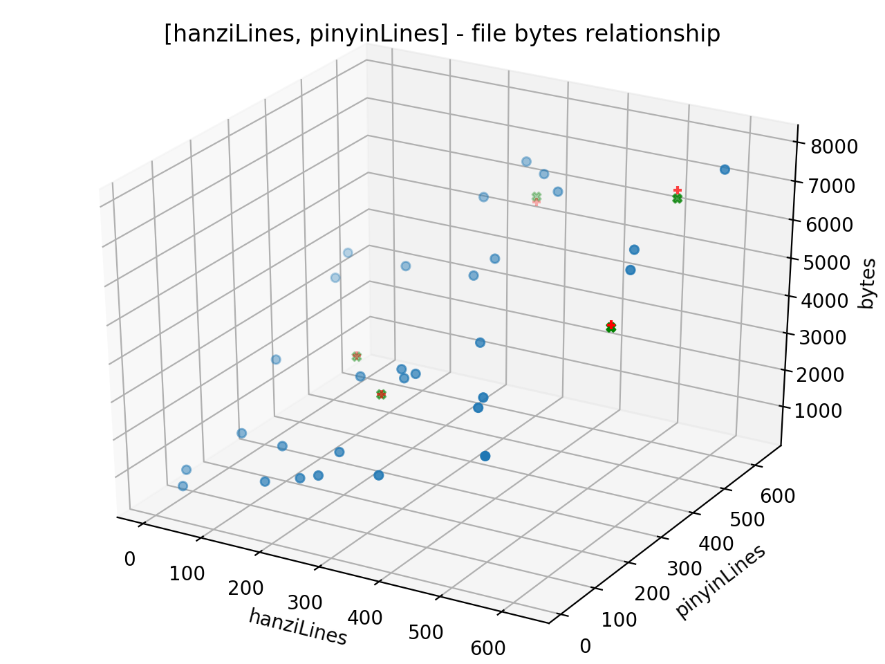

本节和视频教程没什么关系，学完了线性回归，自己想两个题目做做吧。
<!-- more -->
题目是这样的，假设用户词库是由中文词条或拼音串组成，词条个数和词库大小呈线性关系。词库来自于libGooglePinyin中的语料。接下来我们就生成训练集，训练模型，并用模型验证测试样本。

代码我传到了[线性回归练习](https://github.com/palanceli/MachineLearningSample)

# 单变量线性回归练习
单变量线性回归练习中，词库里只有中文词条，输入变量就是词条个数，输出变量是词库大小。
我截取了主要代码如下：
``` python
def SingleFeatureLearning():
	# 单变量线性回归学习过程
    dc = DataCreator()
    # 生成训练样本
    cSamples = 30		# 训练样本个数
    samples = dc.CreateSampleForSingleFeature(cSamples) 

    csvData = 'lines,bytes\n'
    for s in samples:
    	csvData += '%d,%d\n' % (s[0], s[1])

    # 将训练样本读入dataFrame
    dataFrame = pandas.read_csv(io.StringIO(csvData.decode('utf-8')))
    logging.debug(dataFrame)

    # 建立线性回归模型
    regr = sklearn.linear_model.LinearRegression()

    # 拟合
    regr.fit(dataFrame['lines'].values.reshape(-1, 1), dataFrame['bytes']) # reshape(-1, 1)是什么意思？

    # 生成测试样本
    cSample = 5			# 测试样本个数
    samples = dc.CreateSampleForSingleFeature(cSample)
    csvTestData = 'lines,bytes\n'
    for s in samples:
    	csvTestData += '%d,%d\n' % (s[0], s[1])

    # 将训练样本读入dataFrame
    testDataFrame = pandas.read_csv(io.StringIO(csvTestData.decode('utf-8')))
    print(testDataFrame)

    # 预测10000条词的大小
    logging.debug(regr.predict(10000))

    # 画图
    # 1. 训练样本的点
    matplotlib.pyplot.scatter(dataFrame['lines'], dataFrame['bytes'], color='blue')

    # 2. 测试样本的点
    matplotlib.pyplot.scatter(testDataFrame['lines'], testDataFrame['bytes'], marker='x', color='green')

    # 3. 拟合直线
    matplotlib.pyplot.plot(dataFrame['lines'], regr.predict(dataFrame['lines'].values.reshape(-1, 1)), color='red')

    ......
    matplotlib.pyplot.show()
```
运行结果如下图：

横轴是词条的个数，纵轴是词库的大小。蓝点表示训练样本，绿叉表示测试样本，直线是训练出来的预测函数。本例中共30个训练样本，5个测试样本。

从这附图上看起来无论训练样本还是测试样本，好像严格遵守了一次函数的线性关系。我猜测这是因为数据取值范围过大导致的肉眼无法在图形上分辨误差了。这套训练样本的词条数在(6000, 60000)之间。

可以把每个样本中词条数的取值范围缩小到几百的量级，样本个数不变，图形就变成这样了：


# 两个变量的线性回归练习
两个变量的线性回归练习中，词库里包含中文词条和拼音串。两个参数的个数不一定相等，有的词仅有中文词条，有的词只有汉语拼音。输出变量是词库大小。主干代码如下：
``` python
	def Main(self):
		# 二元线性回归学习过程
	    dataCreator = DataCreator()
	    # 生成训练样本
	    trainingDataFrame = self.createSampleDataFrame(dataCreator, 30)

	    # 建立线性回归模型
	    regr = sklearn.linear_model.LinearRegression()

	    # 拟合
	    regr.fit(trainingDataFrame[['hanziLines', 'pinyinLines']].values.reshape(-1, 2), trainingDataFrame['bytes'])

	    # 生成测试样本
	    testingDataFrame = self.createSampleDataFrame(dataCreator, 5)

	    # 验证预测
	    predictBytes = regr.predict(testingDataFrame[['hanziLines', 'pinyinLines']].values.reshape(-1, 2))
	    print(predictBytes)


	    # 打印测试样本和预测结果
	    print(pandas.concat([testingDataFrame, pandas.Series(predictBytes, name="predict")], axis=1))

	    # 画图
	    fig = matplotlib.pyplot.figure()
	    ax = mpl_toolkits.mplot3d.Axes3D(fig)
	    # 绘制训练样本
	    ax.scatter(trainingDataFrame['hanziLines'], trainingDataFrame['pinyinLines'], trainingDataFrame['bytes'])
	    # 绘制测试样本
	    ax.scatter(testingDataFrame['hanziLines'], testingDataFrame['pinyinLines'], testingDataFrame['bytes'], marker='+', color='red')
	    # 绘制预测样本
	    ax.scatter(testingDataFrame['hanziLines'], testingDataFrame['pinyinLines'], predictBytes, marker='X', color='green')

	    # 绘制预测平面
	    xSurf, ySurf = numpy.meshgrid(numpy.linspace(trainingDataFrame['hanziLines'].min(), trainingDataFrame['hanziLines'].max(), 100),
	    	numpy.linspace(trainingDataFrame['pinyinLines'].min(), trainingDataFrame['pinyinLines'].max(), 100))

	    zSurf = predictBytes[0] * xSurf + predictBytes[1] * ySurf + predictBytes[2]
	    # ax.plot_surface(xSurf, ySurf, zSurf, color='None', alpha = 0.4)
	    
	    # 设置坐标轴
	    matplotlib.pyplot.title('[hanziLines, pinyinLines] - file bytes relationship')
	    ax.set_xlabel('hanziLines')
	    ax.set_ylabel('pinyinLines')
	    ax.set_zlabel('bytes')
	    matplotlib.pyplot.show()
```
输出结果如下：
``` bash
   hanziLines  pinyinLines  bytes      predict
0         318          562   6017  6152.173395
1         581          500   7477  7270.284704
2         182          272   3175  3145.866178
3         614          246   5619  5554.244139
4         278          181   3040  3038.543497
```
`hanziLines`、`pinyinLines`是测试集的输入参数，`bytes`是测试集的输出参数，`predict`是预测结果。图形如下：

还不会绘制平面，我把它翻转个视角，可以看到这个训练模型的平面：


# 总结
做到这里，已经跟研究没多大关系了，研究的方法在前面两节，这里只是工程实现，numpy、pandas、sklearn和matplotlib的使用了。

在做第一个练习的时候感到有些失望，这个练习只不过是通过散落在一条直线上的若干个点描绘出这条直线而已，如果知道截距和斜率，直接画出来就可以了。在完全不知道机器学习能做什么的时候，我脑子里认为的是扔给他一堆数据，它能自己找出规律，预测结果。从这个例子上看来还不是要靠人判断曲线的走向，进而选择线性回归的方法，才能训练出一条直线嘛。价值只是在于这条直线和各点距离平方和最小，我们称之为训练误差。而且当训练集继续延伸，后续的点未必遵循这条直线，到那时候，这个模型就不准确了。那么机器学习的智能性如何体现呢？

我觉得这取决于我们如何看待这个世界的运行规律。如果是机械论的世界观，认为世界的运行由若干个参数决定，只要收集全了这些参数，就一定能推导出它的运行轨迹，那么从方法论上来讲，就应该找出运行规律和和参数，不过这些大数据目前恐怕只有上帝掌握。针对本节的例子，我们通过词条个数，平均词长或者每一条词的长度就能精确知道它所占用的文件大小。但在现实世界中，我们很可能拿不到这些数据，或者根本不知道还有词长这个参数在计算文件大小时会起作用，其实相关的参数还有编码方式、文件头等等。在拿不全这些参数的情况下，传统的计算方式只能束手无策。而机器学习的思路在初步判断这近似是条直线或者平面的情况下，根据一批数据就能判断更多的case，和传统方式相比确实解决了问题。

至于当扩大了训练集，如果后面的点不再遵循直线，那么训练方法也就应当相应地调整，采用分段预测，根据后续段落的特征选择相应地模型。总之，机器学习还没有神到只扔给它一堆数据，它就能毫无条件地预知未来的程度。模型的选择很依赖于人对现实世界的理解，这是我目前对于机器学习的理解。

## 参考
[sklearn官方文档](http://scikit-learn.org/stable/)
[pandas官方文档](http://pandas.pydata.org/pandas-docs/stable/)
[matplotlib官方文档](http://matplotlib.org/2.0.2/contents.html)
[numpy快速入门](https://docs.scipy.org/doc/numpy-dev/user/quickstart.html)
[一元、二元特征的sklearn示例](http://scikit-learn.org/stable/auto_examples/linear_model/plot_ols_3d.html#sphx-glr-auto-examples-linear-model-plot-ols-3d-py)