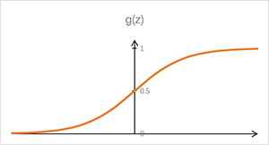

本节主要学习了逻辑回归算法。线性回归解决的是输出值为连续的情况，逻辑回归解决的是输出值为离散的情况。
<!-- more -->
# 假设函数
逻辑回归用来解决分类问题，先讨论简单的二元分类，输出空间只有两个取值：0或1。来看下图的例子，如果只有前6个样本，按照线性回归的思路可以画出蓝线作为预测曲线。当预测曲线的取值小于0.5时表示输出值为0的概率更大，当预测曲线的取值大于0.5时，表示输出值为1的概率更大。这条曲线用来预测前6个样本时还凑合，但当在最右侧增加第7个样本，会让预测曲线变成绿线，显然按照绿线做预测，结果就很不准确了——它会把值为1的第一个样本也预测为0。

所以本章选取了适合做{0, 1}概率逻辑判断的S型曲线来作为预测函数，函数值表示输出值取1的概率：

该曲线的函数为：

可以把假设函数定义成这个形状，于是：

# 代价函数
按照代价函数的定义应为：

但是当把此处的hθ(x)代入该代价函数后，得到是一个非凸函数，这会导致它有很多局部最小值，这将影响梯度下降法求解全局最小值。因此，为了方便求最小值，此处重新定义代价函数：

# 梯度下降求解代价函数最小值
先来求解∂J(θ)/∂θ，过程如下：

真神奇，结果竟然和线性回归一样！

于是按照梯度下降法的模板：

