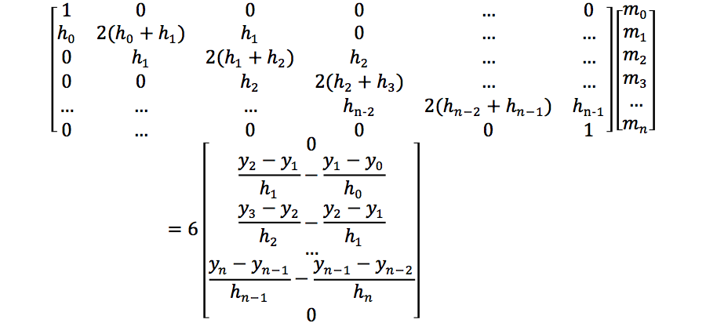
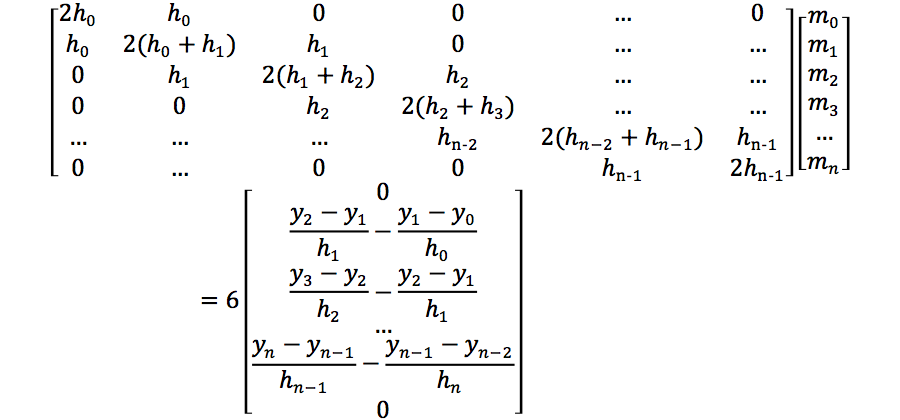
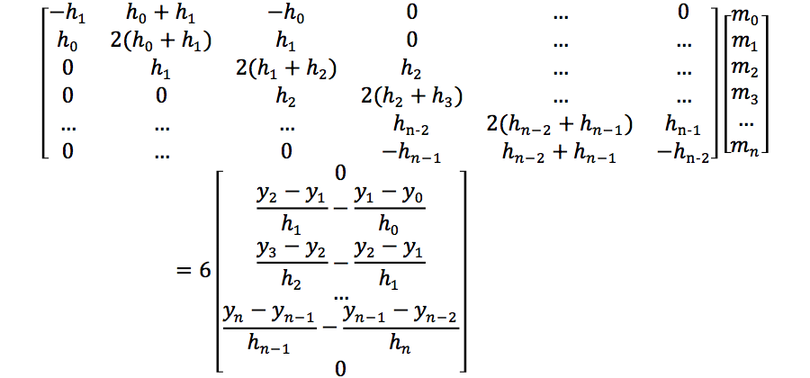

常见的一维插值方法有：
- 多项式插值（polynormal interpolation）
- 分段线性插值（piecewise linear interpolation）
- 3次样条插值（cubic spline interpolation）

本文推演一遍3次样条插值的计算过程。
<!-- more -->
# 定义
有节点序列：(x0, y0),(x1, y1),……(xn, yn)，其中a=x0 < x1 < ... < xn = b
在每个分段区间[xi, xi+1]，样条曲线Si(x)都是一个三次多项式；S(x)、S'(x)、S"(x)在区间[a, b]上是连续的，即S(x)曲线是光滑的。
Si可以写作：
Si(x) = ai + bi(x - xi) + ci(x - xi)<super>2</super> + di(x - xi)<super>3</super>  其中i = 0, 1, ..., n-1
ai、bi、ci、di是未知系数，接下来需要求解它们。

# 求解
每一段样条曲线的节点与已知序列重合，故：
Si(xi) = yi
Si(xi+1) = yi+1  　　　其中i=0, 1, ..., n-1
相邻的两段样条曲线在接缝处是平滑的，故：
S'i(xi+1) = S'i+1(xi+1)
S"i(xi+1) = S"i+1(xi+1) 　　　其中i=0, 1, ..., n-2
样条曲线方程及微分方程：
Si(x) = ai + bi(x - xi) + ci(x - xi)2 + di(x - xi)3  　　　…①
S'i(x) = bi + 2ci(x - xi) + 3di(x - xi)2  　　　　　　　…②
S"i(x) = 2ci + 6di(x - xi)  　　　　　　　　　　　　…③

将Si(xi) = yi代入①得：
ai = yi　　　　　　　　　　　　　　　　　　　　…⑥

将Si(xi+1) = yi+1代入①得：
ai + bi(xi+1 - xi) + ci(xi+1 - xi)2 + di(xi+1 - xi)3 = yi+1
令hi = xi+1 - xi为步长，代入上式得：
ai + bihi + cihi2 + dihi3 = yi+1　　　　　　　　　　…⑦

将S'i(xi+1) = S'i+1(xi+1)代入②得：
bi - bi+1 + 2ci(xi+1 - xi) + 3di(xi+1 - xi)2 = 0
即：bi - bi+1 + 2cihi + 3dihi2 = 0　　　　　　　　　…⑧

将S"i(xi+1) = S"i+1(xi+1)代入③得：
2(ci - ci+1) + 6di(xi+1 - xi) = 0
=> 2(ci - ci+1) + 6dihi = 0
=> di = 2(ci - ci+1)/6hi
令 mi = S"i(xi) = 2ci
=> ci = mi / 2　　　　　　　　　　　　　　　　　　…④
=> di = (mi+1 - mi)/6hi　　　　　　　　　　　　　　…⑤

将④⑤⑥代入⑦：
yi + bihi + mihi2/2 + (mi+1 - mi)hi3/6hi = yi+1
=> bihi = (yi+1 - yi) - mihi2/2 - (mi+1 - mi)hi2 / 6
=> bi = (yi+1 - yi)/hi - mihi/2 - (mi+1 - mi)hi/6　　　…⑨

将④⑤⑨代入⑧：
(yi+1 - yi)/hi - mihi/2 - (mi+1 - mi)hi/6 - (yi+2 - yi+1)/hi+1 + mi+1hi+1/2 + (mi+2 - mi+1)hi+1/6 + mihi + (mi+1 - mi)hi/2 = 0
=> himi + 2(hi+hi+1)mi+1 + hi+1mi+2 = 6((yi+2 - yi+1)/hi+1 - (yi+1 - yi)/hi)　　　…⑩

对于两个端点可以引入约束，常用的有三种：
- 自由边界（Natual)。令：S"=0 即：m0=0,mn=0
于是⑩可以写作：

- 固定边界（Claped）。指定S'0(x0)=A, S'n-1(xn)=B
=>b0=A，bn-1=B，代入⑨：
2h0m0 + h0m1 = 6((y1 - y0)/h0 - A)
hn-1mn-1 + 2hn-1m0 = 6(B - (yn - yn-1)/hn-1)

- 非节点边界（Not-A-Knot）。令：
S'''0(x1) = S'''1(x1)　　　　　　…⑪
S'''n-2(xn-1) = S'''n-1(xn-1)　　…⑫
由③得：S'''i(x)=6di
由⑤得：S'''i(x)=6di = (mi+1 - mi)/hi　　…⑬
将⑬代入⑪⑫得：
h1(m1-m0) = h0(m2-m1)
hn-1(mn-1-mn-2) = hn-2(mn-mn-1)

不同的边界点约束影响的是样条曲线函数的首末两行。

# 总结
已知n格数据点：(x0, y0), (x1, y1), ..., (xn, yn)，令hi=xi+1-xi为步长，代入矩阵方程（此处采用自由边界约束）：

计算样条系数：
ai=yi
bi=(yi+1-yi)/hi - mihi/2 - (mi+1-mi)hi/6
ci=mi/2
di=(mi+1-mi)/6hi
在每个区间x∈[xi, xi+1]创建样条曲线方程gi(x) = ai + bi(x-xi) + ci(x-xi)2 + di(x - xi)3