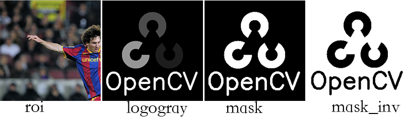
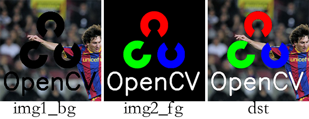

图形图像处理好帮手——opencv，python便于上手，所以这里简要归纳opencv-python的一些使用，便于自己查阅。
<!-- more -->
# 简单几何图形的绘制
## 绘图板
``` python
img = numpy.zeros((300, 400, 3), numpy.uint8) # 创建高300，宽400的绘图板

while True:
  cv2.imshow('image', img)
  if cv2.waitKey(20) & 0xFF == 27: # 等待按键，如果为ESC则跳出循环
    break

cv2.destroyAllWindows() # 销毁窗体
```
所谓绘图板就是一个三维数组，第一维有300个元素，进入第二维每个元素又有400个元素，进入第三维每个元素有3个uint8的值。300是数组的行数，表示位图的高；400是数组的列数，表示位图的宽；每个宽、高确定一个像素点，这是一个(uint8, uint8, uint8)的值，表示颜色。此处为全0，即黑色。

接下来的while循环里，每隔20ms读一次键盘，如果有按键并且为ESC，则跳出循环，否则继续循环。跳出循环后销毁窗体。

下文中我把循环封装成函数`self.waitToClose(img)`。
## 直线
``` python
img = numpy.zeros((400, 300, 3), numpy.uint8) 
cv2.line(img, (0, 0), (511, 511), (255, 0, 0), 2) # 绘制直线
self.waitToClose(img)
```
参数分别为：`背景位图`，`起始坐标`，`终止坐标`，`线条颜色`，`线宽`。
结果如下：

## 矩形
``` python
img = numpy.zeros((300, 400, 3), numpy.uint8)
img[:, :] = (255, 255, 255)
cv2.rectangle(img, (10, 10), (100, 100), (0, 0, 0), 1)# 绘制矩形
self.waitToClose(img)
```
参数分别为：`背景位图`，`左上坐标`，`右下坐标`，`线条颜色`，`线宽`。
结果如下：

## 多边形
``` python
img = numpy.zeros((300, 400, 3), numpy.uint8)
img[:, :] = (255, 255, 255)

pts = numpy.array([[10, 10], [100, 10], [100, 100], [10, 100]], numpy.int32)
cv2.polylines(img, [pts.reshape(-1, 1, 2)], True, (0, 0, 0), 1)

pts[:, 0] = pts[:, 0] + 100
cv2.polylines(img, [pts.reshape(-1, 1, 2)], False, (0, 0, 0), 1)

pts[:, 1] = pts[:, 1] + 100
cv2.polylines(img, pts.reshape(-1, 1, 2), True, (0, 0, 0), 2)

self.waitToClose(img)
```
参数分别为：`背景位图`，`多边形顶点坐标`，`是否封闭`，`右下坐标`，`线条颜色`，`线宽`。结果如下：

其中`多边形顶点坐标`如果括到[]里，将绘制多边形，如果没有[]，则只绘制顶点。
## 圆
``` python
img = numpy.zeros((300, 400, 3), numpy.uint8)
img[:, :] = (255, 255, 255)
cv2.circle(img, (50, 50), 20, (0, 0, 0), -1)
cv2.circle(img, (100, 100), 20, (0, 0, 0), 2)
self.waitToClose(img)
```
参数分别为：`背景位图`，`圆心坐标`，`半径`，`线条颜色`，`线宽`。其中线宽如果是-1，则为实心。结果如下：

## 椭圆
``` python
img = numpy.zeros((300, 400, 3), numpy.uint8)
img[:, :] = (255, 255, 255)
cv2.ellipse(img, (200, 50), (100, 50), 0, 0, 180, (0, 0, 0), 1)
cv2.ellipse(img, (200, 250), (100, 50), 0, 120, 180, (0, 0, 0), -1)
self.waitToClose(img)
```
参数分别为：`背景位图`，`中心坐标`，`长短轴长度`，`起始旋转角度`，`起始绘制角度`，`终止绘制角度`，`颜色`，`线宽`。其中线宽如果是-1，则为实心。结果如下：

不知道为什么要引入起始旋转角度，大致意思是说从起始旋转角度，旋转`起始绘制角度`后开始绘制，直到旋转到`终止绘制角度`。
把第二个实心椭圆改成下面这样：
``` python
cv2.ellipse(img, (200, 250), (100, 50), 90, 120, 180, (0, 0, 0), -1)
```
图形为：


## 文字
``` python
img = numpy.zeros((300, 400, 3), numpy.uint8)
img[:, :] = (255, 255, 255)
font = cv2.FONT_HERSHEY_SIMPLEX								# 文字
cv2.putText(img, 'OpenCV', (10, 100), font, 2, (0, 0, 0), 2, cv2.LINE_AA)
cv2.putText(img, 'OpenCV', (10, 200), font, 1, (0, 0, 0), 1, cv2.LINE_AA)
self.waitToClose(img)
```
参数分别为：`背景位图`，`字串`，`位置`，`字体`，`字号`，`字色`，`线宽`，`线条类型`。结果如下：

## 填充
### cv2.floodFill(...)
``` python
img = numpy.zeros((300, 300, 3), numpy.uint8)
img[:, :] = (255, 255, 255)
pts = numpy.array([[10, 10], [100, 10], [100, 100], [10, 100]], numpy.int32)
pts = pts.reshape((-1, 1, 2))
cv2.polylines(img, [pts], True, (0, 0, 0), 1)

mask = numpy.zeros((302, 302), numpy.uint8)
cv2.floodFill(img, mask, (50, 50), (0, 0, 0), (0,), (0,), 8)  # 填充封闭区域

self.waitToClose(img)
```
`cv2.floodFill`参数分别为：`源图`，`掩码`，`起始填充标记点`，`填充色`，`最大低亮度之间的差异`，`最大高亮度之间的差异`，`联通方式`。
- `掩码图像`，大小比原图多两个像素点。设输入图像大小为w * h ,则掩码的大小必须为 (w + 2) * (h + 2) , mask可为输出，也可作为输入 ，由flags决定。
- `起始填充标记点`，从这个点开始往外扩散执行填充。
- `连通方式`：0~7位为0x04或者0x08 即 4连通 或者 8连通，
8~15位为填充mask的值大小 , 若为0 ， 则默认用1填充 
16~23位为 `CV_FLOODFILL_FIXED_RANGE =(1 << 16)`, `CV_FLOODFILL_MASK_ONLY =(1 << 17)` 

flags参数通过位与运算处理：
- 当为CV_FLOODFILL_FIXED_RANGE 待处理的像素点与种子点作比较，如果∈(s – lodiff , s + updiff)，s为种子点像素值，则填充此像素。若无此位设置，则将待处理点与已填充的相邻点作此比较。
- 当为CV_FLOODFILL_MASK_ONLY 此位设置填充的对像， 若设置此位，则mask不能为空，此时，函数不填充原始图像img，而是填充掩码图像. 若无此位设置，则在填充原始图像的时候，也用flags的8~15位标记对应位置的mask.

在本例中，先沿(10, 10), (100, 10), (100, 100), (10, 100)四个顶点画矩形，在图中用红色标出这四个顶点；再将(50, 50)作为起始填充标记点，开始执行填充，该点用蓝色标记，结果如下：

### cv2.fillPoly(...)
当被填充的多边形的边界不是横平竖直，而是斜的，这个时候使用`cv2.floodFill(...)`会产生诸多问题。如果边界线宽度为1，会导致洪水泛滥到边界以外，因为边界线上不是所有的像素都是边界色。如果边界线的绘制采用了平滑曲线`cv2.LINE_AA`的方式，使用`cv2.floodFill(...)`会导致界内有一个白边：

使用`cv2.floodFill(...)`解决这个问题只能把边界线画为2个像素，并且不使用平滑。更好的方式是使用`cv2.fillPoly(...)`来完成填充。
``` python
img = numpy.zeros((300, 300, 3), numpy.uint8)
img[:, :] = (255, 255, 255)
pts = numpy.array([[454, 283], [471, 288], [486, 294], [553, 320], 
  [548, 339], [479, 313], [464, 307], [449, 302]], numpy.int32)
cv2.polylines(img, [pts.reshape(-1, 1, 2)], True, (0, 0, 0), 1, cv2.LINE_AA)
cv2.fillPoly(img, [pts.reshape(-1, 1, 2)], (0, 0, 0))
self.waitToClose(img)
```
效果如下：


# 读取图片
## 读取图片时的标记参数
函数原型为：`cv2.imread(filename[, flags]) → retval`
在官方文档中说flag取值为`CV_LOAD_IMAGE_ANYDEPTH`、`CV_LOAD_IMAGE_COLOR`或`CV_LOAD_IMAGE_GRAYSCALE`。
但是我并没有从cv2中找到这些常量：
``` python
IMAGE = [i for i in dir(cv2) if 'IMAGE' in i]
logging.debug(IMAGE)
```
```bash
['CALIB_CB_NORMALIZE_IMAGE', 'CAP_IMAGES', 'CAP_INTELPERC_IMAGE', 'CAP_INTELPERC_IMAGE_GENERATOR', 'CAP_OPENNI_BGR_IMAGE', 'CAP_OPENNI_GRAY_IMAGE', 'CAP_OPENNI_IMAGE_GENERATOR', 'CAP_OPENNI_IMAGE_GENERATOR_OUTPUT_MODE', 'CAP_OPENNI_IMAGE_GENERATOR_PRESENT', 'CAP_OPENNI_IR_IMAGE', 'CAP_PROP_IMAGES_BASE', 'CAP_PROP_IMAGES_LAST', 'CAP_PROP_XI_IMAGE_BLACK_LEVEL', 'CAP_PROP_XI_IMAGE_DATA_BIT_DEPTH', 'CAP_PROP_XI_IMAGE_DATA_FORMAT', 'CAP_PROP_XI_IMAGE_DATA_FORMAT_RGB32_ALPHA', 'CAP_PROP_XI_IMAGE_IS_COLOR', 'CAP_PROP_XI_IMAGE_PAYLOAD_SIZE', 'CASCADE_SCALE_IMAGE']
```

文档还提到，如果flag大于0，则为3通道图片；flag等于0为灰度图；flag小于0为带alpha通道的图片。这是靠谱的：
``` python
img = cv2.imread('dot.png')
logging.debug(img.shape)  # 打印行像素数、列像素数、颜色
img = cv2.imread('dot.png', -1)
logging.debug(img.shape)
```
``` bash
23:47 0120 DEBUG    (41, 36, 3)   # 表示3通道RGB
23:47 0122 DEBUG    (41, 36, 4)   # 表示4通道ARGB
```
当然，如果图片本身是3通道的，即使传入flag=1，得到的通道数还是3。

遗憾的是，虽然能读出ARGB的图片数据，但是opencv-python只能以灰度图的形式显示它：
``` python
img = cv2.imread('dot.png', -1)
logging.debug(img.shape)
self.waitToClose(img)
```
如下左半部分是在photo中看到的样子，右半部分则是用这段代码显示出来的样子：


## 图像混合
``` python
background = cv2.imread('messi.jpg')
logo = cv2.imread('opencv_logo.png')

# 在background上截取与logo相同大小的图片
rows, cols, channels = logo.shape
roi = background[0:rows, 0:cols]

logogray = cv2.cvtColor(logo, cv2.COLOR_BGR2GRAY)	# logo转成灰度图
ret, mask = cv2.threshold(logogray, 20, 255, cv2.THRESH_BINARY)	# 前景纯白，背景纯黑
mask_inv = cv2.bitwise_not(mask)					# 翻转：前景纯黑，背景纯白

# img1_bg = if(mask≠0){roi ^ roi}else{mask}
img1_bg = cv2.bitwise_and(roi, roi, mask = mask_inv) # 在messi中把logo部分变黑

img2_fg = cv2.bitwise_and(logo, logo, mask = mask)

dst = cv2.add(img1_bg, img2_fg)
background[0:rows, 0:cols] = dst
return

dst = cv2.add(img1_bg, img2_fg)
background[0:rows, 0:cols] = dst
```
`background`：

`logo`：

`roi`是在`background`上截取了与`logo`相同大小的区域；`logogray`是将`logo`转成灰度图；`mask`是将`logogray`转成前景纯白，背景纯黑；`mask_inv`是将`logogray`转成前景纯黑，背景纯白。
这四张图如下：

`img1_bg`是将`roi`中`logo`的部分转成黑色；`img2_fg`是将`logo`中背景转成黑色；`dst`是将`img1_bg`和`img2_fg`取逻辑与，也即混合两张图中非黑色的部分。
这三张图如下：

最后，将混合后的`dst`贴到背景图上：


### 总结
把要混合的两张图对方的部分转成黑色，然后把这两张图做个逻辑相加。
怎么做到“把对方的部分转成黑色”呢？在本例中，把logo的前景转成黑色，背景转成白色，即`mask_inv`，再与另一张图`roi`做逻辑与，这就得到`img1_bg`。而`logo`的背景本来就是纯色的，转成黑色很容易。

## 缩放
``` python
logo = cv2.imread('opencv_logo.png')
# 设置x/y轴的缩放因子均为0.8
res1 = cv2.resize(logo, None, fx=0.8, fy=0.8, interpolation=cv2.INTER_CUBIC)

# 设置宽高的实际值为原来的1.5倍
height, width = logo.shape[:2]
res2 = cv2.resize(logo, (int(width*1.5), int(height*1.5)), interpolation=cv2.INTER_CUBIC)

self.waitToClose(res1)
self.waitToClose(res2)
```
缩放的代码非常简单，有两种方式完成缩放：1、设置x/y轴的缩放因子；2、设置缩放后的尺寸。
# 参考
本文例程放在了[opencvSample.py](https://github.com/palanceli/HandWriting/blob/master/opencvSample.py)

## 安装
$ pip install opencv-python
使用brew install opencv是不行滴

## 入门文档
[OpenCV Python Tutorial中文版](https://github.com/makelove/OpenCV-Python-Tutorial)
或者到官网下载
[OpenCV Python Tutorials英文版](http://readthedocs.org/projects/opencv-python-tutroals/downloads/)