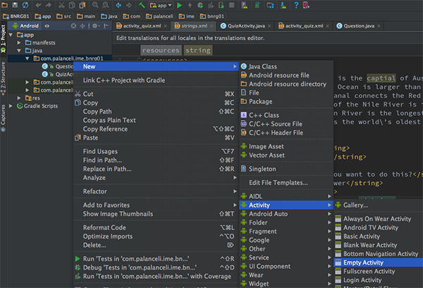
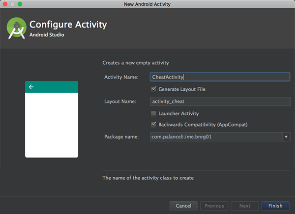
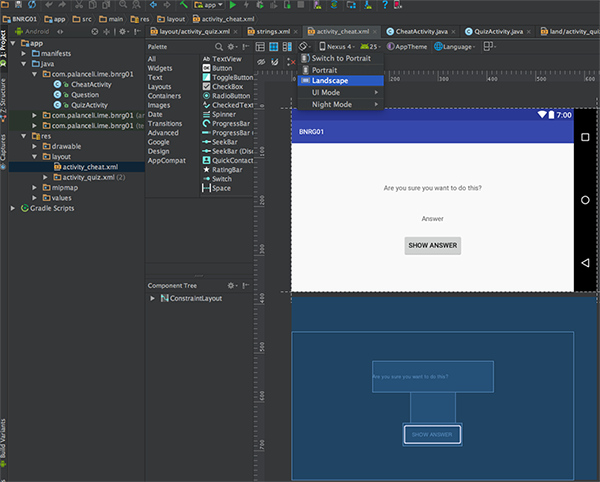
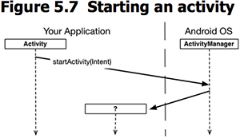
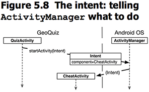
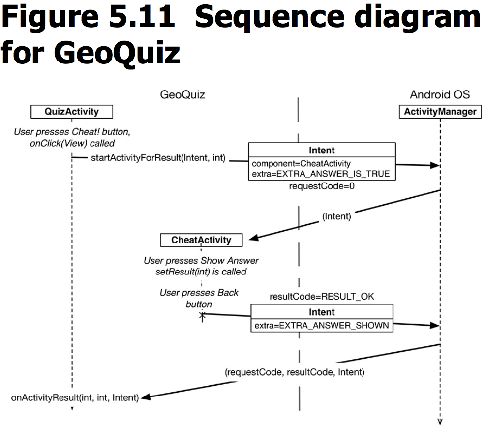
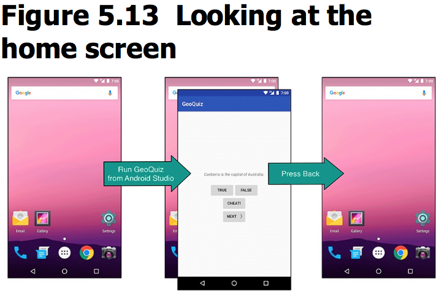
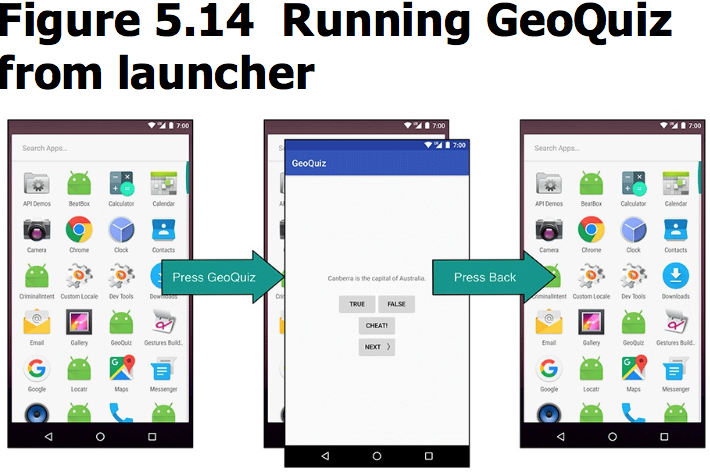

本章添加了新的Activity，用于显示作弊界面。由原来的Activity可以跳转到新界面，并在两个Activity之间可以传递数据。
本章要点：
- 添加Activity，并为之生成布局
- 从一个Activity跳转到另一个Activity
- 在两个Activity之间传递数据

<!-- more -->
# 怎样添加Activity
在Android视图中，找到java/<包名> 右键 > New > Activity > Empty Activity：

在弹出的面板中填写Activity Name

点击完成。该步骤：
1. 生成两个文件：activity_cheat.xml布局文件，CheatActivity.java代码文件
2. 修改AndroidManifest.xml文件，在其中添加CheatActivity

## 添加Activity后AndroidManifest文件的改动
``` xml
<?xml version="1.0" encoding="utf-8"?>
<manifest xmlns:android="http://schemas.android.com/apk/res/android"
    package="com.palanceli.ime.bnrg01">
    <application
        ...
        android:theme="@style/AppTheme">
        <activity android:name=".QuizActivity">
            ...
        </activity>
        <!-- 会在这里插入新activity -->
        <activity android:name=".CheatActivity"></activity> 
    </application>
</manifest>
```
activity的必填属性是android:name，其值由`.`开头，表示它的包名和manifest的package相同。

## 如何预览横竖屏布局
找到预览视图左上角的屏幕旋转标志，点开选择Portrait或Landscape：


# tools:text属性
在xml布局文件中，可以为widget添加tools属性，它可以用于覆盖widget的任何属性，使得widget在Android Studio预览时的性质发生变化。例如：
``` xml
    <TextView
        android:id="@+id/answer_text_view"
        android:layout_width="wrap_content"
        android:layout_height="wrap_content"
        android:padding="24dp"
        tools:text="Answer"
        />
```
该TextView的内容是在运行时设置，因此不会给它的`android:text`定义默认值，但是可以定义`tools:text`，这样在Android Studio预览时，它就会显示为Answer。

# 启动一个Activity
通过调用Activity的startActivity(Intent intent)函数，可以启动另一个Activity：

这个调用会将启动Activity的请求发送到ActivityManager，由ActivityManager创建新Activity并调用它的onCreate(Bundle)函数，这个过程在之前分析安卓源码的时候已经走查过了。结合本章的例子，过程如下：

代码如下：
``` java
mCheatButton.setOnClickListener(new View.OnClickListener(){
    @Override
    public void onClick(View v){
        Intent intent = new Intent(QuizActivity.this, CheatActivity.class);
        startActivity(intent);	// 启动intent中指定的Activity
    }
});
```
Intent构造函数的原型为：
`public Intent(Context packageContext, Class<?> cls)`，其中Context告诉ActivityManager在哪个package中找到Activity类；cls指定该Activity类。

## 启动本应用内的Activity的要求
在启动activity之前，ActivityManager会检查包里的manifest文件，是否声明了该类名的activity，如果没有声明，会抛出ActivityNotFoundException异常。因此，如果你想让你的app启动某个activity，必须在manifest文件中声明它。

关于显式和隐式Intent，本节只是提了一笔。显式Intent用于启动应用内的activity，隐式Intent则用于跨进程启动Activity，在以后的章节会有介绍。

个人觉得这本书写得太散，一个概念或主题往往提出来而不讲透，需要拉扯到后面再来补充，这一点比iOS行文要差。

# 如何在Activity间传递数据
包含两种情况：1、向启动的Activity传递数据；2、启动的Activity向发起者返回数据。

## 向启动的Activity传递数据
一、发起方调用Intent::putExtra(...)，向Intent中写入Extra。Extra是一个key-value对，是在Intent中夹带的数据，用于在Activity间传递。

本章中的例子是QuizActivity启动了CheatActivity，本应在QuizActivity中创建Intent，写入Extra，再传入startActivity(Intent)，但这种做法的复用性不好，因为可能还有别的Activity启动CheatActivity，那就需要在别的Activity里再写一遍同样的代码咯？

比较好的做法是把Intent的创建作为静态函数封装到CheatActivity里，代码如下。
在本节的业务逻辑中，QuizActivity会告诉CheatActivity当前问题的答案是True还是False，由CheatActivity负责把该结果显示出来。因此需要在Intent中传入answerIsTrue参数。
``` java
public class CheatActivity extends AppCompatActivity {
    private static final String EXTRA_ANSWER_IS_TURE = "com.palanceli.ime.bnrg01.answer_is_true";
    ...
    // 根据参数创建Intent
    public static Intent newIntent(Context packageContext, boolean answerIsTrue){
        Intent intent = new Intent(packageContext, CheatActivity.class);
        intent.putExtra(EXTRA_ANSWER_IS_TURE, answerIsTrue);
        return intent;
    }
}
```

在QuizActivity启动CheatActivity时调用该函数：
``` java
public class QuizActivity extends AppCompatActivity {
    ...
    private Button mCheatButton;
    ...
    @Override
    protected void onCreate(Bundle savedInstanceState) {
        ...
        mCheatButton = (Button)findViewById(R.id.cheat_button);
        mCheatButton.setOnClickListener(new View.OnClickListener(){
            @Override
            public void onClick(View v){
                // 创建Intent，启动Activity
                boolean answerIsTrue = mQuestionBank[mCurrentIndex].isAnswerTrue();
                Intent intent = CheatActivity.newIntent(QuizActivity.this, answerIsTrue);
                startActivity(intent);
            }
        });
    }
    updateQuestion();
}
```
二、被启动的Activity在其onCreate(Bundle)中通过Intent::getxxxExtra(...)接收数据，代码如下：
``` java
public class CheatActivity extends AppCompatActivity {
    private static final String EXTRA_ANSWER_IS_TURE = "com.palanceli.ime.bnrg01.answer_is_true";
    private boolean mAnswerIsTrue;
    ...
    @Override
    protected void onCreate(Bundle savedInstanceState) {
        ...
        mAnswerIsTrue = getIntent().getBooleanExtra(EXTRA_ANSWER_IS_TURE, false);
        ...
    }
    ...
}
```
Activity::getIntent()返回该activity启动时传入的Intent。

## 从启动的Activity返回数据
如果需要从启动的Activity中获取返回数据需要完成如下步骤：
一、启动Activity时调用Activity的成员函数
`public void startActivityForResult(Intent intent, int requestCode)`
第一个参数含义同`public void startActivityForResult(Intent intent)`版本，
第二个参数是给被启动的activity绑定了一个id，这在Activity启动多个activity时比较有用，通过这个requestCode来区分返回值来自哪个activity

二、在被启动的activity结束时设置返回值，调用的函数有两种形式：
`public final void setResult(int resultCode)`
`public final void setResult(int resultCode, Intent data)`
第一个版本可以返回一个简单的数字，如`Activity.RESULT_OK`或`Activity.RESULT_CANCELED`或基于`Activity.RESULT_FIRST_USER`的累加值；
第二个版本还可以追加一个Intent参数。

三、被启动的Activity通过Back返回后，父Activity会收到回调：
`protected void onActivityResult(int requestCode, int resultCode, Intent data)`
其中requestCode是在启动时传入的requestCode，后两个参数是子Activity调用`setResult(...)`时传入的两个参数，即返回值信息。

下图给出了整个过程的时序：


具体代码如下：
一、在QuizActivity.java中启动activity时要求有返回值
``` java
public class QuizActivity extends AppCompatActivity {
    ...
    private static final int REQUEST_CODE_CHEAT = 0; // 定义requestCode
    private boolean mIsCheater;
    @Override
    protected void onCreate(Bundle savedInstanceState) {
        ...
        mCheatButton = (Button)findViewById(R.id.cheat_button);
        mCheatButton.setOnClickListener(new View.OnClickListener(){
            @Override
            public void onClick(View v){
                boolean answerIsTrue = mQuestionBank[mCurrentIndex].isAnswerTrue();
                Intent intent = CheatActivity.newIntent(QuizActivity.this, answerIsTrue);
                // 启动Activity，要求返回值
                startActivityForResult(intent, REQUEST_CODE_CHEAT);  
            }
        });
        updateQuestion();
    }
    ...
}
```
二、在CheatActivity.java中回传返回值
``` java
public class CheatActivity extends AppCompatActivity {
    ...
    private static final String EXTRA_ANSWER_SHOW = "com.palanceli.ime.bnrg01.answer_show";
    ...
    @Override
    protected void onCreate(Bundle savedInstanceState) {
        ...
        mShowAnswerButton = (Button)findViewById(R.id.show_answer_button);
        mShowAnswerButton.setOnClickListener(new View.OnClickListener(){
            @Override
            public void onClick(View v){
                if(mAnswerIsTrue)
                    mAnswerTextView.setText(R.string.true_button);
                else
                    mAnswerTextView.setText(R.string.false_button);
                setAnswerShowResult(true);  // 生成回传数据
            }
        });
    }
    private void setAnswerShowResult(boolean isAnswerShown){
        // 组织回传Intent数据
        Intent data = new Intent();
        data.putExtra(EXTRA_ANSWER_SHOW, isAnswerShown);
        setResult(RESULT_OK, data);
    }
    ...
    // 解析回传数据
    public static boolean wasAnswerShown(Intent result){
        return result.getBooleanExtra(EXTRA_ANSWER_SHOW, false);
    }
}
```
和“向启动的activity传递数据”类似，数据的组织在CheatActivity中完成，这样便于代码复用，未来方便CheatActivity向更多的Activity返回数据。`wasAnswerShown(...)`负责解析Intent。
三、启动方QuizActivity.java接收回传数据
``` java
public class QuizActivity extends AppCompatActivity {
    ...
    private static final int REQUEST_CODE_CHEAT = 0; // 定义requestCode
    private boolean mIsCheater;
    ...
    @Override
    public void onActivityResult(int requestCode, int resultCode, Intent data){
        if(resultCode != RESULT_OK)
            return;
        if(requestCode == REQUEST_CODE_CHEAT){
            if(data == null)
                return;
            // 如果有回传数据，则接收解析
            mIsCheater = CheatActivity.wasAnswerShown(data);
            if(mIsCheater)
                Log.d(TAG, "mIsCheater=1");
            else
                Log.d(TAG, "mIsCheater=0");
        }
    }
    ...
}
```

# 点击了app图标后，系统做了什么
之前在分析Android源码时已经深入了解过，当点击app图标后，OS并不直接启动应用进程，而是启动该应用的launcher activity。在AndroidManifest.xml中有定义该app的launcher activity：
``` xml
...
<manifest ...>
    <application  ...>
        <activity android:name=".QuizActivity">
            <intent-filter>
                <action android:name="android.intent.action.MAIN" />
                <!-- launcher activity -->
                <category android:name="android.intent.category.LAUNCHER" /> 
            </intent-filter>
        </activity>
        ...
    </application>
</manifest>
```
启动该Activity后，可以通过它上面的按钮再启动新的Activity。每一个activity，点击Back后都会被Destroy。系统中的activity的启动和退出是一个进栈/出栈的过程，系统所有应用共享同一个栈。因此当在桌面上启动app，再back后露出的是桌面；在launcher里启动app，再back后露出的是launcher。


