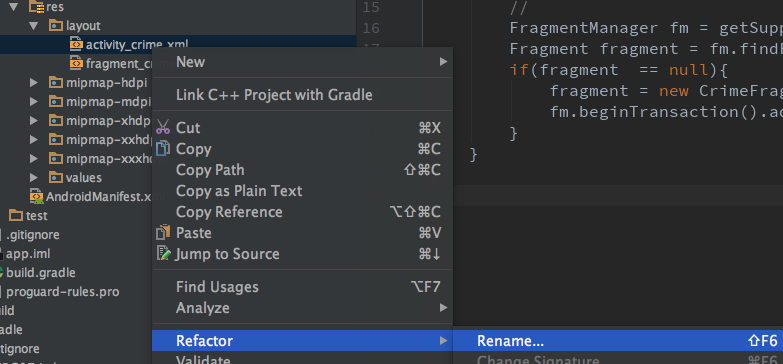
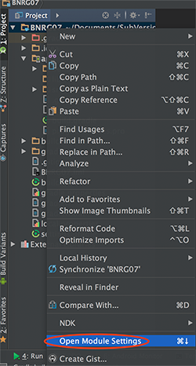
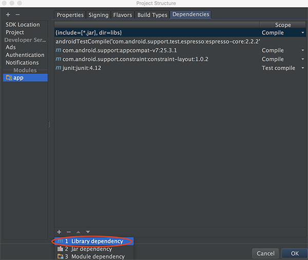

本章继续实现CriminalIntent的list部分，并且抽象出供list和details公用Fragment的布局和java类。
本章要点：
- 抽象一个通用的Fragment，包括xml容器和java实现
- RecyclerView的设计思想，实现步骤

<!-- more -->

# 修改fragment的容器、java文件
## 重命名fragment xml容器文件
本节为了让Fragment更通用，把原先的`activity_crime.xml`改名为`activity_fragment.xml`：

内容如下：
``` xml
<?xml version="1.0" encoding="utf-8"?>
    <android.support.constraint.ConstraintLayout
    android:id="@+id/fragment_container"
    android:layout_width="match_parent"
    android:layout_height="match_parent">
```
AndroidStudio会自动修改引用该资源的代码，比如`CrimeActivity.java`：
``` java
public class CrimeActivity extends AppCompatActivity {
    @Override
    protected void onCreate(Bundle savedInstanceState) {
        ...
        setContentView(R.layout.activity_fragment); // 自动修改
        ...
    }
}
```
如果没有自动修改，需要手动解决。
## 为通用的Fragment配备对应的java文件
xml容器文件只是在命名上体现出通用性，具体实现更多是在java代码上:
``` java
// SingleFragmentActivity.java
...
public abstract class SingleFragmentActivity extends AppCompatActivity {
    protected abstract Fragment createFragment();

    @Override
    protected void onCreate(Bundle savedInstanceState) {
        super.onCreate(savedInstanceState);
        setContentView(R.layout.activity_fragment);

        FragmentManager fm = getSupportFragmentManager();
        Fragment fragment = fm.findFragmentById(R.id.fragment_container);
        if(fragment  == null){
            fragment = createFragment();
            fm.beginTransaction().add(R.id.fragment_container, fragment).commit();
        }
    }
}
```
SingleFragmentActivity在`onCreate(...)`中加载Fragment容器文件，并创建Fragment实例，具体的实例的创建则由派生类来实现：
``` java
// CrimeActivity.java
...
public class CrimeActivity extends SingleFragmentActivity {
    @Override
    protected Fragment createFragment(){
        return new CrimeFragment();
    }
}
```

> 疑问：把Fragment的添加放到基类里，这不会导致所有Fragment共用同一个id么？FragmentManager是绑定在Activity的，也就是说Fragment ID的唯一性只要在具体Activity的范围内即可。

## 向manifest添加新的Activity并置为启动项
在[启动本应用内的Activity的要求](/2016/10/16/2017/1016AndroidProgrammingBNRG05/#启动本应用内的Activity的要求)中提到，如果希望应用的Activity能被启动，必须在其manifest文件中声明该组件。
``` xml
<?xml version="1.0" encoding="utf-8"?>
<manifest xmlns:android="http://schemas.android.com/apk/res/android"
    package="com.bnrg.bnrg07">

    <application
        ... android:theme="@style/AppTheme">
        
        <!-- 新加入的Activity，并设置为启动项 -->
        <activity android:name=".CrimeListActivity">
            <intent-filter>
                <action android:name="android.intent.action.MAIN" />
                <category android:name="android.intent.category.LAUNCHER" />
            </intent-filter>
        </activity>

        <activity android:name=".CrimeActivity">
        </activity>
    </application>

</manifest>
```

# RecyclerView的设计思想
我们还拿集装箱码头做个类比：RecyclerView就是集装箱码头，需要装100箱的货物也许并不需要100个集装箱，10个可能就够了，因为可以分多次运输。为了运作起来，还需要几个角色共同配合。
- Adapter调度中心 根据码头的规模和集装箱的尺寸决定订做多少个集装箱，以及如何调配。
- ViewHolder集装箱 负责包装货物

它们和RecyclerView共同完成“可回收视图”的业务逻辑。在具体实现的时候需要派生Adapter和ViewHolder，因为要在ViewHolder的子类中实现装入具体的货物，在Adapter的子类中实现创建和调配ViewHolder的子类实例。

## ViewHolder的职责
它负责维护一个具体的View
为什么需要ViewHolder这一层抽象？它抽象的又是什么？
答案还可以套用“集装箱码头”的类比：ViewHolder就是“集装箱”，它向调度中心Adapter提供了统一的接口，便于Adapter生产和搬运。这是这一层抽象的作用。

而每一个集装箱会调用内部货物接口，显示相关信息。本质上ViewHolder就是一个View，它需要从布局文件中获得widget，再从Model层获取数据，将数据展现到widget。

## Adapter的职责
Adapter位于RecyclerView和Model之间，它的职责是：
1. 创建必要的ViewHolders
2. 将Modle层的数据传入ViewHolder

即：调度中心负责创建和调配集装箱，也负责把货物装入集装箱。

Adapter和RecyclerView之间的关系如下：


在P624中提到：当这些调用完成后，RecyclerView将把list item显示到屏幕上。onCreateViewHolder(...)的调用次数会比onBindViewHolder(...)少得多，因为一旦创建了足够多的ViewHolder之后，RecyclerView将不再调用onCreateViewHolder(...)。
可见，复用集装箱的核心逻辑是写在RecyclerView内部的，RecyclerView才是“复用”策略的司令部，Adapter这个调度中心也只是负责执行司令部的命令。

# RecyclerView的具体实现步骤
## 添加RecyclerView的依赖
项目 > 右键 > Open Module Settings：

app > Dependencies > +号 > Library dependency：

搜索recyclerview，并选择com.android.support:recyclerview-v7：

但实际情况是添加了次依赖会导致如下错误：
> Manifest merger failed : Attribute meta-data#android.support.VERSION@value value=(25.3.1) from [com.android.support:appcompat-v7:25.3.1] AndroidManifest.xml:27:9-31
is also present at [com.android.support:recyclerview-v7:26.0.0-alpha1] AndroidManifest.xml:24:9-38 value=(26.0.0-alpha1).
Suggestion: add 'tools:replace="android:value"' to element at AndroidManifest.xml:25:5-27:34 to override.

这主要是android.support:appcompat-v7:25.3.1和android.support:recyclerview-v7:26.0.0-alpha1有冲突，修改`app/build.gradle`：
```
...
dependencies {
    ...
    compile 'com.android.support:recyclerview-v7:26.0.0-alpha1'
    compile 'com.android.support:appcompat-v7:26.0.0-alpha1'
}
```

## 为RecyclerView创建layout布局文件
命名为fragment_crime_list.xml
``` xml
<?xml version="1.0" encoding="utf-8"?>
<android.support.v7.widget.RecyclerView
    xmlns:android="http://schemas.android.com/apk/res/android"
    android:id="@+id/crime_recycler_view"
    android:layout_width="match_parent"
    android:layout_height="match_parent"/>
```
## 为RecyclerView创建java代码
``` java
public class CrimeListFragment extends Fragment {
    private RecyclerView mCrimeRecyclerView;
    private CrimeAdapter mAdapter;
    // ④
    private class CrimeHolder extends RecyclerView.ViewHolder{
        private TextView mTitleTextView;
        private TextView mDateTextView;
        private Crime mCrime;

        public CrimeHolder(LayoutInflater inflater, ViewGroup parent){
            super(inflater.inflate(R.layout.list_item_crime, parent, false));

            mTitleTextView = (TextView)itemView.findViewById(R.id.crime_title);
            mDateTextView = (TextView)itemView.findViewById(R.id.crime_date);
        }

        public void bind(Crime crime){
            mCrime = crime;
            mTitleTextView.setText(mCrime.getTitle());
            mDateTextView.setText(mCrime.getDate().toString());
        }
    }
    // ③
    private class CrimeAdapter extends RecyclerView.Adapter<CrimeHolder>{
        private List<Crime> mCrimes;
        public CrimeAdapter(List<Crime> crimes){
            mCrimes = crimes;
        }

        @Override
        public CrimeHolder onCreateViewHolder(ViewGroup parent, int viewType) {
            LayoutInflater layoutInflater = LayoutInflater.from(getActivity());
            return new CrimeHolder(layoutInflater, parent);
        }

        @Override
        public void onBindViewHolder(CrimeHolder holder, int position) {
            Crime crime = mCrimes.get(position);
            holder.bind(crime);
        }

        @Override
        public int getItemCount() {
            return mCrimes.size();
        }
    }
    // ①
    public View onCreateView(LayoutInflater inflater, ViewGroup container, Bundle savedInstanceState){
        View view = inflater.inflate(R.layout.fragment_crime_list, container, false);
        mCrimeRecyclerView = (RecyclerView)view.findViewById(R.id.crime_recycler_view);
        mCrimeRecyclerView.setLayoutManager(new LinearLayoutManager(getActivity()));

        updateUI();
        return view;
    }
    // ②
    private void updateUI(){
        CrimeLab crimeLab = CrimeLab.get(getActivity());
        List<Crime> crimes = crimeLab.getCrimes();
        mAdapter = new CrimeAdapter(crimes);
        mCrimeRecyclerView.setAdapter(mAdapter);
    }
}

```
这段代码略长，但是理解了RecyclerView的设计思想，就很容易掌握，我们按照注释中标定的顺序。
- ① 载入布局文件，并从中提领到RecyclerView实例
注意：RecyclerView必须需要一个LayoutManager实例才能正常工作，因为它并不直接负责布局itmes，而是通过这个LayoutManager实例来完成的，除了负责布局每一个item，LayoutManager还负责定义如何滚动的逻辑。
- ② 创建“调度中心”Adapter，并将该实例设置为RecyclerView的Adapter。
- ③ 实现“调度中心”CrimeAdapter，其中有几个要点：1、连接到Model数据，此处为mCrimes；2、实现`onCreateViewHolder(...)`接口，用于创建新的ViewHolder实例；3、实现`onBindViewHolder(...)`接口，用于将某个货物装入已存在的集装箱；4、实现`getItemCount()`接口，返回货物的数量。
- ④ 实现“集装箱”CrimeHolder，它负责：1、根据布局文件提领widget；2、把传入的数据显示到widget。

## 集装箱的布局文件
在“集装箱”CrimeHolder的代码中，根据布局文件提领widget，它的布局文件list_item_crime.xml如下：
``` xml
<LinearLayout xmlns:android="http://schemas.android.com/apk/res/android"
    android:orientation="vertical" android:layout_width="match_parent"
    android:layout_height="wrap_content">

    <TextView android:id="@+id/crime_title"
        android:layout_width="match_parent"
        android:layout_height="wrap_content"
        android:text="Crime Title"/>

    <TextView
        android:id="@+id/crime_date"
        android:layout_width="match_parent"
        android:layout_height="wrap_content"
        android:text="Crime Date"/>
</LinearLayout>
```
它包含两个TextView，一个用来显示标题，另一个显示日期。

# 让RecyclerView响应点击
本节只是在点击了每个Item的时候，弹出Toast。原理非常简单：①、把CrimeHolder::itemView的clickListener设置为ViewHolder自身；②、让CrimeHolder实现View.OnClickListener接口。代码如下：
``` java
...
    private class CrimeHolder extends RecyclerView.ViewHolder
    implements View.OnClickListener{ // ②
        ...
        public CrimeHolder(LayoutInflater inflater, ViewGroup parent){
            super(inflater.inflate(R.layout.list_item_crime, parent, false));
            itemView.setOnClickListener(this); // ①
            ...
        }

        @Override
        public void onClick(View view){ // ②
            Toast.makeText(getActivity(), mCrime.getTitle() + " clicked!", Toast.LENGTH_SHORT).show();
        }
        ...
    }
...
```