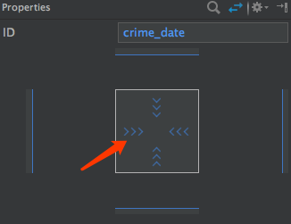

本章引入了ConstraintLayout布局，同时介绍了AndroidStudio的Design编辑器，在上一章的基础上变化不大，这里就不贴图了。

本章要点：
- 在AndroidStudio的Design编辑器中调整界面设置
- px/dp/sp/pt,mm,in基本概念
- Style, themes基本概念
<!-- more -->

# 把LinearLayout转成ConstraintLayout
上一节引入的list_item_crime.xml是一个LinearLayout的布局，在[本书第一章笔记](/2016/09/10/2017/0909AndroidProgrammingBNRG01/#ConstraintLayout布局)中介绍过ConstraintLayout将成为未来Android主流布局，因此可能常常会有把老的布局形式转成ConstratintLayout的需要。具体步骤如下：

打开list_item_crime.xml，选择Design编辑器，Component Tree > LiearnLayout > 右键 > Convert LinearLayout to ConstraintLayout：

AndroidStudio询问转换策略，点击OK

> Google的UI设计比苹果的要差好多，在mac系统中，很少能看到这种大段文字的提示。

# Widget的三种尺寸设置
如下图，AndroidStudio用三种标志来表示Widget的三种尺寸设置：


设置类型|值|含义
----|----|----
Fixed|Xdp|以dp为单位的固定值
Wrap Content|wrap_content|根据视图的内在需要分配尺寸。如对于TextView就是足够显示内容
any size|0dp|允许视图拉伸以适应指定的约束

any size说的不是很清楚，举个例子：比如TextView，设置了距离左右邻居的宽度。如果是Wrap Content，其最终宽度由文本内容决定；如果是any size，不管文本内容是什么，其最终宽度则由距离左右邻居的宽度决定。

在本例中，点击Component Tree中的具体widget，在最右侧Properties中点击标志，可以循环设定不同的值。


# 添加ImageView元素
Palette > Images > ImageView，将ImageView拖到Component Tree中，在弹出的界面中选择要植入的图片，本节是ic_solved：


# 在Design界面中添加约束
我想说的是，尽量在Text编辑器中手动编辑吧，Design对于约束的控制实在太难用了。本节需要把ImageView对齐到它所在的ConstraintLayout的上、下、右边缘。期待的操作是从ImageView的Anchor拖到父容器的Anchor，但是
1. 当拖动到父容器的边缘时，并没有对应的Anchor来接应，fuck无门。
2. 设定上了也没有一个相应的提示，感觉像奸尸。尽管书里说会有一个tip提示，实际并没有发生。
3. 检验一个widget都有哪些约束的箭头标志也没找到。
AndroidStudio的UI编辑器比Xcode差了几条街。
所以在Design中添加约束可以仅作为一个辅助手段，当不知道关键字怎么写时，可以用它帮个忙。真正设置还是在Text编辑器中完成。此处的约束代码如下：

``` xml
...
<ImageView
    android:id="@+id/imageView"
    ...
    app:layout_constraintRight_toRightOf="parent"
    app:layout_constraintTop_toTopOf="parent"
    app:layout_constraintBottom_toBottomOf="parent"/>
    ...
```
具体用法在[本书第一章笔记](/2016/09/10/2017/0909AndroidProgrammingBNRG01/#ConstraintLayout布局)已经介绍过，不再赘述。

# 动态显示widget
本节是要根据某个item是否处于solved状态决定是否显示手铐图标。没有什么新内容：
1. 在CrimeHolder中提领到crime_solved （ImageView视图）
2. 在CrimeHolder::bind(...)函数中根据“货物”的值决定要不要显示crime_solved
3. 具体显示代码为：

``` java
...
mSolvedImageView.setVisibility(crime.isSolved()? View.VISIBLE:View.GONE);
...
```

# px/dp(dip)/sp/pt,mm,in

<style>
table th:nth-of-type(1){
    width: 40px;
}
</style>

名称|解释
---|---
px| pixel的缩写。无论屏幕的密度是多少，一个px对应屏幕上的一个物理像素点。由于px不会适配屏幕的密度，因此不建议使用px。
dp<br>或dip| density-independent pixel的缩写，故又称dip。通常使用dp定义margin, padding或其它尺寸相关的像素值。通常无论屏幕密度如何，1dp=1/160英寸。
sp| scale-independent pixel的缩写。sp是考虑了用户字体尺寸习惯的dp，通常用于设置文本尺寸。
pt,<br>mm,<br>in| 和dp类似的缩放单元，只是计算单位是按照points(1/72英寸)或millimeters毫米或inches英寸。不建议使用，因为不是所有设备都支持这些单位的换算。

本书常用的计量单位是dp和sp，Android会自动把这些单位翻译成物理相关的像素。

# Margin vs Padding
Margin属性是用于布局的参数，它决定两个widget之间的间距；Padding则是widget内部属性，用来决定widget比它的内容大出来多少。比如一个按钮因为要比其内部文字大出一圈，需要使用Padding；因为要遵守和邻居间距而大出一圈，则需要使用Margin。

# Styles, themes和theme attributes
Style是描述widget外观和行为的xml资源文件，例如下面的style描述了一个大字体的外观：
``` xml
<style name="BigTextStyle">
    <item name="android:textSize">20sp</item>
    <item name="android:padding">3dp</item>
</style>
```
你可以定义自己的style。

theme则是style的集合，它的属性指向其它的style。Android提供了平台themes供app使用。比如在本节的fragment_crime.xml中描述TextView：
``` xml
<TextView
...
style="?android:listSeparatorTextViewStyle"
...
/>
```
这是带有一个分割线的TextView，每个Android theme都包含listSeparatorTextViewStyle，他们描述了不同的分割线外观。

一个app的theme定义在`AndrodiManifest.xml`文件中：
``` xml
<manifest xmlns:android="http://schemas.android.com/apk/res/android" ...>
    <application
        ...
        android:theme="@style/AppTheme">
        ...
    </application>
</manifest>
```
该theme的属性值定义在`res/values/styles.xml`。